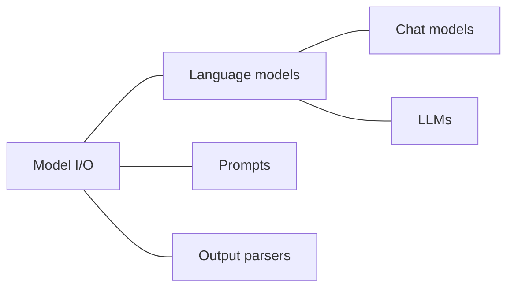

# Chapter 02. Model I/O - 언어 모델을 다루기 쉽게 만들기

## 1. 언어 모델을 이용한 응용 프로그램 작동 방식

### 언어 모델 호출이란?

- GPT에서는 텍스트 상장에 입력한 메시지를 통해 언어 모델을 호출하고 있다고 할 수 있다.
- 언어 모델을 호출할 때 입력되는 텍스트를 '프롬프트'라고 부른다.
- 실제로 언어 모델을 활용한 애플리케이션을 개발할 때 문제가 되는 경우가 많다. 언어 모델을 활용한 애플리케이션은 모두 절차형으로 작성하는 기존 애플리케이션과 달리 좋은 결과를 얻기 위해 시행착오를 거쳐야 한다.
- 하지만 언어 모델은 OpenAI의 GPT만 있는 것이 아니다. 앤트로픽의 클로드2(Claude 2)를 사용해 결과가 어떻게 달라지는지 보고 싶을 수도 있다.
  - 이 경우, 앞서 언급한 소스코드는 OpenAI에만 대응하기 때문에 거의 모든 소스코드를 다시 작성해야 한다.
- 언어 모델을 호출하는 프롬프트를 일일이 재작성하거나 모델을 교체하는 것은 매우 번거롭다.
  - Model I/O 모듈은 이러한 번거로움을 줄일 수 있는 수단을 제공한다.

### Model I/O 랭체인의 가장 기본적인 모듈이다

- Model I/O는 모듈을 단독으로도 사용할 수 있지만, 실제 애플리케이션을 개발할 때 이 모듈만으로 모든 것을 만드는 것은 현실적으로 어렵기 때문에 다른 모듈과 조합해 사용하는 것이 일반적이다.
  - 예를 들어, Model I/O의 하위 모듈인 Prompts 모듈은 프롬프트를 최적화하기 위해 사용될 뿐만 아니라 나중에 소개할 Chains 모듈 등에서도 사용되며, 마찬가지로 하위 모듈인 Language models는 거의 모든 모듈에서 사용된다.

### Model I/O를 구성하는 3개의 서브모듈

- 랭체인의 모든 모듈은 서브모듈을 가지고 있으며, Model I/O 모듈도 예외는 아니어서 3개의 서브모듈로 구성돼 있다.

#### 1. Language models

- Language models 모듈은 다양한 언어 모델을 동일한 인터페이스에서 호출할 수 있는 기능을 제공하며, OpenAI의 모델뿐만 아니라 앤트로픽의 클로드 2와 같은 다른 모델도 동일하게 호출할 수 있다.
- 이를 통해 다른 모델을 시도할 때 기존 코드를 처음부터 다시 작성할 필요가 없다.

#### 2. Prompts

- Prompts 모듈은 언어 모델을 호출하기 위한 프롬프트를 구축하는 데 유용한 기능을 제공한다.
- 용도에 따라 다양한 손자 모듈이 제공된다.
  - 예를 들어, 프롬프트와 변수를 결합하거나 대량의 예시를 프롬프트에 효율적으로 삽입할 수 있다.
  - 다양한 처리를 통해 프롬프트를 쉽게 만들 수 있도록 하는 것이 목적이다.

#### 3. Output parsers

- Output parsers 모듈은 언어 모델에서 얻은 출력을 분석해 애플리케이션에서 사용하기 쉬운 형태로 변환하는 기능을 제공한다.
  - 출력 문자열을 정형화하거나 특정 정보를 추출하는 데 사용한다.
  - 이 모듈을 사용하면 출력을 구조화된 데이터로 쉽게 처리할 수 있다.

### Language models를 사용해 gpt-3.5-turbo 호출하기

```python
from langchain_community.chat_models import ChatOpenAI
from langchain.schema import HumanMessage

chat = ChatOpenAI(model="gpt-3.5-turbo")

result = chat([HumanMessage(content="안녕하세요!")])
print(result)
```

- 위 코드를 실행하면 아래와 같은 결과물을 받을 수 있다.

```shell
content='안녕하세요! 무엇을 도와드릴까요?' 
additional_kwargs={} 
response_metadata={
  'token_usage': {
    'completion_tokens': 21, 
    'prompt_tokens': 13, 
    'total_tokens': 34, 
    'completion_tokens_details': {
      'accepted_prediction_tokens': 0, 
      'audio_tokens': 0, 
      'reasoning_tokens': 0, 
      'rejected_prediction_tokens': 0
    }, 
    'prompt_tokens_details': {
      'audio_tokens': 0, 
      'cached_tokens': 0
    }
  }, 
  'model_name': 'gpt-3.5-turbo', 
  'system_fingerprint': None, 
  'finish_reason': 'stop', 
  'logprobs': None
} 
id='run-d3735d94-4502-40a8-b69a-e6a4b773a79b-0
```

- `HumanMessage`는 사람의 메시지가 있다는 것을 나타내며, content는 그 내용을 나타낸다.

#### AIMessage를 사용해 언어 모델의 응답을 표현할 수 있다.

- 랭체인에서는 대화 형식의 상호작용을 표현하기 위해 `AIMessage`도 준비돼 있다.
  - 예를 들어 '계란찜 만드는 법을 알려줘'라고 문의하면 언어 모델에서 레시피를 반환한다.

```python
result = chat([
    HumanMessage(content="계랸찜 만드는 법 알려줘"),
    AIMessage(content="ChatModel의 답변인 계란찜 만드는 법"),
    HumanMessage(content="영어로 번역해줘"),
])
```

```shell
content='How to make steamed egg custard' 
additional_kwargs={} 
response_metadata={
  'token_usage': {
    'completion_tokens': 8, 
    'prompt_tokens': 60, 
    'total_tokens': 68, 
    'completion_tokens_details': {
      'accepted_prediction_tokens': 0, 
      'audio_tokens': 0, 
      'reasoning_tokens': 0, 
      'rejected_prediction_tokens': 0
    }, 
    'prompt_tokens_details': {
      'audio_tokens': 0, 
      'cached_tokens': 0
    }
  }, 
  'model_name': 'gpt-3.5-turbo', 
  'system_fingerprint': None, 
  'finish_reason': 'stop', 
  'logprobs': None
} 
id='run-7e749350-5ecc-4b18-90ed-a4f65a19609d-0'
```

- 이처럼 Language models 모듈의 Chat models 모듈에서는 `HumanMessage`, `AIMessage`를 사용해 언어 모델과의 대화 형식의 상호작용을 표현할 수 있다.
- Language models만으로 이렇게 과거의 응답을 바탕으로 답변하게 하려면 매번 소스코드를 다시 작성해야 하므로 매우 번거롭고, 대화를 이용한 애플리케이션 개발이 어려울 수 있다.
- 랭체인에는 이러한 상호작용을 지원하기 위한 Memory 모듈이 준비돼 있다.

#### SystemMessage를 사용해 언어 모델의 성격과 설정을 정의한다.

- 이러한 대화 기능을 커스터마이징할 수 있는 `SystemMessage`도 준비돼 있다.
  - 이것은 대화를 표현하는 것이 아니라, 언어에 대한 직접적인 지시를 작성하는 기능이다.
  - ex) 언어 모델의 성격이나 설정 등을 입력하면 답변의 문체를 좀 더 솔직하게 바꿀 수 있다.

```python
result = chat([
    SystemMessage(content="당신은 친한 친구입니다. 존댓말을 쓰지 말고 솔직하게 답해주세요."),
    HumanMessage(content="안녕"),
])
```

```shell
content='안녕! 어떻게 지내? 무슨 일 있어?' 
additional_kwargs={} 
response_metadata={
  'token_usage': {
    'completion_tokens': 22, 
    'prompt_tokens': 52, 
    'total_tokens': 74, 
    'completion_tokens_details': {
      'accepted_prediction_tokens': 0, 
      'audio_tokens': 0, 
      'reasoning_tokens': 0, 
      'rejected_prediction_tokens': 0
    }, 
    'prompt_tokens_details': {
      'audio_tokens': 0, 
      'cached_tokens': 0
    }
  }, 
  'model_name': 'gpt-3.5-turbo', 
  'system_fingerprint': None, 
  'finish_reason': 'stop', 
  'logprobs': None
} 
id='run-d237eede-ca5d-4ed8-a34b-14d583999743-0'
```

#### 언어 모델 교체 가능

- 앤트로픽이 개발한 언어 모델로 대체할 경우 어떻게 변경되는지 확인.
- 앤트로픽이 개발한 대화형 언어 모델은 ChatAnthropic에서 사용할 수 있다.
  - 아래와 같이 앤트로픽의 모델을 가져오도록 변경만 해주면 된다.

```python
from langchain_community.chat_models import ChatAnthropic
# ...
chat = ChatAnthropic()
# ...
```

### PromptTemplate로 변수를 프롬프트에 전개하기

- `Prompts` 모듈의 가장 기본적인 모듈인 `PromptTemplate`을 사용.

```python
from langchain import PromptTemplate

prompt = PromptTemplate(
    template="{product}는 어느 회사에서 개발한 제품인가요?",
    input_variables={
        "product"
    }
)

print(prompt.format(product="아이폰"))
print(prompt.format(product="갤럭시"))
```

- 결과값은 아래와 같다.

```shell
아이폰는 어느 회사에서 개발한 제품인가요?
갤럭시는 어느 회사에서 개발한 제품인가요?
```

### PromptTemplate에서 제공하는 다른 기능들

- 유효성 검사 기능

```python
print(prompt.format())
```

```shell
KeyError: 'product' # 필요한 입력이 있음에도 입력이 없었기 때문에
```

### Language models와 PromptTemplate의 결합

```python
from langchain_community.chat_models import ChatOpenAI
from langchain.schema import HumanMessage
from langchain import PromptTemplate

chat = ChatOpenAI(model="gpt-3.5-turbo")

prompt = PromptTemplate(
    template="{product}는 어느 회사에서 개발한 제품인가요?",
    input_variables={
        "product"
    }
)

result = chat([HumanMessage(content=prompt.format(product="아이폰"))])
print(result.content)
```

```shell
아이폰은 미국의 애플(Apple) 회사에서 개발한 제품입니다.
```

#### PromptTemplate 초기화 방법의 종류

1. `input_variables`로 초기화하기

```python
prompt = PromptTemplate(
    template="{product}는 어느 회사에서 개발한 제품인가요?",
    input_variables={
        "product"
    }
)
```

2. JSON 파일에 저장한 프롬프트 읽어오기

```python
from langchain.prompts import PromptTemplate

prompt = PromptTemplate(
    template="{product}는 어느 회사에서 개발한 제품인가요?",
)

input_variables=["product"]
prompt_json = prompt.save("prompt.json")
```

- 아래와 같은 JSON이 생성된다.

```shell
{
    "name": null,
    "input_variables": [
        "product"
    ],
    "optional_variables": [],
    "output_parser": null,
    "partial_variables": {},
    "metadata": null,
    "tags": null,
    "template": "{product}\ub294 \uc5b4\ub290 \ud68c\uc0ac\uc5d0\uc11c \uac1c\ubc1c\ud55c \uc81c\ud488\uc778\uac00\uc694?",
    "template_format": "f-string",
    "validate_template": false,
    "_type": "prompt"
}
```

- 이제 해당 JSON을 로드하여 사용할 수 있다.

```python
from langchain.prompts import load_prompt

loaded_prompt = load_prompt("prompt.json")

print(loaded_prompt.format(product="아이폰"))
```

```shell
아이폰는 어느 회사에서 개발한 제품인가요?
```

### 목록 형식으로 결과 받기

- Ouput parsers를 통해 결과를 구조화

```python
from langchain_community.chat_models import ChatOpenAI
from langchain.output_parsers import CommaSeparatedListOutputParser
from langchain.schema import HumanMessage

output_parser = CommaSeparatedListOutputParser()

chat = ChatOpenAI(model="gpt-3.5-turbo")

result = chat([
    HumanMessage(content="애플이 개발한 대표적인 제품 3개 알려주세요."),
    HumanMessage(content=output_parser.get_format_instructions()),
])

output = output_parser.parse(result.content)
for item in output:
    print("대표 상품: " + item)
```

```shell
대표 상품: 아이폰
대표 상품: 아이패드
대표 상품: 맥북
```

- `CommaSeparatedListOutputParser`에서 이뤄지는 처리는 다음과 같다.
  - 목록 형식으로 출력하도록 언어 모델에 출력 형식 지시를 추가한다.
  - 출력 결과를 분석해 목록 형식으로 변환한다.
- 언어 모델이 생성하는 출력은 기본적으로 일반 텍스트 문자열이다. 이 문자열을 그대로 활용할 수도 있지만, 애플리케이션을 개발할 때 이 문자열에서 특정 정보를 추출하거나 데이터로 구조화해야 하는 경우가 많다.
- 애플리케이션에서 활용하기 쉬운 데이터로 변홚하기 위해서는 출력 문자열을 분석해 필요한 정보를 추출하는 과정이 필수적이다.

<br/>

## 2. Language models - 사용하기 쉬운 모델

### 통일된 인터페이스로 사용하기 쉬움

- Model I/O 모듈의 하위 모듈인 Language models의 목적은 다양한 종류의 언어 모델을 통일된 인터페이스를 통해 쉽게 다룰 수 있게 하는 것이다.

### Chat models와 LLMs

- `Chat models`: OpenAI의 `Chat` 모델과 같은 대화 형식을 사용하는 언어 모델을 다룸
- `LLMs`: OpenAI의 `Complete` 모델과 같은 문장의 연속을 준비하는 언어 모델을 다룸



- llm 사용 예시

```python
from langchain_community.llms import OpenAI

llm = OpenAI(model="gpt-3.5-turbo-instruct")

retult = llm("밋있는 라면을", stop=".")
print(retult)
```

```shell
뜨거운 물에 3분간 끓인다
```

### Language models의 편리한 기능

#### 캐싱

- OpenAI 등의 API는 사용한 토큰 수에 따라 요금이 부과된다.
  - 같은 프롬프트를 전송하면 요금도 2배, 시간도 2배
- 캐시를 적용하면 속도가 확연히 빨라지는 것을 확인할 수 있다.

```python
import time
import langchain
from langchain.cache import InMemoryCache
from langchain_community.chat_models import ChatOpenAI
from langchain.schema import HumanMessage

langchain.llm_cache = InMemoryCache()

chat = ChatOpenAI(model="gpt-3.5-turbo")

start = time.time()
result = chat([HumanMessage(content="안녕하세요!")])
end = time.time()

print(result.content)
print(f"실행 시간: {end-start}초")

start = time.time()
result = chat([HumanMessage(content="안녕하세요!")])
end = time.time()

print(result.content)
print(f"실행 시간: {end-start}초")
```

```shell
안녕하세요! 무엇을 도와드릴까요?
실행 시간: 0.7603998184204102초
안녕하세요! 무엇을 도와드릴까요?
실행 시간: 0.0005061626434326172초
```

- 그러나 메모리 내 캐시는 프로그램이 실행되는 동안만 유지되고, 종료되면 삭제된다.
- 장기간 캐싱이 필요한 경우 SQLite 데이터베이스에 저장할 수 있는 `SQLiteCache`를 사용하는 것이 좋다.

#### 결과를 순차적으로 표시

- `Streaming` 모듈

```python
from langchain.callbacks.streaming_stdout import StreamingStdOutCallbackHandler
from langchain.chat_models import ChatOpenAI
from langchain.schema import HumanMessage

chat = ChatOpenAI(
    streaming=True,
    callbacks=[StreamingStdOutCallbackHandler()],
)

resp = chat([HumanMessage("맛있는 스테이크 굽는 법을 알려주세요")])
```

- 아래와 같이 순차적으로 표시되는 것을 확인할 수 있다.

```shell
스테이크를 맛있게 굽는 법은 다음과 같습니다:

1. 스테이크를 냉장고에서 꺼내어 실온에 30분 정도 방치해주세요. 이렇게 하면 고기가 고르게 익게 됩니다.

2. 팬이나 그릴에 기름을 두르고 불을 세게 달군 후, 스테이크를 올려주세요. 한쪽 면을 2-3분 정도 굽다가 뒤집어서 다른 한쪽 면을 2-3분 정도 굽니다. 

3. 스테이크의 두면에 굽기를 반복하면서 원하는 익도에 도달할 때까지 계속 굽어주세요. 익도는 개인의 취향에 따라서 다르지만, 보통은 레어(혹은 미디엄 레어)에서 웰다잉(혹은 미디엄 웰다잉) 정도가 가장 인기가 많습니다.

4. 스테이크를 굽는 동안 손을 자주 뒤집어주어 고기의 수분이 증발하지 않도록 해주세요.

5. 스테이크를 굽는 마지막 1-2분 동안에는 기름에 마늘이나 로즈마리 등의 허브를 함께 넣어주어 향을 내주면 더욱 맛있는 스테이크를 즐길 수 있습니다.

6. 스테이크를 그릴에서 꺼내어 5분 정도 쉬게해주세요. 이렇게 하면 고기의 주스가 고르게 퍼지고 맛있는 스테이크를 즐길 수 있습니다.

즐거운 식사되세요!
```

- 코드를 보면 결과를 표시하기 위한 print가 존재하지 않는다는 사실을 알 수 있다.
  - `StreamingStdOutCallbackHandler`에서 실행되는 처리 내에서 결과를 순차적으로 표시하기 때문에 print 문에서 실행 결과를 표시할 필요가 없기 때문이다.
  - 다만 아래와 같이 결과를 표시한 후에에 소스코드를 다루고 싶다면 아래와 같이 response 값에 접근해 가져올 수 있다.

```python
resp = chat([HumanMessage("맛있는 스테이크 굽는 법을 알려주세요")])
response_text = resp.content
```

<br/>

## 3. Templates - 프롬프트 구축의 효율성 향상

### 프롬프트 엔지니어링을 통한 결과 최적화

- 언어 모델은 텍스트 형태의 입력을 받는다. 이 텍스트 입력을 프롬프트라고 한다.
- 프롬프트를 최적화하면 단순한 명령어로는 어려웠던 작업을 수행할 수 있게 되거나 더 나은 결과를 얻을 수 있다.
  - 이 프롬프트를 최적화하는 과정, 그리고 결과로 얻어지는 개선된 결과물을 '프롬프트 엔지니어링'이라고 한다.
  - 적절한 프롬프트를 통해 언어 모델을 호출함으로써 이전에는 불가능하다고 여겼던 고도의 작업도 가능해졌다.
  - ex) 과학 논문 요약 생성, 전문 지식이 필요한 문장 작성, 고도의 인터렉션
- `Templates` 모듈은 이러한 프롬프트 엔지니어링을 돕고, 프롬프트를 쉽게 구축할 수 있는 기능을 제공한다.

#### 출력 예제가 포함된 프롬프트 만들기

- `퓨샷 프롬프트 Few-shot prompt`
  - 프롬프트 엔지니어링 분야에서 효과가 높다고 알려진 여러 방법 중 하나
- 언어 모델이 수행해야 할 작업을 간결하게 지시하고, 그 작업의 입력과 출력의 예시를 몇 가지 제시한다.
- 그러면 언어 모델은 그 예시를 통해 작업의 패턴을 학습하고, 새로운 입력이 주어졌을 때 유사한 출력을 생성할 수 있게 된다.
  - 구체적인 예시를 제시해 인간이 상상하는 출력에 가까운 결과를 생성할 수 있다.

```python
from langchain.llms import OpenAI
from langchain.prompts import FewShotPromptTemplate, PromptTemplate

examples = [
    {
        "input": "충청도의 계룡산 전라도의 내장산 강원도의 설악산은 모두 국립공원이다",
        "output": "충청도의 계룡산, 전라도의 내장산, 강원도의 설악산은 모두 국립공원이다.",
    }
]

prompt = PromptTemplate(
    input_variables=["input", "output"],
    template="입력: {input}\n출력: {output}"
)

few_shot_prompt = FewShotPromptTemplate(
    examples=examples,
    example_prompt=prompt,
    prefix="아래 문장부호가 빠진 입력에 입력에 문장부호를 추가하세요. 추가할 수 있는 문장부호는 ',', '.'입니다. 다른 문장부호는 추가하지 마세요.",
    suffix="입력: {input_string}\n출력:",
    input_variables=["input_string"]
)
llm = OpenAI()
formatted_prompt = few_shot_prompt.format(
    input_string="집을 보러 가면 그 집이 내가 원하는 조건에 맞는지 살기에 편한지 망가진 곳은 없는지 확인해야 한다"
)
result = llm.predict(formatted_prompt)
print("formatted_prompt: ", formatted_prompt)
print("result: ", result)
```

- 나의 결과는 책과는 다르게 나왔다. 쉼표가 '지'로 끝날 때마다 들어갔으면 좋았겠지만.... 이상한 곳에만 들어갔다.

```shell
formatted_prompt:  아래 문장부호가 빠진 입력에 입력에 문장부호를 추가하세요. 추가할 수 있는 문장부호는 ',', '.'입니다. 다른 문장부호는 추가하지 마세요.

입력: 충청도의 계룡산 전라도의 내장산 강원도의 설악산은 모두 국립공원이다
출력: 충청도의 계룡산, 전라도의 내장산, 강원도의 설악산은 모두 국립공원이다.

입력: 집을 보러 가면 그 집이 내가 원하는 조건에 맞는지 살기에 편한지 망가진 곳은 없는지 확인해야 한다
출력:
result:   집을 보러 가면, 그 집이 내가 원하는 조건에 맞는지 살기에 편한지 망가진 곳은 없는지 확인해야 한다.
```

<br/>

## 4. Output parsers - 출력 구조화

### 결과를 날짜와 시간 형식으로 받아보기

```python
from langchain import PromptTemplate
from langchain_community.chat_models import ChatOpenAI
from langchain.output_parsers import DatetimeOutputParser

from langchain.schema import HumanMessage

output_parser = DatetimeOutputParser()

chat = ChatOpenAI(model="gpt-3.5-turbo")

prompt = PromptTemplate.from_template("{product}의 출시일을 알려주세요")

result = chat([
    HumanMessage(content=prompt.format(product="iPhone8")),
    HumanMessage(content=output_parser.get_format_instructions()),
])

output = output_parser.parse(result.content)

print(output)
```

- 근데 출시일이 이상하게 나온다?

```shell
6322-09-18 15:42:35.965218
```

```shell
2022-09-22 00:00:00
```

```shell
1933-07-02 14:45:11.200045
```

### 출력 형식을 직접 정의하기

- `Pydantic` 모델 기반인 `PydanticOutputParser` 사용
  - `Pydantic` 모델은 파이썬에서 데이터 검증을 위한 라이브러리로, 타입 힌트를 이용해 데이터 모델을 정의하고 이를 기반으로 데이터 분석과 검증을 수행하는 편리한 도구다.

#### `PydanticOutputParser` 장점

- 임의의 데이터 구조를 표현할 수 있는 `Pydantic` 모델을 사용해 구문 분석 규칙을 유연하게 정의할 수 있다.
- 모델 검증 기능을 활용해 파싱된 데이터의 무결성을 보장할 수 있다.
- 개발자가 `Pydantic`에 명시적으로 정의한 데이터 구조에 분석 결과를 맞출 수 있다.
- 파싱 결과를 파이썬 객체로 쉽게 가져와 후속 처리에 활용할 수 있다.

- `PydanticOutputParser`는 특정 정보를 가진 텍스트를 분석할 때 유용하다.
  - 특히 특정 포맷을 가진 텍스트를 분석해야 하는 경우나 특정 정보를 추출하고 싶을 때 유용하게 사용할 수 있다.

```shell
모델명: Samsung Galaxy S21
화면 크기: 6.7인치
OS: Android 11
스마트폰 출시일: 2021-10-15
```

### 잘못된 결과가 반환될 때 수정을 지시할 수 있게 한다

- 언어 모델은 기존의 절차적 프로그래밍과 달리 반드시 지시를 지킬 수 있는 것은 아니다.
  - `OutputFixingParser`의 사용
  - 위의 `PydanticOutputParser` 예시에 parser만 수정

```python
# ...
from langchain.output_parsers import OutputFixingParser
# ...
parser = OutputFixingParser.from_llm(parser=PydanticOutputParser(pydantic_object=Smartphone), llm=chat)
```

- 실패했을 때만 재실행되도록 하는 방법이다.

> #### 참고
> - 허깅페이스. AI 모델과 정보 공유를 목적으로 하는 플랫폼.

# 참고자료

- 랭체인 완벽 입문, 타무라 하루카 저
