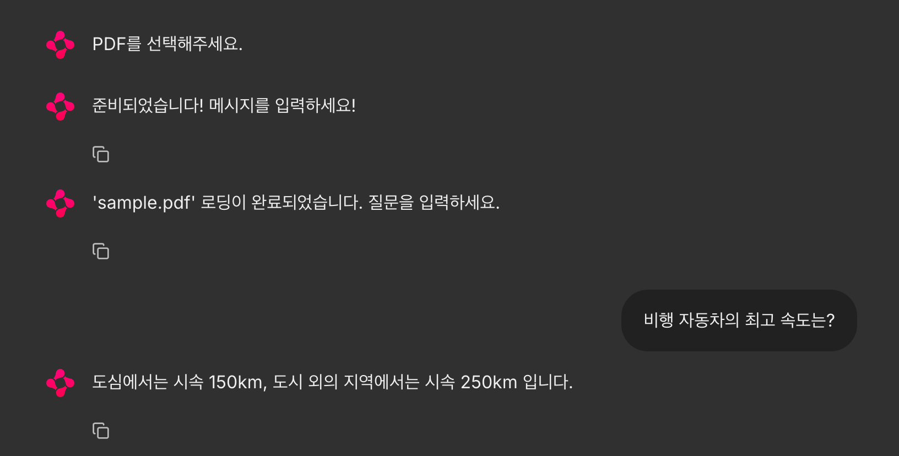

# Chapter03. Retrieval - 알지 못하는 데이터

## 1. 언어 모델이 미지의 데이터를 처리할 수 있게 하려면

- Retrieval은 언어 모델이 학습하지 않은 개념이나 정보를 처리할 수 있게 하는 모듈이다.

### 모르는 정보에 기반한 답변을 할 수 있는 구조

- RAG. Retrieval-Augmented Generation
- 주로 언어 모델을 사용한 FAQ 시스템 개발에 사용되며, 사용자가 입력한 내용과 관련된 정보를 외부 데이터베이스 등에서 검색하고, 그 정보를 이용해 프롬프트를 만들어 언어 모델을 호출한다.
  - 이를 통해 학습하지 않은 지식이나 정보도 답변할 수 있게 된다.
- RAG는 프롬프트에 정보원의 문장, 질문, 문장을 기반으로 답변하라는 지시를 포함시킴으로써 언어 모델이 알지 못하는 정보에 기반한 답변을 생성할 수 있다.
- 이 방법에서는 애플리케이션에서 질문을 받으면 다음과 같은 절차가 진행된다.
1. 사용자에게 질문받기
2. 준비된 문장에서 답변에 필요한 부분 찾기
3. 문장의 관련 부분과 사용자 질문을 조합해 프롬프트 생성하기
4. 생성한 프롬프트로 언어 모델을 호출해 사용자에게 결과 반환하기

### 답변에 필요한 문장을 찾는 방법이 중요

- RAG에서는 답변에 필요한 문장을 어떻게 검색하고 가져오는지가 중요하다.
  - ex) 위키백과, 구글 사용. 질문 입력 및 페이지 로드
- 하지만 손안에 있는 PDF 파일이나 엑셀 파일을 정보원으로 하는 경우 검색이 쉽지 않다.
  - 그래서 검색이 어려운 정보원에 대응하기 위해 텍스트르 벡터화해 검색을 가능하게 한다.

### 유사 문장 검색을 위해 필요한 벡터화란?

- 인간은 자연스럽게 어떤 부분이 비슷한지 이해할 수 있지만, 컴퓨터는 이해할 수 없다.
- 그래서 컴퓨터가 이해할 수 있도록 텍스트를 숫자의 조합으로 표현하는 과정이 바로 텍스트 벡터화다.
- 단어나 문장을 벡터라는 수치로 표현해 컴퓨터에서 계산을 통해 유사성 여부를 확인할 수 있다.
  - 텍스트의 벡터화

### 언어 모델을 사용해 텍스트를 벡터화하기

- OpenAI에서 'text-embedding-ada-002'라는 언어 모델을 API로 제공

### 벡터 유사도 검색

- `tiktoken`을 설치하지 않았다면 `langchain.embeddings` 대신 `langchain_openai` 의존성을 설치해 사용할 수도 있다. 

```python
from langchain_openai import OpenAIEmbeddings
from numpy import dot
from numpy.linalg import norm

embeddings = OpenAIEmbeddings(
    model="text-embedding-ada-002"
)

query_vector = embeddings.embed_query("비행 자동차의 최고 속도는?")
print(f"벡터화된 질문: {query_vector[:5]}")

document_1_vector = embeddings.embed_query("비행 자동차의 최고 속도는 시속 150km입니다.")
document_2_vector = embeddings.embed_query("닭고기를 적당히 양념한 후 중불로 굽다가 가끔 뒤집어 주면서 겉은 고소하고 속은 부드럽게 익힌다.")

cos_sim_1 = dot(query_vector, document_1_vector) / (norm(query_vector) * norm(document_1_vector))
print(f"문서 1과 질문의 유사도: {cos_sim_1}")
cos_sim_2 = dot(query_vector, document_2_vector) / (norm(query_vector) * norm(document_2_vector))
print(f"문서 2과 질문의 유사도: {cos_sim_2}")
```

```shell
벡터화된 질문: [-0.011098354123532772, -0.015254581347107887, 0.014659910462796688, -0.029940346255898476, -0.02566130831837654]
문서 1과 질문의 유사도: 0.9328017194423176
문서 2과 질문의 유사도: 0.7341004230866152
```

- 문서 1과 질문의 유사도가 더 높은 것을 확인할 수 있다.

#### 벡터화하기

- 'text-embedding-ada-002'는 텍스트를 벡터화하면 1536차원의 벡터를 출력한다. 즉, 1536개의 숫자를 가진 배열이 출력되는 것이다.

#### 벡터 유사도 계산하기

- 'text-embedding-ada-002'에서는 코사인 유사도를 사용해 유사도를 계산하는 것을 권장한다.
- 두 벡터 사이의 각도의 코사인을 사용해 유사도를 계산하는 방법으로, 0부터 1 사이의 값을 가지며 1에 가까울수록 유사도가 높은 것으로 간주된다.

### 벡터 유사도 검색에서 RAG를 통합하는 구체적인 절차

- 사전 준비
  - 정보원이 되는 문서에서 데이터베이스를 만들어 질문으로 검색할 수 있게 하는 것
  - PDF나 텍스트 파일인 경우, 거기에 포함된 모든 텍스트를 추출한 후 벡터화해 데이터베이스에 저장해야 한다.
  - 이렇게 벡터와 문장 세트를 데이터베이스로 만들면 벡터에서 유사한 문장을 검색할 수 있게 된다.
- 검색 및 프롬프트 구축
  - 사용자 처리를 받아들였을 때 하는 처리가 바로 검색과 프롬프트 구축이다.
  - 사전 준비된 데이터베이스에서 질문과 유사한 벡터를 검색해 정보원이 될 문장을 여러 개 획득한다. 그런 다음, 획득한 문장과 질문을 조합해 프롬프트를 구성한다.

### 사전 준비

1. 텍스트 추출
2. 텍스트 분할
3. 텍스트의 벡터화
4. 텍스트와 벡터를 벡터 데이터베이스에 저장

#### 1. 텍스트 추출 Document loaders

- 수십~수백 페이지 분량의 PDF 정보를 처리하려면 수작업으로 처리하기에는 무리.
  - 이런 문제에 대응하기 위해 정보 획득의 원천이 되는 텍스트 준비를 보조하는 것이 `Document loaders` 모듈
- PDF, 엑셀 등의 파일뿐만 아니라 URL을 입력하면 웹 페이지 내 텍스트만 추출하는 등 기능적인 부분도 있다.

#### 2. 텍스트 분할 Text splitters

- 준비된 텍스트가 RAG 기법에 사용하기에 적절한 길이인지는 알 수 없다.
  - 너무 긴 텍스트는 언어 모델이 처리할 수 있는 글자 수 한계를 넘어선다.
  - 따라서 적절한 길이로 쪼개야 하는데, 추출된 텍스트에 당연히 의미가 있고 파편화되지 않는 위치에서 쪼개야 한다.
- 이 적절한 위치에서 분할할 수 있는 기능을 제공하는 것이 Text splitters이며, 분할 방식에 따라 다양한 종류가 준배돼 있다.
- 문장 나누기에서 설명하는 SpacyTextSplitter는 한국어로 주어, 서술어 등을 분석해 적절한 위치에서 분할할 수 있다.

#### 3. 텍스트의 벡터화 Text embedding models

- '언어 모델을 사용해 텍스트를 벡터화하기'에서 설명한 것처럼 텍스트 벡터화에는 언어 모델을 사용하는데, 이를 위해 Retrieval 모듈에 Text embedding models가 준비돼 있다.

#### 4. 텍스트와 벡터를 벡터 데이터베이스에 저장 Vector stores

- 이제 준비된 데이터를 저장하는 데 특화된 데이터베이스를 사용하면 되는데, 그게 바로 벡터 데이터베이스다.
  - ex) 파인콘(Pinecone), 크로마DB(ChromaDB)
- 다양한 종류의 벡터 데이터베이스에 쉽게 데이터를 투입하는 기능이 Vector stores다.

### 검색 및 프롬프트 구축

1. 사용자의 입력을 벡터화 Text embedding models
2. 사용자 입력의 벡터를 미리 준비된 데이터베이스에서 검색해 문장 가져오기 Vector stores
3. 획득한 유사 문장과 질문을 조합해 프롬프트 작성
   - Model I/O 모듈의 PromptTemplate를 사용해 유사 문장과 질문을 조합한다.
4. 생성한 프롬프트를 사용해 언어 모델 호출 Language models
   - Model I/O 모듈의 Chat models를 생성한 프롬프트를 기반으로 호출

## 2. 주어진 PDF를 기반으로 답변하는 챗봇

### PDF에서 문장 불러오기

```python
from langchain.document_loaders import PyMuPDFLoader

loader = PyMuPDFLoader("./sample.pdf")
documents = loader.load()

print(f"문서 개수: {len(documents)}")
print(f"첫 번째 문서의 내용: {documents[0].page_content}")
print(f"첫 번째 문서의 메타데이터: {documents[0].metadata}")
```

```shell
문서 개수: 12
첫 번째 문서의 내용: 하늘을 나는 자동차 관련 
법제도
주의】이 글은 가상의 비행 자동차를 대상으로 한 법률 자동 생성 예시입니다.

첫 번째 문서의 메타데이터: {'source': './sample.pdf', 'file_path': './sample.pdf', 'page': 0, 'total_pages': 12, 'format': 'PDF 1.7', 'title': '하늘을 나는 자동차 관련 법제도', 'author': '', 'subject': '', 'keywords': ', docId:825DD61FFAE9658C7293B36CB13F138C', 'creator': 'Microsoft Office Word', 'producer': 'Aspose.Words for .NET 23.11.0', 'creationDate': 'D:20231207125109Z', 'modDate': "D:20231211174122+09'00'", 'trapped': ''}
```

### 문장 나누기

- PDF로 문장을 가져온 경우, RAG 기법으로 처리하기에는 너무 길어질 수 있기 때문에 Text splitters 모듈로 문맥을 유지하면서 문장을 적절히 분할해야 한다.
- 랭체인에서는 이러한 텍스트 분할을 위한 다양한 방법을 제공한다. ex) `spaCy`

```shell
$ pip install spacy 
$ python3 -m spacy download ko_core_news_sm
```

```python
from langchain.document_loaders import PyMuPDFLoader
from langchain.text_splitter import SpacyTextSplitter

loader = PyMuPDFLoader("./sample.pdf")
documents = loader.load()

text_splitter = SpacyTextSplitter(
    chunk_size=300, # 분할할 크기
    pipeline="ko_core_news_sm" # 분할에 사용할 언어 모델을 설정
)
splitted_documents = text_splitter.split_documents(documents)

print(f"분할 전 문서 개수: {len(documents)}")
print(f"분할 후 문서 개수: {len(splitted_documents)}")
```

```shell
분할 전 문서 개수: 12
분할 후 문서 개수: 70
```

### 분할된 문장을 벡터화해 데이터베이스에 저장한다

- OpenAI의 임베딩을 이용하려면 `tiktoken`이 필요하다.
- 또한 벡터 데이터베이스인 크로마도 설치해보자.

```shell
$ pip install tiktoken
$ pip install chromadb 
```

- 아래 코드를 추가해 데이터베이스를 구성한다.

```python
from langchain.embeddings import OpenAIEmbeddings
from langchain.vectorstores import Chroma

# ...

embeddings = OpenAIEmbeddings(
    model="text-embedding-ada-002"
)

database = Chroma(
    persist_directory="./.data",
    embedding_function=embeddings,
)

database.add_documents(
    splitted_documents,
)
```

### 벡터 데이터베이스에서 검색 실행하기

```python
from langchain.embeddings import OpenAIEmbeddings
from langchain.vectorstores import Chroma

embeddings = OpenAIEmbeddings(
    model="text-embedding-ada-002"
)

database = Chroma(
    persist_directory="./.data",
    embedding_function=embeddings,
)

documents = database.similarity_search("비행 자동차의 최고 속도는?")
print(f"문서 개수: {len(documents)}")

for document in documents:
    print(f"문서 내용: {document}")
```

```shell
문서 개수: 4
문서 내용: page_content='비행 자동차 속도 제한법
제1조(목적)
이 법은 비행자동차의 비행 안전 및 일반 대중의 이익을 보장하기 위해 비행자동차의 비행 속도에 관한 
기준을 규정하는 것을 목적으로 한다.


제2조(정의)
이 법에서 "비행자동차"라 함은 지상 및 공중을 이동할 수 있는 능력을 가진 차량을 말한다. 

... 생략 ...
```

### 검색 결과와 질문을 조합해 질문에 답하게 한다.

```python
from langchain_community.chat_models import ChatOpenAI
from langchain.embeddings import OpenAIEmbeddings
from langchain.prompts import PromptTemplate
from langchain.schema import HumanMessage
from langchain.vectorstores import Chroma

embeddings = OpenAIEmbeddings(
    model="text-embedding-ada-002"
)

database = Chroma(
    persist_directory="./.data",
    embedding_function=embeddings,
)

query = "비행 자동차의 최고 속도는?"
documents = database.similarity_search(query)

documents_string = ""

for document in documents:
    documents_string += f"""
-------------------------------
{document.page_content}
"""

prompt = PromptTemplate(
    template="""문장을 바탕으로 질문에 답하세요.

문장:
{document}

질문: {query}
""",
    input_variables=["document", "query"],
)

chat = ChatOpenAI(
    model="gpt-3.5-turbo"
)

result = chat([
    HumanMessage(content=prompt.format(document=documents_string, query=query)),
])

print(result.content)
```

```shell
도심에서 비행 자동차가 비행하는 경우 최대 속도는 시속 150km이며, 도시 외의 지역에서 비행 자동차가 비행하는 경우 최대 속도는 시속 250km로 한다.
```

### 채팅 화면 만들기

```shell
$ pip install chainlit
```

```python
import chainlit as cl

@cl.on_chat_start
async def on_chat_start():
    await cl.Message(content="준비되었습니다! 메시지를 입력하세요!").send()

@cl.on_message
async def on_message(input_message):
    print("입력된 메시지: " + input_message)
    await cl.Message(content="안녕하세요!").send()
```

- 코드를 작성하고 `chainlit` 명령어를 통해 실행해야 한다.

```shell
$ chainlit run practice/bell/03_retrieval/chat_1.py
```

### 채팅 화면에서 질문을 입력할 수 있게 하기

- 챗봇과 query_2.py의 결합

#### 주의!! 의존성 문제 있음!!

- pydantic, langchain, chainlit 간의 버전 문제가 있다.
  - pydantic을 아래 버전으로 조정해야 한다.

```shell
$ pip install pydantic=2.10.1      
```

#### 주의!! input_message

- input_message를 받고 content에 접근해야 유저가 입력한 진짜 문자열 값을 볼 수 있다.

```python
@cl.on_message
async def on_message(input_message):
    print("입력된 메시지: " + input_message.content)
```

```python
import chainlit as cl
from langchain_community.chat_models import ChatOpenAI
from langchain.embeddings import OpenAIEmbeddings
from langchain.prompts import PromptTemplate
from langchain.schema import HumanMessage
from langchain.vectorstores import Chroma

embeddings = OpenAIEmbeddings(
    model="text-embedding-ada-002"
)

chat = ChatOpenAI(
    model="gpt-3.5-turbo"
)

prompt = PromptTemplate(
    template="""문장을 바탕으로 질문에 답하세요.

문장:
{document}

질문: {query}
""",
    input_variables=["document", "query"],
)

database = Chroma(
    persist_directory="./.data",
    embedding_function=embeddings,
)

@cl.on_chat_start
async def on_chat_start():
    await cl.Message(content="준비되었습니다! 메시지를 입력하세요!").send()

@cl.on_message
async def on_message(input_message):
    print("입력된 메시지: " + input_message.content)
    documents = database.similarity_search(input_message.content)

    documents_string = ""

    for document in documents:
        documents_string += f"""
    -------------------------------
    {document.page_content}
    """

    result = chat([
        HumanMessage(content=prompt.format(document=documents_string, query=input_message.content)),
    ])
    await cl.Message(content=result.content).send()
```


### 채팅 시작 시 파일 업로드 기능

#### 주의 AskFileMessage

- 업데이트를 거치며 객체 형상이 달라진듯 하다.
  - 아래와 같이 file.path에 접근해 파일을 직접 읽는 방식을 사용해야 한다.

```python
with open(f"tmp/{file.name}", "wb") as f:
    with open(file.path, "rb") as source:
        f.write(source.read())
```

```python
import os
import chainlit as cl
from langchain_community.chat_models import ChatOpenAI
from langchain.document_loaders import PyMuPDFLoader
from langchain.embeddings import OpenAIEmbeddings
from langchain.prompts import PromptTemplate
from langchain.schema import HumanMessage
from langchain.text_splitter import SpacyTextSplitter
from langchain.vectorstores import Chroma

embeddings = OpenAIEmbeddings(
        model="text-embedding-ada-002"
    )

chat = ChatOpenAI(
    model="gpt-3.5-turbo"
)

prompt = PromptTemplate(
    template="""문장을 바탕으로 질문에 답하세요.

문장:
{document}

질문: {query}
""",
    input_variables=["document", "query"],
)

text_splitter = SpacyTextSplitter(
    chunk_size=300,
    pipeline="ko_core_news_sm"
)

@cl.on_chat_start
async def on_chat_start():
    files = None

    while files is None:
        files = await cl.AskFileMessage(
            max_size_mb=20,
            content="PDF를 선택해주세요.",
            accept=["application/pdf"],
            raise_on_timeout=False,
        ).send()
    file = files[0]

    if not os.path.exists("tmp"):
        os.mkdir("tmp")
    with open(f"tmp/{file.name}", "wb") as f:
        with open(file.path, "rb") as source:
            f.write(source.read())

    documents = PyMuPDFLoader(f"tmp/{file.name}").load()
    splitted_documents = text_splitter.split_documents(documents)

    # 영속화 X
    database = Chroma(
        embedding_function=embeddings,
    )
    database.add_documents(splitted_documents)

    cl.user_session.set(
        "database",
        database,
    )

    await cl.Message(content=f"'{file.name}' 로딩이 완료되었습니다. 질문을 입력하세요.").send()

@cl.on_message
async def on_message(input_message):
    print("입력된 메시지: " + input_message.content)

    database = cl.user_session.get("database")
    documents = database.similarity_search(input_message.content)

    documents_string = ""

    for document in documents:
        documents_string += f"""
    -------------------------------
    {document.page_content}
    """

    result = chat([
        HumanMessage(content=prompt.format(document=documents_string, query=input_message.content)),
    ])
    await cl.Message(content=result.content).send()
```



## 3. RetrievalQA로 QA 시스템 구축이 쉬워진다.

- RAG 기법을 사용해 QA 시스템을 보다 쉽게 개발할 수 있고, 다기능으로 만들기 위한 모듈이다.
- RetrievalQA를 사용하면 다음과 같은 구체적인 이점이 있다.
  - 검색, 프롬프트 구축, 언어 모델 호출 처리의 구현을 단순화한다.
  - 준비된 Retrievers를 사용해 쉽게 구현할 수 있다.

### RetrievalQA로 코드를 간단하게

```python
from langchain.chains import RetrievalQA
from langchain_community.chat_models import ChatOpenAI
from langchain.embeddings import OpenAIEmbeddings
from langchain.vectorstores import Chroma

chat = ChatOpenAI(
    model="gpt-3.5-turbo"
)

embeddings = OpenAIEmbeddings(
    model="text-embedding-ada-002"
)

database = Chroma(
    persist_directory="./.data",
    embedding_function=embeddings,
)

retriever = database.as_retriever()

qa = RetrievalQA.from_llm(
    llm=chat,
    retriever=retriever,
    return_source_documents=True,
)

result = qa("비행 자동차의 최고 속도는?")

print(result["result"])
print(result["source_documents"])
```

```shell
도심에서 비행 자동차가 비행하는 경우 최대 속도는 시속 150km이며, 도시 외의 지역에서 비행 자동차가 비행하는 경우 최대 속도는 시속 250km입니다.
[
  Document(
      metadata={
        'author': '', 
        'creationDate': 'D:20231207125109Z', 
        'creator': 'Microsoft Office Word', 
        'file_path': './sample.pdf', 
        'format': 'PDF 1.7', 
        'keywords': ', docId:825DD61FFAE9658C7293B36CB13F138C', 
        'modDate': "D:20231211174122+09'00'", 
        'page': 3, 
        'producer': 'Aspose.Words for .NET 23.11.0', 
        'source': './sample.pdf', 
        'subject': '', 
        'title': '하늘을 나는 자동차 관련 법제도', 
        'total_pages': 12, 
        'trapped': ''
      }, 
    page_content='비행 자동차 속도 제한법\n제1조(목적)\n이 법은 비행자동차의 비행 안전 및 일반 대중의 이익을 보장하기 위해 비행자동차의 비행 속도에 관한 \n기준을 규정하는 것을 목적으로 한다.\n\n\n제2조(정의)\n이 법에서 "비행자동차"라 함은 지상 및 공중을 이동할 수 있는 능력을 가진 차량을 말한다. \n\n\n제3조(일반적 속도제한)\n1.\n도심에서 비행 자동차가 비행하는 경우 최대 속도는 시속 150km로 한다.\n\n\n2.\n\n도시 외의 지역에서 비행 자동차가 비행하는 경우 최대 속도는 시속 250km로 한다.\n\n\n3.'
  ), 
  Document(
    metadata={
      'author': '', 
      'creationDate': 'D:20231207125109Z', 
      'creator': 'Microsoft Office Word', 
      'file_path': './sample.pdf', 
      'format': 'PDF 1.7', 
      'keywords': ', docId:825DD61FFAE9658C7293B36CB13F138C', 
      'modDate': "D:20231211174122+09'00'", 
      'page': 3, 
      'producer': 'Aspose.Words for .NET 23.11.0',
      'source': './sample.pdf', 
      'subject': '', 
      'title': '하늘을 나는 자동차 관련 법제도', 
      'total_pages': 12, 
      'trapped': ''
    }, 
    page_content='제2조(정의)\n이 법에서 "비행자동차"라 함은 지상 및 공중을 이동할 수 있는 능력을 가진 차량을 말한다. \n\n\n제3조(일반적 속도제한)\n1.\n도심에서 비행 자동차가 비행하는 경우 최대 속도는 시속 150km로 한다.\n\n\n2.\n\n도시 외의 지역에서 비행 자동차가 비행하는 경우 최대 속도는 시속 250km로 한다.\n\n\n3.\n\n특정 지역이나 시설 상공 또는 특정 비행 코스에서는 별도의 속도 제한이 설정될 수 있다.'
  ), 
  Document(
    metadata={
      'author': '', 
      'creationDate': 'D:20231207125109Z', 
      'creator': 'Microsoft Office Word', 
      'file_path': './sample.pdf', 
      'format': 'PDF 1.7', 
      'keywords': ', docId:825DD61FFAE9658C7293B36CB13F138C', 
      'modDate': "D:20231211174122+09'00'", 
      'page': 3, 
      'producer': 'Aspose.Words for .NET 23.11.0', 
      'source': './sample.pdf', 
      'subject': '', 
      'title': '하늘을 나는 자동차 관련 법제도', 
      'total_pages': 12, 
      'trapped': ''
    }, 
    page_content='제3조(일반적 속도제한)\n1.\n도심에서 비행 자동차가 비행하는 경우 최대 속도는 시속 150km로 한다.\n\n\n2.\n\n도시 외의 지역에서 비행 자동차가 비행하는 경우 최대 속도는 시속 250km로 한다.\n\n\n3.\n\n특정 지역이나 시설 상공 또는 특정 비행 코스에서는 별도의 속도 제한이 설정될 수 있다.\n\n\n제4조 (특례 속도 제한)\n1. 긴급차량, 공공기관 차량 및 관련 공적 임무를 수행하는 차량에 대해서는 제3조의 제한 속도를 초\n과하여 비행할 수 있도록 허용한다.\n\n\n2.'
  ), 
  Document(
    metadata={
      'author': '', 
      'creationDate': 'D:20231207125109Z', 
      'creator': 'Microsoft Office Word', 
      'file_path': './sample.pdf', 
      'format': 'PDF 1.7', 
      'keywords': ', docId:825DD61FFAE9658C7293B36CB13F138C', 
      'modDate': "D:20231211174122+09'00'", 
      'page': 2, 
      'producer': 'Aspose.Words for .NET 23.11.0', 
      'source': './sample.pdf', 
      'subject': '', 
      'title': '하늘을 나는 자동차 관련 법제도', 
      'total_pages': 12, 
      'trapped': ''
    }, 
    page_content='비행 자동차 고도 제한법\n제1조(목적)\n이 법은 비행자동차의 비행안전 및 주민의 안전을 확보하기 위하여 비행자동차의 비행 고도 제한에 관한 \n기준을 정함을 목적으로 한다.\n\n\n제2조(정의)\n이 법에서 "비행자동차"라 함은 지상 및 공중을 이동할 수 있는 능력을 가진 차량을 말한다. \n\n\n제3조(일반적인 비행고도 제한)\n1.\n\n도심지에서 비행차가 비행하는 경우 기본 고도는 지상에서 150m에서 300m로 한다.\n\n\n2.\n\n도시 외의 지역에서 비행차가 비행하는 경우 기본 고도는 지상에서 300미터에서 500미터로 한다.\n\n\n3.'
  )
]
```

## 4. 준비된 Retrievers를 사용해 위키백과를 정보원으로 활용

### Retrievers는 문서를 검색하는 기능 세트

- `Retrievers`는 특정 단어로 검색을 하면 관련된 여러 문서(문장)를 얻을 수 있는 일련의 기능을 총칭한다.
- `RetrievalQA`는 받은 `Retrievers`를 이용해 문장을 검색하고, 검색된 문장을 기반으로 답변을 생성하는 기능을 가지고 있다.
  - 즉, `Retrievers`를 교체함으로써 정보원을 변경할 수 있다.

```shell
$ pip install wikipedia
```

```python
from langchain.retrievers import WikipediaRetriever

retriever = WikipediaRetriever(lang="ko")
documents = retriever.get_relevant_documents("대형 언어 모델")

print({f"검색 결과: {len(documents)}"})

for document in documents:
    print("-------------------검색한 메타데이터-------------------")
    print(document.metadata)
    print("-------------------검색한 텍스트-------------------")
    print(document.page_content[:100])
```

```shell
{'검색 결과: 3'}
-------------------검색한 메타데이터-------------------
{'title': '대형 언어 모델', 'summary': '대형 언어 모델(大型言語 - , 영어: large language model, LLM) 또는 거대 언어 모델(巨大言語 - )은 수많은 파라미터(보통 수십억 웨이트 이상)를 보유한 인공 신경망으로 구성되는 언어 모델이다. 자기 지도 학습이나 반자기지도학습을 사용하여 레이블링되지 않은 상당한 양의 텍스트로 훈련된다. LLM은 2018년 즈음에 모습을 드러냈으며 다양한 작업을 위해 수행된다. 이전의 특정 작업의 특수한 지도 학습 모델의 훈련 패러다임에서 벗어나 자연어 처리 연구로 초점이 옮겨졌다.\n대규모 언어 모델(LLM) 은 AI 챗봇 기술을 가능하게 하는 요소이며 많은 화제를 불러일으키고 있는 주제 중 하나다. 대규모 언어 모델(LLM)의 작동 방식은 크게 3가지로 나뉘고 있다. 토큰화, 트랜스포머 모델, 프롬프트 등. 토큰화는 자연어 처리의 일부로 일반 인간 언어를 저수준 기계 시스템(LLMS)이 이해할 수 있는 시퀀스로 변환하는 작업을 말하며 여기에는 섹션에 숫자 값을 할당하고 빠른 분석을 위해 인코딩하는 작업이 수반된다. 이는 음성학의 AI 버전과 같으며 토큰화의 목적은 인공지능이 문장의 구조를 예측하기 위한 학습 가이드 또는 공식과 같은 컨텍스트 백터를 생성하는 것이 목적. 언어를 더 많이 연구하고 문장이 어떻게 구성되는지 이해할수록 특정 유형의 문장에서 다음 언어에 대한 예측이 더 정확해진다. 이로 인해 온라인에서 사람들이 사용하는 다양한 커뮤니케이션 스타일을 재현하는 모델을 개발할 수 있다.\n트랜스포머 모델은 순차적 데이터를 검사하여 어떤 단어가 서로 뒤따를 가능성이 높은지 관련 패턴을 식별하는 신경망의 일종으로 각각 다른 분석을 수행하여 어떤 단어가 호환되는지 결정하는 계층으로 구성된다. 이러한 모델은 언어를 학습하지 않고 알고리즘에 의존하여 사람이 쓴 단어를 이해하고 예를 들어, 힙스터 커피 블로그를 제공함으로써 커피에 대한 표준 글을 작성하도록 학습시킨다.\n프롬프트는 개발자가 정보를 분석하고 토큰화하기 위해 대규모 언어 모델 LLM에 제공하는 정보로 프롬프트는 기본적으로 다양한 사용 사례에서 LLM에 도움이 되는 학습 데이터이다. 더 정확한 프롬프트를 받을수록 LLM은 다음 단어를 더 잘 예측하고 정확한 문장을 구성할 수 있다. 따라서 딥러닝 AI의 적절한 학습을 위해서는 적절한 프롬프트를 선택하는 것이 중요하다.', 'source': 'https://ko.wikipedia.org/wiki/%EB%8C%80%ED%98%95_%EC%96%B8%EC%96%B4_%EB%AA%A8%EB%8D%B8'}
-------------------검색한 텍스트-------------------
대형 언어 모델(大型言語 - , 영어: large language model, LLM) 또는 거대 언어 모델(巨大言語 - )은 수많은 파라미터(보통 수십억 웨이트 이상)를 보유한 
-------------------검색한 메타데이터-------------------
{'title': '데이터베이스', 'summary': '데이터베이스(영어: database, DB)는 여러 사람이 공유하여 사용할 목적으로 체계화해 통합, 관리하는 데이터의 집합이다. 작성된 목록으로써 여러 데이터 베이스 관리 시스템(DBMS)의 통합된 정보들을 저장하여 운영할 수 있는 공용 데이터들의 묶음이다. 데이터베이스에 속해 있는 모델은 다양하다.', 'source': 'https://ko.wikipedia.org/wiki/%EB%8D%B0%EC%9D%B4%ED%84%B0%EB%B2%A0%EC%9D%B4%EC%8A%A4'}
-------------------검색한 텍스트-------------------
데이터베이스(영어: database, DB)는 여러 사람이 공유하여 사용할 목적으로 체계화해 통합, 관리하는 데이터의 집합이다. 작성된 목록으로써 여러 데이터 베이스 관리 시스템(
-------------------검색한 메타데이터-------------------
{'title': '닌텐도 스위치', 'summary': '닌텐도 스위치(영어: Nintendo Switch)는 닌텐도가 제작 · 출시한 비디오 게임 콘솔이다. 닌텐도 3DS와 Wii U 이후 발매한 차세대 기종으로, 2017년 3월 3일 전세계 대부분의 국가에서 출시되었다. 기기 자체는 도킹이 가능한 태블릿 형태로, 거치대에 연결해 가정용 게임기로 이용하거나 분리해 휴대용 게임기로 사용할 수 있는 복합형 콘솔이다. 스위치의 컨트롤러는 무선 조이콘으로, 표준형 버튼 및 아날로그 스틱 이외에 동작 인식 및 진동 출력을 지원하며, 콘솔 양측 옆면에 장착해 휴대용 게임기식으로 사용할 수 있다. 콘솔에서 분리해 Wii 리모컨처럼 손에 쥐거나 주변기기인 게임패드로 조립해 사용할 수 있으며 근거리 멀티플레이를 할 수 있다. 닌텐도 스위치 소프트웨어는 인터넷 연결을 통한 온라인 게임 플레이와 다른 콘솔과의 무선 애드혹 네트워크를 지원한다. 닌텐도 스위치 게임 및 소프트웨어들은 플래시 메모리 기반 롬 카트리지 닌텐도 게임 카드를 콘솔에 삽입하거나 닌텐도 e숍를 통한 디지털 배급으로 사용 가능하다. 스위치의 파생 기종으로 2019년 9월 20일 발매된 휴대형 기종 닌텐도 스위치 라이트, 2021년 10월 8일 출시된 OLED 화면을 지원하는 고해상도 기종 닌텐도 스위치 OLED 모델이 있다.\n닌텐도 스위치는 2016년 10월 20일 공식적으로 공개됐다. 개발 단계시 암호명은 NX로, 처음 스위치에 대한 정보가 간접적으로 드러난 것은 2014년 닌텐도가 Wii U의 저조한 성적과 모바일 게임의 시장 점유율 확장으로 수 분기 연속 경영 손실을 겪을 때의 보고서를 통해서였다. 당시 닌텐도의 사장 이와타 사토루는 회사가 모바일 게임 시장에 대한 대책과 동시에 독창적인 하드웨어를 개발해야 함을 주장했다. 닌텐도 스위치는 용도에 따라 게임기를 변형할 수 있는 유동성 디자인을 이용해 더 넓은 게임 이용자층을 공략하고자 했다. 스위치의 부품 선정에서 닌텐도는 엔비디아의 테그라 칩셋처럼 표준 전자부품을 사용해 기존 게임 엔진과의 호환성을 높이고 게임 개발이 좀 더 용이한 환경을 구축했다. Wii U가 본사 외 개발사들의 지원이 미미해 소프트웨어의 질이 낮았던 점을 고려해, 스위치의 경우 닌텐도가 인디 게임 개발사까지 끌어들여 최대한 많은 서드파티 개발사 및 배급사를 포섭했다. 그 결과 발매 첫 해에는 약 100종의 게임이 발매될 것이라는 닌텐도의 예측을 초과해 2017년 말까지 퍼스트파티와 서드파티를 포함해 320종 이상의 게임들이 스위치로 출시됐다.\n닌텐도 스위치는 8세대 콘솔로 마이크로소프트의 엑스박스 원과 소니의 플레이스테이션 4와 같은 시기에 경쟁했다. 발매 첫 달 약 300만 대의 판매량을 기록했으며, 일 년 만에 전세계에 1400만 대를 판매하면서 Wii U의 전체 판매량을 넘어섰다. 2021년 12월 기준으로 닌텐도 스위치의 전 기종 판매량은 전세계 1억 400만 대로, 닌텐도 역사상 가장 많이 팔린 콘솔이자 게임 역사상 5번째로 많이 팔린 게임 콘솔이 됐다. 상업적 성공의 주역으로 우수한 닌텐도 퍼스트파티 게임들이 꼽혔으며, 이 중 6개의 게임들(《젤다의 전설 브레스 오브 더 와일드》, 《마리오 카트 8 디럭스》, 《슈퍼 마리오 오디세이》, 《슈퍼 스매시 브라더스 얼티밋》, 《포켓몬스터 소드·실드》, 《모여봐요 동물의 숲》)은 각각 2000만 장 이상 판매되는 쾌거를 이뤘다.\n\n', 'source': 'https://ko.wikipedia.org/wiki/%EB%8B%8C%ED%85%90%EB%8F%84_%EC%8A%A4%EC%9C%84%EC%B9%98'}
-------------------검색한 텍스트-------------------
닌텐도 스위치(영어: Nintendo Switch)는 닌텐도가 제작 · 출시한 비디오 게임 콘솔이다. 닌텐도 3DS와 Wii U 이후 발매한 차세대 기종으로, 2017년 3월 3일
```

- RetrievalQA 예시

```python
from langchain.chains.retrieval_qa.base import RetrievalQA
from langchain.chat_models import ChatOpenAI
from langchain.retrievers import WikipediaRetriever

chat = ChatOpenAI()

retriever = WikipediaRetriever(
    lang="ko",
    doc_content_chars_max=500,  # 검색할 텍스트의 최대 글자수를 지정
    top_k_results=2,          # 검색 결과 중 상위 몇 건을 가져올 것인지
)

chain = RetrievalQA.from_llm(
    llm=chat,                      # 사용할 Chat models 지정
    retriever=retriever,           # 사용할 Retriever 지정
    return_source_documents=True,  # 정보를 가져온 원본 문서를 반환
)

result = chain("소주란?")

source_documents = result["source_documents"]

print({f"검색 결과: {len(source_documents)}건"})
for document in source_documents:
    print("-------------------검색한 메타데이터-------------------")
    print(document.metadata)
    print("-------------------검색한 텍스트-------------------")
    print(document.page_content[:100])
print("------------------응답-------------------")
print(result["result"])
```

```shell
{'검색 결과: 2건'}
-------------------검색한 메타데이터-------------------
{'title': '소주', 'summary': '소주(燒酒)는 곡류를 발효시켜 증류하거나, 에탄올을 물로 희석하여 만든 술이다.', 'source': 'https://ko.wikipedia.org/wiki/%EC%86%8C%EC%A3%BC'}
-------------------검색한 텍스트-------------------
소주(燒酒)는 곡류를 발효시켜 증류하거나, 에탄올을 물로 희석하여 만든 술이다.


== 어원 ==
소주라는 말은 태워서 만든 술이라는 뜻이다. 소주의 원명은 증류, 땀을 가리키는
-------------------검색한 메타데이터-------------------
{'title': '한국의 소주', 'summary': '한국의 소주(燒酒)는 전통적으로 쌀로 증류해왔지만, 일제 강점기와 한국 전쟁 이후부터 경제 성장기에 걸쳐 감자, 밀, 보리, 고구마, 타피오카 등의 전분을 첨가한 소주가 만들어지게 되었다. 소주는 원래는 증류식 소주만을 일컫는 말이었으나, 1960년대에 쌀을 원료로하는 주조가 금지되면서 희석식 소주가 증류식 소주를 대체하였고, 이후 두 가지 종류의 술을 모두 이르는 말이 되었다. 현재 소주는 보통 값이 싸고 대중화된 희석식 소주를 말한다.\n소주는 무색 투명하고 알코올 도수는 16.8%에서 53%까지 다양하다. 1990년대 이전에는 25% 이상이 거의 대부분이었으나 이후 저도수 주류가 유행함에 따라 도수가 낮은 소주가 점점 늘어나고 있다. 1977년에 정부주도로 소주업체 통폐합이 진행되어 1도(道) 1사(社)가 원칙이었으나 1988년 제6공화국 수립 이후 이 제도는 폐지되었다.\n2000년대 들어 한국소주는 20년 연속으로 세계에서 가장 많이 팔리는 증류주(蒸溜酒 spirts, distilled Liquor) 에 올라있다.', 'source': 'https://ko.wikipedia.org/wiki/%ED%95%9C%EA%B5%AD%EC%9D%98_%EC%86%8C%EC%A3%BC'}
-------------------검색한 텍스트-------------------
한국의 소주(燒酒)는 전통적으로 쌀로 증류해왔지만, 일제 강점기와 한국 전쟁 이후부터 경제 성장기에 걸쳐 감자, 밀, 보리, 고구마, 타피오카 등의 전분을 첨가한 소주가 만들어지게
------------------응답-------------------
소주는 곡류를 발효시켜 증류하거나, 에탄올을 물로 희석하여 만든 술입니다. 한국의 전통주로 유명합니다.
```

### Retrievers에서 어떤 검색을 할지 제어하는 방법

- `RetrievalQA`는 입력된 질문을 그대로 `Retrievers`에 전달해 문장을 검색한다.
  - 내부적으로 `get_relavant_documents`를 사용한다.


# 참고자료

- 랭체인 완벽 입문, 타무라 하루카 저
  다루기