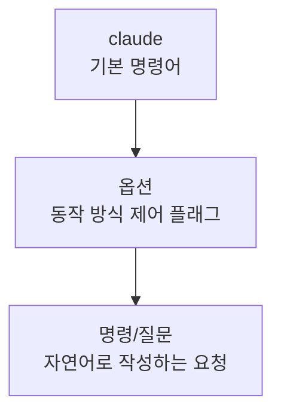
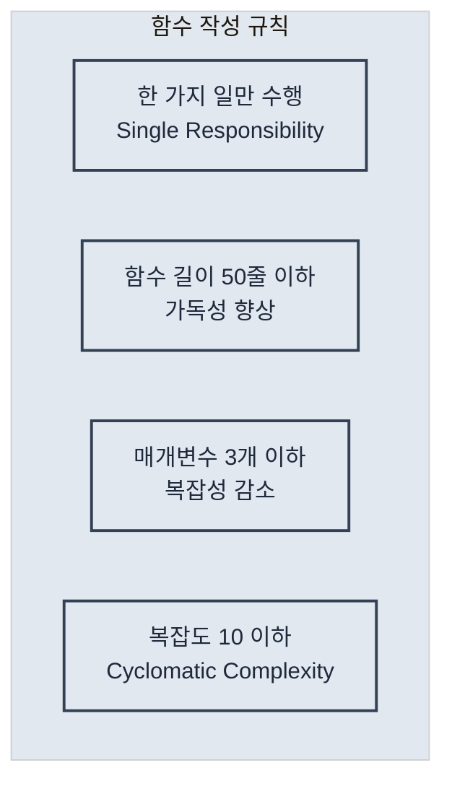

# Claude Code 마스터하기

> 프로그래밍의 역사는 끈임없는 `추상화`와 `도구 발전`의 역사

## Claude Code의 핵심 철학?

1. 유연성: 워크 플로우 강제 X, 다양한 접근 방식 모두 가능
2. 투명성: 모든 작업 과정이 공개
3. 협업: AI는 도구가 아닌 동료
4. 맥락 이해: 전체 프로젝트 맥락 파악

### 강점

- 프로젝트의 전체 컨텍스트를 파악할 수 있다는 점.
- 기능도 강력 -> 30분 만에 실시간 채팅 앱을 만들었다고 함.

----

## 기본 설정 최적화

### 전역 파일 설정

- `~/.claude/config.json`

```json
{
  "api_key": "sk-ant-...",              // API 인증 키
  "default_model": "claude-3-opus-20240229", // 기본 사용 모델
  "theme": "dark",                       // 인터페이스 테마 (dark/light)
  "editor": "vscode",                    // 선호 에디터
  "auto_commit": false,                  // 자동 커밋 여부
  "language": "ko",                      // 기본 언어 설정
  "permissions": {
    "file_write": true,                  // 파일 쓰기 권한
    "file_read": true,                   // 파일 읽기 권한
    "command_execution": true            // 명령 실행 권한
  }
}
```

### IDE?

- 나 같은 경우 IntelliJ의 Claude Code 플러그인을 설치

### 성능 최적화 팁

#### 1. 캐시 활성화

- 반복적인 요청에 대한 응답을 캐시하여 속도를 향상

```shell
# 응답 캐시 활성화
$ claude config set cache_enabled true

# 캐시 유지 시간 설정 (초 단위, 기본: 3600초 = 1시간)
$ claude config set cache_ttl 3600

# 캐시 크기 제한 설정 (MB 단위)
$ claude config set cache_max_size 100
```

- 동일한 코드를 반복 분석할 때 유용.
- 큰 프로젝트에서 점진적 작업 시 효과적
- 캐시 무효화 `claude cache clear`

#### 2. 컨텍스트 크기 조정

- Claude Code가 한 번에 처리할 수 있는 컨텍스트 크기를 조정

```shell
# 큰 프로젝트의 경우 컨텍스트 확대
$ claude config set max_context_length 100000

# 작은 프로젝트나 빠른 응답이 필요한 경우
$ claude config set max_context_length 50000

# 현재 설정 확인
$ claude config get max_context_length
```

- 설정 가이드라인: 
  - 소규모 프로젝트 (< 50개 파일): 50,000 
  - 중간 규모 프로젝트 (50-200개 파일): 100,000 
  - 대규모 프로젝트 (200개+ 파일): 200,000 

#### 3. 로컬 모델 사용

- 인터넷 연결 없이도 사용하는 방법

```shell
# 로컬 모드 활성화
$ claude config set local_mode true

# 로컬 모델 다운로드 (용량 주의: 수 GB)
$ claude download-model claude-instant

# 다운로드된 모델 확인
$ claude list-models --local

# 특정 모델로 실행
$ claude --model local:claude-instant "코드를 분석해줘"
```

---

## Basic

### 명령어 구조

- Claude Code의 명령어 구조



- 아래와 같이 출력 형식을 제어할 수 있다.

```shell
# JSON 형식으로 구조화된 데이터 받기
$ claude --json "프로젝트 구조를 JSON으로 출력해줘"

# 마크다운 형식으로 문서 생성
$ claude --markdown "README 파일 내용을 마크다운으로 보여줘"

# 일반 텍스트 출력 (기본값)
$ claude --plain "간단한 설명을 텍스트로 보여줘"
```

### 파일 탐색과 읽기

- Claude Code는 효율적으로 코드베이스를 탐색할 수 있다.
1. 프로젝트 개요를 파악한다. 구조 트리를 시각화하고 기술 스택을 분석한다.
2. 핵심 디렉토리를 탐색하여 파일들을 상세 분석하고 분류한다.
3. 파일 패턴을 분석. 파일 타입별로 그룹핑하고 테스트 구조를 파악한다.
4. 최근 활동을 추적하여 변경사항을 분석하고 핵심 로직 위치를 파악한다.

- 프로젝트 파악을 위해 `파일 읽기`, `코드 분석 요청` 등 해볼 수 있겠다.

### 코드 작성 및 수정, 디버깅

- 아래 작업을 위해 활용
  - 코드 현대화: ex) `var`를 `const`나 `let`으로 수정
  - 리팩토링
  - 점진적 개선
  - 버그 수정, 테스트 작성
  - 코드 스타일 통일
- Claude Code가 직접 테스트를 실행하는 것도 가능하며, 전체 프로젝트 문맥을 파악하다보니 디버깅도 강력하다.
- 성능 분석 요청도 무리 없이 수행 가능.
- 메모리 누수 추적과 같이 사람이 발견하기 어려운 문제도 쉽게 추적할 수 있다!!!!

### Git 연동

- 변경 사항을 요약하게 하거나, 커밋, 브랜치 체크아웃 등의 작업도 수행 가능하다.
- Squash, 머지 충돌 해결, 버그 변경 사항 추적, cherrypick, PR 등 고급 기능도 사용 가능하다.

---

## 앱 개발? 어떻게 해야할까?

### 가이드를 제공한다.

- 프로젝트 완성 체크리스트를 제공.
- 자주 사용하는 명령어에 단축 별칭을 설정하여 작업 효율성을 높일 수 있다. (아래는 예시)

```markdown
# ~/.bashrc 또는 ~/.zshrc에 추가
alias cc="claude"
alias ccc="claude --clear"
alias ccr="claude 'npm run'"
```

### 템플릿 활용 - 실용적인 템플릿 예시들

1. React 컴포넌트 템플릿

```markdown
# 컴포넌트 생성 템플릿
cat > ~/.claude-templates/components/react-component.txt << 'EOF'
새로운 React 컴포넌트를 만들어줘
- 컴포넌트 이름: [COMPONENT_NAME]
- 함수형 컴포넌트로 작성
- TypeScript 사용
- Props 인터페이스 정의
- 기본 스타일 포함
- 스토리북 스토리 파일도 생성
- 유닛 테스트 파일 포함
EOF

# 사용 예시
COMPONENT_NAME="UserProfile" envsubst < ~/.claude-templates/components/react-component.txt | claude
```

2. API 엔드포인트 템플릿

```markdown
# API 라우트 생성 템플릿
cat > ~/.claude-templates/features/api-endpoint.txt << 'EOF'
새로운 REST API 엔드포인트를 만들어줘
- 리소스: [RESOURCE_NAME]
- CRUD 작업 모두 포함
- Express.js 라우터 사용
- 입력 검증 미들웨어
- 에러 핸들링
- Swagger 문서 주석
- 통합 테스트 포함
EOF
```

3. 버그 수정 템플릿

```markdown
# 버그 수정 워크플로우 템플릿
cat > ~/.claude-templates/features/bugfix.txt << 'EOF'
다음 버그를 수정해줘
1. 먼저 관련된 코드를 찾아서 분석해줘
2. 버그의 근본 원인을 설명해줘
3. 수정 방안을 제시하고 구현해줘
4. 재발 방지를 위한 테스트를 추가해줘
5. 수정사항을 커밋 메시지와 함께 정리해줘

버그 설명: [BUG_DESCRIPTION]
EOF
```

### 컨텍스트 유지

- 복잡하고 긴 작업을 수행할 때는 대화형 모드를 활용하여 문맥을 유지하는 것이 좋다.
- 아래와 같이 단계식으로 접근하면 Claude Code가 프로젝트를 더 잘 파악하고 좋은 코드를 작성할 가능성이 높아진다.

```
> 1단계: 현재 아키텍처를 분석하고 문제점을 파악해줘
...

> 2단계: 마이그레이션 로드맵을 만들어줘
...

> 로드맵 중 첫번째부터 진행해줘
... 
```

#### 컨텍스트 유지 팁

1. `체크포인트 생성`: 각 단계 완료 시 진행 상황 요약 요청 
2. `명확한 단계 구분`: 번호나 라벨로 작업 단계 명시 
3. `정기적인 검증`: 중간중간 결과 확인 및 방향 조정 
4. `컨텍스트 저장`: 중요한 결정사항은 별도 문서로 저장

---

## 프로젝트 맞춤 설정

- `CLAUDE.md` 파일을 통해 맞춤 설정을 한다.
- `CLAUDE.md`가 중요한 이유!
1. 일관성 보장
2. 팀 규칙 자동 적용 (코드 컨벤션, 커밋 규칙 등)
3. 프로젝트 특화 지식 (도메인 용어 제공, 비즈니스 규칙 제공 등)


### 프로젝트 구조 문서화

#### 기본 구조 설명

- 단순한 구조 나열을 넘어서 각 디렉토리의 책임과 파일 명명 규칙까지 포함해야 한다.

#### 아키텍처 패턴 명시

```markdown
## 아키텍처 패턴

### 상태 관리
- Redux Toolkit 사용
- 각 기능별로 slice 파일 생성
- RTK Query로 API 상태 관리

### 컴포넌트 구조
```typescript
// 모든 컴포넌트는 다음 구조를 따름
interface ComponentProps {
  // props 정의
}

export const ComponentName: React.FC<ComponentProps> = (props) => {
  // 훅은 최상단에
  // 로직
  // JSX 반환
}
```

### 코딩 스타일 가이드 정의

- 프로젝트에서 사용하는 프로그래밍 언어별로 일관된 코딩 스타일을 정의해야 한다.
- 단순한 포매팅 규칙을 넘어서 코드의 가독성과 유지보성을 높이는 핵심 요소다.

#### 코드 품질 기준

- 높은 품질의 코드를 유지하기 위한 구체적인 기준과 규칙을 설정한다.
  - 이 기준은 코드 리뷰 시 체크리스트로도 활용된다.

```markdown
## 코드 품질 기준



### 팀 협업을 위한 규칙 설정

- 새로운 팀원의 온보딩과 생산성에도 큰 도움이 된다.

#### 코드 리뷰 가이드라인

```markdown
## 코드 리뷰 가이드라인

### PR 작성 규칙
1. 제목: `[타입] 간단한 설명`
2. 본문 필수 포함 사항
   - 변경 사항 요약
   - 관련 이슈 번호
   - 테스트 방법
   - 스크린샷 (UI 변경 시)

### 리뷰 체크리스트
- [ ] 코드가 프로젝트 컨벤션을 따르는가?
- [ ] 테스트가 충분히 작성되었는가?
- [ ] 성능 영향은 고려되었는가?
- [ ] 보안 취약점은 없는가?
- [ ] 문서는 업데이트되었는가?

### 머지 기준
- 최소 1명의 승인 필요
- 모든 CI 체크 통과
- 충돌 해결 완료

### 브랜치 전략

체계적인 Git 브랜치 관리를 위한 전략과 규칙을 정의합니다. Git Flow를 기반으로 한 실용적인 브랜치 전략을 소개합니다.

## Git 브랜치 전략

### 브랜치 명명 규칙
- feature/기능명: 새 기능 개발
- fix/이슈번호: 버그 수정
- hotfix/설명: 긴급 수정
- refactor/대상: 리팩토링

### 브랜치 플로우
main
  ├── develop
  │     ├── feature/user-auth
  │     ├── feature/payment
  │     └── fix/123
  └── hotfix/critical-bug

### 머지 전략
- feature → develop: Squash merge
- develop → main: Merge commit
- hotfix → main: Cherry-pick
```

---

## 프레임워크별 Best Practices

- 자료 참고 바람

---

## 언어별

### JVM

#### 성능 최적화 전략

```markdown
# JVM 성능 튜닝
claude "Java/Kotlin 애플리케이션의 JVM 성능을 최적화해줘.
- G1GC vs ZGC vs Parallel GC 비교 분석
- 힙 크기와 메타스페이스 튜닝
- JIT 컴파일러 최적화 옵션
- 스레드 로컬 할당 버퍼(TLAB) 설정
- Flight Recorder로 성능 프로파일링"

# 메모리 최적화
claude "메모리 사용량을 최적화하고 GC 압박을 줄여줘.
- 객체 풀링과 재사용 전략
- 오프힙 캐싱 구현
- WeakReference와 SoftReference 활용
- 메모리 누수 탐지와 해결
- 대용량 데이터 스트리밍 처리"

# 동시성 최적화
claude "Java/Kotlin의 동시성 기능을 최적화해줘.
- Virtual Threads (Project Loom) 활용
- CompletableFuture vs Kotlin Coroutines 비교
- 락프리 자료구조 구현
- Actor 모델과 CSP 패턴
- 백프레셔와 플로우 제어"
```

### 실전 디버깅과 문제 해결

```markdown
# 복잡한 동시성 문제 해결
claude "멀티스레드 환경에서 발생하는 데드락을 탐지하고 해결해줘.
- 스레드 덤프 분석과 해석
- 락 경합 지점 식별
- 락프리 알고리즘 적용
- Virtual Threads 마이그레이션
- 성능 벤치마크와 검증"

# 메모리 누수 진단
claude "Java 애플리케이션의 메모리 누수를 진단하고 해결해줘.
- 힙 덤프 분석과 MAT 도구 활용
- 강한 참조 체인 추적
- 리스너와 콜백 누수 탐지
- 오프힙 메모리 누수 확인
- 메모리 사용 패턴 최적화"

# 프로덕션 이슈 대응
claude "프로덕션 환경의 성능 저하를 실시간으로 진단해줘.
- APM 도구로 병목 지점 식별
- 데이터베이스 쿼리 성능 분석
- GC 로그 분석과 튜닝
- JIT 컴파일러 최적화 확인
- 자동 복구 메커니즘 구현"
```

---

## 효율적인 개발 워크 플로우


---

# 참고자료

- [Claude Code 마스터하기](https://revfactory.github.io/claude-code-mastering/)
