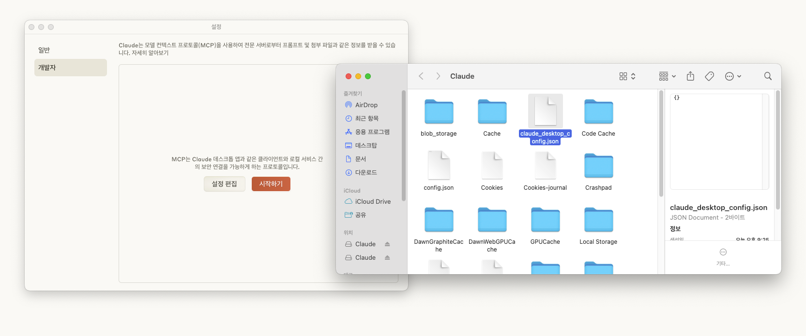

# MCP(Model Context Protocol)

- 정의: AI 모델과 다양한 데이터 소스 및 도구를 연결하는 표준 통신 방식
- 쉽게 표현하자면, AI 모델이 컨텍스트를 잘 이해하고 필요한 액션을 취할 수 있도록 도와주는 프로토콜이다.
  - 개발자가 API를 활용해서 다양한 서비스를 연결해서 사용할 수 있는 것처럼
  - AI 모델도 MCP를 통해 다양한 서비스를 활용

## 구조

- HOST -> Client -> Server <-> Resource


- `HOST`: AI 모델을 활용할 수 있는 서비스를 의미
  - AI 모델을 제공하는 Claude, ChatGPT(지원할 거라고 밝힘)
  - Cursor, Windsurf 등의 코드 편집기
  - N8N과 같은 자동화 툴
- `Client`: `Server`와 `HOST` 커뮤니케이션을 도와주는 역할. `HOST`에 포함되는 개념
- `Server`: (가장 중요) 다양한 서비스들을 표준화된 방식으로 활용할 수 있게 도와주는 역할
- `Resource`: 외부 서비스

## MCP를 사용하면 무엇이 좋은가?

- 기존에는 외부 서비스를 활용하기 위해 서버에서 코딩을 일일이 다 해줘야 했다.
  - 인증 작업, 세부 사항 설정, 기능 사용 등 많은 코드가 필요 => 작업이 많이 필요.
  - Resource별로 설정이 달라 많은 보일러플레이트 코드가 필요해진다.
- MCP를 사용하면 이런 번거로움을 아예 제거할 수 있다.
  - 사용할 호스트별로 동일한 MCP 서버만 설치해주면 작업이 끝이다. 세부 설정을 할 필요가 없다.
  - 쉽게 여러 서비스를 적용할 수 있어 AI Agent를 만드는 것이 쉬워진다.

## 실습

- NodeJS 설치. => MCP를 설치하기 위해 활용
- Claude 설치.
- 설정에서 개발자 탭을 클릭. 설정 편집을 통해 편집 가능



### MCP 서버는 어디서 다운로드 받을 수 있나?

- Github에서 다운로드 가능.
- [Github Repository Link](https://github.com/modelcontextprotocol/servers)
- 다양한 커스텀 MCP 서버들이 개발자에 의해 공유되고 있음.

### (1) 인터네셔 뉴스 검색 및 슬랙 전송

#### 크롤링 MCP: [github link](https://github.com/mendableai/firecrawl-mcp-server)

- Claude에서 사용하는 방법을 친절히 설명해주고 있다.


- 방금 전에 살펴본 `claude_desktop_config.json`에 복사 붙여넣기
- 아래와 같이 firecrawl을 사용할 수 있게 된 것을 확인


#### Slack MCP: [github link](https://github.com/modelcontextprotocol/servers/tree/main/src/slack)

- 동일하게 json 파일에 설정 추가하고, API Key 추가

#### 최종 설정

- `claude_desktop_config.json`

```json
{
  "mcpServers": {
    "mcp-server-firecrawl": {
      "command": "npx",
      "args": ["-y", "firecrawl-mcp"],
      "env": {
        "FIRECRAWL_API_KEY": "{firecrawl_key}",

        "FIRECRAWL_RETRY_MAX_ATTEMPTS": "5",
        "FIRECRAWL_RETRY_INITIAL_DELAY": "2000",
        "FIRECRAWL_RETRY_MAX_DELAY": "30000",
        "FIRECRAWL_RETRY_BACKOFF_FACTOR": "3",

        "FIRECRAWL_CREDIT_WARNING_THRESHOLD": "2000",
        "FIRECRAWL_CREDIT_CRITICAL_THRESHOLD": "500"
      }
    },
    "slack": {
      "command": "npx",
      "args": [
        "-y",
        "@modelcontextprotocol/server-slack"
      ],
      "env": {
        "SLACK_BOT_TOKEN": "{슬랙토큰}",
        "SLACK_TEAM_ID": "{팀아이디}",
        "SLACK_CHANNEL_IDS": "{채널아이디}"
      }
    }
  }
}
```

#### 실행

- 아래 요청을 Claude Desktop에 넣어보자.

```shell
Firecrawl로 techcrunch에서 AI 최신 주요 뉴스 5개를 가져와서 daily report로 읽기 좋게 정리해줘
- 각 뉴스 헤드라인에 기사 링크를 강 기사별 1회만 링크를 포함해줘. Output format은 slack Block Kit-compatible JSON payload for a message with a title, bullet list, and footer로 해줘.
```

- 아래와 같이 외부 연동 서비스 사용에 대한 모달이 뜬다. 사용하자.


- 이제 아래 명령어를 사용하면 슬랙을 받을 수 있다.

```shell
해당 리포트를 슬랙 채널 "ai-news"에 보기 좋은 형태로 게시해줘
```

# 참고자료

- [Youtube: MCP써야 진짜 Claude다! 500% 활용 튜토리얼 (개념부터 활용까지)](https://www.youtube.com/watch?v=fkqXQOjj8cA)
