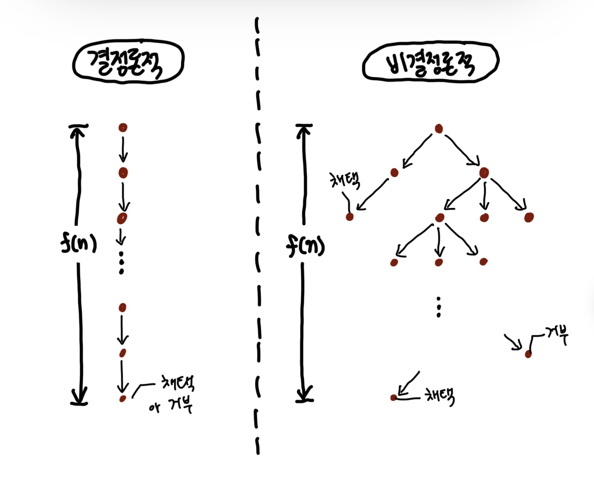

# Graph

- `위상수학`이란 `연속변환 Continuous Transformation`에 대해 불변인 기하학적 객체의 특성을 연구하는 수학의 한 분야
  - 다른 수학 분야의 기초. 자연과학과 이론 물리학, 전자공학 등에 상당한 영향을 미치고 있음.
- 쾨니히스베르크.
  - 섬과 도시를 잇는 7개의 다리.
  - 7개의 다리를 한 번씩만 건너서 모두 지나갈 수 있을까?
  - 수학의 모차르트 레온하르트 오일러가 쾨니히스베르크의 다리 문제를 조사
  - 위상수학의 출현을 이끈 '그래프 이론'의 시작.
- 그래프 = 객체의 일부 쌍들이 연관되어 있는 객체 집합 구조.

## 오일러 경로

- 모든 정점이 짝수 개의 `차수 Degree`를 갖는다면 모든 다리를 한 번씩만 건너서 도달하는 것이 성립한다고 말했다.
  - 100년 후, 독일의 수학자 칼히어홀저가 수학적으로 증명
  - 이를 오일러의 정리라고 부름
  - 모든 간선을 한 번씩 방문하는 유한 그래프를 오일러 경로라고 부른다.

## 해밀턴 경로

- 각 정점을 한 번씩 방문하는 무향 또는 유향 그래프 경로를 말한다.
- 오일러 경로와의 차이?
  - 오일러 경로: 경로가 간선을 기준.
  - 해밀턴 경로: 정점을 기준.
- 해밀턴 경로를 찾는 문제는 최적 알고리즘이 없는 NP-Complete 문제다.
- 해밀턴 경로 중에서 원래의 출발점으로 돌아오는 경로를 `해밀턴 순환 Hamiltonian Cycle`이라 함.
  - 이 중에서 최단 거리를 찾는 문제는 알고리즘 분야에서 `외판원 문제 Travelling Salesman Problem`로 유명하다.
  - 각 도시를 방문하고 돌아오는 가장 짧은 경로를 찾는 문제.
- 외판원 문제는 다이나믹 프로그래밍 기법을 활용하면 최적화하기 쉽다.
  - 이 경우 O(n^2 * 2^n)으로 최적화할 수 있는데 입력값 n = 20을 대입하면 419,430,400으로 여전히 엄청난 수치이긴 하지만 240경보다 훨씬 빠르다.

> #### NP 복잡도
> 
> - 앨런 튜링의 튜링 기계.
>   - 테이프에 쓰여 있는 여러 가지 기호를 일정한 규칙에 따라 바꾸는 가상의 기계
>   - 단순한 수학적 모델의 일종이지만 이 모델에는 이미 현재 컴퓨터의 동작원리가 내포
> - 튜링 기계의 변형 모델로 `비결정론적 튜링 기계 Non-Determinisitc Turing Machine, NTM`을 제시
>   - 기존의 튜링 기계는 일련의 규칙을 엄격히 준수하며 한 가지 방식으로 `결정론적 Deterministic`으로 동작
>   - 비결정론적 튜링 기계는 다양한 선택지가 있고 이동할 수 있는 상태의 개수도 상황에 따라 여러 개가 되거나 아예 없을 수도 있다.



> - 또한 튜링의 기계를 이용해 문제를 풀이할 때 흔히 다항 시간(Polynomial Time) 내에 풀이한다고 얘기함.
>   - 쉽게 말해 다룰 수 있는 시간 범위 내에서 해결이 가능하다는 뜻.
>   - 반대 의미로는 지수 시간이 있으며, 지수 시간이 2^n인 경우 n이 100만 되어도 계산 결과가 1.2676506e+30가 되기 때문에 이런 경우는 다항 시간 내에 풀이가 불가능
> - 튜링 기계로 다항 시간 내에 풀 수 있는 문제는 P 문제. 비결정론적 튜링 기계로 다항 시간 내에 풀 수 있는 문제는 NP 문제라고 한다.
>   - 일정한 공식을 통해 한 번에 풀이할 수 있는 2차 방정식이 대표적인 P 문제
>   - 다양한 가능성을 시도하며 풀이하는 소인수분해 같은 문제는 대표적인 NP 문제
> - 틱택토에서 반드시 승리하는 알고리즘
>   - 비결정론적 튜링 기계로 풀 수 있는 대표적인 문제
>   - 틱택토는 매우 단순하기 때문에 다항 문제로 풀 수 있는 대표적이 문제.
> - 반면 바둑에서 반드시 승리하는 알고리즘?
>   - 다항 시간 내에 전체를 탐색할 수 없기 때문에 풀이가 불가능. NP 문제가 아니다.
>   - 알파고가 등장하기 전까지만 해도 바둑에서 기계는 인간을 이기지 못함.
>   - 알파고는 문제를 풀이한 것이 아닌가 착각할 수 있지만, 알파고는 반그시 승리하는 알고리즘을 찾은 것이 아니며 따라서 알파고 또한 문제를 풀이한 게 아니다. (이세돌에게 한 판 지기도 했음)
> - P 문제의 정의가 '다항 시간 애에 풀이가 가능한 문제'라면 NP 문제는 '다항 시간 내에 검산이 가능한 문제'로 정의하기도 한다.
> - 이외에도 다항 시간 내에 풀 수 없는 문제를 다항 시간 내에 풀 수 있는 다른 문제로 환원해서 풀 수 있을 때 이를 NP-난해 문제라 부른다.
>   - 또한 NP 문제이면서 NP-난해 문제는 NP-완전 문제라 부른다.
>   - 해밀턴 경로 문제는 다항 시간에 쉽게 검산할 수 있으므로 NP 문제이며, NP-난해 문제이다. 또한 NP문제이면서 NP-난해 문제이기 때문에 NP-완전 문제라고 볼 수 있다.
>   - 반면 외판원 문제는 답이 주어진다 해도 최단 거리인지 검산하는 것을 다항 시간 내에 할 수 없으므로 NP 문제가 아니다. NP-난해 문제이지만 NP 문제가 아니브로 NP-완전 문제가 아니다.

## 그래프 순회 Graph Traversal

- `그래프 탐색 Graph Search`라고도 부름. 그래프의 각 정점을 방문하는 과정. 두 가지로 분류 가능
  - `깊이 우선 탐색 Depth-First Search, DFS`
  - `넓이 우선 탐색 Breadth-First Search, BFS`
- `DFS`는 주로 스택이나 재귀로 구현.
  - 백트래킹을 통해 뛰어난 효용을 보인다.
- `BFS`는 주로 큐로 구현.
  - 그래프의 최단 경로를 구하는 문제 등에 사용.

### DFS

#### 재귀 구조로 구현

```
procedure DFS(G, v) is
    label v as discovered
    for all directed edges from v to w that are in G.adjacentEdges(v) do
        if vertex w is not labeled as discovered then
            recursively call DFS(G, w)
```


#### 스택을 이용한 반복 구조

```
procedure DFS_iterative(G, v) is
    let S be a stack
    S.push(v)
    while S is not empty do
        v = S.pop()
        if v is not labeled as discovered then
            label v as discovered
            for all edges from v to w in G.adjacentEdges(v) do 
                S.push(w)
```

### BFS

#### 큐를 이용한 반복 구조로 구현

```
procedure BFS(G, root) is
      let Q be a queue
      label root as explored
      Q.enqueue(root)
      while Q is not empty do
          v := Q.dequeue()
          if v is the goal then
              return v
          for all edges from v to w in G.adjacentEdges(v) do
              if w is not labeled as explored then
                  label w as explored
                  w.parent := v
                  Q.enqueue(w)
```


# 참고자료

- 자바 알고리즘 인터뷰, 박상길 지음
