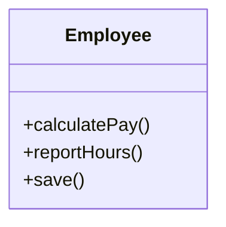
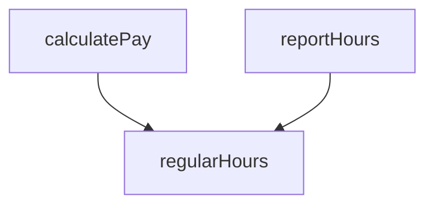
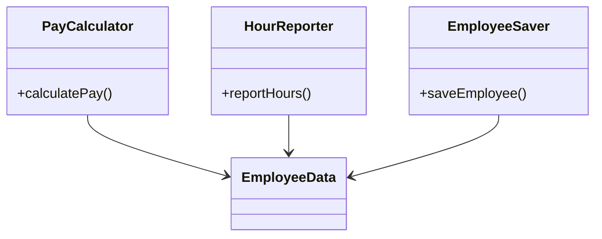
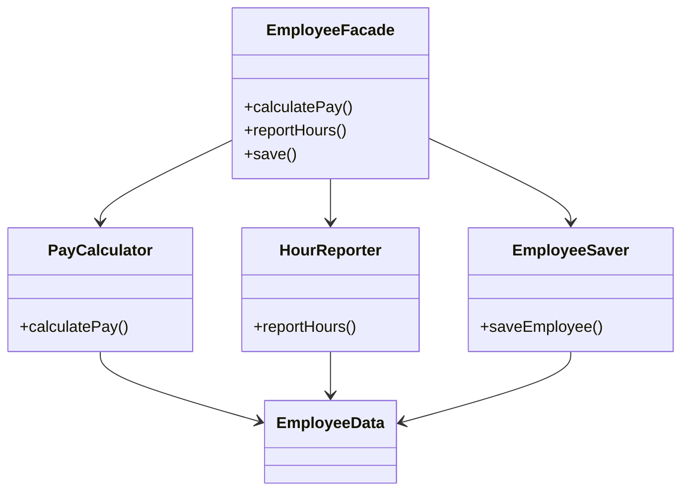
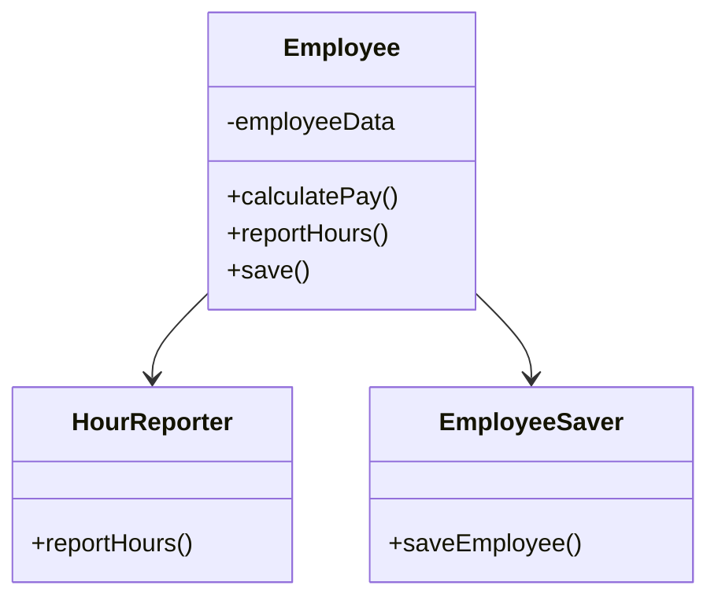
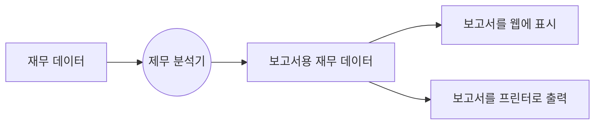
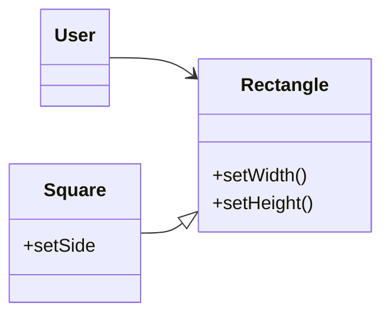
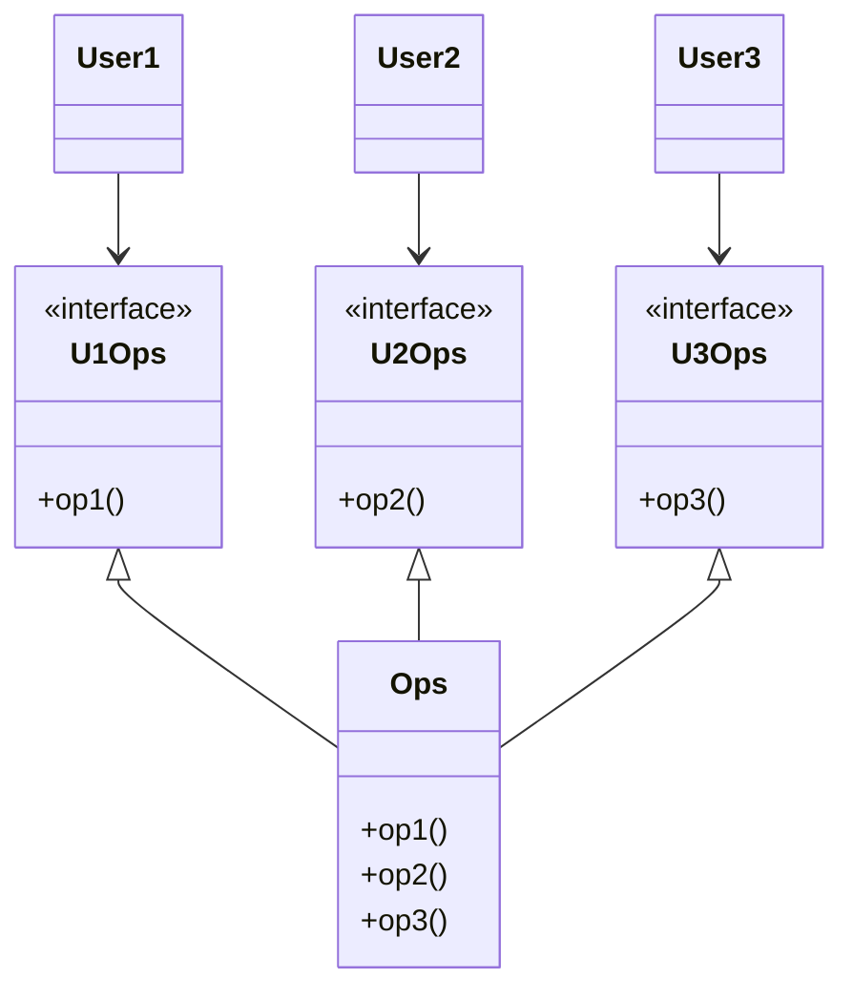
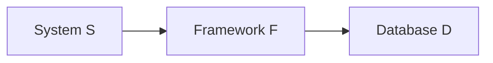
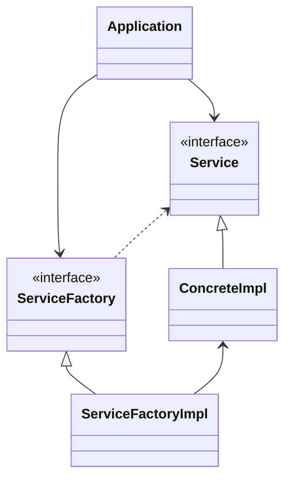

# 3부 설계 원칙

- 아키텍처를 정의하는 원칙, SOLID.
  - 데이터 구조를 클래스로 배치하는 방법, 그리고 이들 클래스를 서로 결합하는 방법을 설명해준다.
- SOLID 원칙의 목적은 중간 수준의 소프트웨어 구조가 아래와 같도록 만드는 데 있다.
1. 변경에 유연하다.
2. 이해하기 쉽다.
3. 많은 소프트웨어 시스템에 사용될 수 있는 컴포넌트의 기반이 된다.

- '중간 수준'이라 함은 프로그래머가 이들 원칙을 모듈 수준에서 작업할 때 적용할 수 있다는 뜻이다.

---

## 7장 SRP: 단일 책임 원칙

- 이 원칙의 이름을 듣는다면 모든 모듈이 단 하나의 일만 해야 한다는 의미로 받아들이기 쉽다.
  - 사실 단 하나의 일만 해야 한다는 원칙은 따로 있다. 함수가 하나의 일만 해야 한다.
- 역사적으로 SRP는 아래와 같이 기술되어 있다.

> 단일 모듈의 변경의 이유가 하나, 오직 하나뿐이어야 한다.

> 하나의 모듈은 하나의, 오직 하나의 액터에 대해서만 책임져야 한다.

- '모듈'의 가장 단순한 정의? 소스 파일
  - 모듈은 단순히 함수와 데이터 구조로 응집된 집합이다. 
  - 단일 액터를 책임지는 코드를 함께 묶어주는 힘이 바로 `응집성 cohesion`이다.
- 이 원칙을 이해하는 가장 좋은 방법. 이 원칙을 위반하는 징후를 살펴보는 것이다.

### 징후 1: 우발적 중복



- 함수 설명
  - `calculatePay()`: 회계팀에서 기능 정의. CFO 보고를 위해 사용.
  - `reportHours()`: 인사팀에서 기능 정의. COO 보고를 위해 사용. 
  - `save()`: DBA가 기능을 정의하고, CTO 보고를 위해 사용
- 세 액터가 결합되어 버렸다.
  - CFO 팀에서 결정한 조치가 COO 팀이 의존하는 무언가에 영향을 줄 수 있다는 말이다.
  - ex) 아래와 같이 `calculatePay()`, `reportHours()`가 같은 함수를 공유하고 있는 경우.



### 징후 2: 병합

- 메소드가 서로 다른 액터를 책임진다면 병합이 발생할 가능성은 확실히 더 높다.
- 이 문제를 벗어나는 방법은 서로 다른 액터를 뒷받침하는 코드를 서로 분리하는 것이다.

### 해결책

1. 모두가 메소드를 각기 다른 클래스로 이동
- 세 클래스는 서로의 존재를 몰라야 한다. 따라서 '우연한 중복'을 피할 수 있다.
- 하지만 세 가지 클래스를 인스턴스화하고 추적해야 한다는 게 단점이다. 이때 흔히 퍼사드 패턴을 사용한다.



2. 퍼사드 패턴 사용
- `EmployeeFacade`에 코드는 거의 없다. 세 클래스의 객체를 생성하고, 요청된 메소드를 가지는 객체로 위임하는 일을 책임진다.



- 가장 중요한 메소드는 기존의 `Employee` 클래스에 그대로 유지하면서, 덜 중요한 나머지 메소드들에 대한 퍼사드로 사용하는 방법도 있다.



- SRP는 모든 클래스는 반드시 하나의 메소드를 가져야 한다는 법칙이 아니다.
- 또한 메소드와 클래스 수준뿐만 아니라, 이보다 상위의 두 수준에서도 다른 형태로 등장한다.
  - 컴포넌트 수준에서는 `공통 폐쇄 원칙 Common Closure Principle` 
  - `아키텍처 경계 Architectural Boundary`의 생성을 책임지는 `변경의 축 Axis of Change`이 된다.

---

## 8장 OCP: 개방-폐쇄 원칙

> 소프트웨어 `개체 artifact`는 확장에는 열려 있어야 하고, 변경에는 닫혀 있어야 한다.

- 소프트웨어 아키텍처를 공부하는 가장 근본적인 이유.

### 사고 실험

- 요구사항

```
지금부터는 재무제표를 웹페이지로 보여주는 시스템이 있다고 가정.
웹페이지에 표시되는 데이터는 스크롤할 수 있으며, 음수는 빨간색으로 출력된다.

이제 이해관계자가 동일한 정보를 보고서 형태로 변환해서 흑백 프린터로 출력해 달라고 요청했다고 해 보자.
이 보고서에는 다음과 같은 요건이 충족되어야 한다:
1. 페이지 번호가 제대로 매겨져 있어야 하며,
2. 페이지마다 적절한 머리글과 바닥글이 있어야 한다.
3. 표의 각 열에는 레이블이 표시되어야 하며,
4. 음수는 괄호로 감싸서 표시되어야 한다.
```

- 서로 다른 목적으로 변경되는 요소를 적절하게 분리하고(단일 책임 원칙), 이들 요소 사이의 의존성을 체계화함으로써(의존성 역전 원칙) 변경량을 최소화할 수 있다.
- 단일 책임 원칙을 적용하면 데이터 흐름을 아래와 같은 형태로 만들 수 있다.



- 보고서 생성이 두 개의 책임으로 분리
  - 두 개의 책임은 각각 변경이 발생하더라도 영향을 주지 않도록 의존성을 조직화해야 함.
  - 또한, 새로 조직화한 구조에서는 행위가 확장될 때 변경이 발생하지 않음을 보장해야 한다.
- 비즈니스 규칙을 포함하는 계층은 다른 계층에서 발생한 변경에 의해 그 어떤 영향도 받지 않게 설계해야 한다.
  - 왜 이처럼 특별한 위치를 차지해야 할까? 비즈니스 규칙이 문제를 해결하기 위한 코드가 있는 가장 중요한 부분이기 때문.
- 아키텍트는 기능이 어떻게, 왜, 언제 발생하는지에 따라서 기능을 분리하고, 분리한 기능을 컴포넌트의 계층구조로 조직화한다.
  - 저수준 컴포넌트에서 발생한 변경으로부터 고수준 컴포넌트를 보호할 수 있다.

### 정보 은닉

- Controller가 도메인 내부에 대해 너무 알지 못하도록 막기 위해 인터페이스를 사용할 수도 있다.
- 만약 인터페이스가 없다면 Controller는 도메인 엔티티에 대해 `추이 종속성 transitive dependency`를 가지게 된다.
- 추이 종속성을 가지게 되면 소프트웨어 엔티티는 '자신이 직접 사용하지 않는 요소에는 절대로 의존해서는 안 된다.'는 소프트웨어 원칙을 위반하게 된다.

---

## 9장 LSP: 리스코프 치환 원칙

> 여기에서 필요한 것은 다음과 같은 `치환 substitution` 원칙이다. 
> `S` 타입의 객체 `o1` 각각에 대응하는 `T` 타입 객체 `o2`가 있고, `T` 타입을 이용해서 정의한 모든 프로그램 `P`에서 `o2`의 자리에 `o1`을 치환하더라도 `P`의 행위가 변하지 않는다면, `S`는 `T`의 하위 타입이다.
> - 바바라 리스코프

### 정사각형/직사각형 문제

- LSP를 위반하는 전형적인 문제로 유명한 정사각형/직사각형 문제



- 이 예제에서 `Square`는 `Rectangle`의 하위 타입으로는 적합하지 않다.
  - `Rectangle`의 높이와 너비는 서로 독립적으로 변경될 수 있는 반면, `Square`의 높이와 너비는 반드시 함께 변경되기 때문이다.

### LSP 위배 사례

- 택시 파견 서비스
  - 만약 서로 다른 REST API 시스템을 가지고 있는 2개의 택시 서비스가 통합된다면?
- 치환 가능성을 조금이라도 위배하면 시스템 아키텍처가 오염되어 상당량의 별도 메커니즘을 추가해야 할 수도 있다.

---

## 10장 ISP: 인터페이스 분리 원칙



### ISP와 언어

- 정적 타입 언어는 사용자가 `import`, `use` 또는 `include`와 같은 타입 선언문을 사용하도록 강제한다.
  - 이처럼 소스 코드에 포함된 선언문으로 인해 소스 코드 의존성이 발생하고, 이로 인해 재컴파일 또는 재배포가 강제되는 상황이 무조건 초래된다.
- 동적 타입 언어에서는 소스 코드에 이러한 선언문이 존재하지 않는다. 대신 런타임 추론이 발생한다.
  - 따라서 소스 코드 의존성이 아예 없으며, 결국 재컴파일과 재배포가 필요없다.
  - 동적 타입 언어를 사용하면 정적 타입 언어를 사용할 때보다 유연하며 결합도가 낮은 시스템을 만들 수 있는 이유가 바로 이 때문이다.

### ISP와 아키텍처

- 일반적으로, 필요 이상으로 많은 걸 포함하는 모듈에 의존하는 것은 해로운 일이다.
  - 소스 코드 의존성의 경우 이는 분명한 사실인데, 불필요한 재컴파일과 재배포를 강제하기 때문이다.
  - 하지만 더 고수준인 아키텍처 수준에서도 마찬가지 상황이 발생한다.



- `F`에서는 불필요한 기능, 따라서 `S`와는 전혀 관계 없는 기능이 `D`에 포함된다고 해보자.
  - 그 기능 때문에 `D`의 내부가 변경되면, `F`를 재배포해야 할 수도 있고, 따라서 `S`까지 재배포해야 할지 모른다.

---

## 11장 DIP: 의존성 역전 원칙

> '유연성이 극대화된 시스템'이란 소스 코드 의존성이 `추상 abstraction`에 의존하며 `구체 concrete`에는 의존하지 않는 시스템이다.

- 우리가 의존하지 않도록 피하고자 하는 것은 바로 `변동성이 큰 volatile` 구체적인 요소다.
  - 다만, 요구사항의 변동에 따라 자주 변경될 수밖에 없는 모듈들이다.

### 안정된 추상화

- 추상 인터페이스에 변경이 생기면 이를 구체화한 구현체들도 따라서 수정해야 한다.
  - 반대로 구체적인 구현체에 변경이 생기더라도 그 구현체가 구현하는 인터페이스는 항상, 좀 더 정확히 말하면 대다수의 경우 변경될 필요가 없다.
  - 따라서 인터페이스는 구현체보다 변동성이 낮다.

1. 변동성이 큰 구체 클래스를 참조하지 말라.
2. 변동성이 큰 구체 클래스로부터 파생하지 말라.
3. 구체 함수를 오버라이드 하지 말라.
4. 구체적이며 변동성이 크다면 절대로 그 이름을 언급하지 말라.

### 팩토리

- 위 규칙들을 준수하려면 변동성이 큰 구체적인 객체는 특별히 주의해서 생성해야 한다.
- 자바 등 대다수의 객체 지향 언어에서 바람직하지 못한 의존성을 처리할 때 추상 팩토리를 사용하곤 한다.



- `Service` & `ServiceFactory`와  `ServiceFactoryImpl` & `ConcreteImpl` 사이에는 경계가 있다.
  - 전자는 추상 컴포넌트고, 다른 하나는 구체 컴포넌트다.
  - 추상 컴포넌트는 애플리케이션의 모든 고수준 업무 규칙을 포함한다.
  - 구체 컴포넌트는 업무 규칙을 다루기 위해 필요한 모든 세부사항을 포함한다.
- 제어흐름은 소스 코드 의존성과는 정반대 방향으로 흐른다는 것을 주목.
  - 이러한 이유로 이 원칙을 `의존성 역전 Dependency Inversion`이라고 부른다.

### 구체 컴포넌트

- 구체 컴포넌트에는 구체적인 의존성이 하나 있고, 따라서 DIP에 위배된다.
  - 일반적이다. DIP 위배를 모두 없앨 수는 없다.

---

# 참고자료

- 클린 아키텍처, 로버트 C. 마틴
