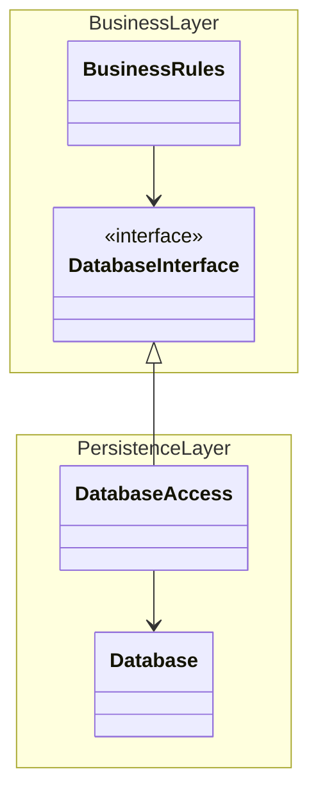
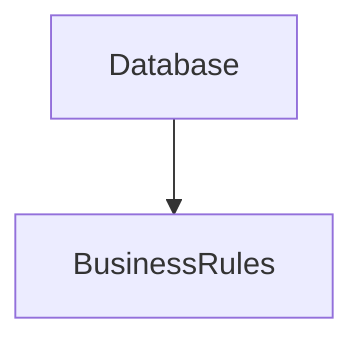
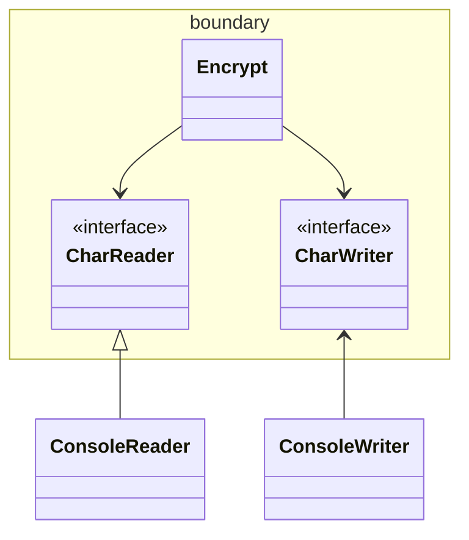

# 5부 아키텍처

## 15장 아키텍처란?

> 소프트웨어 아키텍트라면 코드에서 탈피하여 고수준의 문제에 집중해야 한다는 거짓말에 절대로 속아 넘어가서는 안 된다.
> 소프트웨어 아키텍트는 코드와 동떨어져서는 안 된다.

- 초점은 항상 '생산성 극대화'
- 소프트웨어 시스템의 아키텍처란? 시스템을 구축했던 사람들이 만들어낸 시스템의 형태
  - 그 모양은 시스템을 컴포넌트로 분할하는 방법, 분할된 컴포넌트를 배치하는 방법, 컴포넌트가 서로 의사소통하는 방식에 따라 정해진다.
  - 그리고 그 형태는 아키텍처 안에 담긴 소프트웨어 시스템이 쉽게 개발, 배포, 운영, 유지보수되도록 만들어진다.

> 이러한 일을 용이하게 만들기 위해서는 가능한 한 많은 선택지를, 가능한 한 오래 남겨두는 전략을 따라야 한다.

> 아키텍처의 주된 목적은 시스템의 생명주기를 지원하는 것이다.
> 시스템의 수명과 관련된 비용은 최소화하고, 프로그래머의 생산성은 최대화하는 데 있다.

### 개발

- 팀 구조 -> 아키텍처 관련 결정에서도 차이가 난다.
  - 소규모 팀은 아키텍처 관련 제약이 오히려 방해가 된다고 여길 수 있음.
  - 수많은 시스템에서 좋은 아키텍처가 결여된 이유는 바로 이 때문이다.

### 배포

- 배포 비용이 높을수록 시스템의 유용성은 떨어진다.
- 프로젝트 초기에 '마이크로서비스'를 채택했다고 가정.
  - 위협적일만큼 늘어난 수많은 마이크로서비스를 발견하게 될지도? -> 서로 연결하기 위해 설정하고 작동 순서를 결정하는 과정에서 오작동이 발생할 원천이 스며들 수 있다.
  - 배포 문제를 고려한다면 더 적은 서비스를 사용하고, 서비스 컴포넌트와 프로세스 수준의 컴포넌트를 하이브리드로 융합하며, 더 통합된 도구를 사용하여 상호 연결을 관리

### 운영

- 아키텍처가 미치는 영향이 개발, 배포, 유지보수보다는 덜 극적이다.
  - 하드웨어를 더 투입해서 해결할 수 있기 때문. (아키텍처가 만약 비효율적이라면 말이다.)

> 좋은 아키텍처는 시스템을 운영하는 데 필요한 요구도 알려준다.

### 유지보수

- 유지보수는 소프트웨어에서 비용이 가장 많이 발생하는 곳.
  - 새로운 기능 -> 결함 -> 결험 수정
  - 그 중 가장 큰 비용은 `탐사 spelunking`. 기존의 소프트웨어에 새로운 기능을 추가하거나 결함을 수정할 때, 소프트웨어를 파헤쳐서 어디를 고치는 게 최선인지, 그리고 어떤 전략을 쓰는 게 최적일지를 결정할 때 드는 비용
  - 의도치 않은 결함이 발생할 가능성은 항상 존재.

### 선택사항 열어 두기

- 소프트웨어의 두 가지 가치
1. 행위적 가치
2. 구조적 가치

- 이 중 구조적 가치가 더 중요. 소프트웨어를 soft하게 만드는 것이기 때문이다.
  - 부드럽게 유지하는 방법? 선택사항을 가능한 한 많이, 그리고 가능한 한 오랫동안 열어 두는 것이다.
  - 열어 둬야 하는 선택사항이란? 중요치 않은 세부사항
- 모든 소프트웨어 시스템의 주요한 두 가지 구성요소
1. `정책 policy`: 모든 업무 규칙과 업무 절차를 구체화. 시스템의 진정한 가치가 살아 있는 곳.
2. `세부사항 detail`: 사람, 외부 시스템, 프로그래머가 정책과 소통할 때 필요한 요소지만, 정책이 가진 행위에는 조금도 영향을 미치지 않는다. (ex-입출력 장치, 데이터베이스, 서버, 프레임워크, 프로토콜 등)

> 아키텍트의 목표는 시스템에서 정책을 가장 핵심적인 요소로 식별하고, 동시에 세부사항은 정책에 무관하게 만들 수 있는 형태의 시스템을 구축하는 데 있다.
> 이를 통해 세부사항을 결정하는 일을 미루거나 연기할 수 있다.

> 선택사항을 오랫동안 열어둘 수 있다면 더 많은 실험을 해볼 수 있고 더 많은 것을 시도할 수 있다.
> 그리고 결정을 더 이상 연기할 수 없는 순간이 닥쳤을 때는 이러한 실험과 시도 덕분에 더 많은 정보를 획득한 상태일 것이다.

> 좋은 아키텍트는 결정되지 않은 사항의 수를 최대화한다.

### 장치 독립성

- 예전의 소프트웨어 예시. 오직 카드 판독기와 카드 천공기에서만 작동하는 소프트웨어.
  - `장치 종속적 device dependent`
- 1960년대 후반에 이르러서야 교휸을 얻고 `장치 독립성 device independence`을 생각해냄.

### 광고 우편

- 자기테이프, 라인 프린터 각각 호환되는 프로그램을 만듦.
- 정책은 이름과 주소 레코드에 대한 서식.
- 세부사항은 장치.

### 물리적 주소 할당

- 고수준의 정책이 디스크의 물리적인 구조에 종속적이었던 예시
  - 200개의 실린더와 10개의 헤드로 구성, 각 실린더는 헤드별로 수십 개의 섹터로 구성.
  - 어느 실린더가 `Agent`, `Employer`, `Member`를 포함하는지 알게 되었고, 이러한 정보가 모두 하드코딩됨.
  - 레코드에 실린더 번호, 헤더 번호, 섹터 번호를 포함했다고 한다 (??!?!)
- 그런데 헤더가 더 많거나 실린더가 더 많은, 또는 실린더당 섹터가 더 많은 새로운 디스크 드라이브로 업그레이드해야 한다면??
  - 실린더/헤드/섹터 번호를 마이그레이션해야 한다. 하드 코딩도 많았다고 하니, 그 많은 코드를 수정해야 한다.
- 상대 주소를 사용하라는 충고.
  - 각 섹터 주소는 순차적인 정수를 이용해 지정 가능. 디스크를 이러한 섹터로 구성된 하나의 거대한 선형 배열 취급.

----

## 16장 독립성

- 좋은 아키텍처는 다음을 지원해야 한다.
1. 시스템의 유스케이스
2. 시스템의 운영
3. 시스템의 개발
4. 시스템의 배포

### 유스케이스

- 시스템의 의도를 지원해야 한다는 뜻.
- 하지만 아키텍처는 시스템의 행위에 그다지 큰 영향을 주지 않는다.
  - 행위와 관련하여 아키텍처가 열어 둘 수 있는 선택사항은 거의 없다.
- 하지만 영향이 전부는 아니다. 좋은 아키텍처가 행위를 지원하기 위해 할 수 있는 일 중에서 가장 중요한 사항은 행위를 명확히 하고 외부로 드러내며, 이를 통해 시스템이 지닌 의도를 아키텍처 수준에서 알아볼 수 있게 만드는 것이다.

### 운영

- 시스템이 단일체로 작성되어 모놀리틱 구조를 갖는다면, 다중 프로세스, 다중 스레드, 또는 마이크로서비스 형태가 필요해질 때 개선하기가 어렵다.
- 아키텍처에서 각 컴포넌트를 적절히 격리하여 유지하고 컴포넌트 간 통신 방식을 특정 형태로 제한하지 않는다면, 시간이 지나 운영에 필요한 요구사항이 바뀌더라도 스레드, 프로세스, 서비스로 구성된 기술 스펙트럼 사이를 전환하는 일이 훨씬 쉬워질 것이다.

### 개발

- 아키텍처는 개발환경을 지원하는 데 있어 핵심적인 역할 수행.
- `콘웨이의 법칙 Conway's Law`

> 시스템을 설계하는 조직이라면 어디든지 그 조직의 의사소통 구조와 동일한 구조의 설계를 만들어낼 것이다.

- 많은 팀 구성 -> 독립적인 컴포넌트로 만들어 잘 격리되게끔 해야 한다.

### 배포

- 아키텍처는 배포 용이성을 결정하는 데 중요한 역할을 한다.
  - 이때 목표는 `즉각적인 배포 immediate deployment`
  - 좋은 아키텍처는 수십 개의 작은 설정 스크립트나 속성 파일을 약간씩 수정하는 방식을 사용하지 않는다.
  - 좋은 아키텍처는 꼭 필요한 디렉터리나 파일을 수작업으로 생성하게 내버려 두지 않는다.
  - 좋은 아키텍처라면 시스템이 빌드된 후 즉각 배포할 수 있도록 지원해야 한다.
- 이러한 아키텍처를 만들려면 시스템을 컴포넌트 단위로 적절하게 분할하고 격리시켜야 한다.
  - 여기에는 마스터 컴포넌트도 포함되는데, 마스터 컴포넌트는 시스템 전체를 하나로 묶고, 각 컴포넌트를 올바르게 구동하고 통합하고 관리해야 한다.

### 선택사항 열어놓기

- 좋은 아키텍처는 컴포넌트 구조와 관련된 이 관심사들 사이에서 균형을 맞추고, 각 관심사 모두를 만족시킨다. <s>말은 쉽다.</s>
  - 현실에서 이러한 균형을 잡기가 매우 어렵다. 대부분의 경우 모든 유스케이스를 알 수는 없으며, 운영하는 데 따르는 제약사항, 팀 구조, 배포 요구사항도 알지 못하기 때문이다.
  - 더 심각한 문제는 이러한 사항들을 알고 있더라도, 시스템이 생명주기의 단계를 하나씩 거쳐감에 따라 이 사항들도 반드시 변해간다는 사실이다.
  - 우리가 도달하려는 목표는 뚜렷하지 않을 뿐만 아니라 시시각각 변한다.
- 이런 변화 속에서도 사라지지 않는 것! 아키텍처 원칙!

### 계층 결합 분리

- 아키텍트는 필요한 모든 유스케이스를 지원할 수 있는 시스템 구조를 원하지만, 유스케이스 전부를 알지는 못한다.
  - 하지만 아키텍트는 시스템의 기본적인 의도는 분명히 알고 있다.
  - 단일 책임 원칙과 공통 폐쇄 원칙을 적용하여, 그 의도의 맥락에 따라서 다른 이유로 변경되는 것들을 분리하고, 동일한 이유로 변경되는 것들을 묶는다.
- 서로 다른 이유로 변경되는 것은 무엇일까?
  - 사용자 인터페이스가 변경되는 이유는 업무 규칙과는 아무런 관련이 없다.
  - 뛰어난 아키텍트는 유스케이스에서 UI 부분과 업무 규칙 부분을 서로 분리하고자 할 것이다. => 이렇게 함으로써 두 요소를 서로 독립적으로 변경 가능, 유스케이스는 여전히 가시적이며 분명하게 유지 가능.

### 유스케이스 결합 분리

- 서로 다른 이유로 변경되는 것에는 또 무엇이 있을까? 유스케이스 그 자체.
  - 유스케이스는 시스템을 분할하는 매우 자연스러운 방법
- 유스케이스는 시스템의 수평적인 계층을 가로지르도록 자른, 수직으로 좁다란 조각.
  - UI의 일부, 애플리케이션 특화 업무 규칙의 일부, 애플리케이션 독립적 업무 규칙의 일부, 그리고 데이터베이스 기능의 일부를 사용.
- 따라서 우리는 시스템을 수평적 계층으로 분할하면서 동시에 해당 계층을 가로지르는, 얇은 수직적인 유스케이스로 시스템을 분할할 수 있다.

### 결합 분리 모드

- 이렇게 결합을 분리하면 운영 관점에서 어떤 의미가 있을까?
  - 유스케이스에서 서로 다른 `관점 Aspect`이 분리 되었다면, 높은 처리량을 보장해야 하는 유스케이스와 낮은 처리량으로도 충분한 유스케이스는 이미 분리되어 있을 가능성이 높다.
  - 높은 대역폭을 요구하는 유스케이스는 여러 서버로 복제하여 실행할 수 있다는 말이다.
- 운영 측면의 이점을 살리기 위해선 결합을 분리할 때 적절한 모드를 선택해야 한다.
  - 서로 다른 서버에서 실행되어야 한다면? => 분리된 컴포넌트는 반드시 독립된 서비스가 되어야 하고, 일종의 네트워크를 통해 서로 통신해야 한다.
  - 마이크로서비스. `서비스 지향 아키텍처 service-oriented architecture`
  - SOA가 최선의 아키텍처라거나, 마이크로서비스가 미래라는 것은 아님. 핵심은, 우리는 때때로 컴포넌트를 서비스 수준까지도 분리해야 한다는 것이다.

### 개발 독립성

- 컴포넌트가 완전히 분리되면 팀 사이의 간섭은 줄어든다.

### 배포 독립성

- 유스케이스와 계층의 결합이 분리되면 배포 측면에서도 고도의 유연성이 생긴다.
  - 실제로 결합을 제대로 분리했다면 운영 중인 시스템에서도 계층과 유스케이스를 `교체 hot-swap`할 수 있다.

### 중복

- 중복에 대한 공포 -> 함정
- 중복은 일반적으로 나쁜 것. 하지만 중복에도 여러 종류가 있다. `진짜 중복`과 `우발적인 중복`
  - 중복으로 보이는 두 코드 영역이 각자의 경로로 발전한다면, 즉 서로 다른 속도와 다른 이유로 변경된다면 이 두 코드는 진짜 중복이 아니다.
  - 우발적 중복을 섣불리 통합하면, 나중에 분리하기 위해 더 많은 공수가 필요해질 수도 있다.

### 결합 분리 모드(다시)

- 계층과 유스케이스의 결합을 분리하는 방법은 다양하다.
1. `소스 코드 수준`: 소스 코드 모듈 사이의 의존성을 제어할 수 있다. 하나의 모듈이 변하더라도 다른 모듈을 변경하거나 재컴파일하지 않도록 만들 수 있다. 모든 컴포넌트가 같은 주소 공간에서 실행. 서로 통신할 때는 간단한 함수 호출을 사용. 컴퓨터 메모리에는 하나의 실행 파일만이 로드. 모놀리틱 구조.
2. `바이너리 코드 수준 (배포)`: jar 파일, DLL, 공유 라이브러리와 같이 배포 가능한 단위들 사이의 의존성을 제어할 수 있다. 한 모듈의 소스 코드가 변하더라도 다른 모듈을 재빌드하거나 재배포하지 않도록 할 수 있다. 많은 컴포넌트가 여전히 같은 공간에 상주, 단순한 함수 호출을 통해 통신 가능. 어떤 컴포넌트는 다른 프로세스에 상주하여 프로세스 간 통신, 소켓 또는 공유 메모리를 통해 통신할 수 있다.
3. `실행 단위 수준 (서비스)`: 의존하는 수준을 데이터 구조 단위까지 낮출 수 있고, 순전히 네트워크 패킷을 통해서만 통신하도록 만들 수 있다. 실행 가능한 단위는 소스와 바이너리 변경에 대해 완전히 독립적.

- 프로젝트 초기에는 어떤 것이 최선인지 알기 어렵다는 게 답이다.
  - 프로젝트가 성숙해갈수록 최적인 모드가 달라질 수 있다.
- 저자는 컴포넌트가 서비스화될 가능성이 있다면 컴포넌트 결합을 분리하되 서비스가 되기 직전에 멈추는 방식을 선호
  - 그러고는 컴포넌트들을 가능한 한 오랫동안 동일한 주소 공간에 남겨둔다. 이를 통해 서비스에 대한 선택권을 열어둘 수 있다.
- 좋은 아키텍처는 시스템이 모노리틱 구조로 태어나서 단일 파일로 배포되더라도, 이후에는 독립적으로 배포 가능한 단위들의 집합으로 성장하고, 또 독립적인 서비스나 마이크로서비스 수준까지 성장할 수 있도록 만들어져야 한다.
- 좋은 아키텍처라면 나중에 상황이 바뀌었을 때 이 진행 방향을 거꾸로 돌려 원래 형태인 모노리틱 구조로 되돌릴 수도 있어야 한다.
- 좋은 아키텍처는 이러한 변경으로부터 소스 코드 대부분을 보호한다.
- 좋은 아키텍처는 결합 분리 모드를 선택사항으로 남겨두어서 배포 규모에 따라 가장 적합한 모드를 선택해 사용할 수 있게 만들어 준다.

---

## 17장 경계: 선 긋기

- 소프트웨어 아키텍처는 `선을 긋는 기술`
  - 이러한 선을 `경계 Boundary`라고 부른다.
  - 소프트웨어 요소를 서로 분리하고, 경계 한편에 있는 요소가 반대편에 있는 요소를 알지 못하도록 막는다.
- 아키텍처의 목표는 필요한 시스템을 만들고 유지하는 데 드는 인적 자원을 최소화하는 것이라는 사실을 상기하자.
  - 인적 자원을 덜어뜨리는 요인? 바로 `결합 Coupling`이다. 특히 일찍 내려진 결정에 따른 결합이다.
  - 어떤 종류의 결정이 이른 결정일까? 바로 시스템의 업무 요구사항, 즉 유스케이스와 아무런 관련이 없는 결정이다. 프레임워크, 데이터베이스, 웹 서버, 유틸리티 라이브러리, 의존성 주입에 대한 결정 등이 여기 포함된다.
- 좋은 시스템 아키텍처 = 이러한 결정이 부수적이며, 결정을 연기할 수 있는 아키텍처.

### 두 가지 슬픈 이야기

- 너무 이른 결정에는 위험이 따른다.
- 첫 번째 예시. P사. `서퍼 팜 server farm`을 상상하며, 3-티어로 구성된 리치 아키텍처 채택
  - 모든 도메인 객체가 3가지 인스턴스를 가져야 한다고 너무 이른 결정을 내렸다. 1) GUI티어, 2) 미들웨어 티어, 3) 데이터베이스 티어.
  - 객체 초기화, 직렬화, 마샬링과 언마샬링, 메시지에 대한 구성 및 파싱, 소켓 통신들, 타임아웃 관리, 재시도 등의 작업이 필요해짐.
  - 심지어 세 개의 실행 파일 모두를 단일 장비에서 세 개의 서로 더룬 프로세스로 실행할 수밖에 없었다.
  - 역설적이게도 서버 팜을 필요로 하는 시스템을 한 번도 판매하지 못했다. 배포했던 시스템은 모두 단일 서버였다. => 개발 비용만 증가시킨 나쁜 예시
- 두 번째 예시. W사. 작은 기업. 아키텍트를 고용 -> 아키텍트는 모든 특성이 구비된, 엔터프라이즈급의 서비스 지향 아키텍처가 필요하다는 사실을 재빠르게 파악
  - 그는 업무와 관련된 서로 다른 모든 '객체'들로 구성된 거대한 도메인 모델을 생성했고, 이들 도메인 객체를 관리하기 위한 서비스들의 묶음을 설계했으며, 모든 개발자를 지옥의 길로 밀어 넣었다.
  - 당연하게도 무언가를 테스트하기 위해 서비스들을 하나씩 구동시키고, 메시지 버스와 BPel(Business Process Execution Language) 서버 등을 작동시켜야 했다. 메시지 큐에 의해 전달 지연도 발생했다.
  - 여기서 새로운 기능을 추가하려면? 모든 서비스 사이의 결합으로 인해 엄청난 양의 WDSL(Web Services Description Language)를 변경해야 하며, 변경에 영향받는 모든 것을 다시 배포해야 할 것이다.

### FitNesse

- 메이븐이 등장하여 jar 파일 문제를 해결하기 전.
- 저자와 그의 아들은 FitNesse 프로젝트 착수. 그들은 그들이 만든 어떤 것도 jar 파일을 둘 이상 다운로드하도록 만들어서는 안 된다는 점에서 단호.
  - 다운로드 후 바로 실행 (Download and Go)
- 그들이 초기에 내린 결정
  1. 그들만의 웹 서버를 직접 작성. -> 어떤 웹 프레임워크를 사용할지에 대한 결정을 훨씬 나중으로 연기 가능.
  2. 데이터베이스에 대해 고민하지 말자. 따라서, 개발을 할 때는 `MockWikiPage` 클래스를 통해 데이터를 가져오는 메소드를 Stub으로 대체하는 것으로 시작하여, 이후엔 `WikiPage`의 파생 클래스를 `InMemoryPage`라는 이름으로 새롭게 만들어 해시 테이블 형태로 페이지를 관리함.
- 영속성을 구현해야 하는 시점이 되었을 때, MySQL을 고민.
  - 단기적으로 필요하지 않다는 결정을 내림. -> 해시 테이블을 `플랫 Flat` 파일에 저장하도록 구현하는 일이 쉬웠기 때문이다. -> `FileSystemWikiPage`를 구현.
  - 그 후로 석 달이 지난 후, 플랫 파일을 사용한 해결책이 적합했다는 결론을 도달 -> MySQL과 관련된 아이디어는 완전히 폐기
- 어떤 고객은 MySQL에 저장이 필요 -> 그는 하루만에 `MySqlWikiPage`라는 파생 클래스를 하나 작성해서 전체 시스템이 동작하게 만들었다.
  - 선택사항으로 구현하였으나, 아무도 사용하지 않자 선택사항에서 제거해 버렸다.
- 테스트를 느리게 만드는 데이터베이스가 없으니 테스트를 더 빨리 돌릴 수 있다는 뜻!

### 어떻게 선을 그을까? 그리고 언제 그을까?

- 관련이 있는 것과 없는 것 사이에 선을 긋는다.
  - GUI는 업무 규칙과는 관련 없기 때문에, 이 둘 사이에는 반드시 선이 있어야 한다.
  - 데이터베이스와 GUI 관계, 데이터베이스와 업무 규칙 관계도 마찬가지다.
- 아래는 인터페이스 뒤로 숨은 데이터베이스 아키텍처.
  - 경계선은 `DatabaseInterface`와 `DatabaseAccess` 사이로 그어진다.

- 조금 더 큰 그림에서 보자면 아래와 같이 데이터베이스가 비즈니스룰을 의존하고 있는 방향으로 보이는 것이다.

### 입력과 출련은?

- 개발자와 고객은 종종 시스템이 무엇인지에 대해 혼란스러워 한다.
  - GUI를 보고선 GUI가 시스템이라고 생각하곤 한다.
  - 하지만 이들은 매우 중요한 원칙을 깨닫지 못한 것이다. **입력과 출력은 중요하지 않다는 사실이다.**
- 우리는 시스템의 행위를 입출력이 지닌 행위적 측면에서 생각하는 경향이 있다.
  - 이러한 인터페이스 뒤에서 인터페이스를 조작하는 모델(데이터 구조와 함수로 구성된 정교한 집합)이 존재한다.
  - 하지만 더 중요한 사실은 모델은 인터페이스를 전혀 필요로 하지 않는다는 것이다.

> 중요한 것은 업무 규칙이다.

### 플러그인 아키텍처

- 소프트웨어 개발 기술의 역사는 플러그인을 손쉽게 생성하여, 확장 가능하며 유지보수가 쉬운 시스템 아키텍처를 확립할 수 있게 만드는 방법에 대한 이야기다.
- 플러그인 구조를 가정한 채 시작함으로써, 변경 작업을 현실성 있도록 만들 수 있다.

### 플러그인에 대한 논의

- ex) 비쥬얼 스튜디오 코드의 여러 플러그인들.
- 비쥬얼 스튜디오 팀과 각종 플러그인의 관계는 상당히 비대칭적이다. (비쥬얼 스튜디오는 플러그인을 신경쓰지 않아도 된다.)
  - 우리가 시스템에서 갖추고자 하는 바로 그런 관계에 해당한다. 특정 모듈이 나머지 모듈에 영향받지 않기를 바란다.
  - 웹 페이지 포맷을 변경하거나 데이터베이스 스키마를 변경하더라도 업무 규칙이 깨지지 않기를 바란다.
  - 또한 시스템에서 한 부분이 변경되더라도 관련 없는 나머지 부분이 망가지길 원치 않는다.
- 시스템을 플러그인 아키텍처로 배치함으로써 변경이 전파될 수 없는 방화벽을 생성할 수 있다.
  - 경계는 `변경의 축 axis of change`이 있는 지점에 그어진다.
  - 경계의 한쪽에 위치한 컴포넌트는 경계 반대편의 컴포넌트와는 다른 속도로, 그리고 다른 이유로 변경된다.
- GUI와 업무 규칙은 다른 시점에 다른 속도로 변경되므로, 둘 사이에는 반드시 경계가 필요하다.
- 업무 규칙은 의존성 주입 프레임워크와는 다른 시점에 그리고 다른 이유로 변경되므로, 둘 사이에도 반드시 경계가 필요하다.
  - 이 역시도 순진히 단일 책이 원칙에 해당한다. 단일 책임 원칙은 어디에 경계를 그어야 할지를 알려준다.

---

## 18장 경계 해부학

- 시스템 아키텍처는 일련의 소프트웨어 컴포넌트와 그 컴포넌트들을 분리하는 경계에 의해 정의된다.
  - 이러한 경계는 다양한 형태로 나타난다.

### 경계 횡단하기

- '런타임에 경계를 횡단한다' 함은 그저 경계 한쪽에 있는 기능에서 반대편 기능을 호출하여 데이터를 전달하는 일에 불과.
- 적절한 위치에서 경계를 횡단하게 하는 비결은 소스 코드 의존성 관리에 있다.
- 경계는 변경이 전파되는 것을 막는 방화벽을 구축하고 관리하는 수단으로써 존재한다.

### 두려운 단일체

- 아키텍처 경계 중에서 가장 단순하며 가장 흔한 형태는 물리적으로 엄격하게 구분되지 않는 형태다.
  - 함수와 데이터가 단일 프로세서에서 같은 주소 공간을 공유하며 그저 나름의 규칙에 따라 분리되어 있을 뿐.
  - 이를 **소스 수준 분리 모드**라고 함.
- 배포 관점에서 보면 이는 소위 `단일체 monolith`라고 불리는 단일 실행 파일에 지나지 않는다.
  - 정적으로 링크된 C나 C++ 프로젝트, 실행 가능한 jar 파일로 묶인 일련의 자바 클래스 파일, 단일 `.exe` 파일로 묶인 `.NET` 바이너리 등
- 이처럼 배포 관점에서 볼 때 단일체는 경계가 드러나지 않는다.
  - 최종적으로는 정적으로 링크된 단일 실행 파일을 만들더라도, 그 안에 포함된 다양한 컴포넌트를 개발하고 바이너리로 만드는 과정을 독립적으로 수행할 수 있게 하는 일은 대단히 가치 있는 일이다.
- 이러한 아키텍처는 거의 모든 경우에 특정한 동적 다형성에 의존하여 내부 의존성을 관리한다.
  - 이 때문에 최근 수십 년 동안 객체 지향 개발이 아주 중요한 패러다임이 될 수 있었다.
  - 객체 지향 개념이 없었다면? 결합도를 적절히 분리하기 위해 함수를 가리키는 포인터라는 위험한 옛 관행에 기대야 했을 것.
  - 또한, 함수 포인터를 과도하게 사용하는 방식이 너무 위험함을 알기 때문에, 컴포넌트를 분리하려는 어떤 종류의 시도도 결국 포기했을 것이다.
- 가장 단순한 형태의 경계 횡단은 저수준 클라이언트에서 고수준 서비스로 향하는 함수 호출이다.
  - 이 경우 런타임 의존성과 컴파일타임 의존성 모두 같은 방향, 즉 저수준 컴포넌트에서 고수준 컴포넌트로 향한다.
- 고수준 클라이언트가 저수준 서비스를 호출해야 한다면 동적 다형성을 사용하여 제어흐름과는 반대 방향으로 의존성을 역전시킬 수 있다.
- 정적 링크된 모놀리틱 구조의 실행 파일이라도 이처럼 규칙적인 방식으로 구조를 분리하면 개발할 때 큰 도움이 된다.
  - 팀들은 서로의 영역에 침범하지 않은 채 자신만의 컴포넌트를 독립적으로 작업할 수 있다.
  - 고수준 컴포넌트는 저수준 세부사항으로부터 독립적으로 유지된다.

### 배포형 컴포넌트

- 아키텍처의 경계가 물리적으로 드러날 수도 있는데 그중 가장 단순한 형태는 동적 링크 라이브러리다.
  - `.NET DLL`, 자바 `jar` 파일, 루비 `젬 gem`, 유닉스 공유 라이브러리 등
  - 컴포넌트를 이 형태로 배포하면 따로 컴파일하지 않고 곧바로 사용할 수 있다. 대신 컴포넌트는 바이너리와 같이 배포 가능한 형태로 전달된다.
  - 이는 **배포 수준 결합 분리 모드**에 해당
  - 배포 작업은 단순히 이들 배포 가능한 단위를 좀 더 편리한 형태로 묶는 일에 지나지 않는다.
- 배포 과정만 차이가 날 뿐, 배포 수준의 컴포넌트는 단일체와 동일.
  - 일반적으로 모든 함수가 동일한 프로세서와 주소 공간에 위치.
  - 컴포넌트를 분리하거나 컴포넌트 간 의존성을 관리하는 전략도 단일체와 동일.

### 스레드

- 단일체와 배포형 컴포넌트 모두 스레드를 활용 가능.
- 스레드는 아키텍처 경계도 아니며 배포 단위도 아니다.
- 실행 계획과 순서를 체계화하는 방법에 가깝다.

### 로컬 프로세스

- 훨씬 강한 물리적 형태를 띠는 아키텍처 경계로는 로컬 프로세스가 있다.
  - 주로 명령행이나 그와 유사한 시스템 호출을 통해 생성.
  - 동일한 프로세서 또는 하나의 멀티코어 시스템에 속한 여러 프로세서들에서 실행되지만, 각각이 독립된 주소 공간에서 실행
  - 종종 공유 메모리 파티션을 사용하기도 하지만, 일반적으로 메모리 보호를 통해 프로세스들이 메모리를 공유하지 못하게 한다.
- 대개의 경우 `소켓 socket`이나 `메일박스 mailbox`, `메시지 큐 message queue`와 같이 운영체제에서 제공하는 통신 기능을 이용하여 서로 통신한다.
- 각 로컬 프로세스는 정적으로 링크된 단일체이거나 동적으로 링크된 여러 개의 컴포넌트로 구성될 수 있다.
  - 전자의 경우, 여러 모놀리틱 프로세스가 같은 컴포넌트들을 가지고 있을 수 있다.
  - 반면 후자의 경우, 동적으로 링크된 배포형 컴포넌트들을 서로 공유할 수 있다.
- 로컬 프로세스를 일종의 최상위 컴포넌트라고 생각하자.
  - 즉, 로컬 프로세스는 컴포넌트 간 의존성을 동적 다형성을 통해 관리하는 저수준 컴포넌트로 구성된다.
- 로컬 프로세스의 경계를 지나느 통신
  - 운영체제 호출, 데이터 마샬링 및 언마샬링, 프로세스 간 문맥 교환 등
  - 제법 비싼 작업에 속한다. -> 통신이 너무 빈번하게 이뤄지지 않도록 신중하게 제한해야 한다.

### 서비스

- 물리적인 형태를 띠는 가장 강력한 경계는 바로 서비스.
- 서비스는 프로세스다.
  - 일반적으로 명령행 또는 그와 동등한 시스템 호출을 통해 구동된다.
  - 서비스는 자신의 물리적 위치에 구애받지 않는다.
  - 서로 통신하는 두 서비스는 물리적으로 동일한 프로세서나 멀티코어에서 동작할 수도 있고, 아닐 수도 있다.
  - 서비스들은 모든 통신이 네트워크를 통해 이뤄진다고 가정한다.
- 서비스 경계를 지나는 통신은 함수 호출에 비해 매우 느리다.
  - 이 수준의 통신에서는 지연시간에 따른 문제를 고수준에서 처리할 수 있어야 한다.
- 저수준 서비스는 반드시 고수준 서비스에 '플러그인'되어야 한다.
  - 고수준 서비스의 소스 코드에는 저수준 서비스를 특정 짓는 어떤 물리적인 정보(ex. URL)도 절대 포함해서는 안 된다.

---

## 19장 정책과 수준

- 소프트웨어 시스템이란 정책을 기술한 것이다.
  - 컴퓨터 프로그램은 각 입력을 출력으로 변환하는 정책을 상세하게 기술한 설명서다.
- 대다수의 주요 시스템에서는 하나의 정책은 이 정책을 서술하는 여러 개의 조그만 정책들로 쪼갤 수 있다.
  - ex) 집계와 관련된 업무 규칙을 처리하는 방식을 서술하는 조그만 정책, 특정 보고서를 어떤 포맷으로 만들지 서술하는 정책, 입력 데이터를 어떻게 검증할지를 서술하는 정책.
- 아키텍처의 기술에는 이런 정책을 신중하게 분리하고, 정책이 변경되는 양상에 따라 정책을 재편성하는 일도 포함.
  - 동일한 이유로 동일한 시점에 변경되는 정책은 동일한 수준에 위치하며, 동일한 컴포넌트에 속해야 한다.
  - 서로 다른 이유로, 혹은 다른 시점에 변경되는 정책은 다른 수준에 위치하며, 반드시 다른 컴포넌트로 분리해야 한다.
- 흔히 아키텍처 개발은 재편성된 컴포넌트들을 `비순환 방향 그래프 directed acyclic graph`로 구성하는 기술을 포함.
  - 방향이 있는 `간선 edge`은 컴포넌트 사이의 의존성을 나타낸다. -> 컴파일 타임의 의존성.
- 좋은 아키텍처라면 각 컴포넌트를 연결할 때 의존성의 방향이 컴포넌트의 수준을 기반으로 연결되도록 만들어야 한다.
  - 즉, 저수준 컴포넌트가 고수준 컴포넌트에 의존하도록 설계해야 한다.

### 수준

- `수준 level`은 엄밀하게 정의하자면 '입력과 출력까지의 거리'다.
  - 시스템 입력과 출력 모두로부터 멀리 위치할수록 정책의 수준은 높아진다.
  - 입력과 출력을 다루는 정책이라면 시스템에서 최하위 수준에 위치한다.
- 주목할 점은 데이터 흐름과 소스 코드 의존성이 항상 같은 방향을 가리키지는 않는다는 사실이다.
  - 소스 코드 의존성은 그 수준에 따라 결합되어야 하며, 데이터 흐름을 기준으로 결합되어서는 안 된다.

- 여기서 `ConsoleReader`, `ConsoleWriter`는 입력과 출력에 가깝기 때문에 저수준이다.
  - 이 구조에서 고수준의 암호화 정책을 저수준의 입력/출력 정책으로부터 분리시킨 방식에 주목하자.
  - 이 방식 덕분에 이 암호화 정책을 더 넓은 맥락에서 사용할 수 있다.
  - 입력과 출력에 변화가 생기더라도 암호화 정책은 거의 영향을 받지 않기 때문이다.
- 정책을 컴포넌트로 묶는 기준은 정책이 변경되는 방식에 달려있다는 사실을 상기하자.
  - `단일 책임 원칙 SRP`과 `공통 폐쇄 원칙 CCP`에 따르면 동일한 이유로 동일한 시점에 변경되는 정책은 함께 묶인다.

---

## 20장 업무 규칙

- 업뮤 규칙과 플러그인으로 구분하려면 업무 규칙이 실제로 무엇인지를잘 이해해야만 한다.
- `업무 규칙`: 사업적으로 수익을 얻거나 비용을 줄일 수 있는 규칙 또는 절차. 더 엄밀하게 말하면 컴퓨터상으로 구현했는지와 상관없이, 업무 규칙은 사업적으로 수익을 얻거나 비용을 줄일 수 있어야 한다.
  - `핵심 업무 규칙 Critical Business Rule`은 보통 데이터를 요구한다. ex) 대출에는 대출 잔액, 이자율, 지급 일정이 필요
  - 이러한 데이터를 `핵심 업무 데이터 Critical Business Data`라고 한다. 시스템으로 자동화되지 않은 경우에도 존재하는 그런 데이터다.
- 핵심 규칙과 핵심 데이터는 본질적으로 결합되어 있기 때문에 객체로 만들 좋은 후보가 된다.
  - 이런 유형의 객체를 `Entity`.

### 엔티티

- 컴퓨터 시스템 내부의 객체. 핵심 업무 데이터를 기반으로 동작하는 일련의 조그만 핵심 업무 규칙을 구체화.
- 엔티티 객체는 핵심 업무 데이터를 직접 포함하거나 핵심 업무 데이터에 매우 쉽게 접근할 수 있다.
  - 엔티티의 인터페이스는 핵심 업무 데이터를 기반으로 동작하는 핵심 업무 규칙을 구현한 함수들로 구성된다.
- 엔티티를 만드는 게 꼭 객체 지향 언어를 사용할 필요는 없다.
  - 유일한 요구조건은 핵심 업무 데이터와 핵심 업무 규칙을 하나로 묶어서 별도의 소프트웨어 모듈로 만들어야 한다는 것이다.

### 유스케이스

- 모든 업무 규칙이 엔티티처럼 순수한 것은 아니다.
  - 자동화된 시스템이 동작하는 방법을 정의하고 제약함으로써 수익을 얻거나 비용을 줄이는 업무 규칙도 존재한다.
- `유스케이스 use case`는 자동화된 시스템이 사용되는 방법을 설명한다.
  - 사용자에게 제공해야 하는 입력
  - 사용자에게 보여줄 출력
  - 해당 출력을 생성하기 위한 처리 단계
- 엔티티 내의 핵심 업무 규칙과는 반대로, 유스케이스는 `애플리케이션에 특화된 application-specific` 업무 규칙을 설명한다.
- 엔티티는 자신을 제어하는 유스케이스에 대해 아무것도 알지 못한다.
  - 엔티티 = 고수준 개념 / 유스케이스 = 저수준 개념
  - 왜냐? 유스케이스는 단일 애플리케이션에 특화되어 해당 시스템의 입력과 출력에 보다 가깝게 위치. 반면, 엔티티는 다양한 애플리케이션에서 사용될 수 있도록 일반화된 것.

### 요청 및 응답 모델

- 유스케이스는 입력 데이터를 받아서 출력 데이터를 생성
  - 제대로 구성된 유스케이스 객체라면 데이터를 사용자나 또 다른 컴포넌트와 주고 받는 방식에 대해서는 전혀 눈치챌 수 없어야 한다.
  - 우리는 유스케이스 클래스의 코드가 HTML이나 SQL에 대해 알게 되는 일을 절대로 원치 않는다.
- 유스케이스는 단순한 요청 데이터 구조를 입력으로 받아들이고, 단순한 응답 데이터 구조를 출력으로 반환한다.
  - 이들 데이터 구조는 어떤 것에도 의존하지 않는다.
  - 이들 데이터 구조는 `HttpRequest`나 `HttpResponse` 같은 표준 프레임워크 인터페이스로부터 파생되지 않는다.
  - 웹뿐만 아니라 그 어떤 사용자 인터페이스에도 종속되는 게 아무것도 없다.
- 엔티티 객체를 가리키는 참조를 요청 및 응답 데이터 구조에 포함하려는 유혹을 받을 수도 있다.
  - 엔티티와 요청/응답 모델은 상당히 많은 데이터를 공유하므로 이러한 방식이 적합해 보일 수도 있다.
  - 하지만 이들 객체의 목적은 완전히 다르다. 시간이 지나면 다른 이유로 변경될 것이고, 따라서 두 객체를 어떤 식으로든 함께 묶는 행위는 공통 폐쇄 원칙과 단일 책임 원칙을 위배하게 된다.
  - 코드에 수많은 `떠돌이 데이터 tramp data`가 만들어지고, 수많은 조건문이 추가되어 버린다.

---

## 21장 소리치는 아키텍처

- 여러분의 애플리케이션 아키텍처는 뭐라고 소리치는가?
- 상위 수준의 디렉터리 구조, 최상위 패키지에 담긴 소스 파일을 볼 때, 이 아키텍처는 "헬스 케어 시스템이야" 또는 "재고 관리 시스템이야"라고 소리치는가?
- 아니면 "레일스야", "스프링/하이버네이트야" 라고 소리치는가?

### 아키텍처의 테마

> 소프트웨어 아키텍처는 시스템의 유스케이스를 지원하는 구조다.
> - 이바 야콥슨 Ivar Jacobson

- 소프트웨어 애플리케이션의 아키텍처는 애플리케이션 유스케이스에 대해 소리쳐야 한다.
- 아키텍처는 프레임워크에 대한 것이 아니다.
  - 프레임워크는 도구일 뿐, 아키텍처가 준수해야 할 대상이 아니다.
  - 아키텍처를 프레임워크 중심으로 만들어버리면 유스케이삭 중심이 되는 아키텍처는 절대 나올 수 없다.

### 아키텍처의 목적

- 좋은 아키텍처는 유스케이스를 그 중심에 둔다.
- 좋은 소프트웨어 아키텍처는 프레임워크, 데이터베이스, 웹 서버, 그리고 여타 개발 환경 문제나 도구에 대해서는 결정을 미룰 수 있도록 만든다.

### 하지만 웹은?

- 시스템이 웹을 통해 전달된다는 사실이 시스템의 아키텍처에 영향을 주는가? 당연히 아니다.
  - 애플리케이션이 웹을 통해 전달된다는 사실은 세부사항이다. -> 시스템 구조를 지배해서는 안 된다.

### 프레임워크는 도구일 뿐, 삶의 방식이 아니다

- 프레임워크는 도움이 되겠지만, 비용은 얼마나 드는가?
  - 프레임워크를 어떻게 사용할지, 그리고 프레임워크를 사용하지 않으려면 어떻게 해야 할지를 스스로에게 물어보라.

### 테스트하기 쉬운 아키텍처

- 아키텍처가 유스케이스를 최우선으로 한다면, 그리고 프레임워크와는 적당한 거리를 둔다면, 프레임워크를 전혀 준비하지 않더라도 필요한 유스케이스 전부에 대해 단위 테스트를 할 수 있어야 한다.
- 테스트를 돌리는 데 웹 서버가 반드시 필요한 상황이 되어서는 안 된다.
- 데이터베이스가 반드시 연결되어 있어야만 테스트를 돌릴 수 있어서도 안 된다.
- 엔티티 객체는 반드시 `오래된 방식의 간단한 객체 plain old object`여야 하며, 프레임워크나 데이터베이스, 또는 여타 복잡한 것들에 의존해서는 안 된다.
- 유스케이스 객체가 엔티티 객체를 조작해야 한다.

---

## 22장 클린 아키텍처

- 시스템 아키텍처와 관련된 여러 가지 아이디어.
1. `육각형 아키텍처 Hexagonal Architecture`: 포트와 어댑터. 앨리스터 코오번이 개발. 
2. `DCI (Data, Context and Interation)`: 제임 코플리언과 트리그베 린스쿠주가 만들었다.
3. `BCE (Boundary-Control-Entity)`: 이바 야콥슨이 자신의 저서인 "Object Oriented Software Engineering"에서 소개.

- 세부적인 면에서 다소 차이가 있지만 그 내용은 상당히 비슷하다.
  - 이들의 목표는 같다. `관심사의 분리 separation of concerns`이다.
  - 소프트웨어를 계층으로 분리함으로써 관심사의 분리라는 목표를 달성할 수 있었다.
  - 각 아키텍처는 최소한 업무 규칙을 위한 계층 하나와, 사용자와 시스템 인터페이스를 위한 또 다른 계층 하나를 반드시 포함한다.
- 이들 아키텍처는 모두 시스템이 다음과 같은 특징을 지니도록 만든다.
1. 프레임워크 독립성
2. 테스트 용이성
3. UI 독립성
4. 데이터베이스 독립성
5. 모든 외부 에이전시에 대한 독립성

### 의존성 규칙

- 소스 코드 의존성은 반드시 안쪽으로, 고수준의 정책을 향해야 한다.

#### 엔티티

- 핵심 업무 규칙
- 외부의 영향을 받아서는 안 되는 계층
- 특정 애플리케이션에 무언가 변경이 필요하더라도 엔티티 계층에는 절대로 영향을 주어서는 안 된다.

#### 유스케이스

- 애플리케이션에 특화된 업무 규칙을 포함
- 이 계층에서 발생한 변경이 엔티티에 영향을 줘서는 안 된다.
- 또한 데이터베이스, UI 또는 여타 공통 프레임워크와 같은 외부 요소에서 발생한 변경이 계층에 영향을 줘서도 안 된다.
  - 유스케이스는 이러한 관심사로부터 격리되어 있다.
- 하지만 운영 관점에서 애플리케이션이 변경된다면 유스케이스가 영향을 받으며, 따라서 이 계층의 소프트웨어도 영향을 줄 것이다.

#### 인터페이스 어댑터

- 어댑터는 데이터를 유스케이스와 엔티티에게 가장 편리한 형식에서 데이터베이스나 웹 같은 외부 에이전시에게 가장 편리한 형식으로 변환한다.
  - GUI의 MVC 아키텍처를 모두 포괄
- 여기에 속한 어떤 코드도 데이터베이스에 대해 조금도 알아서는 안 된다.

#### 프레임워크와 드라이버

- 세부사항. 외부에 위치시켜서 피해를 최소화.
- 안쪽 원과 통신하기 위한 접합 코드 외에는 특별히 더 작성해야 할 코드가 그다지 많지 않다.

#### 원의 개수

- 경우에 따라, 4개보다 많은 원이 필요할 수도 있음.
- 하지만 어떠한 경우에도 의존성 규칙은 적용.

#### 경계 횡단하기

- 제어흐름과 의존성의 방향이 명백히 반대여야 하는 경우, 대체로 의존성 역전 원칙을 사용하여 해결.

#### 경계를 횡단하는 데이터는 어떤 모습인가?

- 흔히 간단한 데이터 구조로 이루어져 있다.
  - 기본적인 구조체나 간단한 `데이터 전송 객체 data transfer object` 등 원하는 대로 고를 수 있다.
  - 중요한 점은 격리되어 있는 간단한 데이터 구조가 경계를 가로질러 전달된다는 것이다.
- 하지만 데이터 구조가 어떤 의존성을 가져 의존성 규칙을 위배하게 되는 일은 바라지 않는다.
  - 따라서 경계를 가로질러 데이터를 전달할 때, 데이터는 항상 내부의 원에서 사용하기에 가장 편리한 형태를 가져야만 한다.

#### 전형적인 시나리오

- 의존성의 방향. 모든 의존성은 경계선을 안쪽으로 가로지르며, 따라서 의존성 규칙을 준수한다.

----

## 23장 프레젠터와 험블 객체

- 프레젠터는 `험블 객체 Humble Object` 패턴을 따른 형태로, 아키텍처 경계를 식별하고 보호하는 데 도움이 된다.

### 험블 객체 패턴

- 험블 객체 패턴은 디자인 패턴.
  - 테스트하기 어려운 행위와 테스트하기 쉬운 행위를 단위 테스트 작성자가 분리하기 쉽게 하는 방법으로 고안
- 행위들을 두 개의 모듈 또는 클래스로 나눈다.
  - 이들 모듈 중 하나가 `Humble`이다.
  - 가장 기본적인 본질은 남기고, 테스트하기 어려운 행위를 모두 험블 객체로 옮긴다.
  - 나머지 모듈에는 험블 객체에 속하지 않는, 테스트하기 쉬운 행위를 모두 옮긴다.
- ex) GUI: 프레젠터와 뷰를 나눈다.

### 프렌젠터와 뷰

- 뷰는 험블 객체, 테스트하기 어렵다.
  - 이 객체에 포함된 코드는 가능한 한 간단하게 유지한다.
  - 뷰는 데이터를 GUI로 이동시키지만, 데이터를 직접 처리하지는 않는다.
- 프레젠터는 테스트하기 쉬운 객체다.
  - 프레젠터의 역할은 애플리케이션으로부터 데이터를 받아 화면에 표현할 수 있는 포맷으로 만드는 것이다.
  - 이를 통해 뷰는 데이터를 화면으로 전달하는 간단한 일만 처리하도록 만든다.
- 뷰는 뷰 모델의 데이터를 화면으로 로드할 뿐이며, 이 외에 뷰가 맡은 역할은 전혀 없다.
  - 따라서 뷰는 보잘 것 없다. (humble)

### 테스트와 아키텍처

- 테스트 용이성 확보 -> 좋은 아키텍처가 가져야 할 속성

### 데이터베이스 게이트웨이

- 유스케이스 인터렉터와 데이터베이스 사이에는 `데이터베이스 게이트웨이 Database Gateway`가 위치.
  - 이 게이트웨이는 다형적 인터페이스. 애플리케이션이 데이터베이스에 수행하는 생성, 조회, 갱신, 삭제 작업과 관련된 모든 메소드를 포함.
- 유스케이스 계층은 SQL을 허용하지 않는다.
  - 따라서 필요한 메소드를 제공하는 게이트웨어 인터페이스를 호출한다.
  - 인터페이스 구현체는 데이터베이스 계층에 위치하며, 이 구현체는 험블 객체다.
- 게이트웨이 인터페이스는 스텁이나 테스트 더블로 적당히 교체하여 테스트 용이성을 확보할 수 있다.

### 데이터 매퍼

- ORM은 어떤 계층에 속한다고 보는가?
  - `객체 관계 매퍼 Ojbect Relational Mapping(ORM)` 같은 건 사실 존재하지 않는다.
  - 객체는 데이터 구조가 아니기 때문이다. 최소한 객체를 사용하는 사람 관점에서 객체는 데이터 구조가 아니다.
  - 사용자 관점에서 볼 때 객체는 단순히 오퍼레이션의 집합이다.
- 객체와 달리 데이터 구조는 함축된 행위를 가지지 않는 `public` 데이터 변수의 집합이다.
  - ORM보다는 차라리 `데이터 매퍼 Data Mapper`라고 부르는 편이 나아 보이는데, 관계형 데이터베이스 테이블로부터 가져온 데이터를 데이터 구조에 맞게 담아주기 때문이다.
- ORM은 데이터베이스 계층이다.

### 서비스 리스너

- 다른 서비스와의 통신.
  - 외부로부터 데이터를 수신하는 경우, `서비스 리스너 service listener`가 서비스 인터페이스로부터 데이터를 수신하고, 데이터를 애플리케이션에서 사용할 수 있게 간단한 데이터 구조로 포맷을 변경한다.
  - 그런 후 이 데이터 구조는 서비스 경계를 가로질러서 내부로 전달된다.

