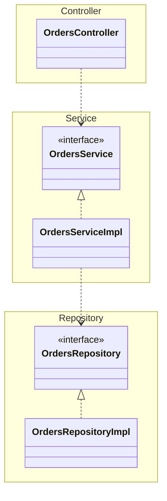
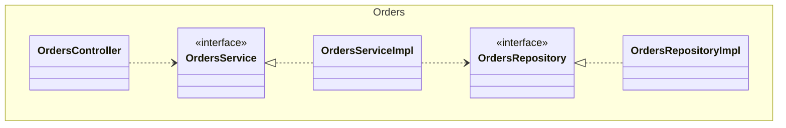
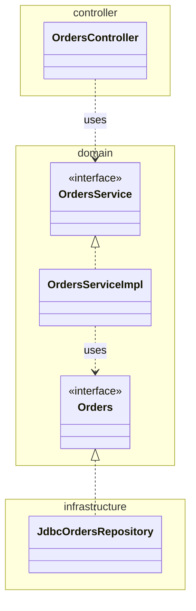
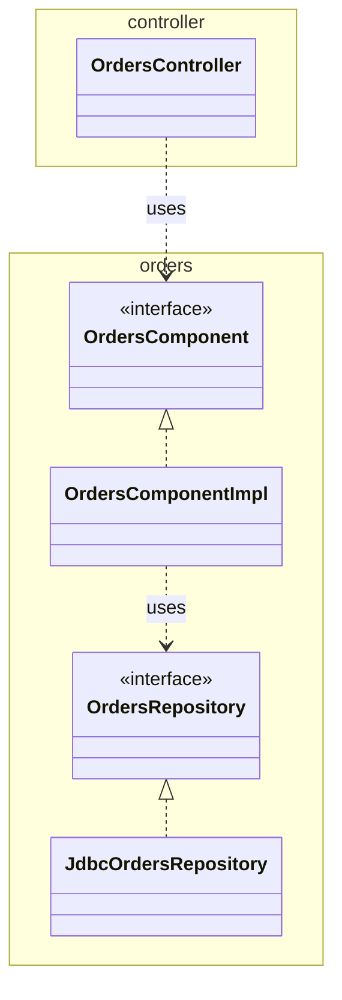

# Chapter06. 세부사항

## 30장 데이터베이스는 세부사항이다.

- 데이터베이스는 엔티티가 아니다.
  - 즉, 데이터베이스는 세부사항이라서 아키텍처의 구성요소 수준으로 끌어올릴 수 없다.
  - 데이터베이스는 일개 소프트웨어일 뿐이다. 데이터에 접근할 방법을 제공하는 유틸리티다.
- 뛰어난 아키텍트라면 저수준의 메커니즘이 시스템 아키텍처를 오염시키는 일을 용납하지 않는다.

### 관계형 데이터베이스

- 1970년 `애드거 커드 Edgar Codd`는 관계형 데이터베이스의 원칙을 정의.
- 1980년 데이터 저장소의 지배적인 형태가 되었다.
- 이 모델은 우아했고, 절제되었으며, 강건했다.
- 하지만 결국은 기술일 뿐이다. -> 세부사항임을 뜻한다.
- 관계형 테이블은 특정한 형식의 데이터에 접근하는 경우에는 편리하지만, 데이터를 테이블에 행 단위로 배치한다는 자체는 아키텍처적으로 볼 대 전혀 중요하지 않다.
  - 애플리케이션의 유스케이스는 이러한 방식을 알아서는 안되며 관여해서도 안 된다.
- 많은 데이터 접근 프레임워크가 테이블과 행이 객체 형태로 시스템 여기저기에서 돌아다니게 허용하는데, 아키텍처적으로 잘못된 설계다.
  - 이렇게 하면 유스케이스, 업무 규칙, 심지어는 UI조차도 관계형 데이터 구조에 결합되어 버린다.

### 데이터베이스 시스템은 왜 이렇게 널리 사용되는가?

- 데이터베이스 시스템이 소프트웨어 시스템과 소프트웨어 기업을 장악할 수 있었을까?
  - 바로 '디스크' 때문이었다.
  - 느리다는 특징.
- 데이터는 원형 `트랙 track`에 저장되며, 트랙은 `섹터 sector`로 분할되고, 각 섹터는 사용하기 편한 크기의 바이트를 저장했는데, 대체로 4K였다.
- 각 플래터는 대략 수백 개의 트랙으로 구성되었고, 디스크는 십여 개의 플래터로 구성되었다.
- 디스크에서 특정 바이트를 읽으려면, 먼저 `헤드 head`를 적절한 트랙으로 옮기고, 디스크가 돌면서 헤드 위치에 적절한 섹터가 올 때까지 기다린 후, 해당 섹터에서 4K 모두를 RAM으로 읽어 들여야 한다.
  - 후 해당 RAM 버퍼의 색인을 찾아서 필요한 바이트를 가져왔다. 이 모든 작업에는 밀리초 단위의 시간이 걸렸다.
  - 밀리초는 길지 않아 보이지는 프로세서에서 한 명령어를 처리하는 주기와 비교하면 백만 배나 오래 걸리는 시간.
- 디스크는 시간 지연이라는 점을 완화하기 위해 색인, 캐시, 쿼리 계획 최적화가 필요해졌다.
  - 데이터를 표현하는 일종의 표준적인 방식도 필요했다. 작업 중인 대상이 어떤 데이터인지 알 수 있어야 했기 때문이다.
  - 간단히 말해서 데이터 접근 및 관리 시스템이 필요했다
- 이러한 시스템은 뚜렷이 구분되는 두 가지 유형을 분리되었다.
1. 파일 시스템 File System
2. 관계형 데이터베이스 관리 시스템 RDBMS

- 파일 시스템은 `문서 기반`
- 데이터베이스 시스템은 `내용 기반`
  - 레코드가 서로 공유하는 일부 내용에 기반해서 다수의 레코드를 연관 짓는 데 매우 탁월.
  - 하지만 정형화되지 않은 문서를 저장하고 검색하는 데는 대체로 부적합하다.
- 이들 두 시스템은 데이터를 디스크에 체계화해서, 각 시스템에 특화된 방식으로 접근할 때 가능한 한 효율적으로 데이터를 저장하고 검색할 수 있도록 한다.
  - 각 시스템은 데이터를 색인하고 배치하는 고유한 전략을 활용한다.
  - 데이터를 빠르게 조작할 수 있도록 결국에는 관련 있는 데이터를 RAM으로 가져온다.

### 디스크가 없다면 어떻게 될까?

- 디스크가 모두 사라진다면, 그래서 모든 데이터가 RAM에 저장된다면 데이터를 어떻게 체계화할 것인가?
  - 데이터를 테이블 구조로 만들어 SQL을 이용해 접근할 것인가?
  - 파일 구조로 만들어 디렉터리를 통해 접근할 것인가?
- 당연히 아니다.
  - 이 데이터들을 연결 리스트, 트리, 해시 테이블, 스택, 큐 혹은 여타 무수히 많은 데이터 구조로 체계화할 것이며, 데이터에 접근할 때는 포인터나 참조를 사용할 것이다.
- 사실 이미 이렇게 일하고 있다.
  - 데이터가 데이터베이스나 파일 시스템에 있더라도, RAM으로 읽은 후에는 다루기 편리한 형태로 그 구조를 변경한다.
  - 리스트, 집합, 스택, 큐, 트리 등 입맛에 맞는 임의의 구조로 말이다.
  - 데이터를 파일이나 테이블 형태로 그대로 두는 경우는 거의 없다.

### 세부사항

- 데이터베이스는 그저 메커니즘에 불과. 디스크 표면과 RAM 사이에서 데이터를 이리저리 옮길 대 사용할 뿐이다.
- 데이터베이스는 비트를 담는 거대한 그릇이며, 데이터를 장기적으로 저장하는 공간에 지나지 않는다.

### 하지만 성능은?

- 당연히 아키텍처적인 관심사.
- 하지만 데이터 저장소 측면에서 성능은 완전히 캡슐화하여 업무 규칙과는 분리할 수 있는 관심사다.
- 성능은 시스템의 전반적인 아키텍처와는 아무런 관련이 없다.

---

## 31장 웹은 세부사항이다

- 처음에는 모든 연산 능력이 `서버 팜 server farm`에 위치할 것이고 브라우저는 멍청해질 거라고 생각
- 그러다가 브라우저에 `애플릿 applet`을 추가하기 시작
- 그러다가 동적인 내용은 다시 서버로 이동시켰다. (아마 서버 사이드 렌더링이 대세 였던 때를 말하는 듯?)
- 그러다가 다시 웹 2.0을 고안, Ajax와 자바스크립트를 이용해서 처리 과정의 많은 부분을 다시 브라우저로 옮겼다.
- 지금은 거대한 애플리케이션 전부를 브라우저에서 실행되도록 작성할 수 있는 수준에 다다랐다.
- 그리고 이제 우리는 Node.js를 이용해 자바스크립트를 다시 서버로 이동시키는 방식에 열광하고 있다. (또 다시 서버 사이드 렌더링.. Next, Nuxt 등)

> #### 브라우저 애플릿
> - 웹 초창기의 동적 기술. 현재는 사용되지 않음.
> - 웹 브라우저 내에서 실행되던 작은 애플리케이션을 말한다.
> - 하지만 느린 실행 속도, 보안 취약점, 플러그인 설치의 번거로움, 대체 기술 등장(Flash, JavasScript) 등이 요인이 되어 사라졌다. 

### 끝없이 반복하는 추

- 이처럼 반복되는 진동이 웹으로부터 시작되었다고 보는 일은 옳지 않다.
  - 웹이 있기 전에 클라이언트-서버 아키텍처가 있었다.
- 앞으로도 우리는 연산 능력을 어디에 둘지 알 수 없을 것이다.
  - 연산 능력을 중앙에 집중하는 방식과 분산하는 방식 사이에서 우리는 끊임없이 움직인다.
  - 그리고 이는 한동안 계속될 것이다.
- IT 역사 전체로 시야를 넓히면 웹은 아무것도 바꾸지 않았다.
  - 웹은 우리가 발버둥치면서 생기는 여느 수많은 진동 중 하나에 불과하다.
  - 이 진동은 우리가 태어나기 전에도 있어 왔고, 우리가 은퇴한 뒤에도 지속될 것이다.
- 아키텍트로서 우리는 멀리 내다봐야 한다.
  - 이 진동은 그저 핵심 업무 규칙의 중심에서 밀어내고 싶은 단기적인 문제일 뿐이다.

### 요약

- GUI는 세부사항이고, 웹은 GUI다. 따라서 웹은 세부사항이다.
- 아키텍트라면 이러한 세부사항을 핵심 업무 로직에서 분리된 경계 바깥에 두어야 한다.

---

## 32장 프레임워크는 세부사항이다

### 프레임워크 제작자

- 당신의 문제는 프레임워크가 풀려는 문제와 꽤 많이 겹칠 것이다.
- 겹치는 영역이 클수록 프레임워크는 실제로 더 유용해진다.

### 혼인 관계의 비대칭성

- 당신과 프레임워크 제작자 사이의 관계는 놀라울 정도로 비대칭적이다.
  - 당신은 프레임워크를 위해 큰 헌신을 해야 하지만, 프레임워크 제작자는 당신을 위해 아무런 헌신도 하지 않는다.
- 우리는 문서를 꼼꼼히 읽고, 우리가 만들 소프트웨어와 프레임워크를 어떻게 통합할 수 있을지 조언을 받는다.
  - 대개의 경우 프레임워크를 중심에 두고 우리의 아키텍처는 그 바깥을 감싸야 한다고 말한다.
- 도한 이들은 프레임워크의 기반 클래스에서 직접 파생하거나, 프레임워크의 기능들을 업무 객체에 바로 임포트해서 사용하라고 권한다.
- 프레임워크 제작자는 당신의 애플리케이션이 가능하면 프레임워크에 공고하게 결합될 것을 강하게 역설한다.
  - 프레임워크 제작자 입장에서는 프레임워크와의 이러한 결합이 위험요소가 아니다.
  - 한술 더 떠서 제작자는 당신도 자신의 프레임워크에 결합되기를 바란다. -> 한 번 결합하면 그 관계를 깨기가 매우 어렵기 때문.
- 사실상 제작자는 당신에게 프레임워크와 혼인하기를 요구하는 것이다.
  - 그리고 장기간에 걸친 막대한 헌신을 요청한다.
  - 하지만, 그 위험과 부담은 오롯이 당신이 감수할 뿐, 제작자가 감수하는 건 아무것도 없다.

### 위험 요인

- 고려해야 할 위험 요인들
1. 프레임워크의 아키텍처는 그다지 깔끔하지 않은 경우가 많다. 의존성 규칙을 위반하는 경향이 있다. 업무 객체를 만들 때 제작자는 자신의 코드를 상속할 것을 요구한다. 자신의 프레임워크와 당신의 가장 안쪽 원이 결합되기를 원한다. 결혼반지는 이미 당신의 손에 끼워졌고, 다시는 빼지 못할 것이다.
2. 초기 기능을 만드는 데는 도움이 될 것이다. 하지만 제품이 성숙해지면서 프레임워크가 제공하는 기능과 틀을 벗어나게 될 것이다.
3. 프레임워크는 당신에게 도움되지 않는 방향으로 진화할 수도 있다. 도움도 되지 않는 신규 버전으로 업그레이드하느라 다른 일을 못할 수도 있다.
4. 새롭고 더 나은 프레임워크가 등장해서 갈아타고 싶을 수도 있다.

### 해결책

> 프레임워크와 결혼하지 말라!

- 프레임워크를 사용할 수는 있지만, 결합해서는 안 된다. 적당히 거리를 두자.
- 업무 객체를 만들 때 프레임워크가 자신의 기반 클래스로부터 파생하기를 요구한다면, 거절하라!
  - 대신 `프록시 proxy`를 만들고, 업무 규칙에 플러그인할 수 있는 컴포넌트에 이들 프록시를 위치시켜라.
- 프레임워크가 핵심 코드 안으로 들어오지 못하게 하라.
  - 대신 핵심 코드에 플러그인할 수 있는 컴포넌트에서 프레임워크를 통합하고, 의존성 규칙을 준수하라.
- ex) 스프링
  - 훌륭한 의존성 주입 프레임워크
  - 스프링의 주요 어노테이션들이 업무 객체 도처에 산재해서는 안 된다. (ex. `@Autowired`)
  - 업무 객체보다는 Main 컴포넌트에서 스프링을 사용해서 의존성을 주입하는 편이 낫다.
  - 메인은 아키텍처 내에서 가장 지저분한, 최저 수준의 컴포넌트이기 때문에 스프링을 알아도 상관 없다.

### 이제 선언합니다

- 정말로 결혼해야만 하는 프레임워크도 존재한다.
  - ex) C++과 STL, 자바와 표준 라이브러리
  - 이러한 관계는 정상. 하지만 선택적이어야 한다.
- 애플리케이션이 프레임워크와 결혼하고자 한다면 애플리케이션의 남은 생애 동안 그 프레임워크와 함께 해야 한다는 사실을 반드시 명심해야 한다.

---

## 33장 사례 연구: 비디오 판매

### 제품

- 비디오 판매 소프트웨어

### 유스케이스 분석

- 시스템을 분할하여, 특정 액터를 위한 변경이 나머지 액터에게는 전혀 영향을 미치지 않게 만들고자 한다.

### 컴포넌트 아키텍처

- 액터와 유스케이스를 식별했다면, 예비 단계의 컴포넌트 아키텍처를 만들어 볼 수 있다.

### 의존성 관리

- 모든 의존성은 경계선을 한 방향으로만 가로지르는 데, 항상 더 높은 수준의 정책을 포함하는 컴포넌트를 향한다.
- 또 하나, 사용 관계는 제어흐름과 같은 방향을 가리키며, 상속 관계는 제어흐름과는 반대 방향을 가리킨다. (개방 폐쇄 원칙)

### 결론

- 컴포넌트 아키텍처 다이어그램
1. 단일 책임 원칙에 기반한 액터 분리
2. 의존성 규칙

---

## 34장 빠져 있는 장

- 클린 아키텍처는 잠시 한쪽으로 제쳐 놓고, 설계나 코드 조직화와 관련된 몇 가지 접근법

### 계층 기반 패키지

- 수평적 계층화
- 이 아키텍처는 엄청난 복잡함을 겪지 않고도 무언가를 작동시켜 주는 아주 빠른 방법이다.
- 문제는 마틴 파울러가 지적했듯이 소프트웨어가 커지고 복잡해지기 시작하면, 머지 않아 큰 그릇 세 개만으로는 모든 코드를 담기엔 부족하다는 사실을 깨닫고, 더 잘게 모듈화해야 할지를 고민하게 될 것이다.

- 엉클 밥이 이미 언급했듯이, 계층형 아키텍처는 업무 도메인에 대해 아무것도 말해주지 않는다는 문제도 있다.
- 전혀 다른 업무 도메인이라도 코드를 계층형 아키텍처로 만들어서 나란히 놓고 보면 웹, 서비스, 리포지터리로 구성된 모습이 기분 나쁠 정도로 비슷하게 보일 것이다.

### 기능 기반 패키지

- 수직적 계층화
- Aggregate Root에 기반하여 수직의 얇은 조각으로 코드를 나누는 방식이다.
- 하지만 이 또한 차선책이며, 이보다 더 잘할 방법이 있다.

### 포트와 어댑터

- `포트와 어댑터 Ports and Adapters` 혹은 `육각형 아키텍처 Hexagonal Architecture`, `경계, 컨트롤러, 엔티티 BCE` 등의 방식으로 접근하는 이유는 업무/도메인에 초점을 둔 코드가 프레임워크나 데이터베이스 같은 기술적인 세부 구현과 독립적이며 분리된 아키텍처를 만들기 위해서다.

- `OrdersRepository`가 `Orders`라는 간단한 이름으로 바뀌었음을 눈치챘을 것이다.
  - 이는 도메인 주도 설계라는 세계관에서 비롯된 명명법으로, 도메인 주도 설계에서는 '내부'에 존재하는 모든 것의 이름은 반드시 `유비쿼터스 도메인 언어 ubiquitous domain lnaguage` 관점에서 기술하라고 조언한다.
  - 바꿔 말하면, 도메인에 대해 논의할 때 우리는 '주문'에 대해 말하는 것이지, '주문 리포지터리'에 대해 말하는 것이 아니다.

### 컴포넌트 기반 패키지

- SOLID, REP, CCP, CRP 그리고 이 책에 나온 대다수의 조언들에 동감
- 하지만 또 다른 선택지를 제시. 이 방법은 `컴포넌트 기반 패키지`
- 계층형 기반 패키지가 안 좋은 이유?
  - 계층형 아키텍처의 목적은 기능이 같은 코드끼리 서로 분리
  - 각 컴포넌트를 무조건 `public`으로 선언해야 한다.
  - 속임수를 써서 몇몇 의존성을 의도치 않은 방식으로 추가하더라도, 보기에는 여전히 좋은 비순환 의존성 그래프가 생성된다는 문제.
  - 속임수 예시? Controller에서 Repository를 바로 의존해버리는 것.
- 빌드 시 정적 분석 도구를 통해 아키텍처적인 위반 사항이 없는지 검사하여 자동으로 강제할 수 있음. 하지만 소수의 팀만 시도.
- 컴포넌트 기반 패키지는 `큰 단위 coarse-grained`의 단일 컴포넌트와 관련된 모든 책임을 하나의 자바 패키지로 묶는 데 주안점을 둔다.
  - 이 접근법은 서비스 중심적인 시각으로 소프트웨어 시스템을 바라보며, 마이크로서비스 아키텍처가 가진 시각과도 동일하다.
  - 포트와 어댑터에서 웹을 그저 또 다른 전달 메커니즘으로 취급하는 것과 마찬가지로, 컴포넌트 기반 패키지에서도 사용자 인터페이스를 큰 단위의 컴포넌트로부터 분리해서 유지한다.

- 본질적으로 이 접근법에서는 '업무 로직'과 영속성 관련 코드를 하나로 묶는데, 이 묶음을 '컴포넌트'라고 부른다.

> 컴포넌트는 배포 단위다. 컴포넌트는 시스템의 구성 요소로, 배포할 수 있는 가장 작은 단위다. 자바의 경우 jar 파일이 컴포넌트다.
> - 엉클 밥

- 하지만 저자의 컴포넌트 정의는 약간 다름.

> 컴포넌트는 멋지고 깔끔한 인터페이스로 감싸진 연관된 기능들의 묶음으로, 애플리케이션과 같은 실행 환경 내부에 존재한다.

- 이 정의는 'C4 소프트웨어 아키텍처 모델'에 따른 것으로, 소프트웨어 시스템의 정적 구조를 컨테이너, 컴포넌트, 클래스의 측면에서 계층적으로 생각하는 간단한 방법이다.
- 이 방법론에서 소프트웨어 시스템은 하나 이상의 컨테이너로 구성되며, 각 컨테이너는 하나 이상의 컴포넌트를 포함한다.
  - 또한 각 컴포넌트는 하나 이상의 클래스로 구현된다. 이때 각 컴포넌트가 개별 jar 파일로 분리될지 여부는 `직교적인 관심사 orthogonal concern`다.

### 구현 세부사항엔 항상 문제가 있다.

- 표면상으로 이 네 가지 접근법이 코드를 조직화하는 완전히 서로 다른 방식처럼 보이며, 따라서 서로 다른 아키텍처 스타일로 여길 수도 있다.
  - 하지만 세부사항을 잘못 구현하면 이러한 견해도 아주 빠르게 흐트러지기 시작한다.
- 개발자인 우리는 `public` 키워드를 아무런 고민 없이 마치 본능적으로 사용하는 것처럼 보인다.
- 모든 타입에서 `public` 지시자를 사용한다는 건 사용하는 프로그래밍 언어가 제공하는 캡슐화 관련 이점을 활용하지 않겠다는 뜻이다.
  - 이로 인해 누군가가 구체적인 구현 클래스의 인스턴스를 직접 생성하는 코드를 작성하는 일을 절대 막을 수 없으니, 결국 우리가 지향하는 아키텍처 스타일을 위반하게 될 것이다.

### 조직화 vs 캡슐화

- 만약 자바 애플리케이션에서 모든 타입을 `public`으로 지정한다면, 패키지는 단순히 조직화를 위한 메커니즘으로 전락하여 캡슐화를 위한 메커니즘이 될 수 없다.
- `public` 타입을 코드 베이스 어디에서도 사용할 수 있다면 패키지를 사용하는 데 따른 이점이 거의 없다.
  - 따라서 사실상 패키지를 사용하지 않는 것과 같다.
  - 패키지를 무시해 버리면 최종적으로 어떤 아키텍처 스타일로 만들려고 하는지는 아무런 의미가 없어진다.
  - `public` 지시자를 사용하면 4가지 아키텍처 접근법은 본질적으로 같아진다.
- 아키텍처 원칙을 강제할 때 자기 규율이나 컴파일 후처리 도구를 이용하지 말고, 반드시 컴파일러에 의지할 것을 권장한다.

### 다른 결합 분리 모드

- 프로그래밍 언어가 제공하는 방법 외에도 소스 코드 의존성을 분리하는 방법은 존재할 수 있다.
  - ex) Java OSGi 모듈 프레임워크
  - 모듈 시스템을 제대로 사용하면 `public` 타입과 외부에 공표할 타입을 분리할 수 있다.
- 다른 선택지로는 소스 코드 수준에서 의존성을 분리하는 방법도 있다.
  - 정확하게는 서로 다른 소스 코드 트리로 분리하는 방법이다.
  - 하지만 이는 너무 이상적인 해결책이다. 현실에서 소스 코드를 이처럼 나누다 보면 성능, 복잡성, 유지보수 문제가 생기기 때문이다.
- 포트와 어댑터 접근법을 저거용할 때는 이보다 간단한 방법을 사용하기도 하는데, 단순히 소스 코드 트리를 두개만 만드는 것이다.
  - 1) 도메인 코드('내부'), 2) 인프라 코드('외부')
  - 이 접근법은 소스 코드를 조직화할 때 효과가 있겠지만, 잠재적으로 절충해야 할 부분이 있음을 알고 있어야만 한다.
  - `포트와 어댑터에 대한 페리페리크 안티 패턴` -> 특정 영역에 있는 인프라 코드가 애플리케이션의 다른 영역에 있는 코드를 도메인을 통하지 않고, 직접 호출 할 수 있다는 뜻.

### 결론: 빠져 있는 조언

- 최적의 설계를 꾀했더라도, 구현 전략에 얽힌 복잡함을 고려하지 않으면 설계가 순식간에 망가질 수 있다.
- **설계가 어떻게 해야만 원하는 코드 구조로 매핑할 수 있을지, 그 코드를 어떻게 조직화할지, 런타임과 컴파일타임에 어떤 결합 분리 모드를 적용할지 고민하라.**
  - 가능하다면 선택사항을 열어두되, 실용주의적으로 행하라.
- 그리고 팀의 규모, 기술 수준, 해결책의 복잡성을 일정과 예산이라는 제약과 동시에 고려하라.

