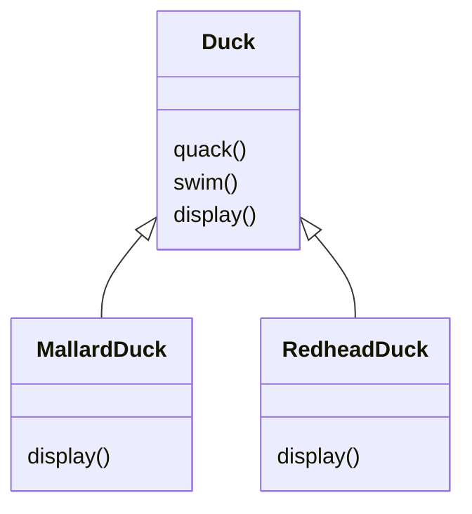
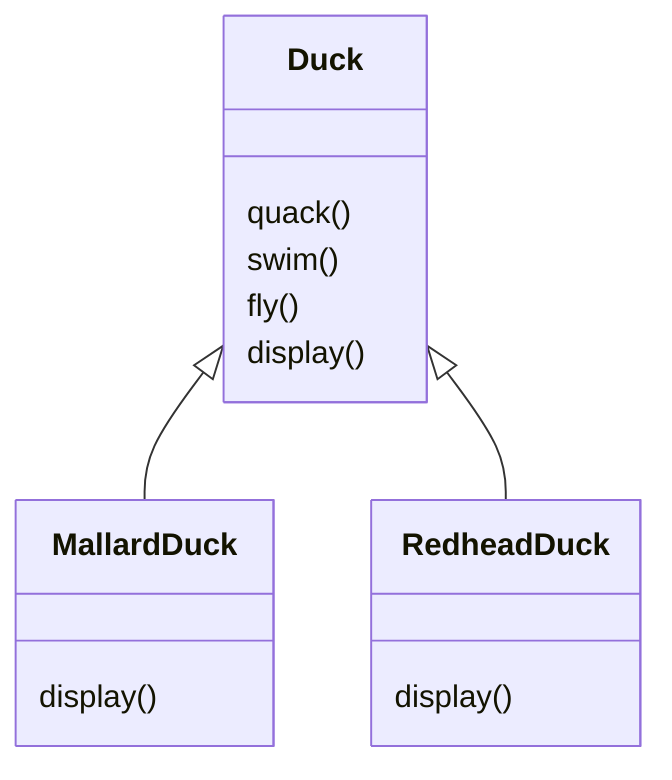
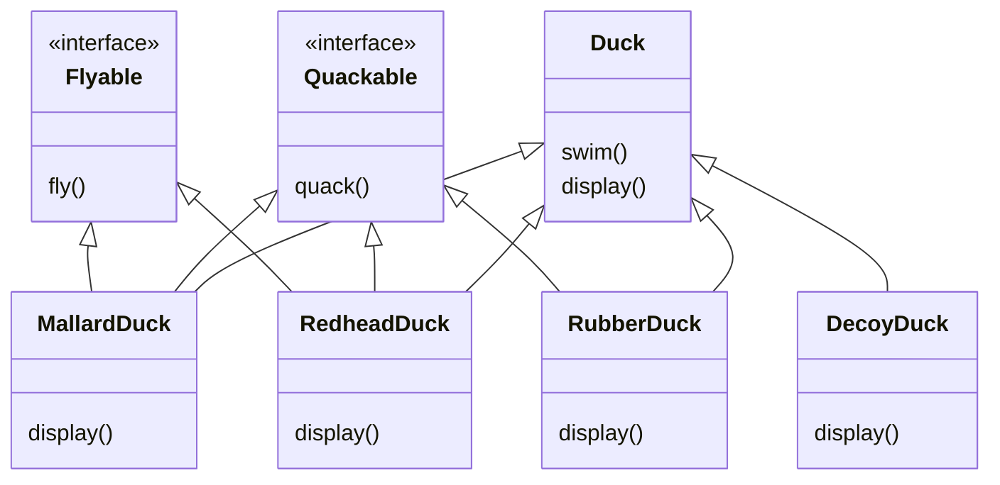
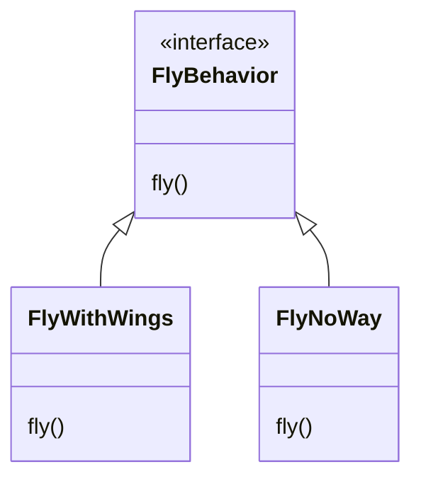
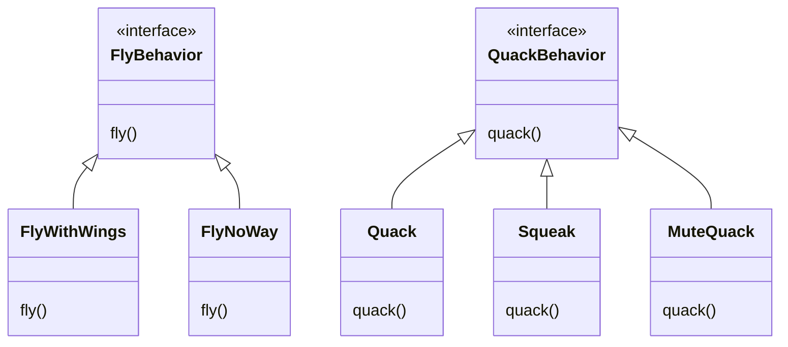

# Chapter 01 전략 패턴

- 오리 시뮬레이션 게임, SimUduck 예제



## 상속?

- `fly()` 라는 행동 추가해보기



- `fly()`를 추가했더니 러버덕이 날아다니기 시작한다..??
- 아래와 같이 fly()를 빈 상태로 오버라이드하면 문제를 해결할 수 있긴 하다.

```java
public class RubberDuck {
  
  @Override
  public void quack() {...}
  
  @Override
  public void display() {...}

  @Override
  public void fly() {
    // 아무것도 하지 않도록 오버라이드
  }
}
```

> #### 상속할 때의 단점
> - 서브클래스에서 코드가 중복된다.
> - 실행 시에 특징을 바꾸기 힘들다.
> - 모든 오리의 행동을 알기 힘들다.
> - 코드를 변경했을 때 다른 오리들에게 원치 않은 영향을 끼칠 수 있다.

<br/>

## 인터페이스 설계하기



- 코드 중복이 발생할 수 있다. => 코드 중복은 유지보수 비용 증가와 버그로 이어진다.
- 소프트웨어를 고칠 때 기존 코드에 미치는 영향을 최소한으로 줄이면서 작업할 수 있는 방법이 있다면 그 방법을 채택해야 한다.

<br/>

## 소프트웨어 개발 불변의 진리

- `변화`
- 변하지 않는 소프트웨어는 없다.

<br/>

## 문제를 명확하게 파악하기

- 상속
  - 서브클래스마다 오리의 행동이 바뀔 수 있는데도 모든 서브 클래스에서 한 가지 행동만 사용하도록 하는 것은 그리 올바르지 못하다.
- 인터페이스
  - 자바 인터페이스에는 구현된 코드가 없으므로 코드를 재사용할 수 없다는 문제점이 있다.
  - 한 가지 행동을 바꿀 때마다 그 행동이 정의되어 있는 서로 다른 서브클래스를 전부 찾아서 코드를 일일이 고쳐야 하고, 그 과정에서 버그가 생길 가능성이 높다.
- 이 상황에 딱 어울리만한 디자인 원칙.
  - `애플리케이션에서 달라지는 부분을 찾아내고, 달라지지 않는 부분과 분리한다.`
- "바뀌는 부분은 따로 뽑아서 캡슐화한다. 그러면 나중에 바뀌지 않는 부분에는 영향을 미치지 않고 그 부분만 고치거나 확장할 수 있다."

<br/>

## 바뀌는 부분과 그렇지 않은 부분 분리하기

- 변하는 부분 => `fly()`와 `quack()`
  - 이 두 가지 행동만 끄집어내서 각 행동을 나타낼 클래스 집합을 새로 만들어야 한다.

<br/>

## 오리의 행동을 디자인하는 방법

- 디자인 원칙! `구현보다는 인터페이스에 맞추서 프로그래밍한다.`
- 나는 행동. `FlyBehaivor`
  - 날 수 있는 오리가 사용할 객체 => `FlyWithWings`
  - 날 수 없는 오리가 사용할 객체 => `FlyNoWay`



- "인터페이스에 맞춰서 프로그래밍한다"라는 말은 사실 "상위 형식에 맞춰서 프로그래밍한다"라는 말이다.
  - 변수를 선언할 때 보통 추상 클래스나 인터페이스 같은 상위 형식으로 선언해야 한다.
  - 객체를 변수에 대입할 때 상위 형식을 구체적으로 구현한 형식이라면 어떤 객체든 넣을 수 있기 때문이다.
  - 그러면 변수를 선언하는 클래스에서 실제 객체의 형식을 몰라도 된다라는 뜻으로 생각하면 된다.

<br/>

## 오리의 행동을 구현하는 방법

- 인터페이스에 맞춰서 프로그래밍하기
- 아래와 같이 디자인하면 다른 형식의 객체에서도 나는 행동과 꽥꽥거리는 행동을 재사용할 수 있다.
  - 그런 행동이 더이상 Duck 클래스 안에 숨겨져 있지 않기 때문이다.
  - 또한 기존의 행동을 수정할 때 Duck 클래스를 전혀 건드리지 않고도 새로운 행동을 추가할 수 있다.



<br/>

## 오리의 행동 통합하기

- Duck 클래스에서 정의한 메소드를 써서 구현하지 않고 다른 클래스에게 위임을 할 것이다.

```java
public class Duck {
  FlyBehavior flyBehavior;
  QuackBehavior quackBehavior;
  
  public void performFly() {
    flyBehavior.fly();
  }
  
  public void performQuack() {
    quackBehavior.quack();
  }
}

public class MallardDuck extends Duck {

  public MallardDuck() {
    flyBehavior = new FlyWithWings();
    quackBehavior = new Quack();
  }
}
```

<br/>

## 동적으로 행동 지정하기

- Setter나 생성자 주입을 통해 오리의 행동을 동적으로 수정할 수 있다.

```java
public class ModelDuck extends Duck {
  
  public void setFlyBehavior(FlyBehivor flyBehavior) {
    super.flyBehavior = flyBehavior;
  }
}
```

- 로켓 추진으로 나는 행동을 추가해볼 수 있다.

```java
public class FlyRocketPowered implements FlyBehavior {
  public void fly() {
    System.out.println("로켓 추진");
  }
}
```

```java
Duck model = new ModelDuck();
model.performFly(); // 기존의 나는 동작을 수행할 것임.
model.setFlyBehavior(new FlyRocketPowered());
model.performFly(); // 로켓 추진 나는 동작 수행
```

<br/>

## 두 클래스를 합치는 방법

- "A는 B이다"보다 "A에는 B가 있다"가 나을 수 있습니다.
- 두 클래스를 합치는 것을 `구성 composition`을 이용한다라고 한다.
- 여기서 디자인 원칙 `상속보다는 구성을 활용하자.`

<br/>

## 전략 패턴 Strategy Pattern

- 여기까지가 전략 패턴의 내용이었다.
- 전략 패턴은 알고리즘군을 정의하고 캡슐화해서 각각의 알고리즘군을 수정해서 쓸 수 있게 해준다.
- 전략 패턴을 사용하면 클라이언트로부터 알고리즘을 분리해서 독립적으로 변경할 수 있다.

<br/>

## 패턴과 전문 용어

#### 1. 서로 알고 있는 패턴은 막강하다.

#### 2. 패턴을 사용하면 간단한 단어로 많은 얘기를 할 수 있다.

#### 3. 패턴 수준에서 이야기하면 '디자인'에 더 오랫동안 집중할 수 있다.

#### 4. 전문 용어를 사용하면 개발팀의 능력을 극대화할 수 있다.

#### 5. 전문 용어는 신입 개발자에게 훌륭한 자극제가 된다.

<br/>

# 참고자료

- 헤드퍼스트 디자인패턴, 에릭 프리먼 / 엘리자베스 롭슨 / 케이시 시에라 / 버트 베이츠 지음
