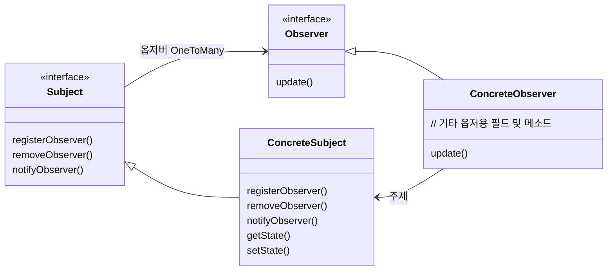
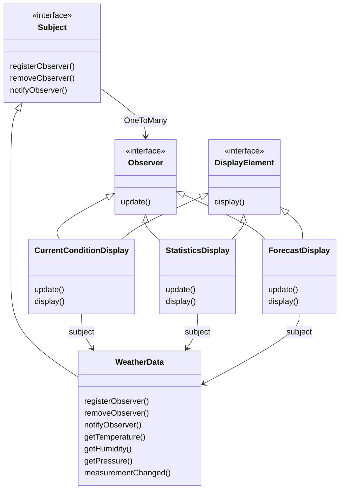

# Chapter 02 옵저버 패턴

- 객체들에게 연락 돌리기

#### 디자인 패턴을 사용하는 목표?

- 미래를 생각.
- 소프트웨어 개발에서 바뀌지 않는 단 하나. `변화`
- 변화하기 쉬운 소프트웨어 => 확장성 있는 소프트웨어

 

## 옵저버 패턴의 정의

- 한 객체의 상태가 바뀌면 그 객체에 의존하는 다른 객체에게 연락이 가고 자동으로 내용이 갱신되는 방식으로 `일대다 OneToMany` 의존성을 정의하는 것

## 옵저버 패턴의 구조

 

## 이론적 설명

- 옵저버 패턴은 크게 두 가지 요소로 나뉜다. `주제 Subject`와 `옵저버 Observer`
- `Subject`
  - 데이터를 관리하는 주체다.
  - 옵저버에게 구독 요청을 받으면 옵저버를 등록한다.
  - 관리하는 데이터가 바뀌면 옵저버에게 `notify`를 해준다.
- `Observer`
  - `Subject`에서 `notify`를 통해 데이터를 받을 수 있다.
  - `Observer`에서 `notify` 시그널을 받아 `Subject`로부터 직접 데이터를 가져오는 방식도 가능하다.
  - 구독 및 구독 해지 신청을 할 수 있다. 
- `Subject`에 `Observer`로 등록되지 않았다면 데이터가 변경되도 아무런 연락도 받지 못한다.

 

## 작동 원리

1. `Duck`가 `Subject`에게 `Observer`가 되고 싶다고 요청.
2. `Subject`는 구독자 목록에 `Duck`을 추가.
3. `Subject`에서 관리하는 데이터가 변경 => `Duck`을 포함한 모든 `Observer`가 값이 바뀌었다는 연락을 수신
4. `Subject`를 구독하는 또 다른 `Observer`인 `Mouse`가 옵저버 목록에서 제외되고 싶다고 요청
5. `Subject`는 구독자 목록에서 `Mouse`를 제거
6. `Subject`가 관리하는 데이터가 변경되어도 `Mouse`에게는 전달되지 않는다.

 

## 느슨한 결합의 위력

- `느슨한 결합 Loose Coupling`
- 객체들이 상호작용할 수 있지만, 서로를 잘 모르는 관계를 의미.

#### `Subject`는 옵저버가 특정 인터페이스를 구현한다는 사실만 인지

- `Observer`의 구상 클래스가 무엇인지, `Observer`가 무엇을 하는지는 알 필요도 없다.

#### `Observer`는 언제든지 새로 추가할 수 있다.

- `Subject`는 `Observer` 인터페이스를 구현하는 객체의 목록에만 의존.
- 목록에는 언제든 새로운 `Observer`를 추가하거나 제거할 수 있다.

#### 새로운 형식의 `Observer`를 추가할 때도 `Subject`를 변경할 필요가 전혀 없다.

- `Observer`가 되어야 하는 새로운 구상 클래스가 생겼다고 가정
  - 새로운 클래스 형식을 받아들일 수 있도록 `Subject`를 변경할 필요는 없다.
  - 새로운 클래스에는 `Observer` 인터페이스를 구현하고 `Subject`의 `Observer`로 등록해주기만 하면 된다.

#### `Subject`와 `Observer`는 서로 독립적으로 재사용할 수 있다.

- 서로가 단단하게 결합되어 있지 않기 때문이다.

#### `Subject`나 `Observer`가 달라져도 서로에게 영향을 미치지는 않는다.

- 느슨하게 결합되어 있기에 `Subject`나 `Observer` 인터페이스를 구현한다는 조건만 만족한다면 어떻게 고쳐도 문제가 생기지 않는다.

 

## 기상 모니터링 애플리케이션

- 온도, 습도, 기압 값을 받는다.
- `measurementChanged` 메소드를 호출.
- 세 가지 방식으로 디스플레이하는 애플리케이션
  - 현재 조건 디스플레이
  - 기상 통계 디스플레이
  - 기상 예보 디스플레이

## Pull 방식

- 옵저버가 필요할 때마다 주제로부터 데이터를 당겨오도록 하는 방식
  - 원래 예제는 push 방식.
  - 대체로 옵저버가 필요한 데이터를 골라갈 수 있는 방법인 pull 방식이 좋은 방법이다.

## 디자인 원칙

#### 애플리케이션에서 달라지는 부분을 찾아내고, 달라지지 않는 부분과 분리한다.

- 달라지는 부분
  - `Subject`의 상태가 달라진다. (달라진 부분을 `Observer`에게 전파)
  - `Observer` 목록의 개수
  - `Observer`의 형태
- 옵저버 패턴은 `Subject`를 변경하지 않고도 `Subject`에 의존하는 객체들을 바꿀 수 있다.

#### 구현보다는 인터페이스에 맞춰서 프로그래밍한다.

- `Subject`는 `Observer` 인터페이스를 통해 옵저버를 등록하거나 제거하고 알림을 할 수 있다.
- 구현체가 인터페이스를 사용하기에 새로운 옵저버를 만들 때 인터페이스를 구현하기만 하면 옵저버 목록에 추가될 수 있다.
  - 느슨한 결합

#### 상속보다는 구성을 사용한다.

- `Subject` 측은 `Observer`의 목록을 필드로 가지고 있다.
  - 이를 통해 옵저버를 관리. `notify`에서 활용
- 반대로 `Observer`가 `Subject`를 구성으로 가지고 있을 수도 있는데.
  - 이를 통해 pull 방식으로 데이터를 가져오거나 구독을 끊는 등의 행위를 할 수 있다.

 

# 참고자료

- 헤드퍼스트 디자인패턴, 에릭 프리먼 / 엘리자베스 롭슨 / 케이시 시에라 / 버트 베이츠 지음
