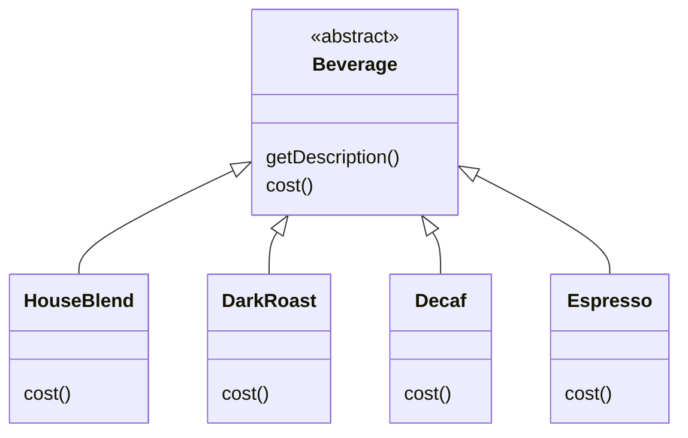
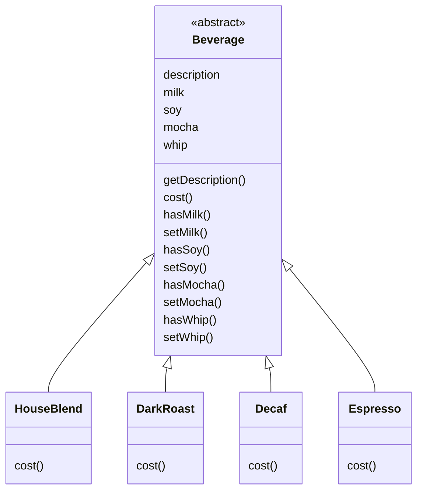
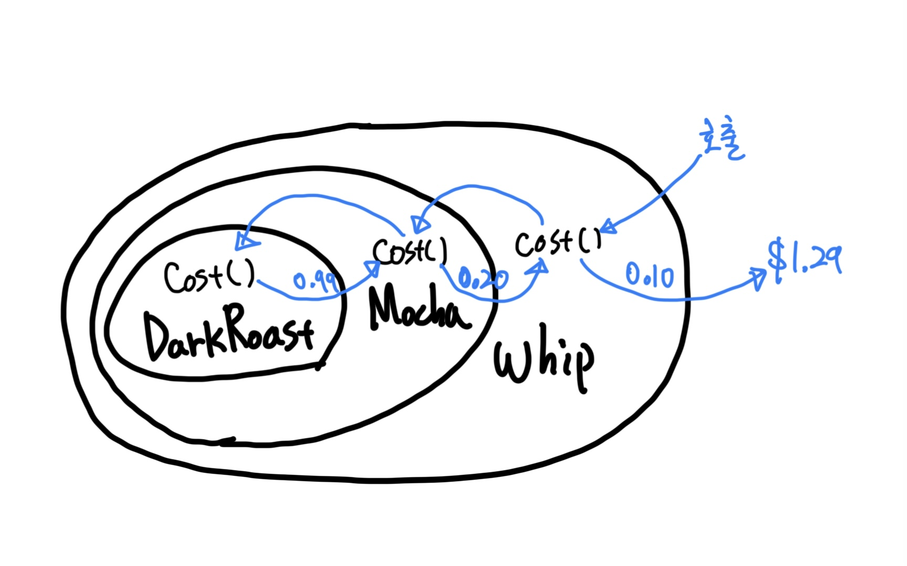
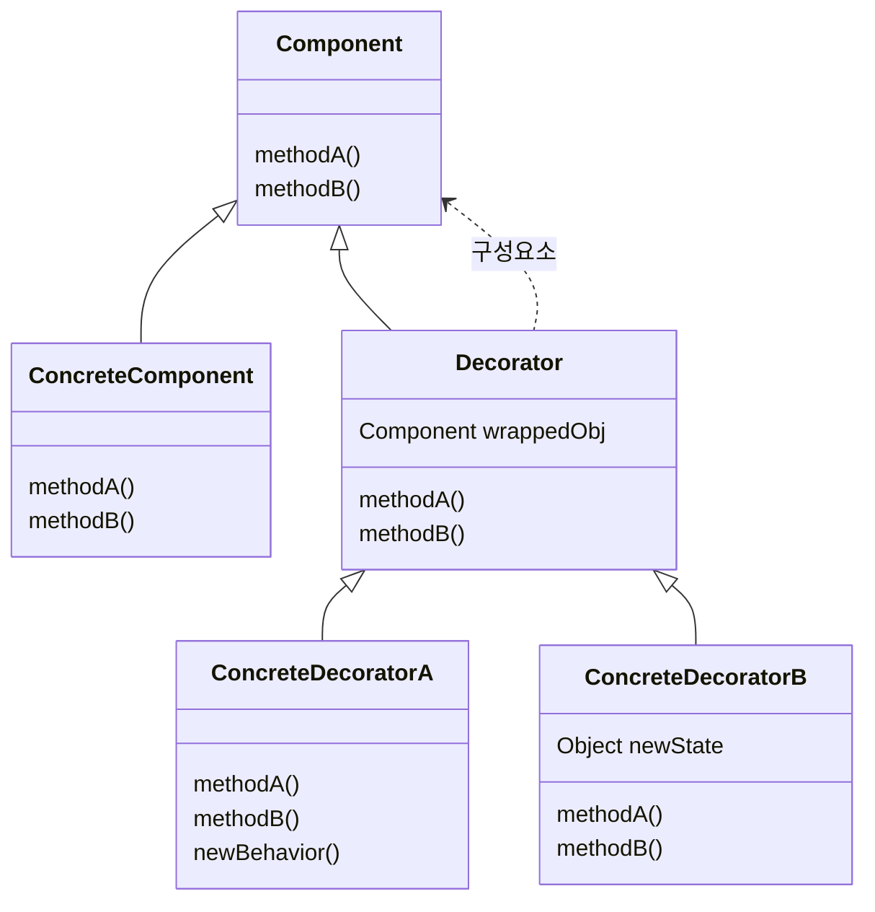
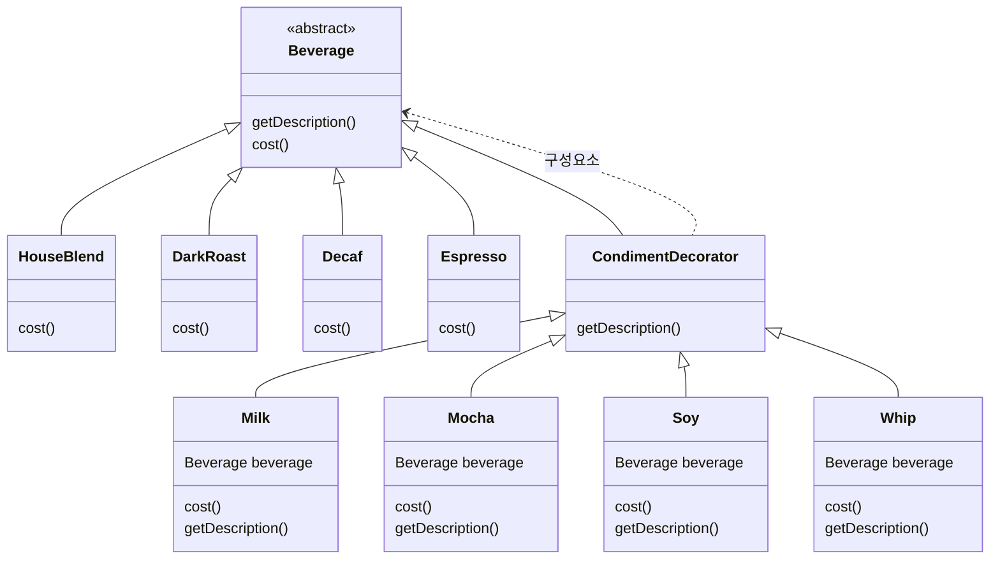
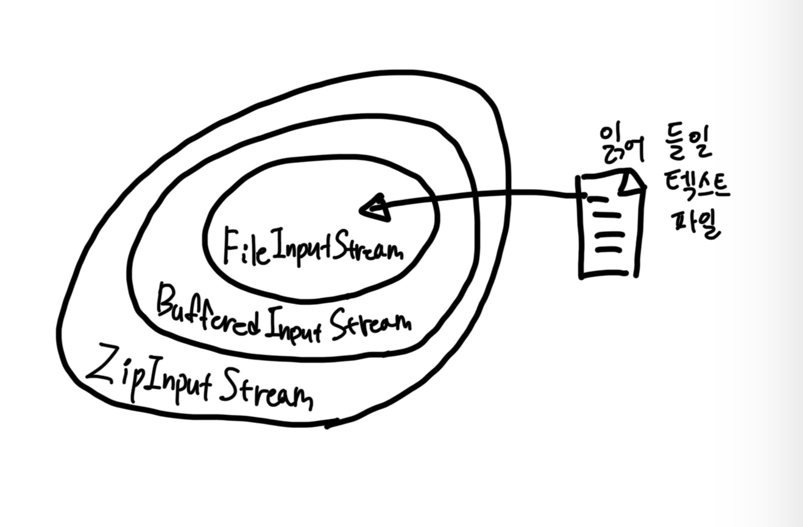

# Chapter 03 Decorator Pattern

## 초대형 커피 전문점 스타버즈

- 초기 다이어그램
  - 아래와 같은 구조는 클래스 '폭발'을 마주하게 될 수도 있다.
  - Milk, Mocha, Whip, Soy 등의 구성물과 Beverage를 상속한 음료를 카테시안 곱만 해도 엄청나게 많은 양의 음료 클래스가 생김.
  - 하지만 첨가물은 중복으로 들어갈 수 있기 때문에 사실상 경우의 수는 무한하다. 

> #### 클래스 관리 문제를 생각해볼 때, 지금까지 배웠던 원칙 중에 무엇을 제대로 지키지 않고 있는 걸까?
> - `상속보다는 구성을 활용한다` => 상속을 사용하고 있다.
> - `달라지는 부분을 찾아내고 달라지지 않는 부분과 분리한다.` => 달리지는 부분을 분리하지 않았기에 변경에 취약
>   - 우유 가격이 인상되면?
>   - 캐러멜을 새로 추가하면?

### 첨가 여부를 추상 클래스로 올린다?

> #### 이 경우, 프로젝트에서 변경되었을 때 디자인에 영향을 미칠 만한 요소?
> - 첨가물 가격이 바뀔 때마다 기존 코드를 수정해야 한다.
> - 첨가물의 종류가 많아지면 새로운 메소드를 추가해야 하고, 슈퍼클래스의 cost() 메소드도 고쳐야 한다.
> - 새로운 음료가 출시되면?
>   - 특정 첨가물이 들어가면 안 되는 음료도 있을 것이다.
> - 만약 더블 모카를 주문 하면?
> ----------
> - 첨가물에 할인 기능이 추가되면?
>   - 특정 음료에만 첨가물 할인이 들어간다면?.. 상상도 하기 싫다.

 

## OCP

- `Open-Closed Principal`
- `클래스는 확장에는 열려 있어야 하지만 변경에는 닫혀 있어야 한다.`
- 코드에서 확장해야 할 부분을 선택할 대는 세심한 주의를 기울여야 한다.
  - 무조건 OCP를 적용한다면 괜히 쓸데없는 일을 하며 시간을 낭비할 수 있으며, 필요 이상으로 복잡하고 이해하기 힘든 코드를 만들게 될 수 있다.

## 데코레이터 패턴

- Decorator: 장식.
- 객체를 장식한다.
- 예시
  - `DarkRoast` 객체에서 시작
  - 고객이 모카를 주문했다. `Mocha` 객체를 만들고 그 객체로 `DarkRoast`를 감싼다.
  - 고객이 휘핑크림도 추가했다. `Whip` 데코레이터를 만들어 `Mocha`도 감싼다.

- 가격 계산을 하면 가장 바깥쪽에 있는 데코레이터인 `Whip`의 `cost()`를 호출한다.
- 그러면 `Whip`은 자신이 장식하고 있는 객체에게 가격 계산을 위임한다. 가격이 구해지고 나면 계산된 가격에 휘핑크림의 가격을 더한 다음 그 결과값을 리턴한다.

### 정리

- 데코레이터의 슈퍼클래스는 자신이 장식하고 있는 객체의 슈퍼클래스와 같다.
- 한 객체로 여러 개의 데코레이터를 감쌀 수 있다.
- 데코레이터는 자신이 감싸고 있는 객체와 같은 슈퍼클래스를 가지고 있기에 원래 객체가 들어갈 자리에 데코레이터 객체를 넣어도 상관 없다.
- **키 포인트!** `데코레이터는 자신이 장식하고 있는 객체에게 어떤 행동을 위임하는 일 말고도 추가 작업을 수행할 수 있다.`
- 객체는 언제든지 감쌀 수 있으므로 실행 중인 필요한 데코레이터를 마음대로 적용할 수 있다.

## 데코레이터 패턴의 정의

- 객체에 추가 요소를 동적으로 더할 수 있다.
  - 서브 클래스를 만들 때보다 훨씬 유연하게 기능을 확장할 수 있다.

- `ConcreteComponent`에는 새로운 행동을 동적으로 추가한다.
- 각 구성 요소는 직접 쓰일 수도 있고 데코레이터에 감싸여 쓰일 수도 있다.
- 각 데코레이터 안에는 Component 객체가 들어있다. 즉, 데코레이터에는 구성 요소의 레퍼런스를 포함한 인스턴스 변수가 있다.
  - 또한 데코레이터는 자신이 장식할 구성 요소와 같은 인터페이스 또는 추상 클래스를 구현한다.
- `ConcreteDecorator`가 감싸고 있는 `Component` 객체용 인스턴스 변수가 있다.
  - 메소드를 추가할 수 있으며, `Componenet`의 상태를 확장할 수 있다.

 

## 스타버즈 예시에 데코레이터 패턴 적용하기

- 데코레이터는 상속 받으려고 `Beverage`의 서브클래스를 만든 게 아니라 **형식을 맞추려고 한 것이다.**
  - 행동의 기본 구성 요소와는 다른 데코레이터 등을 인스턴스 변수에 저장하는 식으로 연결한다.
- 따라서 음료에 첨가물을 다양하게 추가해도 유연성을 잃지 않게 된다.
- 만약 상속만 써야했다면 컴파일 시에 정적으로 결정되었겠지만, 구성을 활용하기 때문에 실행 중에 데코레이터를 마음대로 조합해서 사용할 수 있다는 장점이 잇다.
- 사실 데코레이터 패턴은 특정한 추상 구성 요소를 지정할 필요가 없기 때문에 인터페이스를 사용하면 된다. 
  - 하지만 위의 예시에서는 이미 추상 클래스를 사용하고 있었기 때문에 기존 코드의 변경을 최소한으로 하기 위해 추상 클래스를 그대로 사용한 것이다.

## 또 다른 예시: Java I/O

- Java I/O는 데코레이터 패턴을 사용한 대표적인 예시다.
- `FileInputStream`, `StringBufferInputStream`, `ByteArrayInputStream` 등 다양한 구성 요소를 제공
  - 이는 모두 바이트를 읽어 들이는 구성 요소 역할을 한다.

- 위의 데코레이터 패턴 예시
  - `FileInputStream`을 데코레이터로 장식할 예정
  - `BufferedInputStream`은 구상 데코레이터. `FileInputStream`에 입력을 미리 읽어서 더 빠르게 처리할 수 있게 해 주는 버퍼링 기능을 더해 준다.
  - `ZipInputStream` 또한 구상 데코레이터. zip 파일에서 데이터를 읽어 올 때 그 속에 들어있는 항목을 읽는 기능을 더해 준다.

- 자바 I/O를 보면 데코레이터의 단점도 발견할 수 있다.
  - 잡다한 클래스가 너무 많아진다. => 개발자가 괴로워 진다.
- 하지만 데코레이터가 어떤 식으로 작동하는지 이해하면 다른 사람이 데코레이터 패턴을 활용해서 만든 API를 끌어 쓰더라도 클래스를 데코레이터로 감싸서 원하는 행동을 구현할 수 있다.

 

## 정리

- 디자인의 유연성 면에서 보면 상속으로 확장하는 일은 별로 좋은 선택은 아니다.
- 만약 기존 코드 수정 없이 행동을 확장해야 하는 상황이라면
  - 구성과 위임으로 실행 중에 새로운 행동을 추가할 수 있다.
  - **상속 대신 데코레이터 패턴을 통해 행동을 확장할 수 있다.**
- 데코레이터 클래스는 상속이나 인터페이스 구현을 통해 자신이 감쌀 클래스와 같은 형식을 가진다.
  - 구성 요소의 메소드를 호출한 결과에 새로운 기능을 더할 수 있게 된다. (오버라이딩을 통해!)
- 또한 데코레이터에는 개수의 제한이 없다.
- 구성 요소의 클라이언트는 데코레이터의 존재를 알 수 없다.
  - 하지만 클라이언트가 구성 요소의 구체적인 형식에 의존하고 있다면 예외이다.
- 데코레이터 패턴을 사용하면 자잘한 객체가 매우 많이 추가될 수 있고, 데코레이터가 많아지면 코드가 복잡해진다.

 

# 참고자료

- 헤드퍼스트 디자인패턴, 에릭 프리먼 / 엘리자베스 롭슨 / 케이시 시에라 / 버트 베이츠 지음
