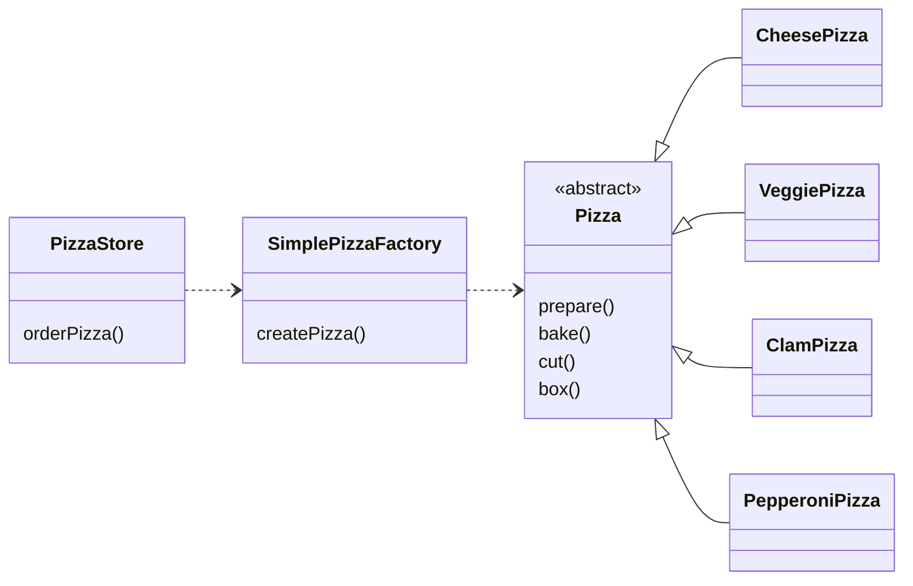
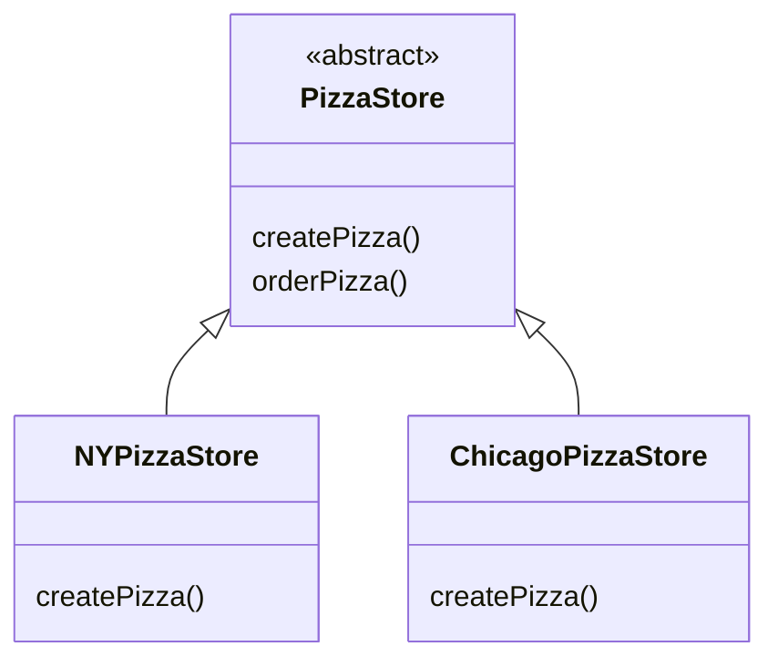
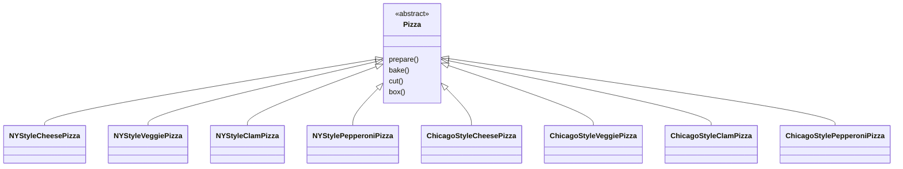
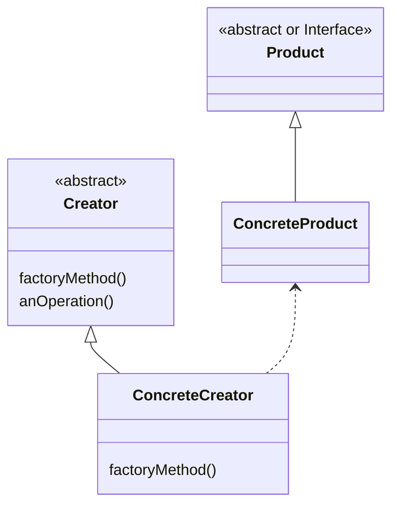
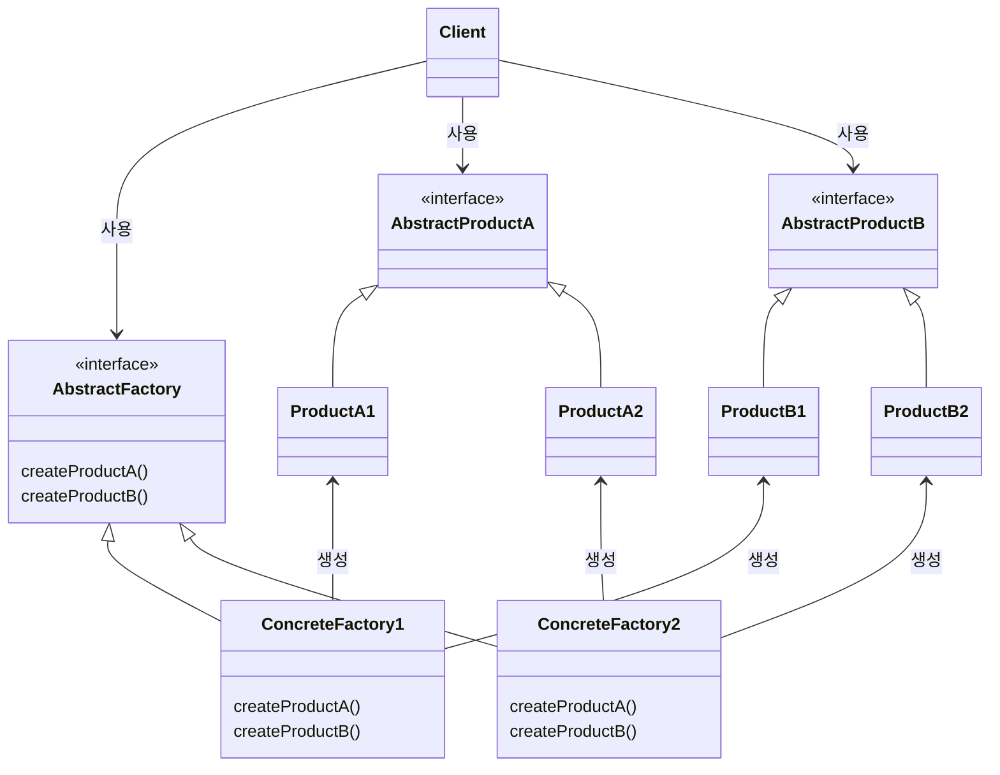

# Chapter04. Factory Pattern

- `new` 연산자를 통해 구상 클래스를 생성?
  - 구상 클래스를 바탕으로 코딩하면 나중에 수정해야 할 가능성이 커지고, 유연성이 떨어진다.
- 만약 실행 시 주어진 조건에 따라 인스턴스의 형식이 결정되어야 한다면 어떻게 해야 할까?
  - 만약 `if-else`로 처리한다면 코드를 변경할 때마다 새로운 코드를 추가해야 하고 기존 코드는 삭제해야 할 수도 있다.
- `new`가 문제가 아니다. `변화`가 문제다. 변화하는 무언가 때문에 `new`를 조심해서 사용해야 한다.
- 인터페이스에 맞춰 코딩하면 시스템에서 일어날 수 있는 변화에 대응할 수 있다.
  - **다형성** 덕분이다.
- 반면에 구상 클래스를 많이 사용하면 새로운 구상 클래스가 추가될 때마다 코드를 고쳐야 하므로 수많은 문제가 생길 수 있다.
  - `변경에 닫혀 있는` 코드가 되는 것이다.
  - 새로운 구상 형식을 써서 확장해야 할 때는 어떻게 해서든 다시 열 수 있게 만들어야 한다. (OCP)

## 피자 가게 예시 - 간단한 팩토리 (패턴은 아님!)

- 아래와 같이 주문을 받을 때 `type`에 따라 피자의 종류를 다르게 만들어 반환한다.

```java
public class PizzaStore {

  Pizza orderPizza(String type) {
    Pizza pizza;

    if (type.equals("cheese")) {
      pizza = new CheesePizza();
    } else if (type.equals("greek")) {
      pizza = new GreekPizza();
    } else if (type.equals("peperoni")) {
      pizza = new PepperoniPizza();
    }

    pizza.prepare();
    pizza.bake();
    pizza.cut();
    pizza.box();
    return pizza;
  }
}
```
 
- 그런데 만약 `GreekPizza`가 잘 안 팔려서 메뉴에서 제외해야 한다면?
- 거기에 더해 `ClamPizza`와 `VeggiePizza`를 추가해야 한다면?
- 주문 코드가 수정되어야 한다.

```java
public class PizzaStore {

  Pizza orderPizza(String type) {
    Pizza pizza;

    if (type.equals("cheese")) {
      pizza = new CheesePizza();
    } 
    // else if (type.equals("greek")) {
    //   pizza = new GreekPizza();
    // } 
    else if (type.equals("peperoni")) {
      pizza = new PepperoniPizza();
    } else if (type.equals("clam")) {
      pizza = new ClamPizza();
    } else if (type.equals("veggie")) {
      pizza = new VeggiePizza();
    }

    pizza.prepare();
    pizza.bake();
    pizza.cut();
    pizza.box();
    return pizza;
  }
}
```

- 문제가 되는 부분?
  - 변경이 있는 부분! => 인스턴스를 만드는 구상 클래스를 선택하는 부분!
  - 변경이 있는 부분은 캡슐화를 하면 된다!
- 객체 생성을 처리하는 클래스 = `팩토리 Factory`

```java
public class SimplePizzaFactory {

  public Pizza createPizza(String type) {
    Pizza pizza = null;
    if (type.equals("cheese")) {
      pizza = new CheesePizza();
    } else if (type.equals("peperoni")) {
      pizza = new PepperoniPizza();
    } else if (type.equals("clam")) {
      pizza = new ClamPizza();
    } else if (type.equals("veggie")) {
      pizza = new VeggiePizza();
    }
    return pizza;
  }
}
```

- 이제 주문 로직에서 팩토리를 가져다 사용하기만 하면 된다.
  - 구성을 통해 

```java
public class PizzaStore {

  SimplePizzaFactory factory;

  public PizzaStore(final SimplePizzaFactory factory) {
    this.factory = factory;
  }

  Pizza orderPizza(String type) {
    Pizza pizza = factory.createPizza(type);

    pizza.prepare();
    pizza.bake();
    pizza.cut();
    pizza.box();
    return pizza;
  }
}
```

### '간단한 팩토리'의 정의

- 사실 `간단한 팩토리 Simple Factory`는 디자인 패턴이라기 보다는 프로그래밍에서 자주 쓰이는 `관용구`에 가깝다.
  - 간단한 팩토리를 팩토리 패턴이라고 부르는 사람도 있지만 **정확히 말하면 패턴은 아니다!**



> #### 주의
> - 디자인 패턴을 얘기할 때, "인터페이스를 구현한다"라는 표현이 나온다고 해서 항상 "클래스를 선언하는 부분에 implements 키워드를 써서 자바 인터페이스를 구현하는 클래스를 만든다"라고 생각하면 안 된다.
> - 일반적으로 어떤 상위 형식(클래스와 인터페이스)에 있는 구상 클래스는 그 상위 형식의 '인터페이스를 구현하는' 클래스라고 생각하면 된다.

<br/>

## 다양한 팩토리 만들기 - 팩토리 메소드 패턴

- 만약 피자 가게가 커져 지역별 다양한 스타일의 피자를 내기로 했다면?
  - 뉴욕 스타일, 시카고 스타일, 캘리포니아 스타일 등등
- 이 문제를 해결하려면 `PizzaStore`와 피자 제작 코드 전체를 하나로 묶어주는 프레임워크를 만들어야 한다.
  - 물론 유연성을 잃어버리면 안 된다. 
  - `SimplePizzaFactory`를 만들기 전에 썼던 코드는 피자를 만드는 코드가 `PizzaStore`와 직접 연결되어 있긴 했지만, 유연성이 전혀 없다.

### 프레임워크 만들기

- 추상 클래스를 만들고 서브클래스를 만들어보자.

```java
public abstract class PizzaStore {
  
  Pizza orderPizza(String type) {
    Pizza pizza = createPizza(type);

    pizza.prepare();
    pizza.bake();
    pizza.cut();
    pizza.box();
    return pizza;
  }

  abstract Pizza createPizza(String type);
}
```



- `orderPizza()` 서브클래스가 아닌 `PizzaStore` 추상 클래스에서 정의한다.
  - 이로써 이 메소드는 실제로 어떤 서브클래스에서 코드를 실행하고 피자를 만드는지 알 수 없다.
- 이제 피자는 `어떤 서브클래스를 선택했느냐`에 따라 결정된다.

```java
public class NYStylePizzaStore extends PizzaStore {

  @Override
  Pizza createPizza(final String type) {
    Pizza pizza = null;
    if (type.equals("cheese")) {
      pizza = new NYStyleCheesePizza();
    } else if (type.equals("peperoni")) {
      pizza = new NYStylePepperoniPizza();
    } else if (type.equals("clam")) {
      pizza = new NYStyleClamPizza();
    } else if (type.equals("veggie")) {
      pizza = new NYStyleVeggiePizza();
    }
    return pizza;
  }
}

public class ChicagoStylePizzaStore extends PizzaStore {

  @Override
  Pizza createPizza(final String type) {
    Pizza pizza = null;
    if (type.equals("cheese")) {
      pizza = new ChicagoStyleCheesePizza();
    } else if (type.equals("peperoni")) {
      pizza = new ChicagoStylePepperoniPizza();
    } else if (type.equals("clam")) {
      pizza = new ChicagoStyleClamPizza();
    } else if (type.equals("veggie")) {
      pizza = new ChicagoStyleVeggiePizza();
    }
    return pizza;
  }
}
```

- `createPizza()`를 오버라이딩하여 피자의 생성이 서브클래스를 통해 결정되도록 구성.

### 팩토리 메소드 패턴 살펴보기

- `생산자 Creator` 클래스


- `제품 Product` 클래스



### 팩토리 메소드 패턴의 정의

> #### 정의
> - 객체를 생성할 때 필요한 인터페이스를 만든다.
> - 어떤 클래스의 인스턴스를 만들지는 서브클래스에서 결정한다.
> - 팩토리 메소드 패턴을 사용하면 클래스는 인스턴스 만드는 일을 서브클래스에게 맡기게 된다.

- `사용하는 서브클래스에 따라 생산되는 객체 인스턴스가 결정된다.` 이게 팩토리 메소드 패턴의 핵심이다.



- `Creator`를 꼭 추상클래스로 선언해야 하는 것은 아니다.
  - 간단한 구상 제품은 기본 팩토리 메소드를 정의해서 `Creator`의 서브클래스 없이 만들 수 있다.
- 간단한 팩토리와의 차이?
  - 간단한 팩토리는 일회용 처방에 불과한 반면
  - 팩토리 메소드 패턴은 여러 번 재사용이 가능한 프레임워크를 만들 수 있다.

<br/>

## 의존성 역전 원칙 Dependency Inversion Principal

- `PizzaStore`와 `Pizza`의 관계는 의존성을 역전이 적용되었다.
- `PizzaStore`는 추상클래스인 `Pizza` 클래스만 의존하고 그 밑의 구상 클래스인 서브클래스들은 모르는 상태다.
- 의존성 역전이 뭘 뒤집는다는 뜻일까?
  - 객체지향 디자인을 할 때 일반적으로 생각하는 방법과는 반대로 뒤집어서 생각해야 함!
  - 의존성이 위에서 아래로만 향하지 않고, 추상화에 의해 반대로 뒤집어진다!
  - 위 예시의 구조는 고수준인 `PizzaStore`도 `Pizza`를 의존하고, `NYStyleCheesePizza`와 같은 구상 클래스도 `Pizza`에 의존하고 있다.

### 의존성 역전 원칙을 지키는 방법

- `변수에 구상 클래스의 레퍼런스를 저장하지 말자.`
- `구상 클래스에서 유도된 클래스를 만들지 말자.`
  - 특정 구상 클래스에 의존하게 된다. 인터페이스나 추상 클래스처럼 추상화된 것으로부터 클래스를 만들어야 한다.
- `베이스 클래스에 이미 구현되어 있는 메소드를 오버라이드하지 말자.`
  - 이미 구현되어 있는 메소드를 오버라이드한다면 베이스 클래스가 제대로 추상화되지 않는다.
  - 베이스 클래스에서 메소드를 정의할 때는 모든 서브클래스에서 공유할 수 있는 것만 정의해야 한다.

- 위의 가이드라인은 항상 지켜야 하는 규칙이 아니라 우리가 지향해야 할 바를 알려 줄 뿐이다.
  - 사실 이 가이드라인을 완벽하게 따르는 프로그램은 하나도 없을 것이다.
- 항상 트레이드오프를 따지자. 합리적인 이유가 있다면 예외를 둘 수도 있다.

<br/>

## 원재료 추가 - 추상 팩토리 패턴

- 이제 지역별 지점마다 원재료를 관리하도록 수정!
- 원재료 팩토리를 만들어보자.

```java
public interface PizzaIngredientFactory {

  Dough createDough();
  Sauce createSauce();
  Cheese createCheese();
  Veggie[] createVeggies();
  Pepperoni createPepperoni();
  Clam createClam();
}
```

- 지점별로 특정 식재료를 사용하도록 구성했다.

```java
public class NYPizzaIngredientFactory implements PizzaIngredientFactory {

  @Override
  public Dough createDough() {
    return new ThinCrustDough();
  }

  @Override
  public Sauce createSauce() {
    return new MarinaraSauce();
  }

  @Override
  public Cheese createCheese() {
    return new ReggianoCheese();
  }

  @Override
  public Veggie[] createVeggies() {
    return new Veggie[]{new Garlic(), new Onion(), new Mushroom(), new RedPepper()};
  }

  @Override
  public Pepperoni createPepperoni() {
    return new SlicedPepperoni();
  }

  @Override
  public Clam createClam() {
    return new FreshClam();
  }
}
```

- 피자도 재료에 맞게 수정되어야 한다.

```java
public abstract class Pizza {

  String name;

  Dough dough;
  Sauce sauce;
  Veggie[] veggies;
  Cheese cheese;
  Pepperoni pepperoni;
  Clam clam;

  abstract public void prepare();

  public void bake() {
    System.out.println("175도에서 25분 굽기");
  }

  public void cut() {
    System.out.println("피자를 사선으로 자르기");
  }

  public void box() {
    System.out.println("상자에 피자 담기");
  }

  public String getName() {
    return name;
  }
}
```

- 또한 지역별로 피자를 따로 만들 필요도 사라졌다.
  - 이제 서브클래스(지역별 원재료 팩토리)에 따라 재료가 들어간다! 
  - 모든 지역에서 어떤 팩토리를 사용하든 클래스는 그대로 `재사용`할 수 있다.

```java
public class CheesePizza extends Pizza {

  PizzaIngredientFactory ingredientFactory;

  public CheesePizza(final PizzaIngredientFactory ingredientFactory) {
    this.ingredientFactory = ingredientFactory;
  }

  @Override
  public void prepare() {
    System.out.println("준비 중: " + name);
    dough = ingredientFactory.createDough();
    sauce = ingredientFactory.createSauce();
    cheese = ingredientFactory.createCheese();
  }
}
```

- 이제 `PizzaStore`를 상속한 구상 클래스에서 구성을 통해 재료를 사용한 피자를 만들어보자.
  - 재료 팩토리를 필드로 가진다. (composition)

```java
public class NYPizzaStore extends PizzaStore {

  @Override
  Pizza createPizza(final String type) {
    Pizza pizza = null;
    PizzaIngredientFactory ingredientFactory = new NYPizzaIngredientFactory();

    if (type.equals("cheese")) {
      pizza = new CheesePizza(ingredientFactory);
      pizza.setName("뉴욕 스타일 치즈 피자");
    } else if (type.equals("peperoni")) {
      pizza = new PepperoniPizza(ingredientFactory);
      pizza.setName("뉴욕 스타일 페페로니 피자");
    } else if (type.equals("clam")) {
      pizza = new ClamPizza(ingredientFactory);
      pizza.setName("뉴욕 스타일 조개 피자");
    } else if (type.equals("veggie")) {
      pizza = new VeggiePizza(ingredientFactory);
      pizza.setName("뉴욕 스타일 채소 피자");
    }
    return pizza;
  }
}
```

### 추상 팩토리 패턴의 정의

> #### 정의
> - 구상 클래스에 의존하지 않고도 서로 연관되거나 의존적인 객체로 이뤄진 제품군을 생산하는 인터페이스 제공.
> - 구상 클래스는 서브클래스에서 만든다.



- 피자 예시를 대입
  - `Client` => `NYPizzaStore`
  - `AbstractFactory` => `PizzaIngredientFactory`
  - `AbstractProduct` => `Dough`, `Cheese` 등의 원재료 인터페이스

<br/>

# 참고자료

- 헤드퍼스트 디자인패턴, 에릭 프리먼 / 엘리자베스 롭슨 / 케이시 시에라 / 버트 베이츠 지음
