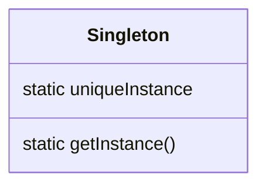
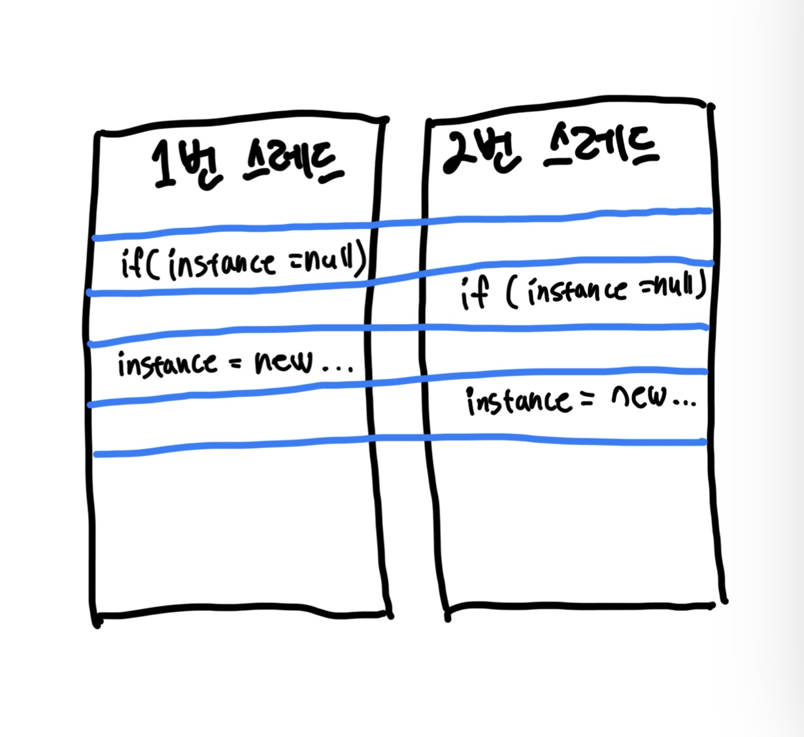

# Chapter05. 싱글턴 패턴

- 싱글턴 패턴의 용도
  - 하나만 있어도 충분히 잘 돌아가는 객체들
  - 스레드 풀, 캐시, 대화상자, 사용자 설정, 레지스트리 설정을 처리하는 객체, 로그 기록용 객체, 디바이스 드라이버
  - 이런 객체를 쓸 때 인스턴스가 2개 이상? 심각한 문제가 생길 수도 있다.
- 전역 변수를 사용할 때처럼 여러 단점을 감수할 필요도 없다.
  - 전역 변수를 생성했는데 만약 한 번도 사용하지 않는다면? 싱글톤 패턴을 사용하면 필요할 때만 객체를 만들 수 있기 때문에 문제를 피할 수 있다.

## 고전적인 싱글턴 패턴 구현법

- 고전적인 `Singleton`은 싱글턴 패턴을 적용하는 클래스의 하나뿐인 인스턴스를 private 정적 변수에 저장하고 `getInstance()`를 사용하는 형식이다.
- 생성자의 접근 제한자를 `private`으로 둬 클래스 안에서만 생성자를 사용할 수 있도록 한다.
- `uniqueInstance`에 인스턴스를 할당하는 과정을 보면, 단 한 번도 해당 클래스의 인스턴스를 사용하지 않으면 해당 객체를 생성하지 않는다는 사실을 알 수 있다.

```java
public class Singleton {
  private static Singleton uniqueInstance;

  private Singleton() {}

  public static Singleton getInstance() {
    if (uniqueInstance == null) {
      uniqueInstance = new Singleton();
    }
    return uniqueInstance;
  }
  
  // 기타 메소드
}
```

## 싱글턴 패턴의 정의

> #### 정의
> - 클래스 인스턴스를 하나만 만드록, 그 인스턴스로의 전역 접근을 제공.

- 싱글턴 패턴이 적용된 클래스에 대해서 인스턴스가 필요하다면 반드시 클래스 자신을 거치도록 한다.
- 클래스는 따라서 어디서든 그 인스턴스에 접근할 수 있도록 전역 접근 지점을 제공한다.
  - 접근하는 로직에 `lazy initialization` 방식을 사용할 수도 있다.



<br/>

## 동시성 문제

- 싱글턴에서는 동시성 문제가 발생할 수 있다.
- 아래와 같이 연산이 겹쳐서 인스턴스가 2개 이상 생성되는 경우도 생길 수 있다.



- 아래와 같이 `synchronized` 키워드를 사용하면 2개 이상의 스레드가 메소드를 동시에 실행하지 않는다.

```java
public class SynchronizedSingleton {
  private static SynchronizedSingleton uniqueInstance;

  private SynchronizedSingleton() {}

  public static synchronized SynchronizedSingleton getInstance() {
    if (uniqueInstance == null) {
      uniqueInstance = new SynchronizedSingleton();
    }
    return uniqueInstance;
  }

  // 기타 메소드
}
```

<br/>

## 더 효율적으로 멀티스레딩 문제 해결하기

- 하지만 `getInstance()` 메소드를 동기화하면 적지 않은 대가를 치러야 한다.
- 다른 방법은 없을까?

#### 1. `getInstance()`의 속도가 그리 중요하지 않다면 그냥 두자.

- `getInstance()` 메소드가 애플리케이션에 큰 부담을 주지 않는다면 그냥 두자.
- 다만 메소드를 동기화하면 성능이 100배 정도 저하된다는 사실만 기억해두자.
  - 해당 메소드가 병목으로 작용한다면 다른 방법이 필요해진다.

#### 2. 인스턴스가 필요할 때는 생성하지 말고 처음부터 만든다.

- 인스턴스를 실행 중에 수시로 만들고 관리하기가 성가시다면 아래와 같이 처음부터 인스턴스를 만들 수도 있다.

```java
public class Singleton {
  private static Singleton uniqueInstance = new Singleton();
  
  private Singleton() {}
  
  public static Singleton getInstance() {
    return uniqueInstance;
  }
}
```

#### 3. 'DCL'을 써서 `getInstance()`에서 동기화되는 부분을 줄인다.

- `Double-Checked Locking, DCL`을 사용하면 인스턴스가 생성되어 있는지 확인한 다음 생성되어 있지 않았을 때만 동기화할 수 있다.
- 처음에만 동기화하지 나중에는 동기화하지 않아도 된다는 얘기다! (대신 Java1.4 이전 버전에서는 사용할 수 없다.)

```java
public class VolatileSingleton {
  private volatile static VolatileSingleton uniqueInstance;

  private VolatileSingleton() {}

  public static VolatileSingleton getInstance() {
    if (uniqueInstance == null) {
      synchronized (VolatileSingleton.class) {
        if (uniqueInstance == null) {
          uniqueInstance = new VolatileSingleton();
        }
      }
    }
    return uniqueInstance;
  }
}
```

<br/>

## 주의사항

- 클래스 로더마다 서로 다른 네임스페이스를 정의하기에 클래스 로더가 2개 이상이라면 같은 클래스를 여러 번 로딩할 수도 있다.
  - 따라서 클래스 로더가 여러 개라면 싱글턴을 조심해서 사용해야 한다. 물론 클래스 로더를 직접 지정하면 이 문제를 피할 수 있다.
- **리플렉션**, **직렬화**, **역직렬화**도 싱글턴에서 문제가 될 수 있다고 한다.
- `Singleton`에 의존하는 객체는 전부 하나의 객체에 단단하게 결합되기 때문에, 싱글턴 패턴을 사용하다보면 '느슨한 결합' 원칙에 위배하기 십상이다.
  - 싱글턴으로 바꾸면 연결된 모든 객체도 바꿔야 할 가능성이 높다.

### enum을 활용하면 싱글턴의 여러 문제를 해결할 수 있다?

- 동기화 문제, 클래스 로딩 문제, 리플렉션, 직렬화, 역직렬화 문제 등은 enum으로 싱글턴을 생성해 해결할 수 있다.

```java
public enum EnumSingleton {
  UNIQUE_INSTANCE
}

public class SingletonClient {
  public static void main(String[] args) {
    final EnumSingleton uniqueInstance = EnumSingleton.UNIQUE_INSTANCE;
  }
}
```

<br/>

# 참고자료

- 헤드퍼스트 디자인패턴, 에릭 프리먼 / 엘리자베스 롭슨 / 케이시 시에라 / 버트 베이츠 지음
