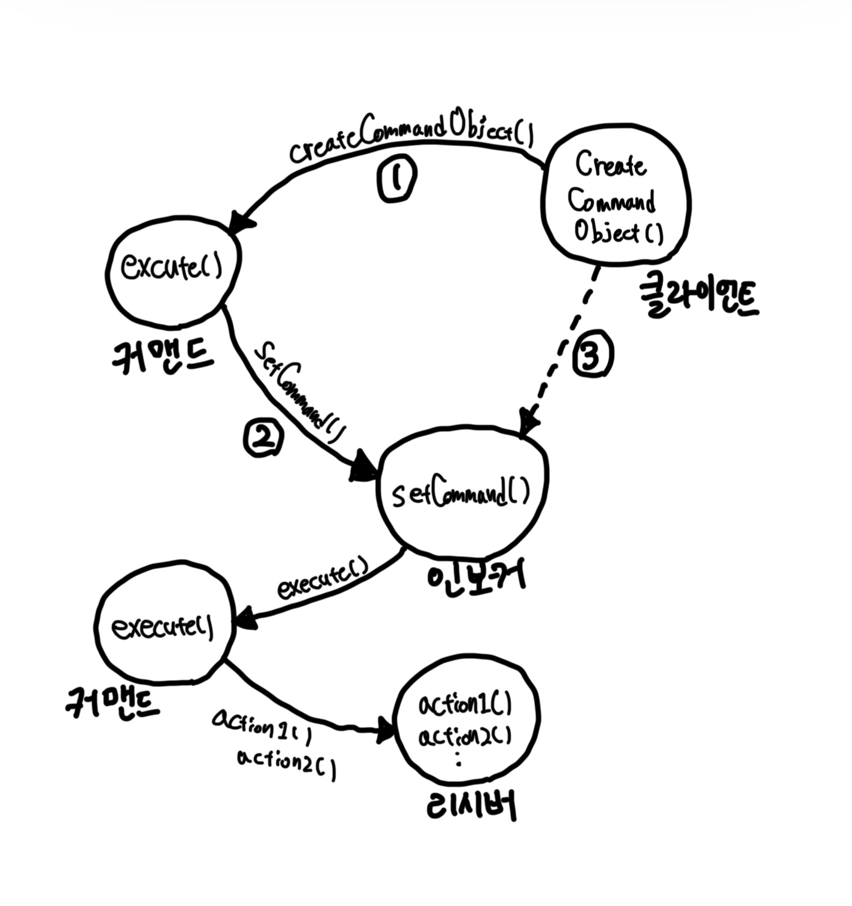
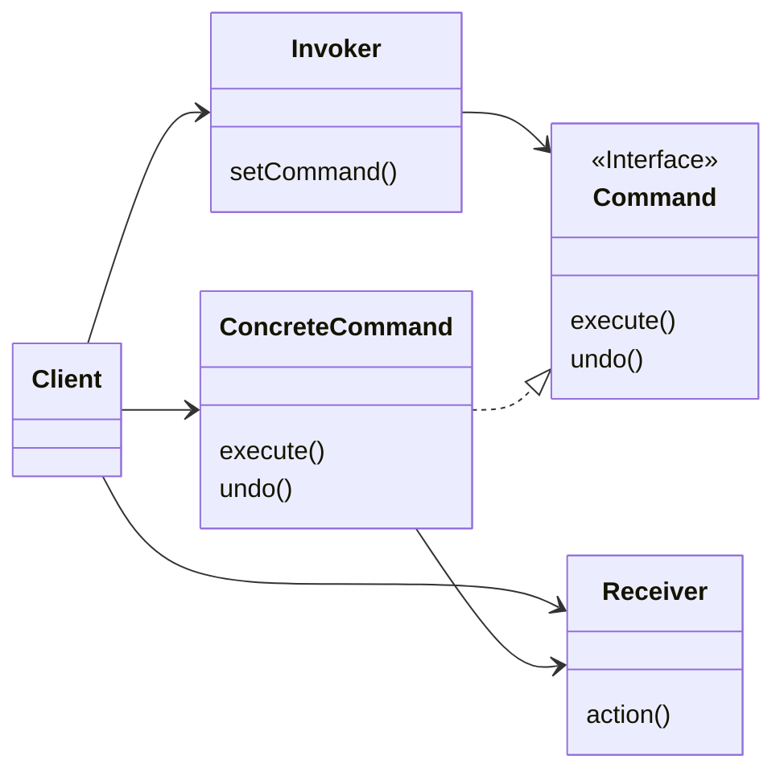
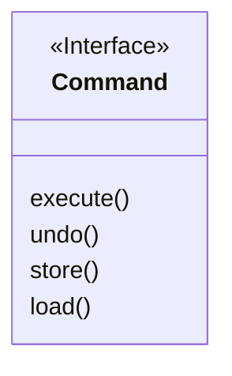

# Chapter06. 커맨드 패턴

- 커맨드 패턴을 사용하면 작업을 요청하는 쪽과 그 작업을 처리하는 쪽을 분리할 수 있다.

- 클라이언트는 커맨드 객체를 생성해야 한다. 커맨드 객체는 리시버에 전달할 일련의 행동으로 구성된다.
  - 커맨드 객체에는 행동과 `리시버 Receiver`의 정보가 같이 들어있다.
- 커맨드 객체에서 제공하는 메소드는 `execute()` 하나뿐이다.
  - 이 메소드는 행동을 캡슐화하며, 리시버에 있는 특정 행동을 처리한다.
- 클라이언트는 `인보커 Invoker` 객체의 `setCommand()` 메소드를 호출하는데, 이때 커맨드 객체를 넘겨준다.
  - 그 커맨드 객체는 나중에 쓰이기 전까지 인보커 객체에 보관된다.
- 이제 `인보커 Invoker`에서 커맨드 객체의 `execute()` 메소드를 호출하면..
- 리시버에 있는 행동 메소드가 호출된다.

## 커맨드 패턴의 정의

> #### 정의
> - 요청 내역을 객체로 캡슐화해서 객체를 서로 다른 요청 내역에 따라 매개변수화할 수 있다.
> - 이러면 요청을 큐에 저장하거나 로그로 기록하거나 작업 취소 기능을 사용할 수 있다.

- 커맨드 객체는 일련의 행동을 특정 리시버와 연결함으로써 요청을 캡슐화한 것이다.
  - 이러려면 행동과 리시버를 한 객체에 넣고, `execute()`라는 메소드 하나만 외부에 공개하는 방법을 사용해야 한다.
  - 이 메소드 호출에 따라서 리시버에서 일련의 작업을 처리한다.
  - 외부에서는 어떤 객체가 리시버의 역할을 하는지, 리시버가 어떤 일을 하는지 알 수 없다. 그냥 `execute()`가 호출된다는 것만 알고 있다.

## 클래스 다이어그램

- `Client`: 클라이언트는 `ConcreteCommand`를 생성하고 `Receiver`를 설정한다.
- `Invoker`: 인보커에는 명령이 들어있으며, `execute()` 메소드를 호출함으로써 커맨드 객체에게 특정 작업을 수행해달라는 요구를 하게 된다.
- `Receiver`: 리시버는 요구 사항을 수행할 때 어떤 일을 처리해야 하는지 알고 있는 객체이다.
- `Command`: `Command`는 모든 커맨드 객체가 구현해야 하는 인터페이스다. 모든 명령은 `execute()` 메소드 호출로 수행되며, 이 메소드는 리시버에 특정 작업을 처리하라는 지시를 전달한다. 이 인터페이스를 보면 `undo()` 메소드도 들어있는데, 이 메소드는 실행을 되돌릴 때 사용한다.
- `ConcreteCommand`: 특정 행동과 리시버를 연결해주는 객체다. 인보커에서 `execute()` 호출로 요청하면 `ConcreteCommand` 객체에서 리시버에 있는 메소드를 호출해서 그 작업을 처리한다.

## 코드 예시

- [Simple Example](https://github.com/pythonstrup/Java-Study/tree/main/design-pattern/src/main/java/com/pythonstrup/command/simple)

- [Slot Example](https://github.com/pythonstrup/Java-Study/tree/main/design-pattern/src/main/java/com/pythonstrup/command/slot)

- [Undo Example](https://github.com/pythonstrup/Java-Study/tree/main/design-pattern/src/main/java/com/pythonstrup/command/undo)

- [Macro Example](https://github.com/pythonstrup/Java-Study/tree/main/design-pattern/src/main/java/com/pythonstrup/command/macro)

## 추가로 적용해보기!

- `Command` 객체에 `store()`와 `load()`라는 로그 기록용 메소드를 추가해보자.

- 모든 행동을 기록해뒀다가 애플리케이션이 다운되었을 때 그 행동을 다시 호출해서 복구할 수 있게 된다.
  - `store()`: 디스크에 실행 히스토리 기록
  - `load()`: 디스크에서 실행 히스토리 가져오기

 

# 참고자료

- 헤드퍼스트 디자인패턴, 에릭 프리먼 / 엘리자베스 롭슨 / 케이시 시에라 / 버트 베이츠 지음
