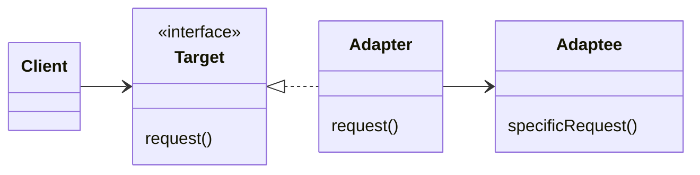
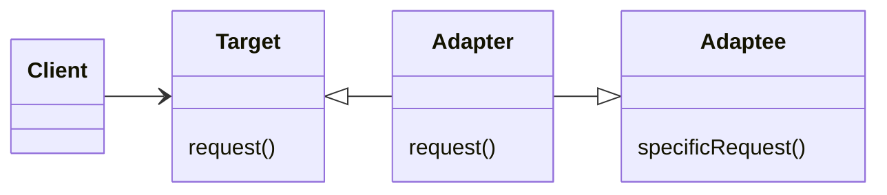
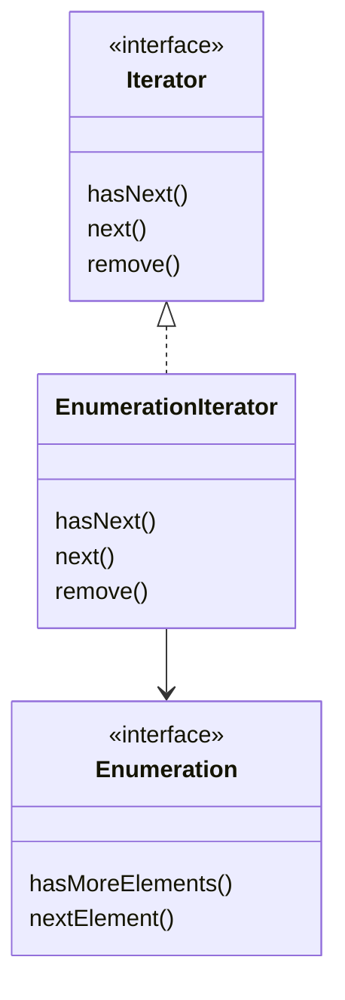

# Chapter07. 어댑터 패턴

- 어떤 소프트웨어 시스템에 새로운 업체에서 제공한 클래스 라이브러리를 사용해야 하는데 그 업체에서 사용하는 인터페이스가 기존에 사용하던 인터페이스와 다르다면?
  - 그런데 기존 코드를 바꿀 수 없는 상황?
- 새로운 업체에서 사용하는 인터페이스를 기존에 사용하던 인터페이스에 적용시켜 주는 클래스를 만들면 된다.

## 예제

```java
public interface Duck {
  void quack();
  void fly();
}
```

```java
public class MallardDuck implements Duck {

  @Override
  public void quack() {
    System.out.println("꽥");
  }

  @Override
  public void fly() {
    System.out.println("날고 있어요!");
  }
}
```

```java
public interface Turkey {
  void gobble();
  void fly();
}
```

- 이제 `Turkey`를 `Duck`에 적응시키는 
  - `quack()` 메소드를 호출했을 때 `gobble()` 사용
  - `fly()`했을 때 5배로 더 날기

```java
public class TurkeyAdapter implements Duck {

  Turkey turkey;

  public TurkeyAdapter(final Turkey turkey) {
    this.turkey = turkey;
  }

  @Override
  public void quack() {
    turkey.gobble();
  }

  @Override
  public void fly() {
    for (int i = 0; i < 5; i++) {
      turkey.fly();
    }
  }
}
```

## 어댑터 패턴 알아보기

- 클라이언트가 어댑터를 사용하는 방법

1. 클라이언트에서 타깃 인터페이스로 메소드를 호출해서 `Adapter`에 요청을 보낸다.
2. `Adapter`는 `Adaptee` 인터페이스로 그 요청을 `Adaptee`에 관한 (하나 이상의) 메소드 호출로 변환합니다. (클라이언트와 `Adaptee`는 서로 분리되어 있다. 서로를 전혀 모르는 상태)
3. 클라이언트는 호출 결과를 받긴 하지만 중간에 `Adapter`가 있다는 사실을 모른다.

- 어댑터 구현은 타킷 인터페이스로 지원해야 하는 인터페이스의 크기에 비례해서 복잡해진다.
- 하나의 어댑터에서 타깃 인터페이스를 구현하기 위해 2개 이상의 어댑티를 감싸야 하는 상황도 생길 수 있다. => 이 내용은 퍼사드 패턴과 관련이 깊다.

## 어댑터 패턴의 정의

> - 특정 클래스 인터페이스를 클라이언트에서 요구하는 다른 인터페이스로 변환한다.
> - 인터페이스가 호출되지 않아 같이 쓸 수 없었던 클래스를 사용할 수 있게 도와준다.

- 아래는 `객체 어댑터` 패턴이다.



- 어댑터 패턴은 여러 객체지향 원칙을 반영하고 있다.
- 어댑티를 새로 바뀐 인터페이스로 감쌀 때는 객체 구성(composition)을 사용한다.
- 그리고 클라이언트를 특정 구현이 아닌 인터페이스로 연결한다.
  - 인터페이스를 기준으로 코딩했기에 타깃 인터페이스만 제대로 유지한다면 나중에 다른 구현을 추가하는 것도 가능하다.

## 클래스 어댑터

- 자바에서는 class의 다중 상속이 불가능하기 때문에 사용할 수 없는 방식이다.



## 실전 - Enumberation을 Iterator에 적응시키기

- 어댑터 디자인



- `Enumeration`은 `remove()`에 해당하는 기능을 제공하지 않는다. 읽기 전용 인터페이스라고 볼 수 있다.
  - 어댑터 차원에서 완벽하게 작동하는 remove() 메소드 구현 방법은 없다.
  - 그나마 가장 좋은 방법은 런타임 예외를 던지는 것이다.

```java
public class EnumerationIterator implements Iterator<Object> {
  Enumeration<?> enumeration;

  public EnumerationIterator(final Enumeration<?> enumeration) {
    this.enumeration = enumeration;
  }

  @Override
  public boolean hasNext() {
    return enumeration.hasMoreElements();
  }

  @Override
  public Object next() {
    return enumeration.nextElement();
  }

  public void remove() {
    throw new UnsupportedOperationException();
  }
}
```
 
- 그렇다면 반대로 `Iterator`를 `Enumeration`에 적응시키는 것은 어떨까?

```java
public class IteratorEnumeration implements Enumeration<Object> {

  Iterator<?> iterator;

  public IteratorEnumeration(final Iterator<?> iterator) {
    this.iterator = iterator;
  }

  @Override
  public boolean hasMoreElements() {
    return iterator.hasNext();
  }

  @Override
  public Object nextElement() {
    return iterator.next();
  }
}
```

<br/>

# 참고자료

- 헤드퍼스트 디자인패턴, 에릭 프리먼 / 엘리자베스 롭슨 / 케이시 시에라 / 버트 베이츠 지음
