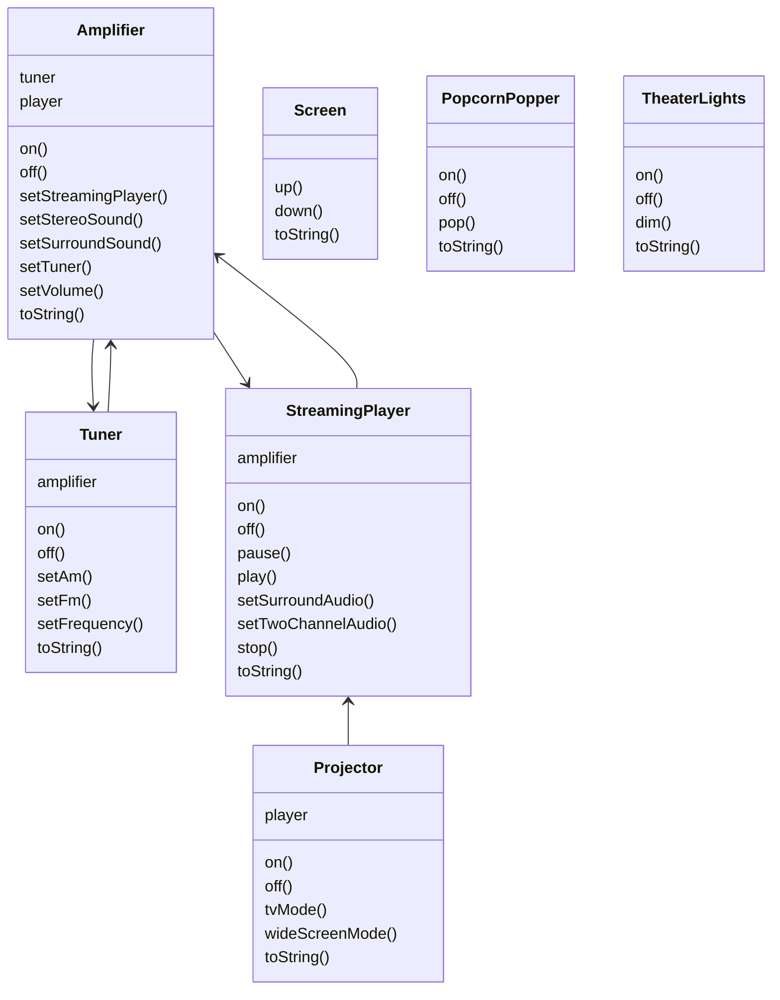
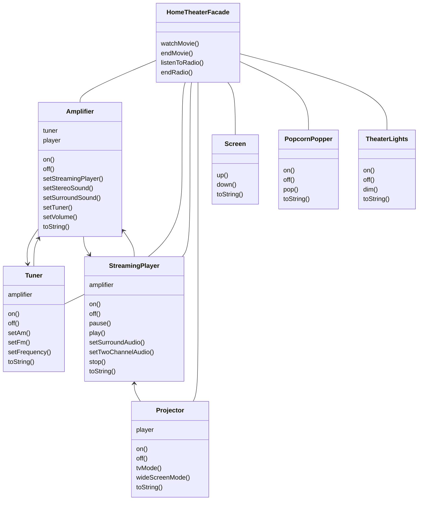

# Chapter08. 퍼사드 패턴

- 이 패턴은 어댑터 패턴과 마찬가지로 인터페이스를 변경하는 패턴이지만 약간 다르다.
  - 인터페이스를 단순하게 바꾸기 위해 인터페이스를 변경한다.

> - 데코레이터 패턴 -> 인터페이스는 바꾸지 않고 책임(기능)만 추가
> - 어댑터 -> 하나의 인터페이스를 다른 인터페이스로 변환
> - 퍼사드 -> 인터페이스를 간단하게 변경

## 홈시어터 만들기



- 영화를 보기 위해 위 객체들의 여러 가지 메소드를 호출해야 한다.
  - 클래스가 6개나 필요하다. 아래는 심지어 영화를 보기 위한 과정이고, 영화를 끌 때는 방금 했던 일을 역순으로 진행해야 한다.

```java
popper.on();
popper.pop();

lights.dim(10);

screen.down();

projector.on();
projector.setInput(player);
projector.wideScreenMode();

amp.on();
amp.setDvd(player);
amp.setSurroundSound();
amp.setVolume(5);

player.on();
player.play(movie);
```

## 퍼사드 작동 원리 알아보기

- 쓰기 쉬운 인터페이스를 제공하는 퍼사드 클래스를 구현함으로서 복잡한 시스템을 훨씬 편리하게 사용할 수 있다.



- 퍼사드 클래스는 홈시어터 구성 요소를 하나의 서브시스템으로 간주하고, `watchMovie()` 메소드는 서브시스템의 메소드를 호출해서 필요한 작업을 처리한다.
- 퍼사드를 쓰더라도 서브시스템에 여전히 직접 접근할 수 있다.

#### 퍼사드 서비스의 이모저모

- 퍼사드 클래스는 서브시스템 클래스를 캡슐화하지 않는다.
  - 서브시스템의 기능을 사용할 수 있는 간단한 인터페이스를 제공할 뿐이다. => 퍼사드의 장점.
- 특정 서브시스템에 대해 만들 수 있는 퍼사드의 개수에는 제한이 없다.
- 퍼사드를 사용하면 클라이언트 구현과 서브시스템을 분리할 수 있다.
- 어댑터 패턴 또한 두 개 이상의 클래스 인터페이스를 클라이언트에서 필요로 하는 인터페이스로 변환할 수 있다.
  - 반면, 퍼사드도 꼭 여러 클래스를 감싸야만 하는 것은 아니다. -> 복잡한 인터페이스를 가지고 있는 클래스 단 한 개에 대해 퍼사드를 만들 수도 있다.

> - 퍼사드 = 서브시스템에 대한 간단한 인터페이스를 제공하는 역할
> - 어댑터 = 인터페이스를 적응시키는 역할

## 퍼사드 패턴의 정의

> - 서브시스템에 있는 일련의 인터페이스를 통합 인터페이스로 묶어 준다.
> - 또한 고수준 인터페이스를 정의해 서브시스템을 더 편리하게 사용할 수 있다.

## 최소 지식 원칙

- `Principle of Least Knowledge`
  - 객체 사이의 상호작용은 될 수 있으면 아주 가까운 '친구' 사이에서만 허용하는 것이 좋다.
- `데메테르의 법칙`과 동의어

<br/>

# 참고자료

- 헤드퍼스트 디자인패턴, 에릭 프리먼 / 엘리자베스 롭슨 / 케이시 시에라 / 버트 베이츠 지음
