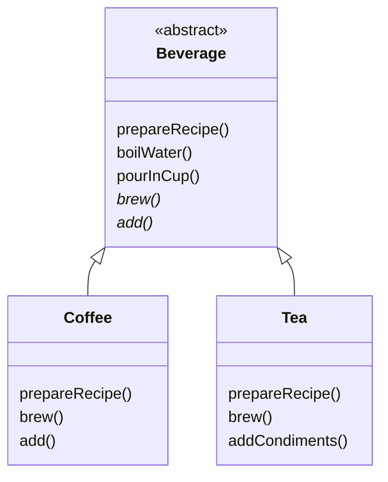

# Chapter09. 템플릿 메소드 패턴

## Coffee와 Tea 클래스

```java
public class Coffee {
  
  void prepareRecipe() {
    boilWater();
    brewCoffeeGrinds();
    pourInCup();
    addSugarAndMilk();
  }
  
  public void boilWater() {
    System.out.println("물 끓이는 중");
  }
  
  public void brewCoffeeGrinds() {
    System.out.println("필터로 커피 우려내는 중");
  }
  
  public void pourInCup() {
    System.out.println("컵에 따르는 중");
  }
  
  public void addSugarAndMilk() {
    System.out.println("설탕과 우유를 추가하는 중");
  }
}
```

```java
public class Tea {
  
  void prepareRecipe() {
    boilWater();
    steepTeaBag();
    pourInCup();
    addLemon();
  }
  
  public void boilWater() {
    System.out.println("물 끓이는 중");
  }
  
  public void steepTeaBag() {
    System.out.println("찻잎을 우려내는 중");
  }
  
  public void addLemon() {
    System.out.println("레몬을 추가하는 중");
  }
  
  public void pourInCup() {
    System.out.println("컵에 따르는 중");
  }
}
```

- 겹치는 부분을 아래와 같이 템플릿화 해볼 수 있을 것이다.



## 템플릿 메소드 패턴 알아보기

> 템플릿 메소드는 알고리즘의 각 단계를 정의하며, 서브클래스에서 일부 단계를 구현할 수 있도록 유도한다.

### 장점

- 추상클래스에서 알고리즘을 독점한다. => 한 군데에 모여 있으므로 한 부분만 고치면 된다.
- 서브클래스에서 코드를 재사용할 수 있다.
- 다른 서브클래스를 추가하기 쉽다.

## 템플릿 메소드 패턴의 정의

> - 템플릿 메소드 패턴은 알고리즘의 골격을 정의한다.
> - 템플릿 메소드를 사용하면 알고리즘의 일부 단계를 서브클래스에서 구현할 수 있으며, 알고리즘의 구조는 그대로 유지하면서 알고리즘의 특정 단계를 서브클래스에서 재정의할 수도 있다.

## 템플릿 메소드 속 Hook

```java
public abstract class CaffeineBeverageWithHook {

  final void prepareRecipe() {
    boilWater();
    brew();
    pourInCup();
    if (customWantCondiments()) {
      addCondiments();
    }
  }

  public final void boilWater() {
    System.out.println("물 끓이는 중");
  }

  public final void pourInCup() {
    System.out.println("컵에 따르는 중");
  }

  public abstract void brew();
  public abstract void addCondiments();

  boolean customWantCondiments() {
    return true;
  }
}
```

```java
public class CoffeeWithHook extends CaffeineBeverageWithHook {

  @Override
  public void brew() {
    System.out.println("필터로 커피 우려내는 중");
  }

  @Override
  public void addCondiments() {
    System.out.println("설탕과 우유를 추가하는 중");
  }

  @Override
  boolean customWantCondiments() {
    String answer = getUserInput();

    if (answer.toLowerCase().startsWith("y")) {
      return true;
    } else {
      return false;
    }
  }

  public String getUserInput() {
    String answer = null;

    System.out.println("커피에 우유와 설탕을 넣을까요? (y/n)? ");

    BufferedReader in = new BufferedReader(new InputStreamReader(System.in));
    try {
      answer = in.readLine();
    } catch (IOException e) {
      System.out.println("I/O 오류");
    }
    if (answer == null) {
      return "no";
    }
    return answer;
  }
}
```

- 추상 메소드 vs Hook
  - 서브클래스가 알고리즘의 `특정 단계를 제공`해야만 한다면 `추상 메소드`
  - 알고리즘의 `특정 단계가 선택적으로 적용`된다면 `Hook`
- Hook의 용도
  - 필수적이지 않은 부분을 서브클래스에서 구현하도록 만들고 싶을 때
  - 앞으로 일어날 일이나 막 일어난 일에 서브클래스가 반응할 수 있도록 기회를 제공하는 용도
- 추상 메소드는 무조건 구현해야 한다.
- 추상 메소드가 너무 많아지면 서브클래스에서 일일이 추상 메소드를 구현해야 하기 때문에 좋지 않다.
  - 따라서 알고리즘의 단계를 너무 잘게 쪼개지 않는 것도 한 가지 방법이 될 수 있다.
  - 하지만 알고리즘을 큼직한 몇 가지 단계로만 나눠 놓으면 유연성이 떨어진다는 단점도 있으니 주의.

## 할리우드 원칙

> 먼저 연락하지 마세요. 저희가 연락 드리겠습니다.

- 할리우드 원칙을 활용하면 `의존성 부패 dependency rot`를 방지할 수 있다.
  - 의존성 부패란, 의존성이 복잡하게 꼬여있는 상황을 말한다.
- 할리우드 원칙을 사용하면, 저수준 구성 요소가 시스템에 접속할 수는 있지만 언제, 어떻게 그 구성 요소를 사용할지는 고수준 구성 요소가 결정한다.
- 추상 클래스는 서브 클래스를 호출하는 반면, 서브 클래스는 추상 클래스를 호출하지 않는다.

> - 템플릿 메소드 패턴 = 알고리즘의 어떤 단계를 구현하는 방법을 서브클래스에서 결정
> - 전략 패턴 = 바꿔 쓸 수 있는 행동을 캡슐화하고, 어떤 행동을 사용할지는 서브클래스에 맡긴다.
> - 팩토리 메소드 패턴 = 구상 클래스의 인스턴스 생성을 서브클래스에서 결정 

## 템플릿 메소드 패턴을 사용한 자바 API

- `Comparable`의 `compareTo()`
  - 사실 `Comparable` 자체는 인터페이스다. 
  - 하지만 이 인터페이스를 사용하는 `Arrays`의 `sort()` 메소드에서 `compareTo()`를 알고리즘 특정 단계에서 사용.
- `Arrays`의 `sort()` 메소드를 디자인할 당시 몇 가지 제약조건이 있었다.
  - 일반적으로 자바에서는 배열의 서브클래스를 만들 수 없지만, 어떤 배열에서도 정렬 기능을 사용할 수 있도록 만들어야 했다.
  - 그래서 정적 메소드를 정의한 다음, 대소를 비교하는 부분은 정렬될 객체에서 구현하도록 만든 것이다.
- 온전한 템플릿 메소드라고 할 순 없겠지만, `sort()` 메소드 구현 자체는 템플릿 메소드 패턴의 기본 정신을 충실히 따르고 있다.
- 또한 `Arrays`의 서브클래스를 만들어야 한다는 제약 조건을 없앰으로써 오히려 더 유연하면서 유용한 정렬 메소드를 만들었다.

## JFrame

- 아래 예시에서는 `paint()` 메소드가 `Hook` 역할을 한다!!

```java
public class MyFrame extends JFrame {

  public MyFrame(final String title) throws HeadlessException {
    super(title);
    this.setDefaultCloseOperation(JFrame.EXIT_ON_CLOSE);

    this.setSize(300, 300);
    this.setVisible(true);
  }

  public void paint(Graphics graphics) {
    super.paint(graphics);
    String msg = "메시지";
    graphics.drawString(msg, 100, 100);
  }

  public static void main(String[] args) {
    MyFrame myFrame = new MyFrame("Head First Design Patterns");
  }
}
```

## AbstractList

```java
public class MyStringList extends AbstractList<String> {
  private String[] myList;

  public MyStringList(final String[] myList) {
    this.myList = myList;
  }

  public String get(int index) {
    return myList[index];
  }

  public int size() {
    return myList.length;
  }

  public String set(int index, String item) {
    String oldString = myList[index];
    myList[index] = item;
    return oldString;
  }
}
```

- 이제 `MyStringList`의 `subList()`를 실행해보자.

```java
@Test
void test() {
    String[] ducks = {"Mallard Duck", "Redhead Duck", "Rubber Duck", "Decoy Duck"};
    MyStringList ducksList = new MyStringList(ducks);
    System.out.println(ducksList);
    
    List<String> ducksSubList = ducksList.subList(2, 3);
    System.out.println(ducksSubList);
}
```

- 위에서 구현한 특정 단계(ex. `size()`)를 사용해 `subList()`를 실행하게 된다.

<br/>

# 참고자료

- 헤드퍼스트 디자인패턴, 에릭 프리먼 / 엘리자베스 롭슨 / 케이시 시에라 / 버트 베이츠 지음
