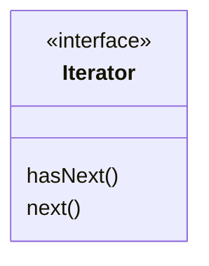
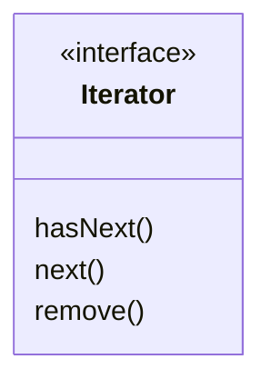
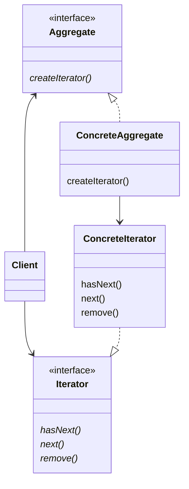
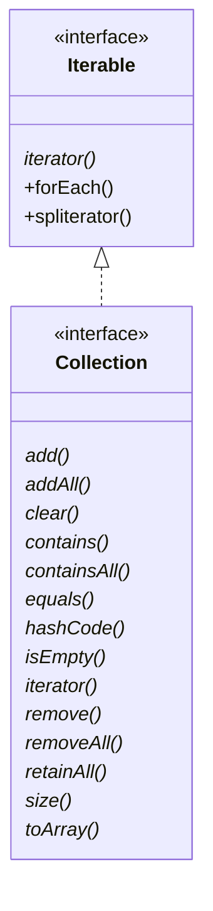

# Chapter10. 반복자 패턴

- 동일한 객체에 대해서 컬렉션을 관리하는 객체가 있다고 해보자. 동일한 객체 컬렉션을 관리하기 때문에 행동 또한 비슷하다.
  - 그런데 한 곳에서는 `List`를 사용하고, 다른 한 곳에서는 `Array`를 사용한다면?
  - 두 객체가 비슷한 행동을 하지만, 관리하는 컬렉션이 다르기 때문에 순환문을 돌릴 때 코드 중복이 발생할 수 있다.

## 반복을 캡슐화하기

- 지금까지 배운 내용 중 가장 중요한 내용은 `바뀌는 부분을 캡슐화하라`
- 현재 문제에서 바뀌는 부분은 반복 작업 처리 방법이다. => 반복 작업을 캡슐화하면 코드 중복을 없앨 수 있다.

## 반복자 패턴 알아보기

- 간단한 반복자 패턴에 대해 알아보자.
- 반복자 패턴은 `Iterator` 인터페이스에 의존한다.



## 예제

```java
public interface Iterator {

  boolean hasNext();
  MenuItem next();
}
```

```java
public class DinerMenuIterator implements Iterator {

  MenuItem[] items;
  int position = 0;

  public DinerMenuIterator(final MenuItem[] items) {
    this.items = items;
  }

  @Override
  public boolean hasNext() {
    if (position >= items.length || items[position] == null) {
      return false;
    }
    return true;
  }

  @Override
  public MenuItem next() {
    MenuItem menuItem = items[position];
    position = position + 1;
    return menuItem;
  }
}
```

- `Array`를 사용하는 객체에서 `Iterator` 인터페이스로 변환하여 반환한다!

```java
public class DinerMenu {
  // ..
  MenuItem[] menuItems;

  // ..
  public Iterator getMenuItems() {
    return new DinerMenuIterator(menuItems);
  }
}
```

- 이제 종업원 코드는 `Iterator` 인터페이스를 통해 메뉴 출력 작업을 공통화할 수 있다.

```java
public class Waitress {
  PancakeHouseMenu pancakeHouseMenu;
  DinerMenu dinerMenu;

  public Waitress(final PancakeHouseMenu pancakeHouseMenu, final DinerMenu dinerMenu) {
    this.pancakeHouseMenu = pancakeHouseMenu;
    this.dinerMenu = dinerMenu;
  }

  public void printMenu() {
    Iterator pancakeIterator = pancakeHouseMenu.createIterator();
    Iterator dinerIterator = dinerMenu.createIterator();

    System.out.println("메뉴\n----\n아침 메뉴");
    printMenu(pancakeIterator);
    System.out.println("\n저녁 메뉴");
    printMenu(dinerIterator);
  }

  private void printMenu(final Iterator iterator) {
    while (iterator.hasNext()) {
      MenuItem menuItem = iterator.next();
      System.out.print(menuItem.getName() + ", ");
      System.out.print(menuItem.getPrice() + " -- ");
      System.out.println(menuItem.getDescription());
    }
  }
}
```

## 반복자 패턴의 특징

- 객체를 어떤 컬렉션으로 저장하는지 전혀 알 수 없다.
- 반복자만 구현한다면 다형성을 활요해서 어던 컬렉션이든 1개의 순환문으로 처리할 수 있다.
- 사용자는 `Iterator` 인터페이스만 알면 된다.

## 인터페이스 개선

- java.util.Iterator 인터페이스



- 위의 예시와 다르게 `remove()`라고 메소드가 존재한다.

## 반복자 패턴의 정의

> - 컬렉션의 구현 방법을 노출하지 않으면서 집합체 내의 모든 항목에 접근하는 방법을 제공

- 각 항목에 일일이 접근할 수 있게 해주는 기능을 집합체가 아닌 반복자 객체가 책임진다는 장점이 있다.
- 그러면 집합체 인터페이스와 구현이 간단해지고, 각자에게 중요한 일면을 처리할 수 있게 된다.

## 반복자 패턴의 구조



- (개인적인 생각) **어댑터 패턴과 약간 유사해보인다.** (컬렉션 구현체를 `Iterator`라는 인터페이스에 적응시킨다는 면도 비슷하다.)

## 단일 역할 원칙

- 집합체에서 내부 컬렉션 관련 기능과 반복자용 메소드 관련 기능을 전부 구현한다면 어떻게 될까?
  - 집합체에 들어가는 메소드 개수가 늘어날 것이다.
- 이것이 나쁜 이유는 아래와 같다.
1. 컬렉션이 어떤 이유로 바귀게 되면 그 클래스도 바뀌어야 한다.
2. 반복자 관련 기능이 바뀌었을 때도 클래스가 바뀌어야 한다.

- 이런 이유로 `'변경'과 관련된 디자인 원칙`이 하나 더 추가된다.

> #### 디자인 원칙
> - 어떤 클래스가 바귀는 이유는 하나뿐이어야 한다.

## Iterable 인터페이스 알아보기

- 자바의 모든 컬렉션 유형에서 `Iterable` 인터페이스를 구현한다.



- 어떤 클래스에서 `Iterable`을 구현한다면 그 클래스는 `iterator()` 메소드를 구현한다.
  - 그 메소드는 `Iterator` 인터페이스를 구현하는 반복자를 리턴한다.
- 또한 컬렉션에 있는 항목을 대상으로 반복 작업을 수행하는 방법을 제공하는 `forEach()` 메소드가 기본으로 포함된다.
- 그 외에도 자바는 `향상된 for 순환문`으로 몇 가지 문법적 기능을 제공한다.

```java
for (MenuItem item: menu) {
  // ..  
}
```

## 향상된 for 순환문 사용 시 주의사항

- 배열은 자바 컬렉션이 아니라서 `Iterable` 인터페이스를 구현하지 않는다.
- 따라서 `향상된 for 순환문`을 사용할 수 없다.
- 

<br/>

# 참고자료

- 헤드퍼스트 디자인패턴, 에릭 프리먼 / 엘리자베스 롭슨 / 케이시 시에라 / 버트 베이츠 지음
