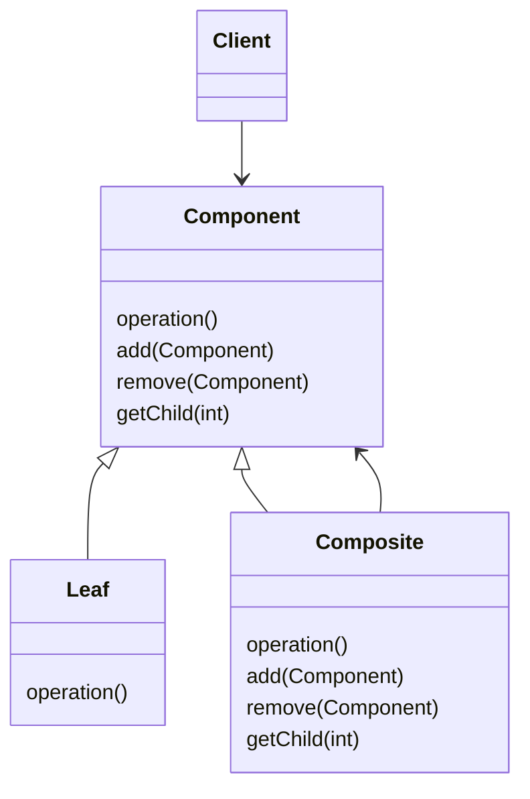
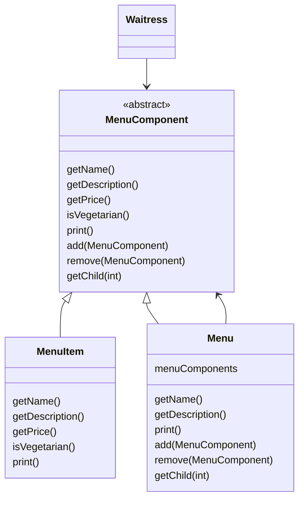

# Chapter11. 컴포지트 패턴

## 컴포지트 패턴의 정의

> - 객체를 트리구조로 구성해서 부분-전체 계층구조를 구현한다.
> - 컴포지트 패턴을 사용하면 클라이언트에서 개별 객체와 복합 객체를 똑같은 방법으로 다룰 수 있다.

- 메뉴와 항목을 같은 구조에 넣어서 `부분-전체 계층 구조 part-shole hierarchy`를 생성할 수 있다.
  - 부분들이 계층을 이루고 있지만 모든 부분을 묶어서 전체로 다룰 수 있는 구조를 뜻함.
  - 컴포지트 패턴을 써서 개별 객체와 복합 객체에도 똑같은 방식을 적용할 수 있다.



- `Client`는 `Componenet` 인터페이스를 통해 복합 객체 내의 객체들을 조작할 수 있다.
- `Componenet`는 복합 객체 내에 들어있는 모든 객체의 인터페이스를 정의한다. 복합 노드와 잎에 관한 메소드까지 정의.
- `Leaf`는 자식이 없다. 그 안에 들어있는 원소의 행동을 정의한다. `Composite`에서 지원하는 기능을 구현하면 된다.
- `Composite`는 자식이 있는 구성 요소의 행동을 정의하고 자식 구성 요소를 저장하는 역할을 한다.
  - `Leaf`와 관련된 기능도 구현해야 한다. 그런 기능들이 복합 객체에게 별 쓸모가 없다면 예외를 던지는 방법으로 처리해도 된다.

## 예시

- 위의 형태를 메뉴에 그대로 사용해보자.



- 모든 구성 요소에 `MenuComponent` 인터페이스를 구현해야만 한다. 
- 하지만 잎과 노드는 각각 역할이 다르므로 모든 메소드에 알맞는 기본 메소드 구현은 불가능하다.
- 그래서 자기 역할에 맞지 않는 상황을 기준으로 예외를 던지는 코드를 기본 구현으로 제공한다.

```java
public abstract class MenuComponent {

  public void add(MenuComponent menuComponent) {
    throw new UnsupportedOperationException();
  }

  public void remove(MenuComponent menuComponent) {
    throw new UnsupportedOperationException();
  }

  public MenuComponent getChild(int i) {
    throw new UnsupportedOperationException();
  }

  public String getName() {
    throw new UnsupportedOperationException();
  }

  public String getDescription() {
    throw new UnsupportedOperationException();
  }

  public double getPrice() {
    throw new UnsupportedOperationException();
  }

  public boolean isVegetarian() {
    throw new UnsupportedOperationException();
  }

  public void print() {
    throw new UnsupportedOperationException();
  }
}
```

```java
public class Menu extends MenuComponent {

  List<MenuComponent> menuComponents = new ArrayList<>();
  String name;
  String description;

  public Menu(final String name, final String description) {
    this.name = name;
    this.description = description;
  }

  public void add(MenuComponent menuComponent) {
    menuComponents.add(menuComponent);
  }

  public void remove(MenuComponent menuComponent) {
    menuComponents.remove(menuComponent);
  }

  public MenuComponent getChild(int i) {
    return menuComponents.get(i);
  }

  public String getName() {
    return name;
  }

  public String getDescription() {
    return description;
  }

  public void print() {
    System.out.print("\n" + getName());
    System.out.println(", " + getDescription());
    System.out.println("-----------------------");

    for (MenuComponent menuComponent: menuComponents) {
      menuComponent.print();
    }
  }
}
```

```java
public class MenuItem extends MenuComponent {

  String name;
  String description;
  boolean vegetarian;
  double price;

  public MenuItem(final String name, final String description, final boolean vegetarian,
      final double price) {
    this.name = name;
    this.description = description;
    this.vegetarian = vegetarian;
    this.price = price;
  }

  public String getName() {
    return name;
  }

  public String getDescription() {
    return description;
  }

  public double getPrice() {
    return price;
  }

  public boolean isVegetarian() {
    return vegetarian;
  }

  public void print() {
    System.out.print("  " + getName());
    if (isVegetarian()) {
      System.out.print("(v)");
    }
    System.out.println(", " + getPrice());
    System.out.println("      __ " + getDescription());
  }
}
```

## 역할에 대하여

- 컴포지트 패턴은 단일 역할 원칙을 깨는 대신 투명성을 확보하는 패턴이다.
- `투명성 transparency`이란?
  - `Component` 인터페이스에 자식들을 관리하는 기능과 잎으로써의 기능을 전부 넣어서 클라이언트가 복합 객체와 잎을 똑같은 방식으로 처리할 수 있도록 만드는 것이다.
  - 어떤 원소가 복합 객체인지 잎인지가 클라이언트에게는 투명하게 보인다.
- `Component` 클래스에는 두 종류의 기능이 모두 들어있다 보니 안전성은 약간 떨어진다.
  - 클라이언트가 어떤 원소를 대상으로 무의미하거나 부적절한 작업을 처리하려고 할 수도 있을 테니 말이다.
- <u>컴포지트 패턴은 상황에 따라 원칙을 적절하게 사용해야 함을 보여 주는 대표 사례라고 할 수 있다.</u>
  - 디자인 원칙에서 제시하는 가이드라인을 따르면 좋지만 그 원칙이 어떤 영향을 끼칠지를 항상 고민하고 원칙을 적용해야 한다.
  - 때때로 일부러 원칙에 위배되는 방식으로 디자인을 하는 경우도 있다.

<br/>

# 참고자료

- 헤드퍼스트 디자인패턴, 에릭 프리먼 / 엘리자베스 롭슨 / 케이시 시에라 / 버트 베이츠 지음
