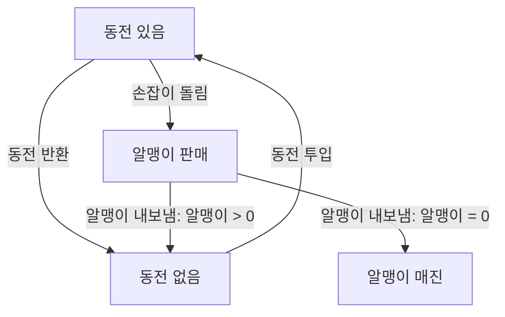
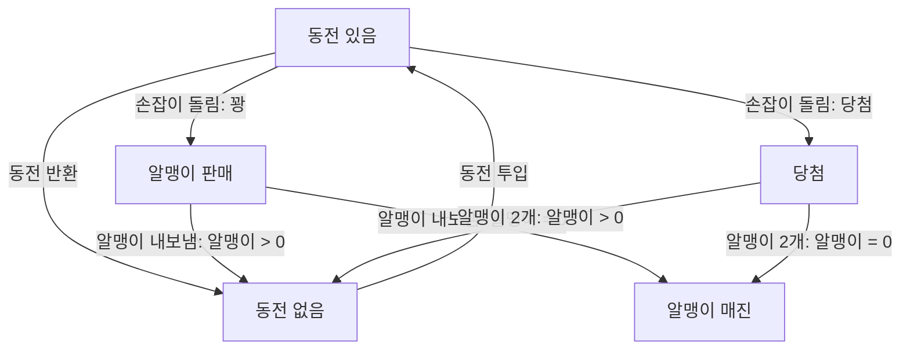
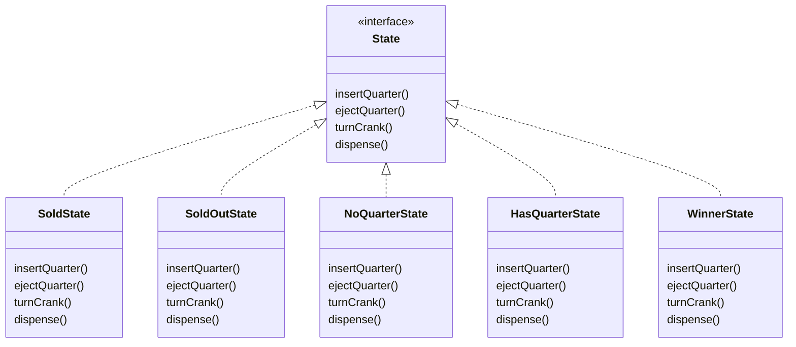
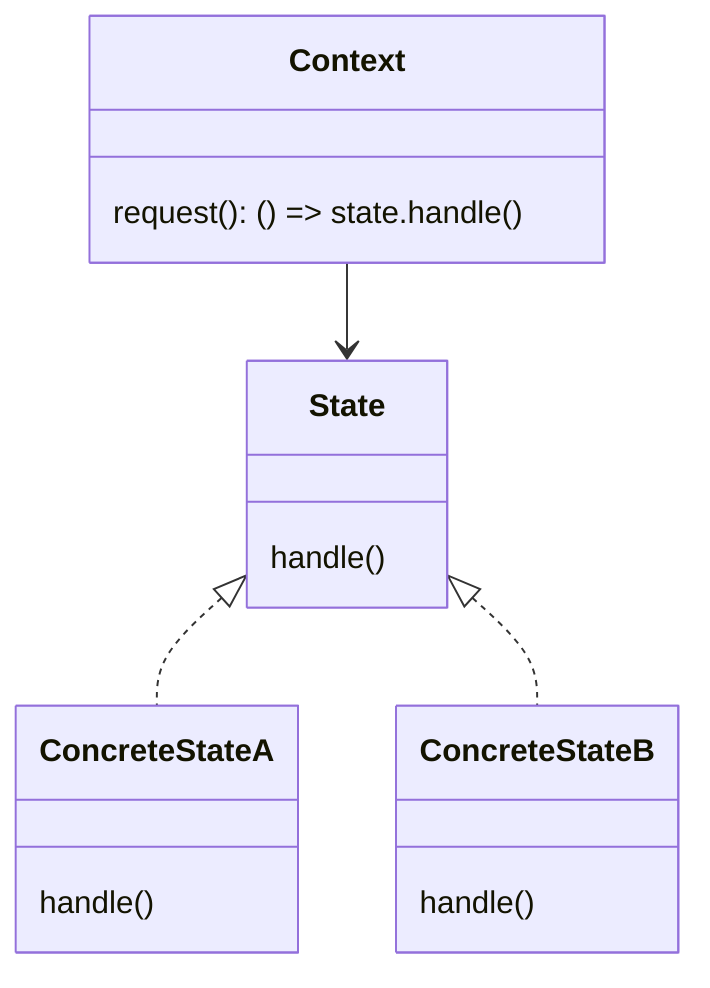

# Chapter12. 상태 패턴

## 예제1

- 아래에서 네모에 할당되어 있는 것들이 상태다.
- 행동을 취하면 상태가 변한다.
  - 상태에 맞는 행동을 취하게 하지 않으면, 엉뚱한 행동을 하려고 할 수 있도 있으니 이를 염두에 둬야 한다.



```java
public class GumbalMachine {

  final static int SOLD_OUT = 0;
  final static int NO_QUARTER = 1;
  final static int HAS_QUARTER = 2;
  final static int SOLD = 3;

  int state = SOLD_OUT;
  int count = 0;

  public GumbalMachine(final int count) {
    this.count = count;
    if (count > 0) {
      state = NO_QUARTER;
    }
  }

  public void insertQuarter() {
    if (state == HAS_QUARTER) {
      System.out.println("동전은 한 개만 넣어주세요.");
    } else if (state == NO_QUARTER) {
      state = HAS_QUARTER;
      System.out.println("동전을 넣었습니다.");
    } else if (state == SOLD_OUT) {
      System.out.println("매진되었습니다.");
    } else if (state == SOLD) {
      System.out.println("알맹이를 내보내고 있습니다.");
    }
  }

  public void ejectQuarter() {
    if (state == HAS_QUARTER) {
      System.out.println("동전이 반환됩니다.");
      state = NO_QUARTER;
    } else if (state == NO_QUARTER) {
      System.out.println("동전을 넣어주세요.");
    } else if (state == SOLD_OUT) {
      System.out.println("동전을 넣지 않았습니다. 동전이 반환되지 않습니다.");
    } else if (state == SOLD) {
      System.out.println("이미 알맹이를 뽑았습니다.");
    }
  }

  public void turnCrank() {
    if (state == HAS_QUARTER) {
      System.out.println("손잡이를 돌렸습니다.");
      state = SOLD;
      dispense();
    } else if (state == NO_QUARTER) {
      System.out.println("동전을 넣어주세요.");
    } else if (state == SOLD_OUT) {
      System.out.println("매진되었습니다.");
    } else if (state == SOLD) {
      System.out.println("손잡이는 한 번만 돌려주세요.");
    }
  }

  private void dispense() {
    if (state == HAS_QUARTER) {
      System.out.println("알맹이를 내보낼 수 없습니다."); // 발생할 수 없는 상황 => 에러를 내야 함.
    } else if (state == NO_QUARTER) {
      System.out.println("동전을 넣어주세요."); // 발생할 수 없는 상황 => 에러를 내야 함.
    } else if (state == SOLD_OUT) {
      System.out.println("매진되었습니다."); // 발생할 수 없는 상황 => 에러를 내야 함.
    } else if (state == SOLD) {
      System.out.println("알맹이를 내보내고 있습니다.");
      count--;
      if (count == 0) {
        System.out.println("더 이상 알맹이가 없습니다.");
        state = SOLD_OUT;
      } else {
        state = NO_QUARTER;
      }
    }
  }

  @Override
  public String toString() {
    return String.format("알맹이 수: %d, 현재 상태: %s", count, getStateDescription());
  }

  private String getStateDescription() {
    return switch (state) {
      case SOLD_OUT -> "알맹이 매진";
      case NO_QUARTER -> "동전 없음";
      case HAS_QUARTER -> "동전 있음";
      case SOLD -> "알맹이 판매";
      default -> "알맹이 매진";
    };
  }
}

```

## 예제2

- 10분의 1의 확률로 보너스 알맹이를 주는 요구사항 추가



- 코드를 확장하는 것이 쉽지 않다.
- "바뀌는 부분은 캡슐화한다"라는 원칙을 지키도록 수정해야 한다.
- 상태별 행동을 별도의 클래스에 넣어, 모든 상태가 각각 자기가 할일을 구현하도록 하면 어떨까 => 상태 패턴

## State Interface 및 Class 정의하기



## 상태 패턴의 정의

> - 객체의 내부 상태가 바뀜에 따라서 객체의 행동을 바꿀 수 있다.
> - 마치 객체의 클래스가 바뀌는 것과 같은 결과를 얻을 수 있다.

- 상태를 별도의 클래스로 캡슐화한 다음 현재 상태를 나타내는 객체에게 행동을 위임하므로 내부 상태가 바뀔 때 행동이 달라지게 된다는 사실을 알 수 있다.
- '클래스가 바뀌는 것 같은'
  - 만약 지금 사용하는 객체의 행동이 완전히 달라진다면 마치 그 객체가 다른 클래스로부터 만들어진 객체처럼 느껴질 것이다.
  - 실제로 다른 클래스로 변신하는 게 아니라 구성으로 여러 상태 객체를 바꿔가면서 사용하니깐 이런 결과를 얻을 수 있는 것이다.



- 전략 패턴과 다이어그램은 같지만 용도가 다르다.
- **상태 패턴**을 사용할 때는 상태 객체에 일련의 행동이 캡슐화된다.
  - 상황에 따라 `Context` 객체에서 여러 상태 객체 중 한 객체에게 모든 행동을 맡기게 된다.
  - 그 객체의 내부 상태에 따라 현재 상태를 나타내는 객체가 바뀌게 되고, 그 결과로 `Context` 객체의 행동도 자연스럽게 바뀌게 된다.
  - 클라이언트는 상태 객체를 몰라도 된다.
- 하지만 **전략 패턴**을 사용할 때는 일반적으로 클라이언트가 `Context` 객체에게 어떤 전략 객체를 사용할지를 지정해준다.
  - 주로 실행 시에 전략 객체를 변경할 수 있는 유연성을 제공하는 용도로 사용된다.
  - 보통 가장 적합한 전략 객체를 선택해 사용하게 된다. (단계와 관련 X)

### 반드시 구상 상태 클래스에서 다음 상태를 결정해야 하는가?

- 꼭 그래야 하는 것은 아니다.
  - 상태 전환이 고정되어 있으면 상태 전환 흐름을 결정하는 코드를 `Context`에 넣어도 된다.
  - 하지만 상태 전환이 동적으로 결정된다면 상태 클래스 내에서 처리하는 것이 좋다.
- 상태 전환 코드를 상태 클래스에 넣으면 상태 클래스 사이에 의존성이 생기는 단점이 있다.

### 여러 `Context`에서 상태 객체를 공유할 수 있는가?

- 당연히 된다. 실제로 그렇게 할 때도 많다.
- 상태를 공유할 때는 일반적으로 각 상태를 정적 인스턴스 변수에 할당하는 방법을 쓴다.
  - 상태 객체에서 `Context`에 있는 메소드 또는 인스턴스 변수를 활용해야 한다면 각 `handle()` 메소드에 `Context` 객체의 레퍼런스도 전달해야 한다.

<br/>

# 참고자료

- 헤드퍼스트 디자인패턴, 에릭 프리먼 / 엘리자베스 롭슨 / 케이시 시에라 / 버트 베이츠 지음
