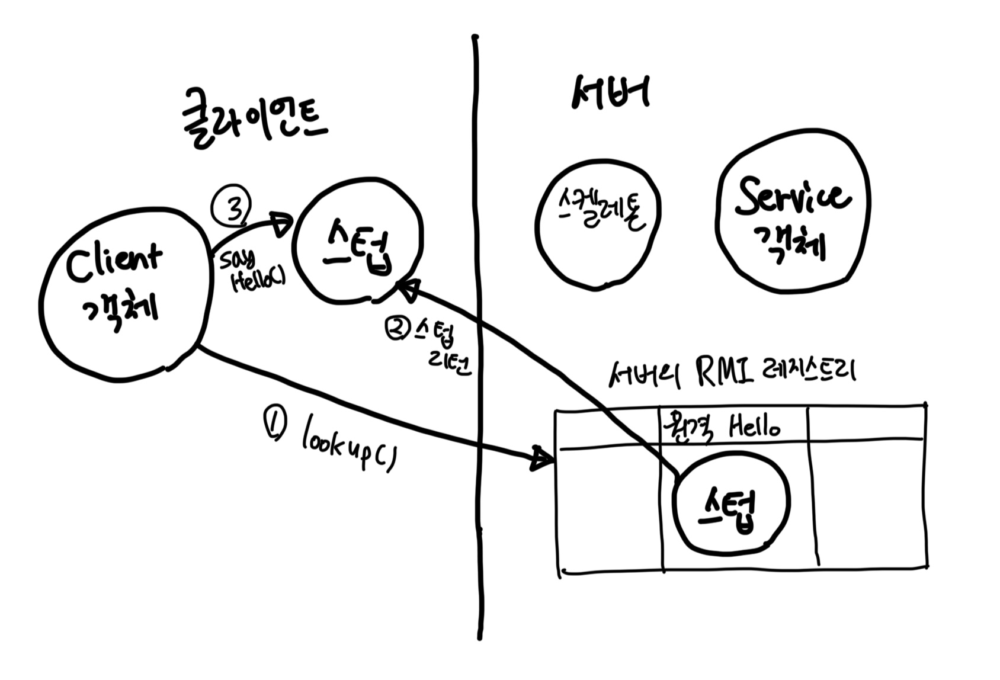
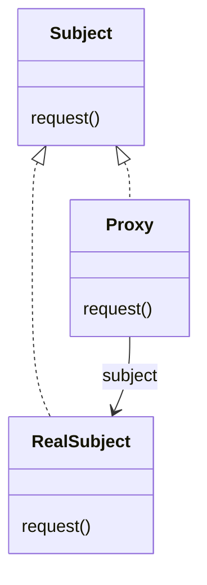
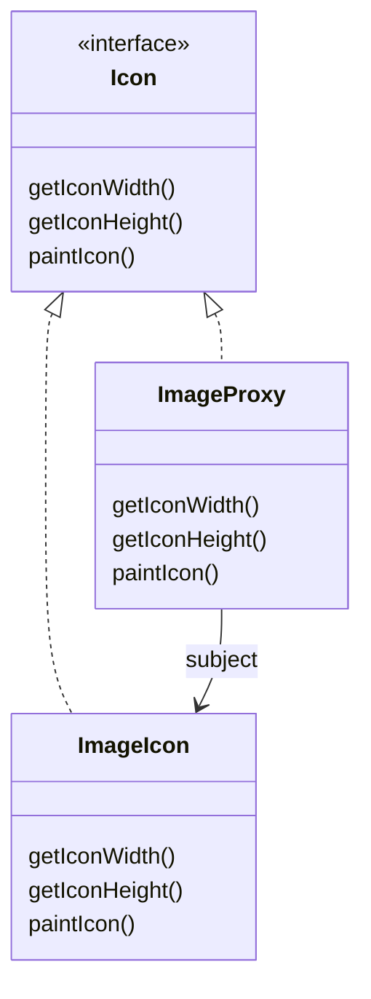
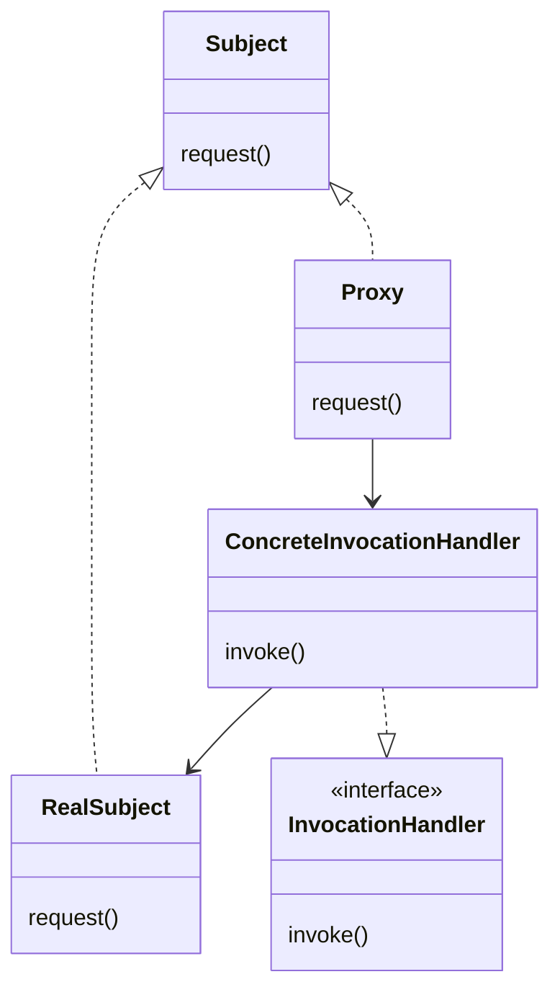

# Chapter13. 프록시 패턴

## 원격 프록시의 역할

- 원격 프록시는 원격 객체의 `로컬 대변자 역할`을 한다.
  - 원격 객체란? 자바 가상 머신의 힙에서 살고 있는 객체(조금 더 일반적으로 설명하자면 다른 주소 공간에서 돌아가고 있는 객체)를 뜻한다.
  - 로컬 대변자란? 로컬 대변자의 어떤 메소드를 호출하면, 다른 원격 객체에게 그 메소드 호출을 전달해 주는 객체를 로컬 대변자라고 한다.
- 클라이언트 객체는 원격 객체의 메소드 호출을 하는 것처럼 행동한다.
  - 하지만 실제로는 로컬 힙에 들어있는 '프록시' 객체의 메소드를 호출하고 있다.
  - 네트워크 통신과 관련된 저수준 작업은 이 프록시 객체에서 처리해준다.

## RMI의 기초

- `Remote Method Invocation, RMI`
- 로컬 객체의 메소드를 호출하면, 그 요청을 원격 객체에 전달해 주는 시스템을 디자인해야 한다고 가정해보자.
  - 우선 대신 통신을 처리해 주는 보조 객체가 필요하다. (client helper)
- 클라이언트는 보조 객체가 실제 서비스를 제공한다고 생각한다.
  - 클라이언트 보조 객체는 그 요청을 원격 객체에게 전달한다.
  - 클라이언트 보조 객체가 클라이언트에서 호출하고자 하는 메소드가 들어있는 객체인 척하기 때문이다.
- 하지만 클라이언트 보조 객체는 진짜 원격 서비스가 아니다.
  - 보조 객체는 서버에 연락을 취하고, 메소드 호출에 관한 정보(메소드 이름, 인자 등)를 전달하고, 서버로부터 리턴되는 정보를 기다린다.
- 서버는 서비스 보조 객체(service helper)가 있어서, Socket 연결로 클라이언트 보조 객체로부터 요청을 받아 오고, 호출 정보를 해석해서 진짜 서비스 객체에 있는 진짜 메소드를 호출한다.
  - 따라서 서비스 객체는 그 메소드 호출이 원격 클라이언트가 아닌 로컬 객체로부터 들어온다고 생각한다.
  - 서비스 보조 객체는 서비스로부터 리턴값을 받아 Socket의 출력 스트림으로 클라이언트 보조 객체에게 전송한다.

### Java RMI의 개요

- RMI를 사용하면 네트워킹 및 입출력 관련 코드를 직접 작성하지 않아도 된다.
- 클라이언트는 그냥 같은 로컬 JVM에 있는 메소드를 호출하듯이 원격 메소드를 호출할 수 있다.
- 또한 클라이언트가 원격 객체를 찾아서 접근할 때 쓸 수 있도록 룩업(lookup) 서비스도 RMI에서 제공한다.
- RMI와 로컬 메소드 호출의 차이점도 있다.
  - 클라이언트는 로컬 메소드 호출과 똑같은 식으로 메소드를 호출하지만, 
  - 실제로는 클라이언트 보조 객체가 네트워크로 호출을 전송해야 하므로 네트워킹 및 입출력 기능이 반드시 필요하다는 차이점이 있다.
- 네트워킹이나 입출력 기능을 쓸 때는 문제가 발생할 위험이 따르므로 클라이언트에서 항상 예상치 못한 상황을 대비하고 있어야 한다.

> #### RMI 용어
> - RMI에서 클라이언트 보조 객체는 `스텁 Stub`
> - 서비스 보조 객체는 `스켈레톤 Skeleton`이라고 부른다.

### 원격 서비스 만드릭

- 원격 서비스를 만드는 4단계

#### 1. 원격 인터페이스 만들기

- 클라이언트가 원격으로 호출할 메소드를 정의한다.
- 클라이언트에서 이 인터페이스를 서비스의 클래스 형식으로 사용한다.
- 스텁과 실제 서비스에 이 인터페이스를 구현해야 한다.

#### 2. 서비스 구현 클래스 만들기

- 실제로 작업을 처리하는 클래스
  - 나중에 클라이언트에서 이 객체에 있는 메소드를 호출한다.

#### 3. RMI 레지스트리 설정하기

- `rmiregistry`는 전화번호부와 비슷하다고 보면 된다.
- 클라이언트는 이 레지스트리로부터 프록시(스텁, 클라이언트 보조 객체)를 받아 간다.

#### 4. 원격 서비스 실행하기

- 서비스 객체를 실행해야 한다.
- 서비스를 구현한 클래스에서 서비스의 인스턴스를 만들고 그 인스턴스를 RMI 레지스트리에 등록한다.
- 이러면 그 서비스를 클라이언트에서 사용할 수 있다.


### 1단계: 원격 인터페이스 만들기

1. `java.rmi.Remote`를 확장한다.

```java
public interface MyRemote extends Remote {}
```

2. 모든 메소드를 `RemoteException`을 던지도록 선언한다.
- 스텁이 각종 입출력 작업을 처리할 때 네트워크 등에 안 좋은 일이 일어날 수 있다.
- 따라서 클라이언트는 원격 예외를 처리하거나 선언해서 안 좋은 일에 대비해야 한다.

```java
public interface MyRemote extends Remote {
  String sayHello() throws RemoteException;
}
```

3. 원격 메소드의 인자와 리턴값은 반드시 `원시 형식 primitive` 또는 `Serializable` 형식으로 선언한다.
- 원격 메소드의 인자는 모두 네트워크로 전달되어야 하며, 직렬화로 포장된다.

### 2단계: 서비스 구현 클래스 만들기

1. 서비스 클래스에 원격 인터페이스를 구현한다.

```java
public class MyRemoteImpl extends UnicastRemoteObject implements MyRemote {

  protected MyRemoteImpl() throws RemoteException {}

  @Override
  public String sayHello() throws RemoteException {
    return "Server says, 'Hey'";
  }
}
```

2. `UnicastRemoteObject`를 확장한다.

```java
public class MyRemoteImpl extends UnicastRemoteObject implements MyRemote {
  @Serial
  private static final long serialVersionUID = 1L;
  //...
}
```

3. `RemoteException`을 선언하는 생성자를 구현한다.

```java
public class MyRemoteImpl extends UnicastRemoteObject implements MyRemote {
  protected MyRemoteImpl() throws RemoteException {}
}
```

4. 서비스는 RMI 레지스트리에 등록한다.

```java
public class MyRemoteImpl extends UnicastRemoteObject implements MyRemote {

  //...

  public static void main(String[] args) {
    try {
      MyRemote service = new MyRemoteImpl();
      Naming.rebind("RemoteHello", service);
    } catch(Exception ex) {
      ex.printStackTrace();
    }
  }
}
```

### 3단계: rmiregistry 실행하기

- 터미널을 새로 띄워 rmiregistry 실행

```shell
$ rmiregistry
WARNING: A terminally deprecated method in java.lang.System has been called
WARNING: System::setSecurityManager has been called by sun.rmi.registry.RegistryImpl
WARNING: Please consider reporting this to the maintainers of sun.rmi.registry.RegistryImpl
WARNING: System::setSecurityManager will be removed in a future release
```

### 4단계: 원격 서비스 실행하기

- 다른 터미널을 열고 서비스를 실행.
- 자바를 컴파일하고 실행해보자.

```shell
$ javac -d . MyRemote.java MyRemoteImpl.java
$ java com.pythonstrup.proxy.rmi.MyRemoteImpl 
```

### 작동 방식



1. 클라이언트 RMI 레지스트리를 룩업한다.

```java
Naming.lookup("rmi://127.0.0.1/RemoteHello")
```

2. RMI 레지스트리에서 스텁 객체를 리턴한다. 스텁 객체는 `lookup()` 메소드의 리턴 값으로 전달되며, RMI에서는 그 스텁을 자동으로 역직렬화한다. 이때 (rmic에서 생성해 준) 스텁 클래스는 반드시 클라이언트에만 있어야 한다. 그 클래스가 없으면 역직렬화를 할 수 없다.
3. 클라이언트는 스텁의 메소드를 호출한다. 스텁이 진짜 서비스 객체라고 생각한다.


<br/>

## 프록시 패턴의 정의

> #### 프록시 패턴
> 특정 객체로의 접근을 제어하는 대리인(특정 객체를 대변하는 객체)을 제공한다.

- 프록시는 다른 객체의 '대리인'이라고 봐도 무방하다.
- 하지만 접근을 제어하는 프록시는 어떤 것일까?
  - 프록시 패턴에는 수많은 변종이 있다. 그리고 그러한 변종들은 대개 접근을 제어하는 방법을 다르게 제공한다.
- 프록시에서 접근을 제어하는 몇 가지 방법
  - 원격 프록시를 써서 원격 객체로의 접근을 제어할 수 있다.
  - `가상 프록시 virtual proxy`를 써서 생성하기 힘든 자원으로의 접근을 제어할 수 있다.
  - `보호 프록시 protection proxy`를 써서 접근 권한이 필요한 자원으로의 접근을 제어할 수 있다.

### 클래스 다이어그램

- `Proxy`와 `RealSubject` 모두 `Subject` 인터페이스를 구현한다.
  - 이러면 어떤 클라이언트에서든 프록시를 주제와 똑같은 식으로 다룰 수 있다.
- `RealSubject`는 진짜 작업을 대부분 처리하는 객체다. `Proxy`는 그 객체로의 접근을 제어하는 객체다.
- `Proxy`에는 진짜 작업을 처리하는 객체의 레퍼런스가 들어있다.
  - 진짜 객체가 필요하면 그 레퍼런스를 사용해서 요청을 전달한다.
- `Proxy`에서 `RealSubject`의 인스턴스를 생성하거나, 그 객체의 생성 과정에 관여하는 경우가 많다.



### 원격 프록시와 가상 프록시 비교하기

- 프록시 패턴은 매우 다양한 형태로 쓰이지만, 어떤 형태로 사용하든 결국은 기본 프록시 디자인을 따른다.

|                                      원격 프록시                                      |                     가상 프록시                      |
|:--------------------------------------------------------------------------------:|:-----------------------------------------------:|
|                           다른 JVM 객체에 들어 있는 객체의 대리인에 해당                           |           생성하는 데 많은 비용이 드는 객체를 대신한다.            |
| 프록시의 메소드를 호출하면 그 호출이 네트워크로 전달되어 결국 원격 객체의 메소드가 호출. 호출의 결과는 다시 프록시를 거쳐 클라이언트에게 전달 | 객체가 필요해지면 그 때 객체를 생성하고 `RealSubject` 직접 요청을 전달. |

<br/>

## 가상 프록시 예제 - Java Swing



<br/>

## 이모저모

#### 원격 프록시와 가상 프록시는 완전히 달라보인다. 과연 정말 둘이 같은 패턴에 속하는 게 맞는지?
- 실전에서는 프록시 패턴의 변종을 더 많이 보게 될 것이다.
- 그 모든 변종의 공통점은 클라이언트가 실제 객체의 메소드를 호출하면, 그 호출을 중간에 가로챈다는 점이다.
- 간접적인 처리를 통해 요청 내역을 원격 시스템에 있는 객체에 전달할 수도 있고, 생성하는 데 많은 비용이 드는 객체를 대변해 줄 수도 있고, 클라이언트별로 호출할 수 있는 메소드를 제한하는 문지기 역할을 하는 것도 가능하다.

#### 데코레이터와의 차이점?

- 종종 똑같아 보이기도 한다. 하지만 용도로 구분할 수 있다.
- `데코레이터`는 클래스의 새로운 행동을 추가하는 용도로 쓰이지만 `프록시`는 어떤 클래스로의 접근을 제어하는 용도로 쓰인다.
- 예제에서 "로딩 메시지를 표시하는 것이 결국 행동을 추가하는 것이 아닌가?"라는 의문이 들 수 있지만 그보다 더 중요한 점은 `ImageProxy`가 `ImageIcon`으로의 접근을 제어하고 있다는 사실이다.

#### 프록시와 어댑터의 차이

- 프록시와 어댑터는 모두 클라이언트와 다른 객체 사이에서 클라이언트의 요청을 다른 객체에게 전달하는 역할을 한다.
- 어댑터는 다른 객체의 인터페이스를 바꿔 주지만, 프록시는 똑같은 인터페이스를 사용한다는 차이점이 있다.
- 보호 프록시는 어댑터와 정말 비슷하다.
  - 보호 프록시는 클라이언트의 역할에 따라서 객체에 있는 특정 메소드로의 접근을 제어한다.
  - 그러다 보니 보호 프록시는 클라이언트에게 인터페이스의 일부분만을 제공한다. 이런 점은 어댑터와 비슷하다고 할 수 있다.

<br/>

## 보호 프록시

- 자바의 java.lang.reflect 패키지 안에 프록시 기능이 내장되어 있다.
  - 이 패키지를 사용하면 즉석에서 하나 이상의 인터페이스를 구현하고, 지정한 클래스에 메소드 호출을 전달하는 프록시 클래스를 만들 수 있다.
- 진짜 프록시 클래스는 실행 중에 생성되므로 이러한 자바 기술을 `동적 프록시 dynamic proxy`라고 부른다.
- 자바의 동적 프록시를 활용해 보호 프록시를 만들어보자.

### 다이어그램



- 자바에서 Proxy 클래스를 생성해 주므로 `Proxy` 클래스에게 무슨 일을 해야 하는지 알려 줄 방법이 필요하다.
- 필요한 코드를 직접 구현하는 건 아니기에 이전처럼 그 코드를 프록시 클래스에 넣을 수는 없다.
  - 그 코드를 프록시 클래스에 넣을 수 없다면 어디에 넣어야 할까? `InvocationHandler`에 넣으면 된다. `InvocationHandler`는 프록시에 호출되는 모든 메소드에 응답한다.
  - `Proxy`에서 메소드 호출을 받으면 항상 `InvocationHandler`에 진짜 작업을 부탁한다고 생각하면 된다.

<br/>

# 참고자료

- 헤드퍼스트 디자인패턴, 에릭 프리먼 / 엘리자베스 롭슨 / 케이시 시에라 / 버트 베이츠 지음
