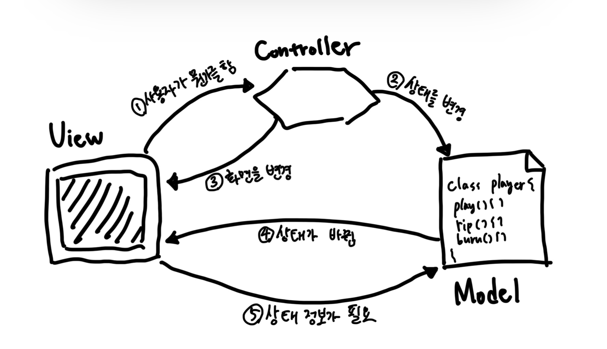
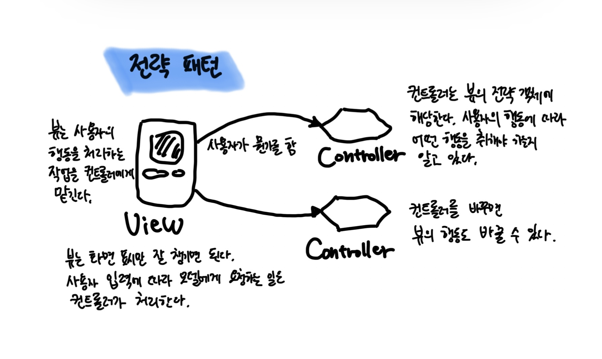
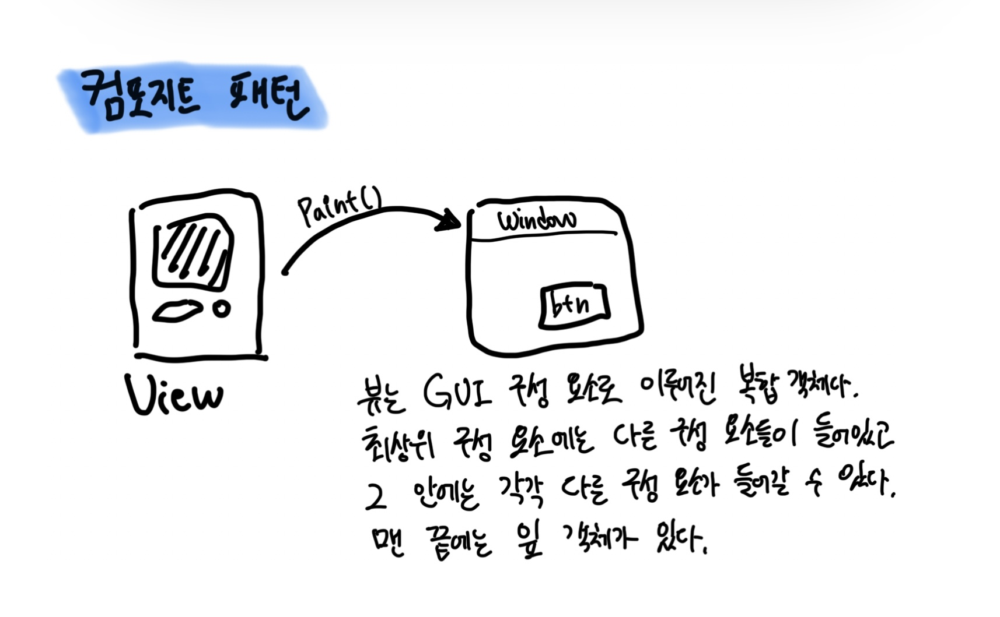
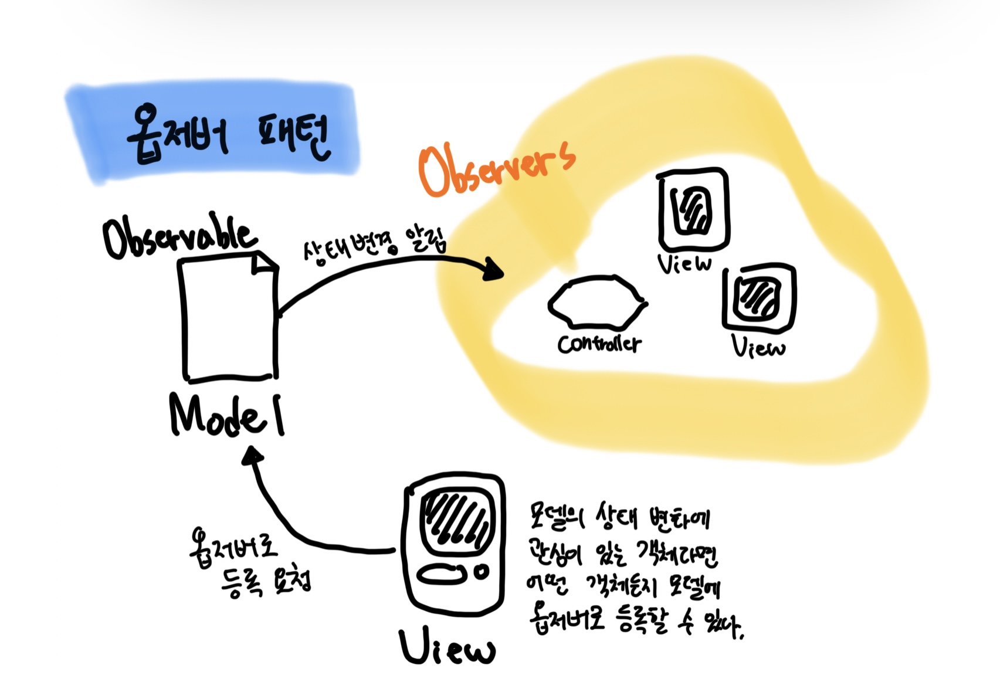

# Chapter14. 복합 패턴

- 패턴을 잘 활용하는 방법 가운데 하나로 서로 다른 패턴을 섞어 쓰기를 들 수 있다.
- 여러 패턴을 함께 사용해서 다양한 디자인 문제를 해결하는 방법을 `복합 패턴 Compound Pattern`이라고 부른다.
- 패턴 몇 개를 결합한다고 해서 무조건 복합 패턴이 되는 것은 아니다.
  - 복합 패턴이라 불리려면 여러 가지 문제의 일반적인 해결법을 제시해야 한다.
  - ex. 복합 패턴의 왕이라고 할 수 있는 MVC 패턴

> 복합 패턴이란 반복적으로 생길 수 있는 일반적인 문제를 해결하는 용도로 2개 이상의 패턴을 결합해서 사용하는 것을 뜻한다.

## MVC 패턴

- `Model`
  - 모델에는 모든 데이터와 상태, 그리고 애플리케이션 로직이 들어있다.
  - 뷰와 컨트롤러에서 모델의 상태를 조작하거나 가져올 때 필요한 인터페이스를 제공하고 모델이 자신의 상태변화를 옵저버들에게 연락해 주긴 하지만, 기본적으로 모델은 뷰와 컨트롤러에 별 관심이 없다.
- `View`
  - 모델을 표현하는 방법을 제공한다.
  - 일반적으로 화면에 표시할 때 필요한 상태와 데이터는 모델에서 직접 가져온다.
- `Controller`
  - 사용자로부터 입력을 받으며 입력받은 내용이 모델에게 어떤 의미가 있는지 파악한다.

1. <b><u>사용자는 뷰에만 접촉할 수 있다.</u></b>
   - 뷰는 모델을 보여 주는 창이라고 할 수 있다.
   - 사용자가 뷰에서 뭔가를 하면 무슨 일이 일어났는지 컨트롤러에게 알려 준다. 그러면 컨트롤러가 상황에 맞게 작업을 처리한다.
2. <b><u>컨트롤러가 모델에게 상태를 변경하라고 요청한다.</u></b>
   - 컨트롤러는 사용자의 행동을 받아서 해석한다.
   - 사용자가 버튼을 클릭하면 컨트롤러는 그것이 무엇을 의미하는지 해석하고, 모델을 어떤 식으로 조작해야 하는지 결정한다.
3. <b><u>컨트롤러가 뷰를 변경해 달라고 요청할 수도 있다.</u></b>
   - 컨트롤러는 뷰로부터 어떤 행동을 받았을 때, 그 행동의 결과로 뷰에게 뭔가를 바꿔 달라고 할 수도 있다.
   - ex. 컨트롤러는 인터페이스에 있는 어떤 버튼이나 메뉴를 활성화하거나 비활성화할 수 있다.
4. <b><u>상태가 변경되면 모델이 뷰에게 그 사실을 알린다.</u></b>
   - 사용자가 한 행동이나 다른 내부적인 변화 등으로 모델에서 뭔가가 바뀌면 모델은 뷰에게 상태가 변경되었다고 알린다.
5. <b><u>뷰가 모델에게 상태를 요청한다.</u></b>
   - 뷰는 화면에 표시할 상태를 모델로부터 직접 가져온다.
   - 컨트롤러가 뷰에게 뭔가를 바꾸라고 요청했을 때, 뷰는 모델에게 상태를 알려 달라고 요청할 수도 있다.

## MVC에 사용되는 패턴 알아보기

#### 전략 패턴

- 뷰와 컨트롤러는 전략 패턴으로 구성되어 있다. 뷰 객체를 여러 전략을 써서 설정할 수 있다. 컨트롤러가 전략을 제공한다.
- 뷰는 애플리케이션의 겉모습에만 신경을 쓰고, 인터페이스의 행동을 결정하는 일은 모두 컨트롤러에게 맡긴다.
- 전략 패턴을 사용하면 뷰를 모델로부터 분리하는 데에도 도움이 된다.
- 사용자가 요청한 내역을 처리하려고 모델과 얘기하는 일을 컨트롤러가 맡고 있기 때문이다. (뷰는 그 방법을 전혀 알지 못한다.)

#### 컴포지트 패턴

- 디스플레이는 여러 단계로 겹쳐 있는 윈도우, 패널, 버튼, 텍스트 레이블 등으로 구성되다. 각 디스플레이 항목은 복합 객체(ex. 윈도우)나 잎(ex. 버튼)이 될 수 있다.
- 컨트롤러가 뷰에게 화면을 갱신해 달라고 요청하면 최상위 뷰 구성 요소에게만 화면을 갱신하라고 얘기하면 된다. 나머지는 컴포지트 패턴이 알아서 처리해 준다.

#### 옵저버 패턴

- 모델은 옵저버 패턴을 써서 상태가 변경되었을 때 그 모델과 연관된 객체들에게 연락한다. 옵저버 패턴을 사용하면 모델을 뷰와 컨트롤러로부터 완전히 독립시킬 수 있다.
- 한 모델에서 서로 다른 뷰를 사용할 수도 있고, 심지어 여러 개의 뷰를 동시에 사용하는 것도 가능하다.

 

# 참고자료

- 헤드퍼스트 디자인패턴, 에릭 프리먼 / 엘리자베스 롭슨 / 케이시 시에라 / 버트 베이츠 지음
