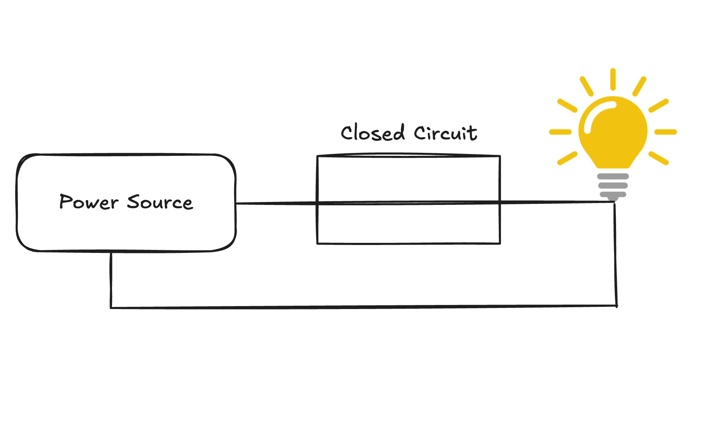
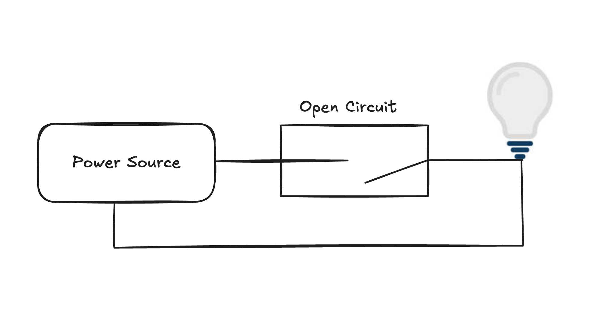
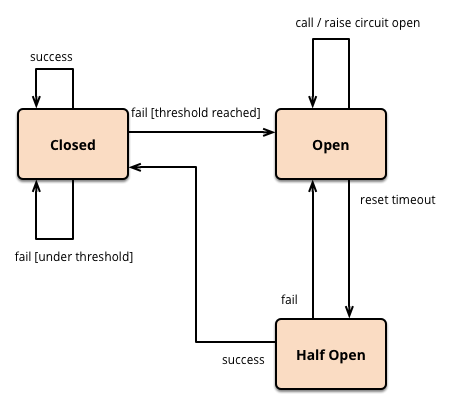
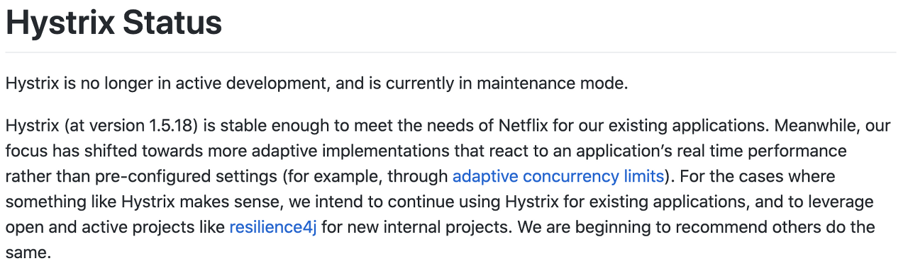

# 서킷 브레이커 패턴

- 시스템의 구성이 MSA로 되어 있어 다른 서비스를 호출하거나 아니면 외부와 계약하여 외부 연동사를 사용하는 경우, 각 서버들에는 장애가 발생할 가능성이 있다.
- 이때 장애가 다른 서비스에도 전파되어 문제가 발생할 수 있다.
  - 또한 장애가 발생한 서버에 계속 요청을 보내는 것은 장애 복구를 힘들게 만든다.
- 장애를 차단하기 위해 어떤 방법을 사용해볼 수 있을까?  

## `서킷 브레이커 패턴 Circuit Breaker Pattern`

- "Release it"이라는 책에서 처음 소개된 디자인 패턴.
- 문제가 발생한 지점을 감지하고 실패하는 요청을 계속하지 않도록 방지한다.
  - 사용자가 불필요하게 대기하지 않는다는 점에서 훨씬 좋은 서비스를 하는 데에 도움이 된다.

## 동작 원리

- Bulb: 외부 API, `Callee`
- Power Source: 클라이언트, `Caller`

### 서킷 브레이커의 상태

- 3가지 상태가 존재한다.

### `Closed`

- 기본 상태로 모든 요청을 통과시키는 상태.
- 이 상태에서 호출이 실패하면 실패 카운터가 증가한다.
- 실패율이 설정된 임계값을 초과하면 서킷 브레이커가 `Open` 상태로 전환된다.

### `Open`

- 서킷 브레이커가 오픈 상태로 전환되면 모든 요청을 즉시 실패로 처리한다.
- 특정 기능이나 서비스에 문제가 발생했을 때, 요청을 막아 장애가 전파되지 않도록 하는 것.
- 대기 시간을 설정한다. 설정된 대기 시간이 지나면 서킷 브레이커는 `Half-Open` 상태가 된다.

### `Half-Open`

- 오픈 상태에서 대기 시간이 지나면 서킷 브레이커는 `Half-Open` 상태로 전환된다.
- `Half-Open`는 제한된 수의 요청을 허용하여 시스템이 정상 상태로 복구되었는지 확인한다.
  - 요청이 성공하면 서킷 브레이커는 `Closed`로 전환
  - 요청이 다시 실패하면 서킷 브레이커는 다시 `Open` 상태로 전환
- ex) 요청 5개를 보내고 모두 성공하면 `Closed`, 하나라도 실패하면 `Open`

### 도식

 

## 라이브러리?

- `Hystrix`, `resilience4j` 등이 있다.
- `Hystrix`기능 개발은 2018년까지. 유지보수는 2023년에서 멈췄다.
  - 심지어 `Hystrix`에서 `resilience4j`를 권장하고 있을 정도..?

### resilience4j

# 참고 자료

- [[디자인패턴] 서킷 브레이커 패턴(Circuit Breaker Pattern)의 필요성 및 동작 원리](https://mangkyu.tistory.com/261)
- [[TIL] 서킷 브레이커의 상태 변화(Closed -> Open -> Half-Open)](https://developer-jinnie.tistory.com/82)