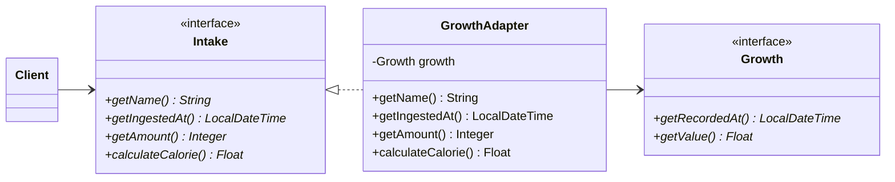
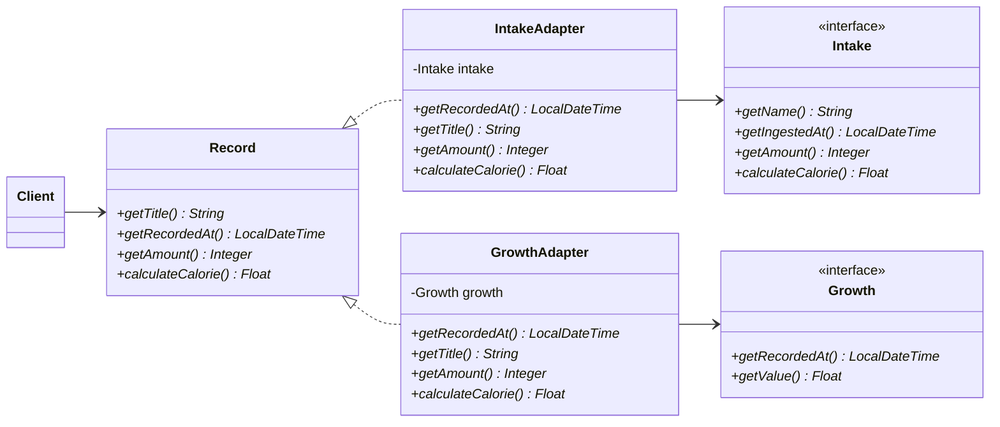
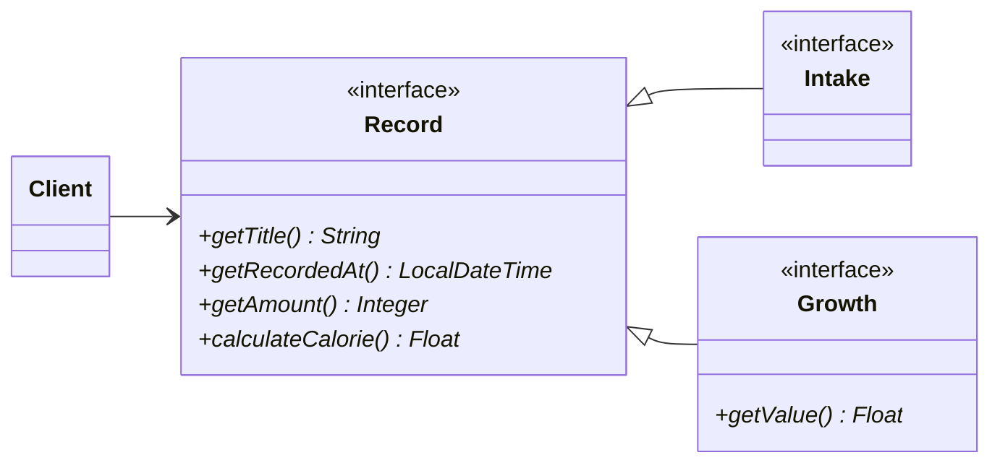

# 어댑터 패턴이란?


# 어댑터 패턴 실전

- 육아 기록을 만든다고 가정
- 원래는 섭취 기록이라는 페이지와 성장 기록이라는 페이지가 나눠져 있다.
- 그런데 섭취 기록 목록 조회에 성장 기록도 함께 조회해야 한다는 요구사항이 추가된다면 어떻게 할 것인가?

## 둘의 타입은 완전히 다르다.

```java
public abstract class Growth {
  
  private final LocalDateTime recordedAt;
  private final String note;
}

public class HeightGrowth extends Growth {
  
}

public class HeightGrowth extends Growth {

}
```

```java
public abstract class Ingest {
  
  private final int amount;
  private final LocalDateTime ingestedAt;
  private final String note;
}

public class ProductIngest extends Ingest {
  
}

public class IngredientIngest extends Ingest {

}
```

## 헤드퍼스트 디자인패턴의 예시

- 칠면조를 새에 적응시키는 예시가 나온다. 
  - 칠면조 어댑터 클래스는 새 인터페이스를 구현하며, 칠면조 객체를 인스턴스 변수로 가지고 있다.
- 이 예시처럼 성장 기록의 어댑터는 섭취 기록 인터페이스를 구현하고, 성장 기록을 인스턴스 변수로 가지고 있게 하면 어떤 식으로 구현이 이뤄질까? 문제는 없을까?

## 어댑터 패턴 적용1 - Growth를 Ingest에 적응시키기.

- 원래 섭취인 Ingest를 조회하는 로직이었으니, Growth를 여기에 적응시키면 되지 않을까?

```java
public class GrowthIngestAdapter extends Ingest {
  
}
```



```java
public class GrowthAdapter implements Intake {
  
  private final Growth growth;
  
  GrowthAdapter(Growth growth) {
    this.growth = growth;
  }
  
  public LocalDateTime getIngestedAt() {
    return growth.getRecordedAt();
  }
  public Integer getAmount() {
    return 0;
  }
  public Float calculateCalorie() {
    return 0;
  }
}
```

- 하지만 `getAmount()`, `getIngestedAt()`, `getMemo()`와 같은 메소드를 강제할 수 없다는 문제점이 있다. 

## 어댑터 패턴 적용2 - 가상의 도메인 Record 만들기

- 사실 둘은 '기록'이라는 공통점이 있다. 차라리 Record라는 가상의 도메인을 만드는 것은 어떨까?



```java 
public interface Record {
  String getTitle(); 
  LocalDateTime getRecordedAt(); 
  Integer getAmount(); 
  Float calculateCalorie(); 
} 
```

- 이제 Record에 적응시킬 어댑터 객체를 만든다.

```java
public class GrowthRecordAdapter implements Record {
  
}
```

```java
public class IngestRecordAdapter implements Record {
  
}
```

# 만약 어댑터 패턴을 적용하지 않고 스키마를 합쳤다면?



# 결론

- 디자인 패턴의 예시를 익히고 그 방식대로 따라하는 것도 좋지만, 이를 응용하여 현재 설계에 맞게 변형시킬 수 있는 능력을 갖추는 것이 중요하다.
- 
