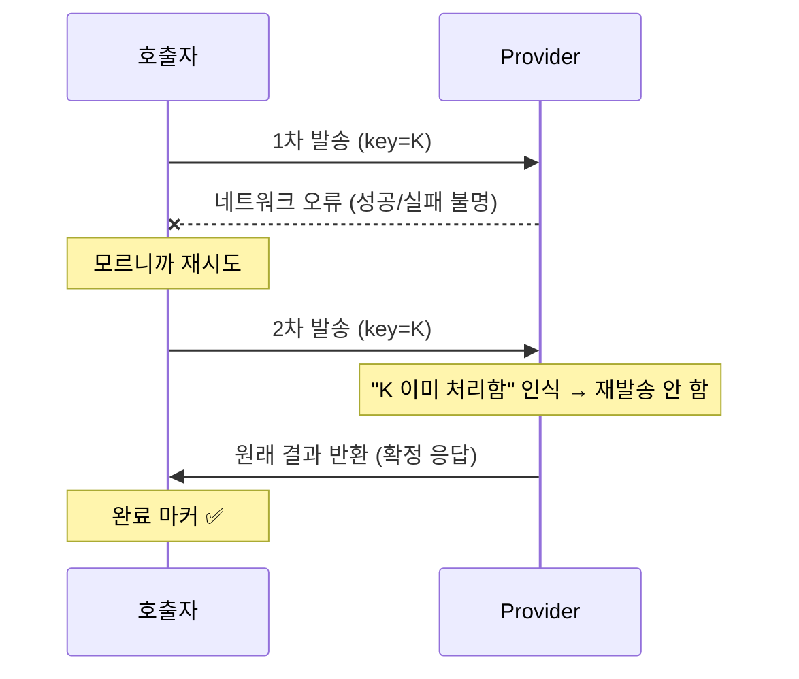

# 메시지 전달 신뢰성 (Message Delivery Reliability)

> 큐 기반 알림 시스템에서 "메시지가 정확히 한 번 전달되게" 하려다 도달한 결론 정리.
> 무대: `[API] → [BullMQ 큐] → [Worker] → [FCM/카카오 발송]`

## 핵심 결론 (TL;DR)

1. **exactly-once delivery(정확히 한 번 전달)는 원리적으로 불가능**하다. 외부 부수효과와 완료기록을 원자적으로 못 묶기 때문 (→ 결국 Two Generals Problem).
2. 그래서 현업은 **at-least-once(유실 없음, 중복 가능)를 받아들이고, 멱등성으로 중복을 흡수**해 *효과상* exactly-once를 만든다.
3. 신뢰성 보장은 **경계(boundary)마다 다시 성립**해야 하고, 각 경계는 옆 경계가 받쳐준다.
4. 끝내 안 닫히는 "불확실성"은 **provider 멱등 키**로 재시도를 안전하게 만들거나, **사후 대사(reconciliation)**로 줄이거나, **유실/중복 중 무엇을 감수할지 비즈니스로 정한다.**

---

## 1. 전달 보장의 이분법

부수효과(발송)와 완료기록(ack)은 둘 중 뭘 먼저 하든 그 사이에 죽는 **창(window)**이 있다.

| 순서 | 사이에서 죽으면 | 결과 |
|---|---|---|
| 발송 → ack | ack 못 보냄 → 재시도 | **중복** = at-least-once |
| ack → 발송 | 발송 못 함 → 재시도 불가 | **유실** = at-most-once |

**왜 보통 at-least-once를 기본으로 두나?** 유실과 중복의 성질이 다르기 때문:

| | 유실 | 중복 |
|---|---|---|
| 보이는가 | ❌ 조용함 (안 온 건 아무도 모름) | ✅ 보임 |
| 복구 | ❌ 탐지조차 어려움 | ✅ 멱등성으로 흡수 가능 |

→ **"내가 대처할 수 있는 실패"를 고른다.** 단, 이건 법칙이 아니라 선택이다 (§7).

---

## 2. 멱등성 (Idempotency) — 중복을 "막는" 게 아니라 "흡수"

**멱등** = 여러 번 해도 한 번 한 것과 결과가 같은 연산. `f(f(x)) = f(x)`.

| 연산 | 멱등? |
|---|---|
| 잔액을 5000원으로 **설정** | ✅ |
| 잔액에 5000원 **더하기** | ❌ (횟수가 결과를 바꿈) |
| 푸시 **발송** | ❌ (두 번 = 알림 2개) |

큐는 at-least-once라 중복 배달을 못 막는다. 그래서 "발송한다"(❌)를 **"발송한 적 없으면 발송"(✅)**으로 바꿔, 두 번 와도 사용자에겐 1번만 보이게 한다.

---

## 3. 경계 모델 — 전체 실패 지도


| 경계 | 실패 | 해결 |
|---|---|---|
| ① producer 유실 | dual write (DB↔큐 원자성 X) | **Transactional Outbox** (§4) |
| ① producer 중복 | 중복 요청(더블클릭/재시도) | **jobId dedup** |
| ② enqueue 중복 | 같은 키 재추가 | jobId dedup (보존기간 내) |
| ③ 브로커 내구성 | Redis failover/영속성 유실 | AOF·복제·`WAIT`·reconciliation |
| ④⑤ consumer 중복 | stalled/재시도로 한 job 2회 처리 | **효과 지점 멱등성** (§5) |
| 순서(ordering) | 재시도로 메시지 순서 뒤바뀜 | FIFO 파티션 / 버전·시퀀스 번호 |
| poison message | 항상 실패하는 job이 무한 재시도 | `maxAttempts` + **DLQ** |
| 멱등 키 TTL 만료 | 창 지난 뒤 재도착 → 재발송 | TTL을 재시도 최대 지연보다 길게 |
| dedup 저장소 재귀 | "기록 쓰기"도 발송과 또 두 시스템 | 결국 provider 멱등 키로 바닥을 막음 (§6) |

**중복에는 두 종류가 있다 — jobId dedup은 (A)만 막는다:**

| | (A) enqueue 중복 | (B) 처리 중복 |
|---|---|---|
| 언제 | 같은 알림을 `add()` 두 번 | 한 job이 stalled/재시도로 handler 2회 실행 |
| jobId dedup이 막음? | ✅ (보존기간 내) | ❌ 전혀 못 막음 |

→ (B)는 큐 기능이 아니라 **handler 내부 멱등성**으로 막아야 한다.

---

## 4. Producer 경계 — Transactional Outbox

dual write("DB 커밋 + 큐 enqueue"의 비원자성)를, **두 번째 쓰기를 같은 DB의 outbox 테이블로 바꿔** 로컬 원자성 문제로 강등시킨다.

```sql
CREATE TABLE outbox (
  id           UUID PRIMARY KEY,        -- 곧 멱등 키가 됨
  event_type   TEXT NOT NULL,
  payload      JSONB NOT NULL,
  created_at   TIMESTAMPTZ NOT NULL DEFAULT now(),
  processed_at TIMESTAMPTZ             -- NULL = 아직 relay 안 됨
);
```

```ts
// 쓰기: 비즈니스 변경과 같은 트랜잭션 → 원자적
await db.transaction(async (tx) => {
  await tx.insert(orders, order);
  await tx.insert(outbox, {
    id: crypto.randomUUID(),
    eventType: 'notification.send',
    payload: { userId, templateId, eventId },
  });
});
```

```ts
// relay (polling): 별도 워커가 주기 실행
const rows = await db.query(`
  SELECT * FROM outbox WHERE processed_at IS NULL
  ORDER BY created_at LIMIT 100
  FOR UPDATE SKIP LOCKED          -- relay 여러 대가 같은 row 안 잡게
`);
for (const row of rows) {
  await queue.add('notification', row.payload, { jobId: row.id }); // publish 먼저
  await db.query(`UPDATE outbox SET processed_at = now() WHERE id = $1`, [row.id]); // 표시 나중
  // 사이에 죽으면 → 재publish → jobId dedup이 흡수
}
```

- **Outbox가 보장**: producer 유실 제거 + at-least-once 확정.
- **Outbox가 안 줌**: 중복(relay 재시도)은 여전 → downstream 멱등성 필수. exactly-once 아님.
- **전제**: outbox가 비즈니스 데이터와 **같은 DB**일 때만 성립. 다른 DB면 dual write 부활.
- CDC(Debezium 등 WAL tailing)는 polling 부하·지연을 없애는 대안 (인프라는 무거움).

---

## 5. Consumer 경계 — 멱등 발송 (stalled 중복 해결)

**함정: "동시성 락"과 "완료 마커(dedup)"는 다른 것.** 하나로 합치면 ─ 락을 발송 *전*에 영구히 박으면 ─ 발송 실패 시 키가 남아 재시도가 스킵 → **유실**. 둘을 분리한다.

```ts
// 1) 동시성 락: 짧은 TTL. '지금 누가 처리 중'만 표시 (영구 X)
const lock = await redis.set(`lock:${key}`, workerId, 'NX', 'EX', 30);
if (!lock) return;                       // 다른 워커 처리 중 → 자연 재시도에 맡김

try {
  // 2) 완료 기록 확인: 성공한 적 있나?
  if (await redis.exists(`done:${key}`)) return;   // 이미 성공 → 스킵

  // 3) 발송 (provider 멱등 키 동봉)
  await sendKakao(payload, { idempotencyKey: key });

  // 4) ★ 성공한 뒤에만 완료 마커
  await redis.set(`done:${key}`, '1', 'EX', longTtl);
} finally {
  await redis.del(`lock:${key}`);        // 안 풀려도 30초 후 자동 만료
}
```

- 발송 실패 → `done` 안 찍힘 + 락 만료 → 재시도가 다시 발송 → **유실 없음**.
- 발송 성공 직후 `done` 쓰기 전 크래시 → 재시도가 재발송 → 중복 → **provider 멱등 키가 흡수**.
- 멱등 키는 비즈니스 결정값(`notification:{userId}:{eventId}`)이어야 한다. random UUID면 같은 알림에 키가 두 개 생겨 dedup 실패.
- 주의: 핸들러가 **이벤트 루프를 오래 막으면 lock 갱신 실패 → 가짜 stalled → 재처리**. (런타임 내부 주제와 연결.)

**원리:** dedup 마커를 효과 *전*에 쓰면 유실 위험(at-most-once), *후*에 쓰면 중복 위험(at-least-once). §1의 이분법이 멱등성 계층 안에서 그대로 반복된다.

---

## 6. 바닥 — Two Generals Problem

네트워크 오류/타임아웃이 나면, 호출자는 두 경우를 **구분할 수 없다**:
- (가) 진짜 실패 (나) 발송은 성공했는데 **응답만 유실**

코드로는 (가)/(나)를 절대 알 수 없다 → 실패로 보고 재시도하면 중복, 성공으로 보고 안 하면 유실. 이것이 **Two Generals Problem**: 신뢰할 수 없는 채널로 연결된 두 주체는 결과에 대한 *확실한 공통 인식*에 결코 도달할 수 없다 (증명된 불가능). exactly-once 불가능의 진짜 뿌리.

**대처: "확실성" 대신 "재시도 안전성".**



provider 멱등 키가 "모름"을 "안전하게 재질의 가능"으로 바꾼다. **원자성의 최종 책임을 provider에게 위임**.

**provider가 멱등 키 미지원이면:**
1. **사후 조회**: 참조 ID로 발송 여부 조회 API → 불확실성 확정.
2. **대사 배치**: "보냈어야 할 목록 vs 실제 발송 로그" 주기 대조해 누락/중복 교정.
3. **독을 고른다**: 재시도(중복) vs 무재시도(유실)를 비용으로 선택.

---

## 7. 최종 결론 — 전달 보장은 "비용으로 정하는 판단"

> "메시지를 절대 안 잃는다"는 보장은 존재하지 않는다. 모든 신뢰성 보장은 *어떤 장애 범위까지 가정하느냐*에 상대적이다. 엔지니어링은 *확실성*을 만드는 게 아니라, **어떤 실패를 비용 들여 막고 / 어떤 실패는 감수하고 사후 탐지·복구할지를 경계마다 정하는 일**이다.

메시지 종류별 중복 비용도 다르다:
- 정보성 알림톡: 중복 = 가벼운 짜증 + **건당 과금이라 비용 2배** + 채널 신뢰도.
- OTP·결제 알림: 중복 = 사용자 **혼란·불신**.
- best-effort 마케팅 푸시: 멱등성 비용이 아까우면 at-most-once로 유실 감수도 합리적.

→ 같은 패턴이라도 "유실 비용 vs 중복 비용"에 따라 설계가 갈린다. 이 판단이 시니어/주니어를 가른다.

---

## BullMQ 메모

- 커스텀 `jobId`: *"adding a job with an id that already exists ... will not be added"* → enqueue dedup.
- ⚠️ *"`removeOnComplete`/`removeOnFailed` can interfere with duplicate detection"* → dedup 창 = **job 보존 기간**. 완료 후 제거되면 같은 id 재추가가 새 job이 됨.
- 신버전 `deduplication: { id, ttl }` 옵션 = TTL 기반 throttle/debounce dedup.
- 어느 것도 **(B) 처리 중복(stalled/retry)은 못 막는다** → §5 필요.

---

_출처: 분산/신뢰성 자가학습 세션 (2026-06). [2편: 이벤트 루프 블로킹과 가짜 stalled](./02_event-loop-blocking-and-false-stalled.md). 다음 편: 백프레셔(backpressure), 관측성._
