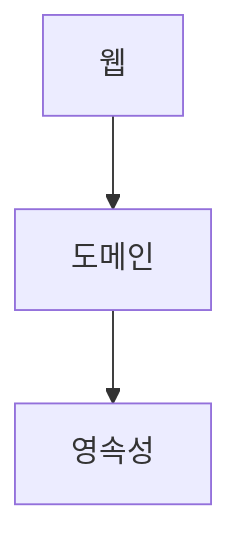
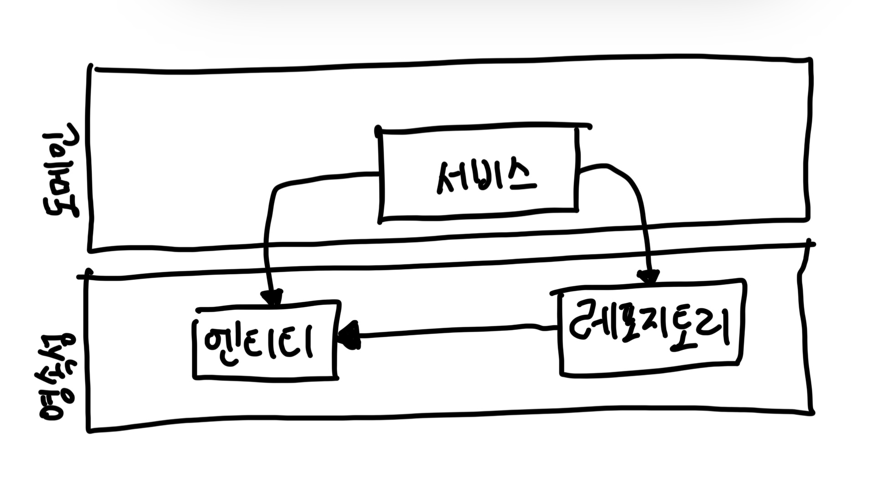
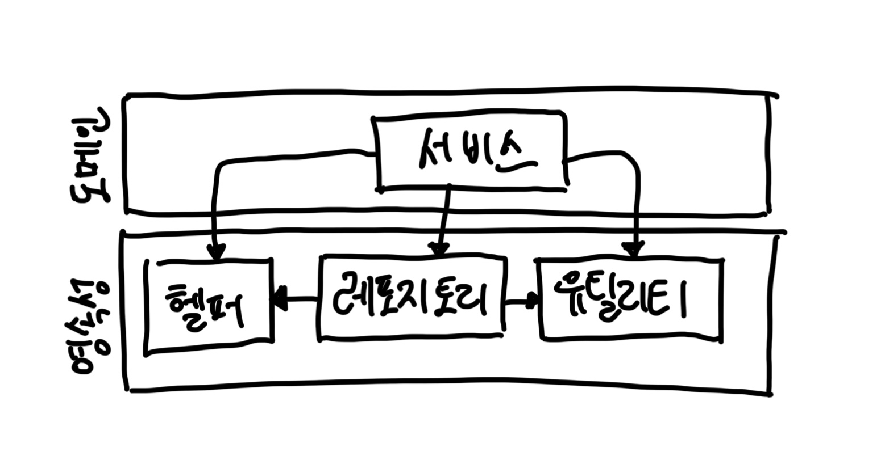
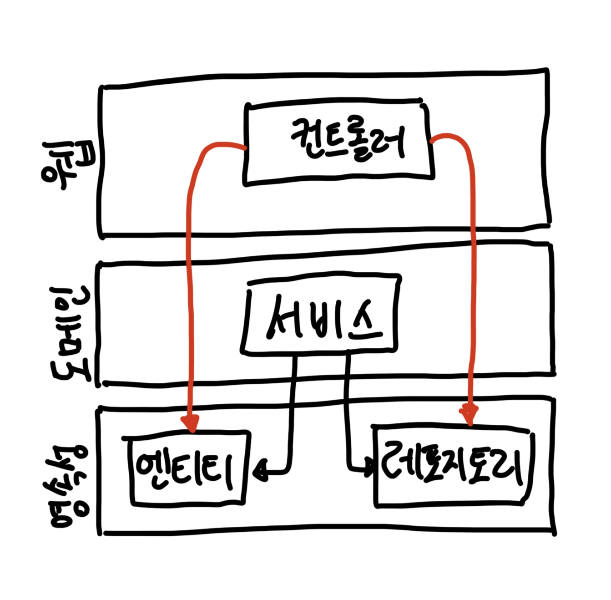

# Chapter 01. 계층형 아키텍처의 문제는 무엇일까?

- 계층을 사용해 애플리케이션을 개발하는 방식. 보통 아래와 같은 구조다.

- 최상단의 `웹` 계층은 요청을 받아 `도메인` 혹은 비즈니스 계층에 있는 서비스로 요청을 보낸다.
- 서비스에서는 필요한 비즈니스 로직을 수행하고 도메인 엔티티의 현재 상태를 조회하거나 변경하기 위해 `영속성` 계층의 컴포넌트를 호출한다.
- 계층형 아키텍처는 경고한 패턴이다.
  - 계층을 잘 이해하고 구성한다면 웹 계층이나 영속성 계층에 독립적으로 도메인 로직을 작성할 수 있다.
  - 원한다면 도메인 로직에 영향을 주지 않고 웹 계층과 영속성 계층에 사용된 기술을 변경할 수 있다.
- 잘 만들어진 계층형 아키텍처는 선택의 폭을 넓히고, 변화하는 요구사항과 외부 요인에 빠르게 적응할 수 있게 해준다.
  - 엉클 밥(로버트 C. 마틴)에 의하면 이것이 바로 아키텍처의 전부다. (클린 아키텍처 15장)
- 문제도 있다.
  - 코드에 나쁜 습관들이 스며들기 쉽게 만들고 시간이 지날수록 소프트웨어를 점점 더 변경하기 어렵게 만드는 수많은 허점들을 노출한다.

## 계층형 아키텍처는 데이터베이스 주도 설계를 유도한다.

- 전통적인 계층형 아키텍처의 토대는 데이터베이스다.
  - 웹 계층은 도메인 계층에 의존. 도메인 계층은 영속성 계층에 의존 => 자연스레 데이터베이스에 의존
- 보통 우리는 `상태 state`가 아니라 `행동 behavior` 중심으로 모델링한다.
  - 상태가 중요한 요소긴 하지만 행동이 상태를 바꾸는 주체이기 때문에 행동이 비즈니스를 이끌어간다.
  - 그런데 왜 '도메인 로직'이 아닌 '데이터베이스'를 토대로 아키텍처를 만드는 걸까?
  - 테이블은 상태를 저장하는 것이고, 도메인 로직은 행동을 정의하는 것임. (책 '오브젝트' 참고)
- 전통적인 계층형 아키텍처에서는 데이터베이스의 구조를 먼저 생각하고 이를 토대로 도메인 로직을 구현하는 것이 꽤나 합리적인 방법이다.
  - 의존성의 방향에 따라 자연스럽게 구현한 것이기 때문이다.
  - 하지만 비즈니스 관점에서는 전혀 맞지 않는 방법이다. `도메인 로직`을 무엇보다도 먼저 만들어야 한다.
  - 그래야만 우리가 로직을 제대로 이해했는지 확인할 수 있다. 로직이 맞다는 것을 확인한 후에 이를 기반으로 영속성 계층과 웹 계층을 만들어야 한다.

> - 내 개인적인 경험에 의하면 테이블을 먼저 설계하는 것은 `상태`에 `행동`을 가두게 만든다.
> - 한 번 테이블을 만들어놓으면 바꾸는 것이 귀찮은 작업이기 때문에 테이블을 바꾸지 않는 선에서 구현 방식을 바꾸는 것을 채택하게 될 수도 있다.
> - 따라서 도메인 로직을 먼저 만드는 것이 구현의 자유도가 더 높고 바람직한 설계가 만들어질 확률이 더 높다. 

- 데이터베이스 중심적인 아키텍처가 만들어지는 가장 큰 원인은 ORM 프레임워크를 사용하기 때문이다.
  - 계층형 아키텍처와 결합하면 비즈니스 규칙을 영속성 관점과 섞고 싶은 유혹을 쉽게 받는다.

- 이렇게 되면 영속성 계층과 도메인 계층 사이에 강한 결합이 생긴다.
  - 서비스는 영속성 모델을 비즈니스 모델처럼 사용하게 되고 이로 인해 도메인 로직뿐만 아니라 즉시로딩/지연로딩, 데이터베이스 트랜잭션, 캐시플러시 등등 영속성 계층과 관련된 작업들을 해야만 한다.

## 지름길을 택하기 쉬워진다.

- 개발 팀 내에서 합의한 다른 규칙들이 있을 수 있고, 그중 일부는 개발 도구를 이요해 강제화했을지도 모르지만.
- 계층형 아키텍처 자체는 위 규칙 외의 다른 규칙을 강제하지 않는다.
- 만약 상위 계층에 위치한 컴포넌트에 접근해야 한다면 간단하게 컴포넌트를 계층 아래로 내려버리면 된다.
  - 접근 가능해지고 깔끔하게 문제가 해결된다.
  - 딱 한 번만 이렇게 하는 것은 괜찮지만.. 과거에도 똑같은 전력이 있다면 재차 그렇게 하는 것에 대한 심리적 부담감은 훨씬 낮아진다. (`깨진 창문 이론`)

- 영속성 계층은 수년에 걸친 개발과 유지부수로 결국 위와 같이 될 확률이 높다.
- 영속성 계층은 컴포넌트를 아래 계층으로 내릴수록 비대해진다.
  - 어떤 계층에도 속하지 않는 것처럼 보이는 헬퍼 컴포넌트나 유틸리티 컴포넌들이 이처럼 아래 계층으로 내릴 가능성이 큰 후보다.
- '지름길 모드'를 끄고 싶다면, 계층형 아키텍처는 피하자.
  - 여기서 강제한다는 것은 해당 규칙이 깨졌을 때 빌드가 실패하도록 만드는 규칙이다.

## 테스트하기 어려워진다.

- 계층형 아키텍처에서는 아래와 같이 계층을 건너뛰게 될 수도 있다.

- 두 가지 문제점
1. 필드를 조작하는 것에 불과하더라도 도메인 로직을 웹 계층에 구현하게 된다.
    - 유스케이스가 확장되면 더 많은 도메인 로직이 웹 계층에 추가되어 애플리케이션 전반에 걸쳐 책임이 섞이고 핵심 도메인 로직이 퍼져나갈 확률이 높다.
2. 웹 계층 테스트에서 도메인 계층뿐만 아니라 영속성 계층도 모킹해야 한다.
    - 단위 테스트의 복잡도가 올라간다.
    - 테스트 설정이 복잡해지는 것은 테스트를 전혀 작성하지 않는 방향으로 가는 첫걸음이다.

## 유스케이스를 숨긴다.

- 기능을 추가하거나 변경할 적절한 위치를 찾는 일이 빈번하기 때문에 아키텍처는 코드를 빠르게 탐색하는 데 도움이 돼야 한다.
  - 이런 관점에서 계층형 아키텍처는 어떻게 우리의 발목을 잡는가?
- 계층형 아키텍처에서는 `도메인 계층 생략`, `컴포넌트를 영속성 계층으로 내림` 등의 이유로 도메인 로직이 여러 계층에 걸쳐 흩어지기 쉽다.
- 또한 여러 개의 유스케이스를 담당하는 아주 넓은 서비스가 만들어지기도 한다.
- 넓은 서비스는 영속성 계층에 많은 의존성. 다시 웹 레이어의 많은 컴포넌트가 이 서비스에 의존.
  - 테스트하기 어렵고, 유스케이스를 책임지는 서비스 찾기도 어려워짐.
  - 고도로 특화된 좁은 도메인 서비스가 유스케이스를 하나씩만 담당하는 것이 해결 방법이 될 수 있다. (ex. RegisterUserService)

## 동시 작업이 어려워진다.

> 지연되는 소프트웨어 프로젝트에 인력을 더하는 것은 개발을 늦출 뿐이다.
> - <맨먼스 미신: 소프트웨어 공학에 관한 에세이>, 프레더릭 P. 브룩스

- 계층형 아키텍처는 동시 작업에 그다지 도움이 되지 않는다.
- 새로운 유스케이스 추가
  - 모든 것이 영속성 계층 위에 만들어지기 때문에 영속성 계층이 먼저 개발되어야 하고, 그다음 도메인 계층, 웹 계층을 개발해야 한다.
  - 물론 인터페이스들로 작업하면 나눠서 개발할 수 있다고 얘기할 수도 있지만, 이것도 데이터베이스 주도 설계를 하지 않는 경우에만 가능한 이야기다.
  - 영속성 로직이 도메인 로직과 너무 뒤섞여서 각 측면을 개별적으로 작업할 수 없기 때문이다.
- 넒은 서비스는 또한 동시 작업을 더더욱 어렵게 만든다.

## 유지보수 가능한 소프트웨어를 만드는 데 어떻게 도움이 될까?

- 계층형 아키텍처에 몇 가지 추가적인 규칙 적용하여 유지보수성을 높일 수 있다.
- 하지만 잘못된 방향으로 흘러갈 가능성이 농후하므로. 이를 염두에 두고 애플리케이션을 만들면 유지보수하기 더 쉬운 솔루션을 만드는 데 도움이 될 것이다.

 

# 참고자료

- 만들면서 배우는 클린 아키텍처, 톰 홈버그 지음
