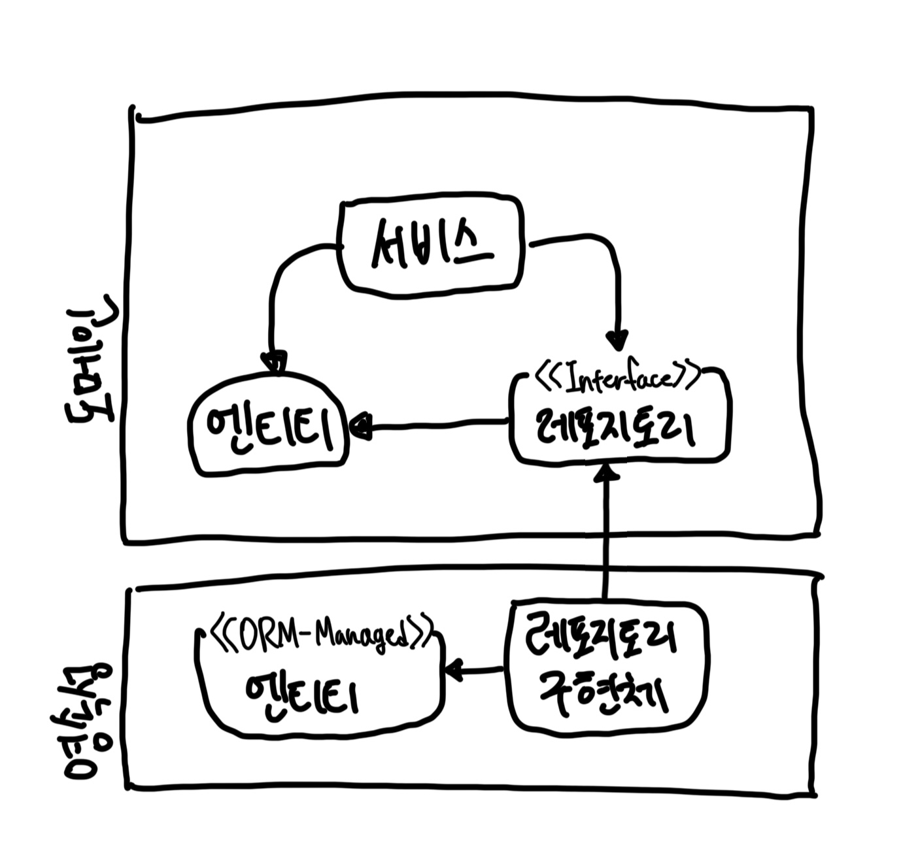
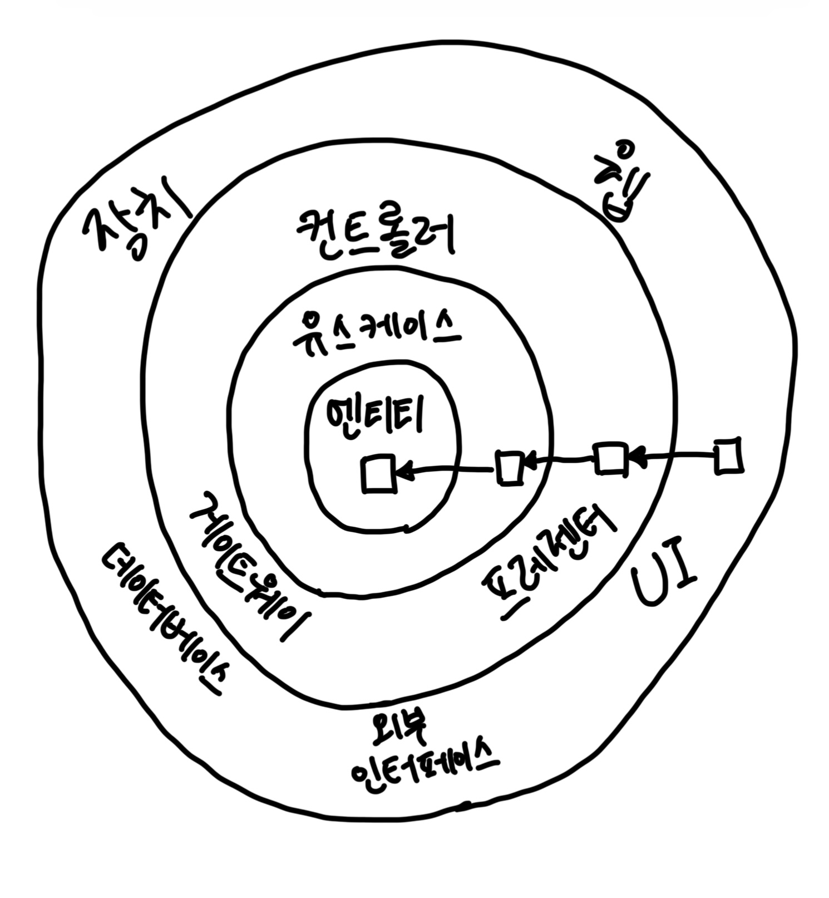
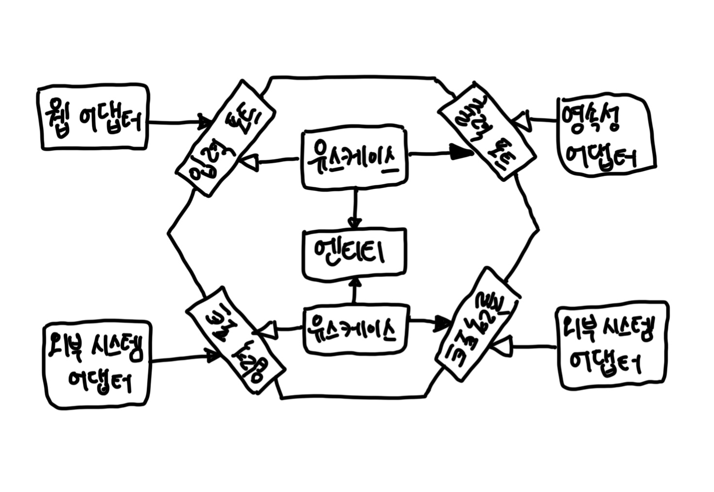

# Chapter 02. 의존성 역전하기

- SRP와 DIP 원칙

## 단일 책임 원칙

- 이 원칙의 일반적인 해석: `하나의 컴포넌트는 오로지 한 가지 일만 해야 하고, 그것을 올바르게 수행해야 한다.`
- '오로지 한 가지 일만 하는 것'. 단일 책임이라는 말을 가장 직관적으로 해석. 하지만 오해의 여지가 있다. 실제 정의는 아래와 같다.
- `컴포넌트를 변경하는 이유는 오직 하나뿐이어야 한다.`
- '책임'은 사실 '오로지 한 가지 일만 하는 것'보다는 '변경할 이유'로 해석해야 한다. 
  - `단일 변경 이유 원칙 Single Reason Change Principle`이 오히려 맞는 말일 수도..?
  - 어떤 다른 이유로 소프트웨어를 변경하더라도 이 컴포넌트에 대해 신경 쓸 필요가 없다.
- 하지만 의존성을 통해 컴포넌트의 변경은 너무나도 쉽게 전파되어 버린다.

## 부수효과에 관한 이야기

- 부수효과가 심한 소프트웨어가 있었음.
- 클라이언트는 이전 개발팀에서 특정 컴포넌트를 변경했을 때 부수효과가 나타나 이를 우려해 이상한 요구사항을 제안.
- 부수효과는 클라이언트로 하여금 잘못 구조화된 소트프웨어를 변경하는 데 더 많은 비용을 지불하도록 만든다.

## 의존성 역전 원칙

- 계층형 아키텍처에서 의존성 방향은 하방.
  - 단일 책임 원칙을 고수준에서 적용할 때 상위 계층들이 하위 계층들에 비해 변경할 이유가 더 많다는 것을 알 수 있다.
  - 영속성이 바뀌면 도메인이 바뀌어야 한다.
- 의존성 역전 원칙을 사용하면 이 의존성을 제거할 수 있다.
  - `코드 상의 어떤 의존성이든 그 방향을 바꿀 수 있다.`
- 영속성 계층의 레포지토리가 도메인 계층에 있는 엔티티에 의존성하기 때문에 두 계층 사이에 `순환 의존성 circular dependency`가 생긴다.
  - 이 부분이 바로 DIP를 적용하는 부분이다.

## 클린 아키텍처

- 로버트 C. 마틴 '클린 아키텍처'
  - 클린 아키텍처는 설계가 비즈니스 규칙의 테스트를 용이하게 한다.
  - 비즈니스 규칙은 프레임워크, 데이터베이스, UI 기술, 그 밖의 외부 애플리케이션이나 인터페이스로부터 독립적일 수 있다.
- 아래는 클린 아키텍처의 형태를 추상적으로 보여주는 그림.

- 아키텍처 코어에는 주변 유스케이스에서 접근하는 도메인 엔티티들이 있다.
- 유스케이스는 서비스. 단일 책임을 갖기 위해 세분화. (넓은 서비스 기피)
- 코어 주변부. 비즈니스 규칙을 지원하는 애플리케이션의 다른 모든 컴포넌트들. 영속성, UI를 제공하는 것 등을 의미
- 또한 바깥쪽 계층들은 다른 서드파티 컴포넌트에 어댑터를 제공할 수 있다.

---

- 도메인 코드에서는 어떤 의존성도 없기 때문에 비즈니스 규칙에만 집중할 수 있다.
  - 도메인을 자유롭게 모델링.
  - DDD를 가장 순수한 형태로 적용해볼 수 있음.
  - 영속성이나 UI에 특화된 문제를 신경 쓰지 않아도 되기 때문에 수월
- 하지만 대가가 따른다.
  - 외부 계층과 철저하게 분리돼야 하므로 애플리케이션의 엔티티에 대한 모델을 각 계층에서 유지보수해야 한다.
  - ex) 영속성 계층에서 ORM 사용할 때. 도메인 계층에서 사용한 에티티 클래스를 영속성 계층에서 함께 사용할 수 없고 두 계층에서 각각 엔티티를 만들어야 한다. (두 엔티티를 서로 변환해야 한다는 의미)
  - 하지만 바람직한 일이다.

## 육각형 아키텍처 (헥사고날 아키텍처)

- 알리스테어 콕번이 만든 용어.

- 육각형 안에는 도메인 엔티티와 이와 상호작용하는 유스케이스가 있다.
  - 외부로 향하는 의존성이 없기 때문에 엉클 밥이 클린 아키텍처에서 제시한 의존성 규칙이 그대로 적용된다는 점을 주목
  - 대신 모든 의존성은 `코어`를 향한다.
- 육각형 바깥에는 애플리케이션과 상호작용하는 다양한 어댑터들이 있다.
- 코어와 어댑터 간의 통신이 가능하려면 애플리케이션 코어가 각각의 포트를 제공해야 한다.
  - `입력 포트 input port`와 연결된 어댑터들은 애플리케이션을 `주도하는 어댑터 driving adapter`
  - `출력 포트 output port`와 연결된 어댑터들은 애플리케이션에 의해 `주도되는 어댑터 driven adapter`들이다.
- 이런 핵심 개념으로 인해 `포트와 어댑터 ports-and-adapter` 아키텍처로도 알려져 있다.

 

# 참고자료

- 만들면서 배우는 클린 아키텍처, 톰 홈버그 지음
