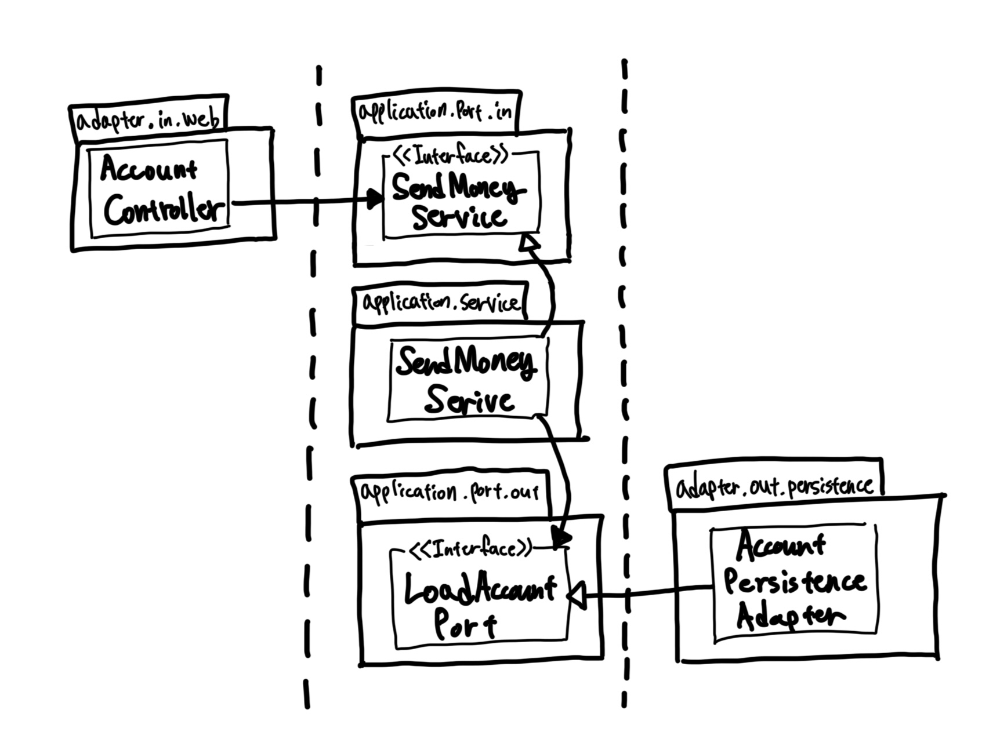

# Chpater 03. 코드 구성하기

- 코드를 보는 것만으로도 어떤 아키텍처인지 파악할 수 있다면 좋지 않을까?

## 계층으로 구성하기

- 코드를 구조화하는 방법으로 계층형 아키텍처 채택?

```shell
buckpal
├── domain
│   ├── Account
│   ├── Activity
│   ├── AccountRepository
│   └── AccountService
├── persistence
│   └── AccountRepositoryImpl
└── web
    └── AccountController
```

- 디렉토리에 따른 계층
  - `web`: 웹 계층
  - `domain`: 도메인 계층
  - `persistence`: 영속성 계층
- `AccountRepository`를 `domain`에 추가하고 `persistence` 패키지에서 `AccountRepositoryImpl`을 둠으로써 의존성을 역전
- 적어도 세 가지 이유로 이 패키지 구조는 최적의 구조가 아니다.
1. 애플리케이션 `기능 조각 functional slice`이나 `특성 feature`을 구분 짓는 패키지 경계가 없다.
    - 이 구조에서 `User`와 연관된 기능을 추가하게 된다면?
    - `web`에는 `UserController`가, `domain` 패키지에는 `UserService`, `UserRepository`, `User`를 추가하고, `persistence` 패키지에는 `UserRepositoryImpl`을 추가하게 될 것이다.
    - 예상치 못한 부수효과를 일으킬 수 있는 클래스들의 엉망진창 묶음으로 변모할 가능성이 크다.
2. 애플리케이션이 어떤 유스케이스들을 제공하는지 파악할 수 없다.
    - `AccountService`와 `AccountController`가 어떤 유스케이스를 구현했는지 파악할 수 있겠는가?
    - 특정 기능을 찾기 위해 어떤 서비스가 이를 구현했는지 추측해야 하는 불편함. 그 안에 들어가서 메소드도 확인해봐야 한다.
3. 패키지 구조를 통해서는 우리가 목표로 하는 아키텍처를 파악할 수 없다.
    - 육각형 아키텍처 스타일을 따랐다고 추측을 해볼 수 있지만, 도메인, 유스케이스와 어댑터의 흐름을 한 눈에 볼 수 없다.
    - 또한 인커밍 포트와 아웃고일 포트가 코드 속에 숨겨져 있다. 

## 기능으로 구성하기

```shell
buckpal
└── account
    ├── Account
    ├── AccountController
    ├── AccountRepository
    ├── AccountRepositoryImpl
    └── SendMoneyService
```

- 각 기능을 묶은 새로운 그룹은 account와 같은 레벨의 새로운 패키지로 들어가고, 패키지 외부에서 접근되면 안 되는 클래스들에 대해 `package-private` 접근 수준을 이용해 패키지 간의 경계를 강화할 수 있다.
  - 불필요한 의존성 방지
- `AccountService`의 책임을 좁히기 위해 `SendMoneyService`로 클래스 명을 바꿨다.
  - 이제 '송금하기' 유스케이스를 구현한 코드는 클래스명만으로도 찾을 수 있게 된다.
  - 애플리케이션의 기능을 코드를 통해 볼 수 있게 만드는 것 = 로버트 마틴의 `소리치는 아키텍처 screming architecture`
- 그러나 기능에 의한 패키징 방식은 계층에 의한 패키징 방식보다 아키텍처의 **가시성을 훨씬 더 떨어뜨린다.**
  - `SendMoneyService`가 `AccountRepository` 인터페이스만 알고 있고 구현체는 알 수 없도록 했음에도 불구하고, `private-package` 접근 수준을 이용해 도메인 코드가 실수로 영속성 코드에 의존하는 것을 막을 수 없다.

## 아키텍처적으로 표현력 있는 패키지 구조

- 육각형 아키텍처에서 구조적으로 핵심적인 요소
  - 엔티티
  - 유스케이스
  - 인커밍/아웃고잉 포트
  - 인커밍/아웃고잉 어댑터

```shell
buckpal
└── account
    ├── adapter
    │   ├── in
    │   │   └── web
    │   │       └── AccountController
    │   └── out
    │       └── persistence
    │           ├── AccountPersistenceAdapter
    │           └── SpringDataAccountRepository
    ├── domain
    │   ├── Account
    │   └── Activity
    └── application
        ├── SendMoneyService
        └── port
            ├── in
            │   └── SendMoneyUseCase
            └── out
                ├── LoadAccountPort
                └── UpdateAccountStatePort
```

- 구조와 각 요소들은 패키지 하나씩에 직접 매핑된다.
  - 도메인 모델이 속한 `domain` 패키지. 
  - 도메인 모델을 둘러싼 서비스 계층 `application` 패키지.
  - 외부 의존성 `adapter` 패키지
- `SendMoneyService`는 인커밍 포트 인터페이스인 `SendMoneyUseCase`를 구현하고, 아웃고잉 포트 인터페이스이자 영속성 어댑터에 의해 구현된 `LoadAccountPort`와 `UpdateAccountStatePort`를 사용한다.
- 이 패키지 구조는 이른바 `아키텍처-코드 갭 architecture-code gap` 혹은 `모델-코드 갭 model-code gap`을 효과적으로 다룰 수 있는 강력한 요소다.
  - 만약 패키지 구조가 아키텍처를 반영할 수 없다면 시간이 지남에 따라 코드는 점점 목표하던 아키텍처로부터 멀어지게 될 것이다.
- 이처럼 표현력 있는 패키지 구조는 아키텍처에 대한 적극적인 사고를 촉진한다.
  - 많은 패키지 생성됨. 현재 작업 중인 코드를 어떤 패키지에 넣어야 할지 계속 생각해야 하기 때문.
- 어댑터 패키지에 대해서는 포트 인터페이스를 통하지 않고는 바깥에서 호출되지 않기 때문에 `package-private` 접근 수준으로 둬도 된다.
  - 따라서 애플리케이션 계층에서 어댑터 클래스로 향하는 우발적인 의존성은 있을 수 없다.
  - 어댑터 코드를 자체 패키지로 이동시키면 필요한 경우 하나의 어댑터를 다른 구현으로 쉽게 교체할 수 있다는 장점도 있다. (ex. key-value DB를 SQL RDB로 교체)
- DDD 개념에 직접적으로 대응시킬 수 있다는 점.
  - `domain` 패키지 내에서는 DDD가 제공하는 모든 도구를 이용해 우리가 원하는 어떤 도메인 모델이든 만들 수 있다.

## 의존성 주입의 역할

- 예제의 영속성 어댑터와 같이 아웃고잉 어댑터에 대해서는 제어 흐름을 반대 방향으로 의존성을 돌리기 위해 의존성 역전 원칙을 사용해야 한다.
  - 애플리케이션 계층에 어댑터에 의존성을 추가하는 것을 방지할 수 있다.



- `AccountController`는 `SendMoneyUseCase` 인터페이스가 필요하기 때문에 의존선 주입을 통해 `SendMoneyService` 클래스의 인스턴스를 전달받는다.
  - `AccountController`는 인터페이스만 알면 되기 때문데 `SendMoneyService` 인스턴스를 가지고 있는지도 모른다.
- `SendMoneyService` 또한 `LoadAccountPort` 인터페이스로 가장한 `AccountPersistenceAdapter` 클래스의 인스턴스를 주입할 것이다.

<br/>

# 참고자료

- 만들면서 배우는 클린 아키텍처, 톰 홈버그 지음
