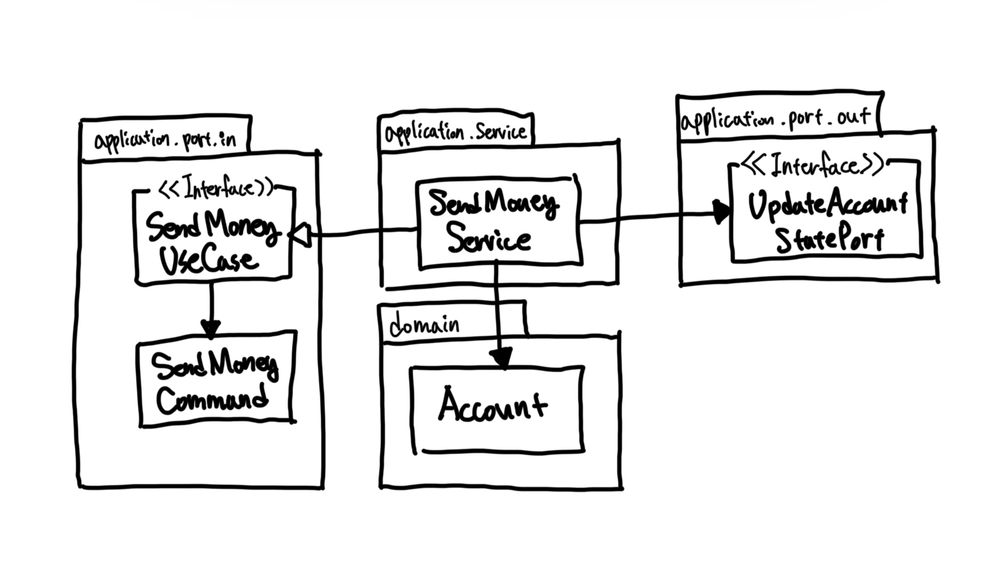

# Chapter04. 유스케이스 구현하기

- 각 계층이 느슨하게 결합돼 있기 때문에 필요한 대로 도메인 코드를 자유롭게 모델링할 수 있다.
  - DDD
  - 풍부하거나 빈약한 도메인 모델
  - 아니면 우리만의 방식

## 도메인 모델 구현

- 한 계좌에서 다른 계좌로 송금하는 유스케이스 구현.
- 입금과 출금을 할 수 있는 `Account`
- 임급과 출금 내역 `Activity`
- 입금과 출금 내역을 저장하는 창구 `ActivityWindow`

```java
package org.mobilohas.bell.account.domain;

import java.time.LocalDateTime;
import lombok.Value;

public class Account {

  private AccountId id;
  private Money baselineBalance;
  private ActivityWindow activityWindow;

  public Money calculateBalance() {
    return Money.add(
        this.baselineBalance,
        this.activityWindow.calculateBalance(this.id));
  }

  public boolean withdraw(Money money, AccountId targetAccountId) {
    if (!mayWithdraw(money)) {
      return false;
    }

    Activity withdrawal = new Activity(
        this.id,
        this.id,
        targetAccountId,
        LocalDateTime.now(),
        money);
    this.activityWindow.addActivity(withdrawal);
    return true;
  }

  private boolean mayWithdraw(final Money money) {
    return Money.add(
        this.calculateBalance(),
        money.negate())
        .isPositive();
  }

  public boolean deposit(Money money, AccountId sourceAccountId) {
    Activity deposit = new Activity(
        this.id,
        sourceAccountId,
        this.id,
        LocalDateTime.now(),
        money);
    this.activityWindow.addActivity(deposit);
    return true;
  }

  @Value
  public static class AccountId {
    private Long value;
  }
}
```

- 여기서 `Account` 엔티티
  - 모든 활동 내역을 다 가지고 있는 것은 비효율적
  - 포착한 지난 며칠 혹은 몇 주간의 범위에 해당하는 활동만 보유
  - 첫 활동 전의 잔고를 표현하는 `baselineBalance` 속성을 가지고 있다.
  - 입금과 출금은 각각 `withdraw()`와 `deposit()` 메소드를 사용한다.

## 유스케이스 둘러보기

- 일반적으로 유스케이스는 다음과 같은 단계를 따른다.
1. 입력을 받는다.
2. 비즈니스 규칙을 검증한다.
3. 모델 상태를 조작한다.
4. 출력을 반환한다.

- 유스케이스는 인커밍 어댑터로부터 입력을 받는다.
  - 이 단계에서는 '입력 유효성 검증'은 처리하지 않는다. 유스케이스 코드는 오로지 도메인 로직에만 신경써야 한다.
  - 그러나 `비즈니스 규칙 business rule`을 검증할 책임이 있다.
  - 비즈니스 규칙만 충족된다면 입력을 기반으로 모델의 상태를 변경한다. 일반적으로 도메인 객체의 상태를 바꾸고 영속성 어댑터를 통해 구현된 포트로 이 상태를 전달해서 저장.
  - 유스케이스는 또 다른 아웃고잉 어댑터를 호출할 수도 있다.
- 마지막 단계는 아웃고잉 어댑터에서 온 출력값을, 유스케이스를 호출한 어댑터로 반환할 출력 객체로 변환하는 것이다.



- 하나의 서비스가 하나의 유스케이스를 구현하고, 도메인 모델을 변경하고, 변경된 상태를 저장하기 위해 아웃고잉 포트를 호출한다.

## 입력 유효성 검증

- 호출하는 어댑터가 유스케이스에 입력을 전달하기 전에 입력 유효성을 검증하면 어떨까?
  - 유스케이스는 하나 이상의 어댑터에서 호출될 텐데, 그러면 유효성 검증을 각 어댑터에서 전부 구현해야 한다.
  - 코드 중복이 생기고, 그 과정에서 실수할 수도 있고 유효성 검증을 깜빡할 수도 있다.
- `입력 모델 input model`이 이 문제를 다루도록 해보자.
  - `SendMoneyCommand`

```java
public class SendMoneyCommand extends SelfValidating<SendMoneyCommand> {

  @NonNull
  private final AccountId sourceAccountId;
  @NonNull
  private final AccountId targetAccountId;
  @NonNull
  private final Money money;

  public SendMoneyCommand(final AccountId sourceAccountId, final AccountId targetAccountId,
      final Money money) {
    this.sourceAccountId = sourceAccountId;
    this.targetAccountId = targetAccountId;
    this.money = money;
    this.validateSelf();
  }
}
```

```java
public abstract class SelfValidating<T> {

  private Validator validator;

  public SelfValidating() {
    ValidatorFactory factory = Validation.buildDefaultValidatorFactory();
    validator = factory.getValidator();
  }
  
  protected void validateSelf() {
    Set<ConstraintViolation<T>> violations = validator.validate((T) this);
    if (!violations.isEmpty()) {
      throw new ConstraintViolationException(violations);
    }
  }
}
```

- 입력 모델에 있는 유효성 검증 코드를 통해 유스케이스 구현체 주위에 사실상 `오류 방지 계층anti corrunption layer`을 만들었다.

## 생성자의 힘

- `SendMoneyCommand`는 생성자에 많은 책임을 지우고 있다.
  - 각 속성의 파라미터 대입.
  - 파라미터 유효성 검증.
- 파라미터가 3개보다 더 많다면 빌더 패턴을 사용할 수도 있을 것이다.
  - 하지만 빌더는 컴파일 타임 에러를 알려주지 못한다. (런타임에서 빌더를 호출하고 나서야 유효성 검증에서 에러를 발생시킬 것이다.)
- 컴파일러가 우리를 이끌도록 생성자 사용을 권유

## 유스케이스마다 다른 입력 모델

- 입력 객체를 같이 사용한다고 가정해보자.
  - 어떤 상황에서는 특정 필드를 사용하지 않거나 채워넣지 못하는 경우도 있을 것이다.
  - 불변 커맨드 객의 필드에 대해서 null을 유효한 상태로 받아들이는 것은 그 자체로 code smell이다.
- 등록 유스케이스와 업데이트 유스케이스는 서로 다른 유효성 검증 로직이 필요하다.
  - 비즈니스 코드를 입력 유효성 검증과 관련된 관심사로 오염시키는 결과를 낳을 수 있다.
- 각 유스케이스 전용 입력 모델은 유스케이스를 훨씬 명확하게 만들고 다른 유스케이스와의 결합도 제거해서 불필요한 부수효과가 발생하지 않게 한다.

## 비즈니스 규칙 검증하기

- 입력 유효성 검증은 유스케이스 로직의 일부가 아니지만, 비즈니스 규칙 검증은 분명히 유스케이스 로직의 일부다.
- 둘 사이의 실용적인 구분점
  - 비즈니스 규칙을 검증하는 것은 도메인 모델의 현재 상태에 접근해야 한다. (비즈니스 맥락이 필요.) (`의미적인 semantical`)
  - 반면 입력 유효성을 검증하는 일은 그럴 필요가 없다. (`@NotNull`을 붙인 것처럼 선언적으로 구현 가능.) (`구문상의 syntactical`)
- 예시
  - "출금 계좌는 초과 출금되어서는 안 된다." => 출금 계좌와 입금 계좌가 존재하는지 확인하기 위해 모델에 접근 필요 => 비즈니스 규칙
  - "송금되는 금액은 0보다 커야 한다." => 모델에 접근하지 않고도 검증 가능. => 입력 유효성 검증
- 비즈니스 규칙 검증은 도메인 엔티티 안에 넣는 것이 가장 좋다.
  - 위치 정하는 것도 쉽고, 추론하기도 쉽다.

```java
public class Account {
  
  // ...

  public boolean withdraw(Money money, AccountId targetAccountId) {
    if (!mayWithdraw(money)) {
      return false;
    }
    // ...
  }
}
```

- 만약 도메인 엔티티에서 비즈니스 규칙을 검증하기가 여의치 않다면 유스케이스 코드에서 도메인 엔티티를 사용하기 전에 해도 된다.

```java
public class SendMoneyService implements SendMoneyUseCase {
  
  // ...
  
  @Override
  public boolean snedMoney(SendMoneyCommand command) {
    requireAccountExists(command.getSourceAccountId());
    requireAccountExists(command.getTargetAccountId());
  }
}
```

## 풍부한 도메인 모델 vs 빈약한 도메인 모델

#### DDD를 따르는 `풍부한 도메인 모델 rich domain model`
- 엔티티들은 상태를 변경하는 메소드 제공, 비즈니스 규칙에 맞는 유효한 변경만 허용.
- 유스케이스는 도메인 모델의 진입점으로 동작. 도메인 엔티티 메소드를 호출해 비즈니스 로직 수행

#### `빈약한 도메인 모델 anemic domain model` => 풍부한 유스케이스.

- 엔티티 자체가 굉장히 얇다.
- 엔티티의 상태를 표현하는 필드와 이 값을 읽고 바꾸기 위한 `getter`, `setter` 메소드만 포함.
- 어떠한 도메인 로직도 가지고 있지 않다. => 유스케이스에 모든 도메인 로직이 들어있다는 뜻.

## 유스케이스마다 다른 출력 모델

- 유스케이스가 할 일을 다하고 나면 호출자에게 무엇을 반환해야 할까?
  - 출력도 가능한 한 구체적일수록 좋다. 호출자에게 꼭 필요한 데이터만 들고 있어야 한다.
  - 의심스럽다면 **가능한 한 적게 반환하자.**
- 유스케이스 간에 같은 출력 모델을 공유하게 되면 유스케이스들도 강하게 결합된다.
  - 한 유스케이스의 출력 모델이 변경되면 다른 유스케이스도 영향을 받는다.
  - 단일 책임 원칙을 적용하고 모델을 분리해서 유지하는 것은 유스케이스의 결합을 제거하는 데 도움이 된다.

## 읽기 전용 유스케이스는 어떨까?

- 이 책의 아키텍처 스타일에서 이를 구현하는 한 가지 방법은 쿼리를 위한 인커밍 전용 포트를 만들고 이를 `쿼리 서비스 query service`에 구현하는 것이다.

```java
@RequiredArgsConstructor
public class GetAccountBalanceService implements GetAccountBalanceQuery {

  private final LoadAccountPort loadAccountPort;

  @Override
  public Money getAccountBalance(final AccountId accountId) {
    return loadAccountPort.loadAccount(accountId, LocalDateTime.now())
        .calculateBalance();
  }
}
```

- 쿼리 서비스는 유스케이스 서비스와 동일한 방식으로 동작한다.
  - `GetAccountBalanceQuery`라는 인커밍 포트
  - `LoadAccountPort`라는 아웃고잉 포트 호출
- 이런 방식은 `Command-Query Separation, CQS`나 `Command-Query Responsibility Segregation, CQRS` 같은 개념과 잘 맞는다.

<br/>

# 참고자료

- 만들면서 배우는 클린 아키텍처, 톰 홈버그 지음
