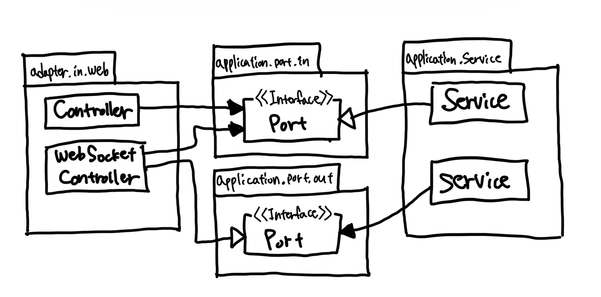

# Chapter05. 웹 어뎁터 구현하기

- 우리가 목표로 하는 아키텍처에서 외부 세계와의 모든 커뮤니케이션은 어댑터를 통해 이뤄진다.

## 의존성 역전

- 웹 어댑터는 '주도하는' 혹은 '인커밍' 어댑터다.
  - 외부로부터 요청을 받아 애플리케이션 코어를 호출한다.
- 의존성 역전을 통해 간접 계층을 넣어야 하는 이유?
  - 애플리케이션 코어가 외부 세계와 통신할 수 있는 곳에 대한 명세가 포트이기 때문이다.
  - 포트를 적절한 곳에 위치시키면 외부와 어떤 통신이 일어나고 있는지 정확히 알 수 있고, 이는 레거시 코드를 다루는 유지보수 엔지니어에게 무척 소중한 정보다.
- 하지만 인커밍 포트를 생략하고 웹 어댑터가 바로 서비스를 참조하게 만들고 싶을 수 있다.



- 위와 같은 형태에서는 웹 어댑터가 인커밍 어댑터인 동시에 아웃고잉 어댑터가 된다.
  - 한 어댑터가 동시에 두 가지 역할을 하지 못할 이유는 없다.

## 웹 어댑터의 책임

1. HTTP 요청을 자바 객체로 매핑
2. 권한 검사
3. 입력 유효성 검증
4. 입력을 유스케이스의 입력 모델로 매핑
5. 유스케이스 호출
6. 유스케이스의 호출을 HTTP로 매핑
7. HTTP 응답을 반환

- 보통은 웹 어댑터가 인증과 권한 부여를 수행하고 실패할 경우 에러를 반환한다.
- 웹 어댑터의 입력 모델은 유스케이스의 입력 모델과는 구조나 의미가 완전히 다를 수 있으므로 또 다른 유효성 검증을 수행해야 한다.
  - 웹 어댑터의 입력 모델을 유스케이스의 입력 모델로 변환할 수 있다는 것을 검증해야 한다.
- 애플리케이션은 웹 어댑터의 책임인 HTTP와 관련된 것을 알아서는 안 된다.
  - 애플리케이션 코어가 HHTP를 알게 되면 HTTP를 사용하지 않는 또 다른 인커밍 어댑터의 요청에 대해 동일한 도메인 로직을 수행할 수 있는 선택지를 잃게 된다.
  - 좋은 아키텍처에서는 선택의 여지를 남겨둔다.
- 유스케이스를 먼저 구현하면 경계를 흐리게 만들 유혹에 빠지지 않을 수 있다. (각 계층 간의 경계)

## 컨트롤러 나누기

- 웹 어댑터는 한 개 이상의 클래스로 구성해도 된다.
- 하지만 클래스들이 같은 소속이라는 것을 표현하기 위해 같은 패키지 수준(hierarchy)에 놓아야 한다.
- 컨트롤러의 수는 너무 적은 것보다는 너무 많은 게 낫다.
  - 컨트롤러가 가능한 좁고 다른 컨트롤러와 가능한 한 적게 공유하는 웹 어댑터 조각을 구현해야 한다.
  - 단일 컨트롤러는 데이터 구조의 재활용을 촉진하기에 지양하는 것이 좋다. (안티 패턴이 안티 패턴을 낳는다.)

```java
@RestController
@RequiredArgsConstructor
public class SendMoneyController {

  private final SendMoneyUseCase sendMoneyUseCase;

  @PostMapping("/accounts/send/{sourceAccountId}/{targetAccountId}/{amount}")
  void sendMoney(
      @PathVariable Long sourceAccountId,
      @PathVariable Long targetAccountId,
      @PathVariable Long amount) {
    SendMoneyCommand command = new SendMoneyCommand(
        new AccountId(sourceAccountId),
        new AccountId(targetAccountId),
        Money.of(amount));
    sendMoneyUseCase.sendMoney(command);
  }
}
```

- 컨트롤러명과 서비스명에 대해서도 잘 생각해봐야 한다
  - `CreateAccount` < `RegisterAccount`
  - 계좌를 생성하는 유일한 방법은 사용자가 계좌를 등록하는 방법 뿐 => 그 의미를 드러내기 위해 `register`가 더 명확하다.
  - 그럼에도 `Create...`, `Update...`, `Delete...`만으로도 충분히 의미를 드러낼 수 있는 유스케이스도 있을 것이다.
- 이렇게 나누는 스타일을 사용하게 되면 충돌을 일으킬 확률도 훨씬 줄어들게 된다.

## 정리

- 웹 컨트롤러를 나눌 때는 모델을 공유하지 않는 여러 작은 클래스들을 만드는 것을 두려워해서는 안 된다.
- 작은 클래스들은 더 파악하기 쉽고, 더 테스트하기 쉬우며, 동시 작업을 지원한다.
- 세분화된 컨트롤러를 만드는 것은 처음에는 조금 더 공수가 들겠지만 유지보수하는 동안에는 분명히 빛을 발할 것이다.

<br/>

# 참고자료

- 만들면서 배우는 클린 아키텍처, 톰 홈버그 지음
