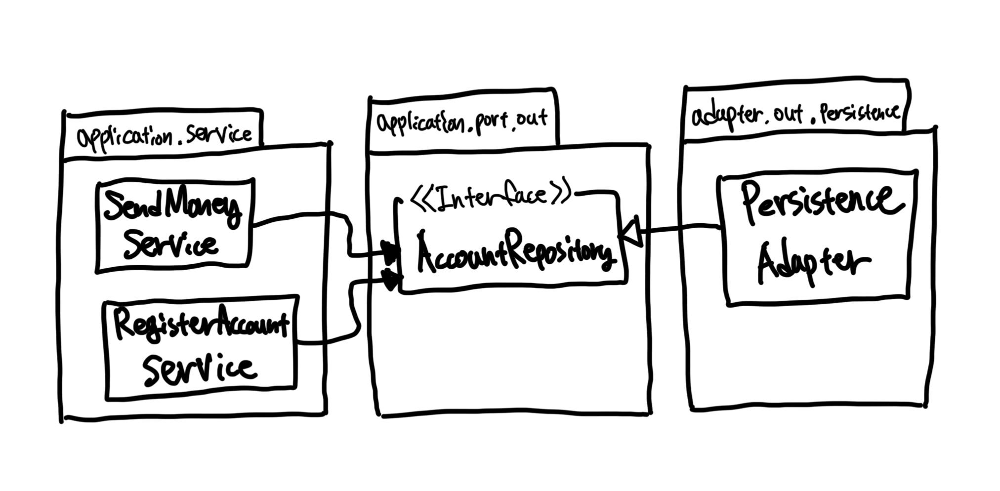
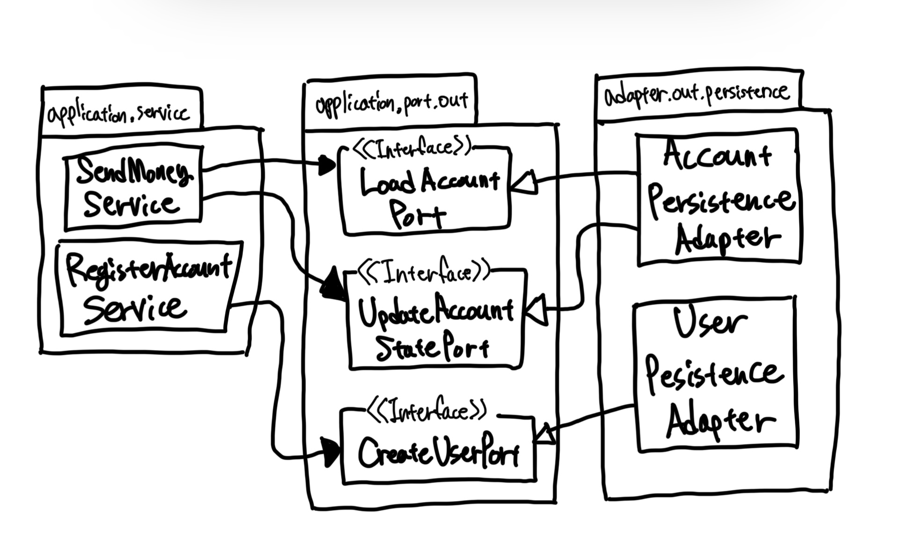

# Chapter06. 영속성 어뎁터 구현하기

- 의존성을 역전시키기 위해 영속성 계층을 애플리케이션 계층의 플러그인으로 만드는 방법을 살펴보자.

## 의존성 역전

- 애플리케이션에 영속성 기능을 제공하는 영속성 어댑터

- 애플리케이션은 영속성 기능을 사용하기 위해 포트 인터페이스를 호출한다.
  - 이 포트는 영속성 어댑터 클래스(데이터베이스와 통신할 책임을 가짐)에 의해 구현.
- 헥사고날 아키텍처에서 영속성 어댑터는 '주도되는' 혹은 '아웃고잉' 어댑터다.
  - 애플리케이션에 의해 호출될 뿐, 애플리케이션을 호출하지는 않기 때문
- 포트가 계약을 만족하는 한, 코어에 영향을 미치지 않으면서 영속성 코드를 마음껏 수정할 수 있다.

## 영속성 어댑터의 책임

1. 입력을 받는다.
2. 입력을 데이터베이스 포맷으로 매핑한다.
3. 입력을 데이터베이스로 보낸다.
4. 데이터베이스 출력을 애플리케이션 포맷으로 매핑한다.
5. 출력을 반환한다.

- 데이터베이스를 쿼리하거나 변경하는 데 사용할 수 있는 포맷으로 입력 모델을 매핑한다.
  - ex. JPA(Java Persistence API)의 `Entity` 객체
- 데이터베이스와 통신하기 위해 어떤 기술을 사용해도 상관없다.
  - 입력 모델을 평범한 SQL 구문에 매핑해서 데이터베이스에 보내도 되고,
  - 들어오는 데이터를 파일로 직렬화해서 그것으로부터 데이터를 읽어와도 됨.
- 핵심은 영속성 어댑터의 입력 모델이 영속성 어댑터 내부에 있는 것이 아니라 애플리케이션 코어에 있기 때문에 영속성 어댑터 내부를 변경하는 것이 코더에 영향을 미치지 않는다는 것이다.
- 데이터베이스 응답을 정의된 출력 모델로 매핑해서 반환한다.
  - 출력 모델은 영속성 어댑터가 아니라 애플리케이션 코어에 위치하는 것이 중요하다.

## 포트 인터페이스 나누기

### 1. 모든 데이터베이스 연산을 하나의 레포지토리 인터페이스에 넣기

- 가장 일반적인 방법
- 각 서비스는 인터페이스에서 단 하나의 메소드만 사용하더라도 하나의 '넓은' 포트 인터페이스에 의존성을 갖게 된다.
  - 코드에 불필요한 의존성이 생겼다는 뜻.

> "필요없는 화물을 운반하는 무언가에 의존하고 있으면 예상하지 못했던 문제가 생길 수 있다."
> - 로버트 C. 마틴

### 2. 인터페이스 분리 원칙을 적용

- `인터페이스 분리 원칙 Interface Segregation Principle, ISP`은 문제의 답을 제시한다.

- 불필요한 의존성을 제거하고 기존 의존성을 눈에 더 잘 띄게 만들 수 있다.
- 나아가 포트의 이름이 포트의 역할을 명확하게 잘 표현하고 있다.
  - 대부분의 경우 포트당 하나의 메소드
- 이렇게 매우 좁은 포트를 만드는 것은 코딩을 `플러그 앤드 플레이 plug-and-play` 경험으로 만든다.
  - 서비스 코드를 짤 대는 필요한 포트에 그저 '꽂기만'하면 된다.
  - 운반할 다른 화물이 없는 것이다.
- 물론 모든 상황에서 적용하지는 못한다.
  - 응집성이 높고 함께 사용될 때가 많기 때문에 하나의 인터페이스에 묶고 싶은 데이터베이스 연산들이 있을 수 있다.

## 영속성 어댑터 나누기

- 하나의 어그리거트당 하나의 영속성 어댑터를 만들어서 여러 개의 영속성 어댑터를 만들 수도 있다.

- 이렇게 하면 영속성 어댑터들은 각 영속성 기능을 이용하는 도메인 경계를 따라 자동으로 나눠진다.
- 영속성 어댑터를 훨씬 더 많은 클래스로 나눌 수도 있다.

## 데이터베이스 트랜잭션은 어떻게 해야 할까?

- 트랜잭션 경계는 어디에 위치시켜야 할까?
- 트랜잭션은 하나의 특정한 유스케이스에 대해서 일어나는 모든 쓰기 작업에 걸쳐 있어야 한다.
  - 그래야 원자성이 보장.
- 영속성 어댑터는 어떤 데이터베이스 연산이 같은 유스케이스에 포함되는지 알지 못하기 때문에 언제 트랜잭션을 열고 닫을지 결정할 수 없다.
  - 이 책임은 영속성 어댑터 호출을 관장하는 서비스에 위임해야 한다.

 

# 참고자료

- 만들면서 배우는 클린 아키텍처, 톰 홈버그 지음
