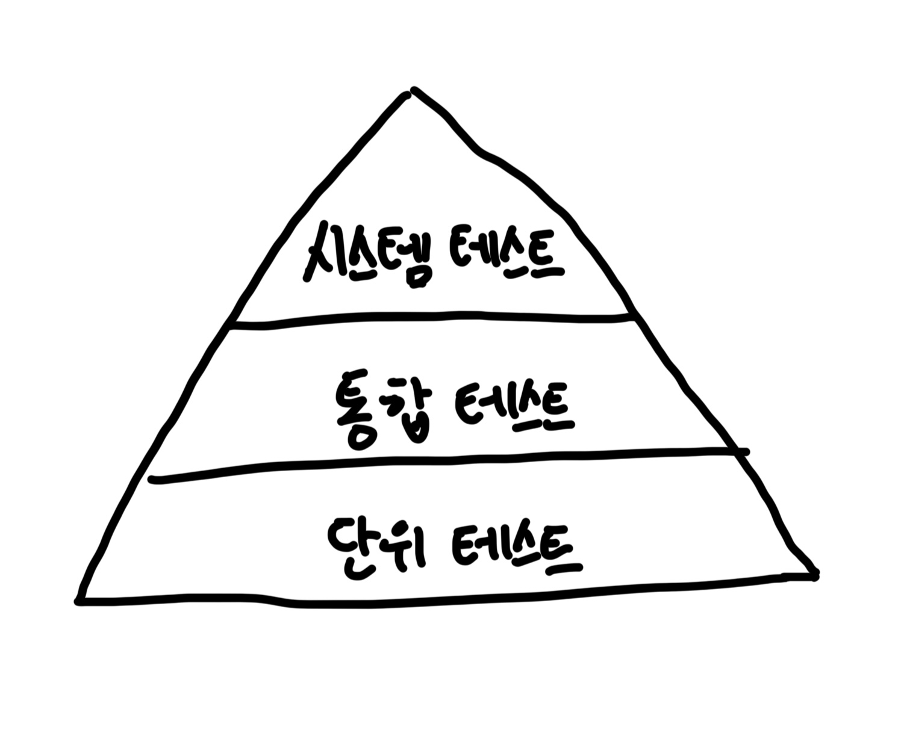

# Chapter07. 아키텍처 요소 테스트하기

## 테스트 피라미드



- 기본 전제는 만드는 비용이 적고, 유지보수하기 쉽고, 빨리 실행되고, 안정적인 작은 크기의 테스트들에 대해 높은 커버리지를 유지해야 한다는 것이다.
- 여러 개의 단위와 단위를 넘는 경계, 아키텍처 경계, 시스템 경계를 결합하는 테스트는 만드는 비용이 더 비싸고, 실행이 더 느려지며 깨지기 더 쉽다.
- 테스트 피라미드는 테스트가 비싸질수록 테스트의 커버리지 목표는 낮게 잡아야 한다는 것을 보여준다.
  - 그렇지 않으면 새로운 기능을 만드는 것보다 테스트를 만드는 데 시간을 더 쓰게 되기 때문이다.

## 단위 테스트로 도메인 엔티티 테스트하기

- 메소드 `withdraw()`가 기대한 대로 동작하는지 검증하는 코드.

```java
class AccountTest {

  @Test
  void withdrawalSucceeds() {
    //given
    AccountId accountId = new AccountId(1L);
    Account account = defaultAccount()
            .withAccountId(accountId)
            .withBaselineBalance(Money.of(555L))
            .withActivityWindow(new ActivityWindow(
                    defaultActivity()
                            .withTargetAccount(accountId)
                            .withMoney(Money.of(999L)).build(),
                    defaultActivity()
                            .withTargetAccount(accountId)
                            .withMoney(Money.of(1L)).build()))
            .build();

    //when
    boolean success = account.withdraw(Money.of(555L), new AccountId(99L));

    //then
    assertThat(success).isTrue();
    assertThat(account.getActivityWindow().getActivities()).hasSize(3);
    assertThat(account.calculateBalance()).isEqualTo(Money.of(1000L));
  }
}
```

- 도메인 엔티티 단위 테스트는 만들기 쉽고, 이해하기도 쉬운 편이며, 아주 빠르게 실행된다.
- 비즈니스 규칙을 검증하기에 가장 적절한 방법이다.
- 도메인 엔티티의 행동은 다른 클래스에 거의 의존하지 않기 때문에 다른 종류의 테스트는 필요하지 않다.

## 단위 테스트로 유스케이스 테스트하기

```java
class SendMoneyServiceTest {
  
  // ... 필드 선언

  @Test
  void transactionSucceeds() {
    //given
    Account sourceAccount = givenSourceAccount();
    Account targetAccount = givenTargetAccount();

    givenWithdrawalWillSucceed(sourceAccount);
    givenDepositWillSucceed(targetAccount);

    Money money = Money.of(500L);

    SendMoneyCommand command = new SendMoneyCommand(
        sourceAccount.getId().get(), targetAccount.getId().get(), money);

    //when
    boolean success = sendMoneyService.sendMoney(command);

    //then
    assertThat(success).isTrue();

    AccountId sourceAccountId = sourceAccount.getId().get();
    AccountId targetAccountId = targetAccount.getId().get();

    then(accountLock).should().lockAccount(eq(sourceAccountId));
    then(sourceAccount).should().withdraw(eq(money), eq(targetAccountId));
    then(accountLock).should().releaseAccount(eq(sourceAccountId));

    then(accountLock).should().lockAccount(eq(targetAccountId));
    then(targetAccount).should().deposit(eq(money), eq(sourceAccountId));
    then(accountLock).should().releaseAccount(eq((targetAccountId)));

    thenAccountsHaveBeenUpdated(sourceAccountId, targetAccountId);
  }
  
  // .. helper method
}
```

- 테스트 중인 유스케이스 서비스는 상태가 없기(stateless) 때문에 'then' 섹션에서 특정 상태를 검증할 수 없다.
  - 대신 테스트는 서비스가 (모킹된) 의존 대상의 특정 메소드와 상호작용했는지 여부를 검증한다.
  - 이는 테스트가 코드의 `행동` 변경뿐만 아니라 코드의 `구조` 변경에도 취약해진다는 의미가 된다. (코드 리팩토링 => 테스트 코드 변경으로 이어짐)
- 따라서 테스트에서 상호작용을 검증하고 싶다면 신중하게 생각해야 한다.
  - 핵심만 골라 테스트.

## 통합 테스트로 웹 어댑터 테스트하기

- 웹 어댑터는 JSON 문자열 등의 형태로 HTTP를 통해 입력을 받고, 입력에 대한 유효성 검증을 한다.
- 또한 유스케이스에서 사용할 수 있는 포맷으로 매핑하고, 유스케이스에 전달한다.
- 그러고 나서 유스케이스의 결과를 JSON으로 매핑하고 HTTP 응답을 통해 클라이언트로 반환했다.
- 테스트에서는 앞의 모든 단계들이 기대한 대로 동작하는지 검증해야 한다.

```java
@WebMvcTest(controllers = SendMoneyController.class)
class SendMoneyControllerTest {

  @Autowired
  private MockMvc mockMvc;

  @MockBean
  private SendMoneyUseCase sendMoneyUseCase;

  @Test
  void testSendMoney() throws Exception {
    mockMvc.perform(
        post("/accounts/send/{sourceAccountId}/{targetAccountId}/{amount}", 41L, 42L, 500)
            .header("Content-Type", "application/json"))
        .andExpect(status().isOk());

    then(sendMoneyUseCase).should()
        .sendMoney(eq(new SendMoneyCommand(
            new AccountId(41L), new AccountId(42L), Money.of(500L))));
  }
}
```

- MockMvc 객체를 이용해 모킹했기 때문에 실제로 HTTP 프로토콜을 통해 테스트한 것은 아니다.
  - 프레임워크가 HTTP 프로토콜에 맞게 모든 것을 적절히 잘 변환한다고 믿는 것이다.
- 그럼 왜 이 테스트가 단위 테스트가 아닌 통합 테스트일까?
  - 사실 보이지 않는 곳에서 더 많은 일들이 벌어지고 있다.
  - `@WebMvcTest` 애노테이션은 스프링이 특정 요청 경로, 자바와 JSON 간의 매핑, HTTP 입력 검증 등에 필요한 전체 객체 네트워크를 인스턴스화하도록 만든다.
  - 그리고 테스트에서는 웹 컨트롤러가 이 네트워크의 일부로서 잘 동작하는지 검증한다.
  - 웹 컨트롤러가 스프링 프레임워크에 강하게 묶여 있기 때문에 격리된 상태로 테스트하기보다는 이 프레임워크와 통합된 상태로 테스트하는 것이 합리적이다.
  - 웹 컨트롤러를 평범한 단위 테스트로 테스트하면 모든 매핑, 유효성 검증, HTTP 항목에 대한 커버리지가 낮아지고, 프레임워크를 구성하는 이런 요소들이 프로덕션 환경에서 정상적으로 작동할지 확신할 수 없게 된다.

## 통합 테스트로 영속성 업대터 테스트하기

- 비슷한 이유로 영속성 어댑터의 테스트에는 통합 테스트를 적용하는 것이 합리적이다.
  - 단순히 어댑터의 로직만 검증하고 싶은 게 아니라 데이터베이스 매핑도 검증하고 싶기 때문이다.

```java
@DataJpaTest
@Import({AccountPersistenceAdapter.class, AccountMapper.class})
class AccountPersistenceAdapterTest {

  @Autowired
  private AccountPersistenceAdapter adapterUnderTest;

  @Autowired
  private ActivityRepository activityRepository;

  @Test
  @Sql("AccountPersistenceAdapterTest.sql")
  void loadsAccount() {
    Account account = adapterUnderTest.loadAccount(new AccountId(1L),
        LocalDateTime.of(2018, 8, 10, 0, 0));

    assertThat(account.getActivityWindow().getActivities()).hasSize(2);
    assertThat(account.calculateBalance()).isEqualTo(Money.of(500L));
  }

  @Test
  void updatesActivities() {
    Account account = defaultAccount()
        .withBaselineBalance(Money.of(555L))
        .withActivityWindow(new ActivityWindow(
            defaultActivity()
                .withId(null)
                .withMoney(Money.of(1L)).build()))
        .build();

    adapterUnderTest.updateActivities(account);

    assertThat(activityRepository.count()).isEqualTo(1);

    ActivityJpaEntity savedActivity = activityRepository.findAll().get(0);
    assertThat(savedActivity.getAmount()).isEqualTo(1L);
  }
}
```

- 이 테스트에서는 데이터베이스를 모킹하지 않았다. 테스트가 실제로 데이터베이스에 접근한다.

## 시스템 테스트로 주요 경로 테스트하기

```java
@SpringBootTest(webEnvironment = WebEnvironment.RANDOM_PORT)
public class SendMoneySystemTest {

  @Autowired
  private TestRestTemplate restTemplate;

  @Test
  @Sql("SendMoneySystemTest.sql")
  void sendMoney() {
    Money initialSourceBalance = sourceAccount().calculateBalance();
    Money initialTargetBalance = targetAccount().calculateBalance();

    ResponseEntity response = whenSendMoney(
        sourceAccountId(), targetAccountId(), transferredAmount());

    then(response.getStatusCode()).isEqualTo(HttpStatus.OK);

    then(sourceAccount().calculateBalance())
        .isEqualTo(initialSourceBalance.minus(transferredAmount()));

    then(targetAccount().calculateBalance())
        .isEqualTo(initialTargetBalance.plus(transferredAmount()));
  }
}
```

- 프로덕션 환경에 조금 더 가깝게 만들기 위해 실제 HTTP 통신을 실행.
  - 실제 출력 어댑터를 이용한다. (예제에서는 영속성 어댑터뿐. 다른 시스템에서는 다른 출력 어댑터들이 있을 수 있다. 따라서 모킹이 필요할 때도 있음.)
- 도메인 특화 언어는 어떤 테스트에서도 유용하지만 시스템 테스트에서는 더욱 의미를 가진다.
  - 시스템 테스트는 단위 테스트나 통합 테스트가 할 수 있는 것보다 훨씬 더 실제 사용자를 잘 흉내 내기 때문에 사용자 관점에서 애플리케이션을 검증할 수 있다.
  - 어휘를 사용하면 프로그래머가 아닌 도메인 전문가가 테스트에 대해 생각하고 피드백을 줄 수도 있다. (JGiven)
- 시스템 테스트는 여러 개의 유스케이스를 결합해서 시나리오를 만들 때 더 빛이 난다.
  - 각 시나리오는 사용자가 애플리케이션을 사용하면서 거쳐갈 특정 경로를 의미한다.

<br/>

# 참고자료

- 만들면서 배우는 클린 아키텍처, 톰 홈버그 지음
