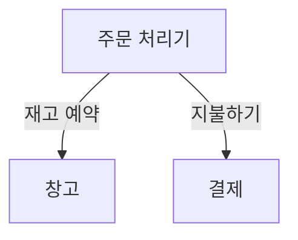

# Chapter 02 마이크로서비스 모델링 방법

> 상대의 논리를 보면 "세상이 무엇이 떠받치고 있을까?"라는 질문에 "거북이가 떠받치고 있지."라고 대답한 이교도가 떠오른다. 그럼 그 거북이를 떠받치는 것은 대체 뭘까? "그건 또 다른 거북이지."
> - 목사 조셉 프레드릭 버그(1854)

- 정보 은닉, 결합, 응집력
- 마이크로서비스 주변의 경계를 그리는 것에 대한 생각이 어떻게 변화되는지 알아본다.
- 또한 사용할 수 있는 다양한 `분해 decomposition` 형태를 살펴보고 이 분야에서 매우 유용한 기술인 도메인 주도 설계도 더 깊이 탐구할 것이다.

 

## 1. 뮤직코프 소개

- 가상 시나리오
- 오프라인 위주 판매 => 레코드판 사업이 바닥 => 이제야말로 온라인 판매에 집중 (이미 웹 사이트를 가지고 있음.)
- 음악용 소프트웨어는 일시적 유행, CD가 집 앞에 도착하길 기다릴 것이라고 판단. (편리함보다는 품질 추구) 
- 스트리밍 비즈니스가 모두 곧 붕괴될 것이라고 확신하는 상태
- 세계를 석권할 가장 좋은 기회는 쉽게 변화하는 것이라고 판단 => 바로 마이크로서비스를 통해

 

## 2. 올바른 마이크로서비스 경계를 만드는 것은 무엇인가?

- 한 마이크로서비스를 다른 마이크로서비스와 별개로 변경할 수 있는 능력은 매우 중요하다. 그렇다면 마이크로서비스 주변의 경계를 정하는 방법을 생각할 때 어떤 점을 염두에 둬야 할까?
  - 결국 모듈식 분해의 또 다른 형태일 뿐이다.
  - 이런 사실은 경계를 정의하는 방법을 찾는 데 모듈식 소프트웨어와 구조적 프로그래밍 영역에 존재하는 많은 선행 기술에 의지할 수 있다는 것을 의미한다.

### 2-1. 정보 은닉

- `정보 은닉 information hiding`. 모듈 경계를 정의하는 가장 효과적인 방법을 찾으려고 데이비드 파나스가 만든 개념
- 정보 은닉은 모듈 경계 뒤에 가능한 한 많은 세부 정보를 숨기려는 욕구를 나타낸다.

#### 향상된 개발 시간

- 모듈을 독립적으로 개발함에 따라 더 많은 작업을 병렬로 수행할 수 있고, 프로젝트에 더 많은 개발자를 추가하는 데 따른 영향을 줄일 수 있다.

#### 이해도

- 각 모듈이 따로따로 살펴보고 이해할 수 있다. 이는 시스템 전체가 수행하는 작업을 더 쉽게 이해하도록 해준다.

#### 유연성

- 모듈은 서로 독립적으로 변경 가능하므로 다른 모듈을 변경하지 않고도 시스템 기능을 변경할 수 있다.
- 게다가 모듈을 다양한 방식으로 결합해 새로운 기능을 제공할 수 있다.

 

- 이러한 매력적인 특징은 마이크로서비스 아키텍처를 통해 성취하려는 것을 훌륭하게 완성한다.

> 모듈 간 연결은 모듈이 서로에게 만드는 `가정 assumption`이다.

- 하나의 모듈이 다른 모듈에 대해 만드는 가정의 수를 줄임으로써 모듈 간의 연결에 직접적으로 영향을 미친다.
  - 가정의 수를 작게 유지하면, 다른 모듈에 영향을 미치지 않고 하나의 모듈을 변경하기가 더 쉽다.
  - 모듈을 변경하는 개발자가 다른 사람들이 해당 모듈을 어떻게 사용하는지 명확히 이해하고 있다면, 업스트림 호출자도 변경할 필요가 없는 방식으로 안전하게 변경하도록 만들 가능성이 더 높을 것이다.

### 2-2. 응집력

- `응집력 cohesion`을 나타내는 가장 간결한 정의 중 하나는 '함께 바뀌고 함께 머무는 코드다.'
- 여러 곳에서 행동을 변경해야 한다면 이 변경 사항을 제공하기 위해 많은 다른 서비스를 동시에 릴리스해야 할 것이다.
- 여러 곳에서 변경하는 것은 느리고 한 번에 많은 서비스를 배포하는 것은 위험하므로 두 가지 다 피하고 싶다.
- 따라서 문제 영역 내에서 관련 동작을 한 곳으로 모으며, 다른 경계와 가능한 한 느슨하게 통신할 수 있는 경계를 찾길 원한다.
- 마이크로서비스 아키텍처는 강한 응집력을 목표로 한다.

### 2-3. 결합

- 서비스가 느슨하게 결합됐다면 한 서비스를 변경할 때 다른 서비스를 변경할 필요가 없다.
- 그렇다면 어떤 종류가 강한 결합을 유발할까?
  - 전형적인 실수는 한 서비스를 다른 서비스에 단단히 결합하는 통합 방식을 선택해 서비스 내부가 변경되면 소비자도 변경하도록 요구하는 것이다.
- 느슨하게 결합된 서비스는 함께 협업하는 서비스들에 대해 꼭 필요한 만큼만 알고 있다.

### 2-4. 결합과 응집력의 연관성

- 결합과 응집력은 개념적으로 분명 관련이 있다.
- 논리적으로 연관된 기능이 시스템 전체에 분산돼 있다면, 이 기능에 대한 변경은 이러한 경계를 넘어 전파돼 더 긴밀한 결합을 나타낸다.

> `콘스탄틴의 법칙 Constantine's law`
> - 응집력이 강하고 결합도가 낮으면 구조가 안정된다.

- 여기서 `안정성 stability`의 개념은 중요하다.
  - 팀 간의 조정 작업량을 줄이려면 경계 자체에 어느 정도의 안정성은 필요하다.
  - 마이크로서비스가 제공하는 계약이 하위 호환성을 깨뜨리는 방식으로 계속 변경된다면 상위 소비자도 지속적으로 변경해야 할 것이다.
- 응집력은 경계 내부에 있는 사물 사이의 관계에 적용되는 반면, 결합은 경계 건너에 있는 사물 간의 관계를 설명한다.

 

## 3. 결합 유형

- 앞서 설명한 개요에 따르면 모든 결합이 나쁘다고 생각할 수 있다. 엄밀히 말해 이것은 사실이 아니다.
  - 궁극적으로 시스템에서 일부 결합은 피할 수 없으며, 우리는 결합의 양을 줄이길 원한다.
- 주로 모듈식 소프트웨어를 고려하는 구조적 프로그래밍 맥락에서 다양한 결합 형태를 살펴보고자 많은 연구가 수행돼 왔다.
  - 결합의 중첩 및 충돌을 평가하는 다양한 모델 중 상당수는 서비스 기반 상호작용보다는 코드 수준에서 주로 이야기된다.
  - 마이크로서비스는 모듈식 아키텍처의 한 형태이므로 (분산 시스템의 복잡성이 추가됐지만), 이러한 원시 개념을 많이 사용할 수 있고 마이크로서비스 기반 시스템 관점에도 적용할 수 있다.

### 3-1. 도메인 결합

- `도메인 결합 domain coupling`은 첫 번째 마이크로서비스가 다른 마이크로서비스가 제공하는 기능을 사용해야 하므로 하나의 마이크로서비스가 다른 마이크로서비스와 상호작용해야 하는 상황을 설명한다.
- 아래 예시는 뮤직코프 내부에서 CD 주문이 관리되는 일부 방식을 보여준다.
  - 주문 처리기(Order Processor)는 창고 마이크로서비스를 호출해 재고를 예약하고, 결제 마이크로서비스를 호출해 결제한다.
  - 따라서 주문 처리기는 이 작업을 위해 창고(Warehouse) 및 결제(Payment) 마이크로서비스에 의존하고 결합된다.
  - 하지만 창고 서비스와 결제 서비스 사이에는 상호작용이 없으므로 결합도 없다.

- 이런 유형의 상호작용은 대개 불가피하다.
- 많은 하위 마이크로서비스와 통신해야 하는 마이크로서비스는 너무 많은 로직이 집중되는 상황을 만든다.
  - 도메인 결합은 서비스 간에 더 복잡한 데이터 집합이 전송됨에 따라 문제가 될 수 있다.
  - 정보 은닉의 중요성을 명심하라. 꼭 필요한 것만 공유하고 필요한 최소한의 데이터만 전송해야 한다.

> 시간적 결합에 대한 간략한 정리
> - `시간적 결합 temporal coupling`은 하나의 마이크로서비스가 작업을 완료하기 위해 동시간에 어떤 작업을 수행하는 다른 마이크로서비스가 필요한 상황을 나타낸다.
> - 작업을 완료하려면 두 마이크로서비스가 동시에 작동하고 서로 통신할 수 있어야 한다.
>   - 어떤 이유로 다른 서비스와 연결할 수 없다면 해당 작업은 실패하게 된다.
>   - 또한 응답을 기다려야 하므로 잠재적으로 리소스 경합과 관련된 문제를 유발할 수 있다.
> - 시간적 결합이 항상 나쁜 것은 아니지만 인지해둘 필요는 있다.
>   - 마이크로서비스가 늘어나 상호작용이 더 복잡해지면 시간적 결합 문제가 증가하므로 시스템을 확장하고 작동 상태를 유지하기가 더 어려워질 수 있다.
>   - 시간적 결합을 피하는 한 가지 방법은 메시지 브로커와 같은 비동기 통신 형태를 사용하는 것이다.

### 3-2. 통과 결합

- `통과 결합 pass-through coupling`은 데이터가 다른 하위 마이크로서비스에 필요하다는 이유만으로 한 마이크로서비스가 다른 마이크로서비스에 데이터를 전달하는 상황을 말한다.
  - 여러 면에서 이 상황은 결합을 구현하는 데 가장 많은 문제를 유발하는 형태 중 하나다.
  - 호출자가 호출 중인 마이크로서비스가 다른 마이크로서비스를 호출한다는 것을 알고 있을 뿐 아니라 잠재적으로 한 단계 떨어진 그 마이크로서비스까지 어떻게 동작하는 지 알아야 한다는 점을 의미하기 때문이다.

 

# 참고 자료

- 마이크로서비스 아키텍처 구축, 샘 뉴먼 지음
