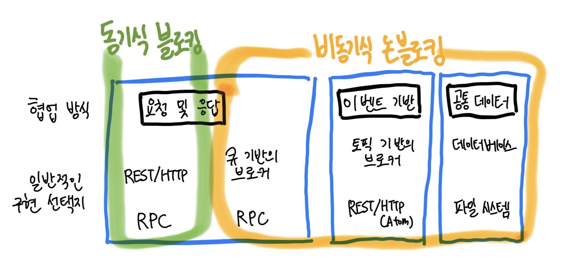
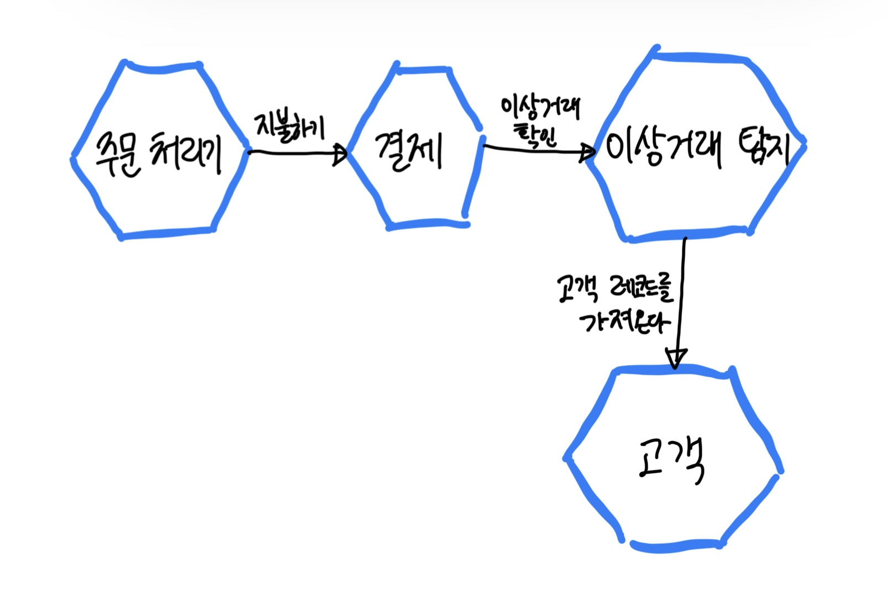
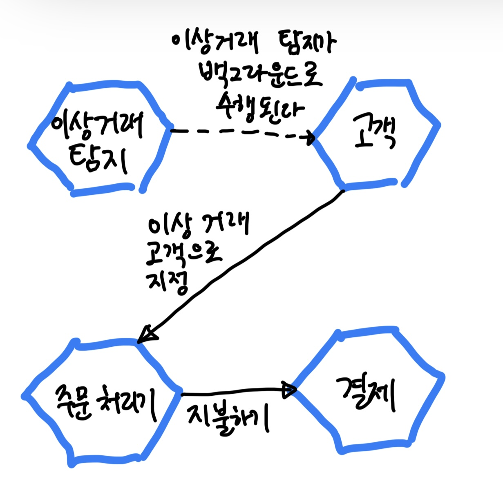
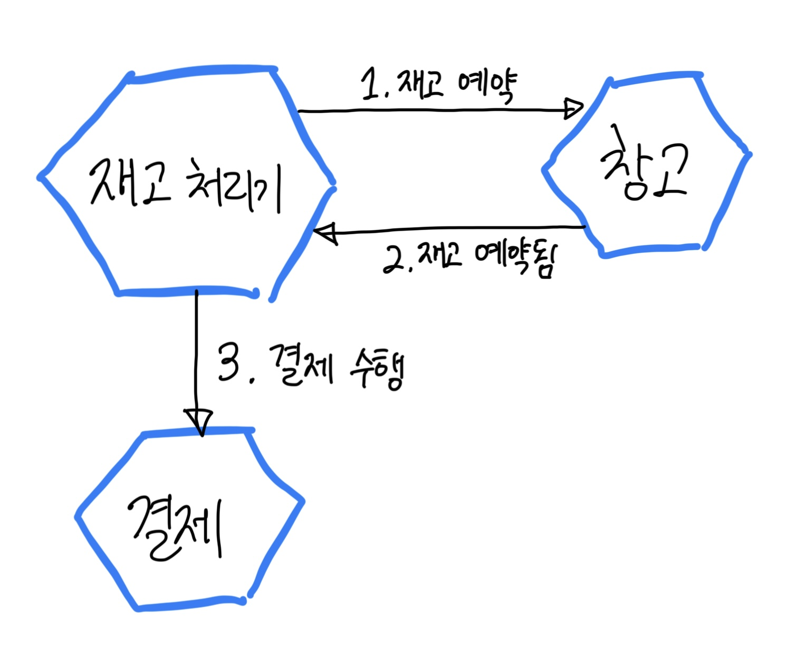

# Chapter04 마이크로서비스 통신 방식

- 다양한 통신 유형을 고려하지 못하고 이미 채택된 기술 방식에 끌린다는 사실 때문에 마이크로서비스 간의 통신을 제대로 구현하는 데 어려움이 따른다.
- 요청 및 응답 협업 방식과 이벤트 기반 협업 방식과 `동기식 블로킹 synchronous blocking` 또는 `비동기식 블로킹 asynchronous nonblocking` 통신 메커니즘.

 

## 1. 프로세스 내부에서 프로세스 사이로

- 네트워크를 통한 두 프로세스 사이의 호출은 한 프로세스 내부의 호출과 매우 다르다. 어떤 면에서는 그 차이를 무시할 수 있다.
  - 예를 들어, 한 객체가 다른 객체에 메소드 호출을 한다고 생각하고 이 상호작용을 네트워크를 통해 통신하는 2개의 마이크로서비스에 매핑한다고 생각하면 쉽다.
  - 하지만 마이크로서비스가 단순한 객체가 아니라는 사실을 제쳐두더라도 이러한 생각은 많은 문제를 일으킬 수 있다.

### 1-1. 성능

- 프로세스 내 호출의 성능은 프로세스 간 호출의 성능과 기본적으로 차이가 있다.
- 프로세스 내 호출을 할 때, 기본 컴파일러와 런타임은 호출의 영향을 줄이려고 마치 처음에 호출이 없었던 것처럼 전체 호스트 최적화를 수행할 수 있다.
- 하지만 프로세스 간 호출에서는 이러한 최적화가 불가능하며, 패킷을 전송해야 한다.
  - 프로세스 간 호출의 오버헤드는 확실히 측정할 수 있다.
  - 예를 들어, 데이터 센터 안에서 단일 패킷이 왕복하는 데 걸리는 시간을 밀리초 단위로 측정할 수 있지만 메소드 호출의 오버헤드는 걱정하지 않아도 될 만큼 작기 때문이다.
- 프로세스 내부에서 적합한 API가 프로세스 산 상황에서는 적합하지 않을 수 있다.
  - 프로세스 내부의 API 경계 사이에서는 걱정 없이 1,000번의 호출을 할 수 있다.
  - 두 마이크로서비스 사이에도 1,000번의 네트워크 호출을 하는 게 좋을까? 아마도 그렇지 않을 것이다.
- 메소드에 매개변수를 전달할 때 보통 전달할 데이터 구조체는 이동되지 않는다.
  - 대신 메모리 위치에 대한 포인터를 전달할 가능성이 높다.
  - 객체나 데이터 구조를 다른 메소드에 전달할 때 데이터를 복사하려고 더 많은 메모리를 할당할 필요는 없다.
- 반면 네트워크를 통해 마이크로서비스 간 호출을 할 때 데이터는 실제로 네트워크를 통해 전송될 수 있는 특정 형태로 직렬화돼야 한다.
  - 그런 다음에 데이터는 전송되고 다른 쪽 끝에서 역직렬화돼야 한다. 따라서 프로세스 간에 전송되는 페이로드의 크기에 대해 더 주의를 기울여야 한다.
  - 프로세스 내부에서 전달되는 데이터 구조의 크기를 신경쓸 필요는 없었을 것이다. 하지만 이제는 알아야 한다.
  - 송수신 데이터 양을 줄이거나, 더 효율적인 직려로하 메커니즘을 선택하거나 데이터를 파일 시스템으로 내려 해당 파일 위치에 대한 참조 정보를 대신 전달할 수 있기 때문이다.

### 1-2. 인터페이스 변경

- 프로세스 내부의 인터페이스 변경을 고려하면 변경 사항을 롤아웃(출시)하는 것은 간단하다.
  - 인터페이스를 구현하는 코드와 인터페이스를 호출하는 코드는 모두 같은 프로세스에 함께 패키징된다.
- 하지만 마이크로서비스 간의 통신에서 인터페이스를 노출하는 마이크로서비스와 해당 인터페이스를 사용하는 소비자 마이크로서비스는 개별적으로 배포 가능한 마이크로서비스다.
  - 마이크로서비스 인터페이스에 하위 호환성을 깨뜨리는 변경을 할 때는 둘 다 새 인터페이스를 사용하도록 업데이트하기 위해 소비자와 함께 `락스텝 배포 lockstep deployment`를 하거나, 새로운 마이크로서비스 계약의 출시를 단계적으로 수행할 방법을 찾아야 한다.

### 1-3. 에러 처리

- 프로세스 내부에서 메소드를 호출하면 에러의 특성은 매우 직관적인 편이다.
  - 에러는 예측돼 처리하기 쉽거나 호출 스택의 위 방향으로 에러를 전파할 정도로 치명적이다. 에러는 전반적으로 결정적이다.
- 분산 시스템에서의 에러의 특성은 다양하다. 통제할 수 없는 에러에는 취약하다.
  - 예를 들면, 네트워크 시간이 초과하거나 다운스트림 마이크로서비스가 일시적으로 사용하지 못할 수 있다.
  - 또는 네트워크 연결이 끊기거나 과도한 메모리 사용으로 컨테이너가 죽기도 하며, 극단적인 상황에서는 데이터 센터 어딘가에 불이 날 수도 있다.
- 앤드류 탄넨바움과 마텐 스틴은 저서 "Distributed Systems"에서 프로세스 간 통신에 나타나는 다섯 가지 유형의 실패 모드를 분류한다.

#### 충돌 실패 crash failure

- 서버가 중단될 때까지 모든 것은 정상이다. 재부팅한다.

#### 누락 실패 omission failure

- 전송 후 응답을 받지 못했다.
- 또는 다운스트림 마이크로서비스가 메시지를 발행할 것으로 예상했으나 그냥 중지한 상황도 포함한다.

#### 타이밍 실패 timing failure

- 어떤 일이 너무 늦게 발생했거나 너무 일찍 발생했다.

#### 응답 실패 response failure

- 응답은 받았지만 잘못된 응답으로 보인다.
- 예를 들어 주문 요약을 요청했지만 필요한 정보가 응답에 누락됐다.

#### 임의 실패 arbitrary failure

- 비잔티움 실패라고도 하며, 무언가 잘못됐지만 참여자들이 실패가 발생한 사실에 동의하지 못하는 경우다.

 

- 에러 중 대부분은 본질적으로 일시적인 경우가 많으며 곧 사라질 수 있는 단기간의 문제다.
- 클라이언트가 적절한 조치를 취할 수 있는 방식으로 에러를 반환하기 위한 더 풍부한 `의미 체계 semantics`를 갖추는 것이 중요해진다.
- HTTP는 그 중요성을 잘 이해하는 프로토콜의 한 예다.
  - 모든 HTTP 응답에는 예약된 에러용으로 (400번대, 500번대) 코드를 제공한다.
  - 400번대 에러 코드는 요청 에러며, 본질적으로 다운스트림 서비스는 원래부터 요청에 문제가 있다는 사실을 클라이언트에 알려준다.
  - 500번대 에러는 다운스트림 서버의 문제와 관련이 있으며, 일부 코드는 일시적인 문제라고 클라이언트에 알려준다.
- 마이크로서비스 간의 통신을 위해 HTTP 기반 프로토콜의 선택 여부와 관계없이 에러의 특성을 중심으로 풍부한 의미 체계를 갖춘다면 클라이언트가 보상 작업을 수행하기 더 쉬워지고 결과적으로 더 견고한 시스템을 구축할 수 잇따.ㄴ

 

## 2. 프로세스 간 통신을 위한 기술: 다양한 선택

> 그리고 선택의 폭이 너무 넓고 시간이 부족한 세상에서 해야 할 당연한 일은 그냥 무시하는 것이다.
> - 세스 고딘 Seth Godin

- 사람들은 종종 자신에게 익숙한 기술이나 컨퍼런스에서 배운 최신 기술에 끌린다.
  - 이런 선택은 특정 기술을 선택할 때 함께 따라오는 일련의 개념과 제약 조건이 포함되는 경우가 많다는 문제가 있다.
  - 이런 제약 조건은 우리에게 부적합할 수 있고, 기술에 대한 사고방식이 실제로 해결하려는 문제와 일치하지 않을 수 있다.
  - 예를 들어 카프카는 이벤트 기반의 상호작용이 빈번한 곳을 위해 설계됐으므로, 요청과 응답을 위해 사용하는 것이 좋은 생각이 아니다.

 

## 3. 마이크로서비스 통신 방식

#### 동기식 블로킹 synchronous blocking

- 마이크로서비스는 다른 마이크로서비스를 호출하고 응답을 기다리는 작업을 차단한다.

#### 동기식 블로킹 asynchronous nonblocking

- 호출을 보낸 마이크로서비스는 호출 수신 여부에 관계없이 처리를 계속할 수 있다.

#### 요청 및 응답 request-response

- 마이크로서비스는 작업을 수행하도록 다른 마이크로서비스에 요청을 보낸다.
- 결과를 알려주는 응답을 받을 것을 기대한다.

#### 이벤트 기반 event-driven

- 마이크로서비스는 다른 마이크로서비스가 소비하고 반응하는 이벤트를 발산한다.
- 이벤트를 발행하는 마이크로서비스는 자신이 발행하는 이벤트를 소비하는 마이크로서비스가 어떤 마이크로서비스인지 알지 못한다.

#### 공통 데이터 common data

- 통신 방식으로 자주 볼 수 없는 마이크로 서비스인 경우 이부 공유 데이터 소스를 통해 협업한다.

 

- 신뢰할 수 있는 통신, 허용 가능한 지연 시간, 통신량에 대한 요구 사항은 모두 기술을 선택하는 데 중요한 역할을 한다.
  - 하지만 대개 주어진 상황에 더 적합한 방식이 요청 및 응답인지 아니면 이벤트 기반 협업 방식인지 살펴본다.

### 3-1. 짜맞추기

- 마이크로서비스 아키텍처 전체에 다양한 협업 스타일이 혼재될 수 있으며, 이것은 지극히 일반적이라는 점을 주목해야 한다.
  - 어떤 상호작용은 요청 및 응답으로만 이뤄지지만, 어떤 상호작용은 이벤트 중심으로 이뤄지기도 한다.
  - 사실 단일 마이크로서비스가 하나 이상의 협업 형태를 구현하는 것은 일반적이다.

 

## 4. 동기식 블로킹

- 동기식 블로킹 호출을 사용하면 마이크로서비스가 일종의 호출을 다운스트림 프로세스에 보내고 호출이 완료돼 응답이 수신될 때까지 대기한다.
- 대기하는 이유는 호출 결과가 이후 연산에 필요하거나 호출이 제대로 작동했는지 확인하고 그러지 않다면 재시도 등을 수행하려 하기 때문일 수 있다.
- 사실상 모든 동기식 블로킹 호출은 요청 및 응답 호출로 구성된다.ㄴ

### 4-1. 장점

- 대부분은 기본적으로 동기 방식의 프로그래밍을 배웠다.
- 프로세스 간 호출을 사용했던 대부분의 상황에서는 동기식 블로킹 방식을 수행했을 것이다.
- 단일 프로세스의 모놀리스와 같이 덜 분산된 아키텍처에서 전환할 때 새로운 일이 벌어진다면 익숙한 아이디어를 고수하는 것이 합리적이다.

### 4-2. 단점

- 동기식 호출의 주요 문제점은 고유한 시간적 결합에 있다.
  - 만약 호출한 마이크로서비스가 가용하지 않으면 호출은 실패하고 현재 서비스에서는 보상 작업의 종류를 결정해야 한다.
  - 보상 작업에는 즉각적인 재시도, 나중에 재시도하기 위한 호출 버퍼링 또는 아예 포기하는 것이 포함될 수 있다.
- 이 결합은 양방향이다.
  - 일반적으로 응답은 동일한 인바운드 네트워크 연결을 통해 업스트림 마이크로서비스에 전송된다.
  - 시간적 결합은 단지 두 마이크로서비스 사이에 생기는 것이 아니라, 이 마이크로서비스들의 특정 두 인스턴스에 발생한다.
- 호출 발신자가 블로킹돼 있고 다운스트림 마이크로서비스의 응답을 기다리고 있을 때 다운스트림 마이크로서비스가 늦게 응답하거나 혹은 네트워크 지연 이슈가 있다면 호출 발신자는 응답을 기다리며 오랜 시간 동안 블로킹될 것이다.
  - 만약 마이크로서비스가 상당한 부하를 받고 있고 요청에 늦게 응답하는 경우라면 호출 발신자도 느리게 응답하게 된다.
- 따라서 동기식 호출을 사용하면 비동기식 호출을 사용할 때보다 시스템이 다운스트림 장애로 인한 연쇄적인 문제에 더욱 취약해진다.

### 4-3. 적용 대상

- 간단한 마이크로서비스 아키텍처라면 동기식 블로킹 호출을 사용하는 데 큰 문제가 없으며, 많은 사람에게 익숙하면 분산 시스템을 다룰 때 유리하다.
- 동기식 블로킹 호출은 호출 체인이 더 많아질 때 문제가 되기 시작한다.

- 위 호출이 모두 동기식이고 블로킹되면 여러 문제에 직면한다.
  - 이런 종류의 긴 체인이 상당한 리소스 경합을 일으킬 수 있다는 사실은 차치하더라도, 관련된 4개의 마이크로서비스 중 하나 또는 이들 간의 네트워크 호출에 문제가 발생하면 전체 작업이 실패할 수 있다.
  - 내부에서는 주문 처리기가 결제 서비스로부터 응답을 기다리며 네트워크 커넥션을 열어두고 있다. 결제 서비스는 또한 이상거래 탐지 서비스 등의 응답을 기다린다.
  - 열린 상태를 유지해야 하는 커넥션이 많으면 실행 중인 시스템에 영향을 줄 수 있다. 즉, 사용 가능한 커넥션이 부족하거나 결과적으로 네트워크 정체가 증가하는 문제가 발생할 가능성이 훨씬 커진다.
- 이와 같은 상황을 개선하기 위해 먼저 마이크로서비스 간의 상호작용을 재검토할 수 있다.
  - 예를 들어 아래 그림과 같이 주요 구매 흐름에서 이상거래 감지 기능을 들어내 백그라운드에서 실행하도록 할 수 있다.
  - 특정 고객의 문제가 발견되면 적절히 기록하고, 이는 결제 프로세스 초기에 확인할 수 있다. 사실상 이는 작업의 일부를 병렬로 수행하고 있음을 나타낸다.
  - 지연 시간도 개선되고, 구매 흐름의 중요 경로에서 마이크로서비스 하나를 제거해 중요한 작업에 대해 걱정해야 할 의존성을 줄일 수 있다.

 

## 5. 비동기식 논블로킹

#### 공통 데이터를 통한 통신

- 업스트림 마이크로서비스는 일부 공통 데이터를 변경하고 이 데이터는 나중에 하나 이상의 마이크로서비스에서 사용된다.

#### 요청 및 응답

- 마이크로서비스는 다른 마이크로서비스에 작업 요청을 보낸다.
- 요청된 작업이 완료되면 성공 여부와 관계없이 업스트림 마이크로서비스는 응답을 수신한다.
- 특히, 업스트림 마이크로서비스의 어떤 인스턴스도 응답을 처리할 수 있어야 한다.

#### 이벤트 기반 상호작용

- 마이크로서비스는 발행한 일에 대한 사실적 진술로 생각될 수 있는 이벤트를 `브로드캐스트 broadcats`한다.
- 다른 마이크로서비스는 관심 있는 이벤트를 수신하고 적절히 대응한다.

 

### 5-1. 장점

- 비동기식 논블로킹 통신을 사용하면 초기 호출을 수행하는 마이크로서비스와 후출을 수신하는 마이크로서비스는 일시적으로 분리된다.
- 호출을 수신하는 마이크로서비스가 호출과 동시에 연결될 필요는 없으며, 이는 2장에서 논의한 시간적 비결합에 대한 우려를 피한다는 것을 의미한다.
- 호출에 의해 트리거되는 기능을 처리하는 데 오랜 시간이 걸리는 경우에도 유용하다.

### 5-2. 단점

- 동기식 블로킹 통신과 비교해 비동기식 논블로킹 통신의 주요 단점은 복잡도와 선택 범위에 있다.
- 비동기식 통신이 컴퓨팅에 대한 우리의 사고 모델과 맞지 않는다면 비동기식 통신 방식을 채택하기는 어려울 것이다.

### 5-3. 적용 대상

- 궁극적으로 비동기식 통신이 우리에게 적합한지를 고려한다면 장단점이 있으므로 어떤 유형의 비동기식 통신을 선택할지도 고려해야 한다.
  - 장기 수행 프로세스는 명확한 비동기 통신 후보다. (특정 작업이 몇 시간 혹은 며칠이 소요되는 경우)
  - 재구성하기 쉽지 않은 긴 호출 체인이 있는 상황도 좋은 후보가 될 수 있다.
- 가장 일반적인 세 가지 비동기 통신 형태인 요청 및 응답 호출, 이벤트 기반 통신, 공통 데이터를 통한 통신 방식.

 

## 6. 공통 데이터를 통한 통신

- 다양한 구현과도 관련 있는 통신 방식은 공통 데이터를 통한 통신이다.
- 이 패턴은 하나의 마이크로서비스가 데이터를 정의한 위치에 넣고 다른 마이크로서비스가 그 데이터를 이용할 때 사용한다.
- 하나의 마이크로서비스가 특정 위치에 파일을 떨구고 나중에 다른 마이크로서비스가 해당 파일을 집어 들어 작업을 수행하는 것처럼 간단할 것이다.
- 가장 흔하고 일반적인 프로세스 간 통신 패턴이지만, 프로세스 간 통신이 너무 간접적이어서 눈에 잘 띄지 않는 경우가 많기 때문에 통신 패턴으로 인식하지 못하는 경우가 종종 있다.

### 6-1. 구현

- 이 패턴을 구현하려면 데이터에 대한 일종의 영구 저장소가 필요하며, 대개는 파일시스템으로 충분하다.
  - 데이터와 작업하는 모든 다운스트림 마이크로서비스는 새 데이터가 가용하다는 사실을 인식하는 메커니즘이 필요하다.
  - 예를 들어, `폴링 polling`은 이 문제에 대한 가장 일반적인 해결책이다.
- 이 패턴의 두 가지 일반적인 예는 `데이터 레이크 data lake`와 `데이터 웨어하우스 data warehouse`다.
  - 두 경우 모두 일반적으로 대량의 데이터를 처리하는 데 도움이 되도록 설계된 솔루션이지만, 결합과 관련해서는 분명 거리가 멀다.
  - `데이터 레이크`를 사용하는 경우, 소스는 자신이 적합하다고 생각하는 형식으로 원시 데이터를 업로드하고, 이 원시 데이터의 다운스트림 소비자는 이 정보를 처리하는 방법을 알고 있어야 한다.
  - `데이터 웨어하우스`에서 웨어하우스 자체는 구조화된 데이터 저장소다. 즉, 구조가 하위 호환이 불가능한 방식으로 변경되면 생산자가 업데이트돼야 한다.
- 데이터 웨어하우스와 데이터 레이크 모두에서 정보의 흐름은 한 방향이라고 가정한다.
  - 한 마이크로서비스는 공통 데이터 저장소에서 데이터를 게시하고, 다운스트림 소비자는 데이터를 읽고 적절한 작업을 수행한다.
  - 이 단방향 흐름에서 정보의 흐름은 더 쉽게 추론할 수 있다. 더욱 문제가 되는 구현 방식은 여러 마이크로서비스가 동일한 데이터 저장소를 읽고 쓰는 공유 데이터베이스를 사용하는 것이다.
  - 공통 결합.

### 6-2. 장점

- 매우 간단하게 구현할 수 있다.
- 파일이나 데이터베이스를 대상으로 읽거나 쓴다면 이 패턴은 유용하다.
- 데이터양에서도 큰 문제가 되지 않으므로, 한 번에 많은 데이터를 전송한다면 이 패턴이 효과적이다.

### 6-3. 단점

- 다운스트림의 소비자 마이크로서비스는 일반적으로 일종의 폴링 메커니즘이나 주기적으로 트리거되는 정기 작업을 통해 처리할 신규 데이터가 있음을 인식한다.
  - 이는 곧 이 메커니즘이 대기 시간이 짧은 상황에서는 유용하지 못할 수 있다는 의미다.
  - 물론 이 패턴은 다운스트림 마이크로서비스에 새 데이터가 사용 가능하다는 사실을 알리는 다른 종류의 호출과 결합할 수 있다.
  - 하지만 일반적으로 아주 많은 양의 데이터에 대해 이 패턴을 사용하면 요구 사항 목록에서 짧은 지연 시간이 우선순위가 높을 가능성은 적다.
  - 더 많은 양의 데이터를 전송하고 '실시간'으로 더 많이 처리하는 데 관심이 있다면 카프카와 같은 스트리밍 기술이 더 적합하다.
- 공통 데이터 저장소가 잠재적으로 결합의 원천이 된다는 것은 또 다른 큰 단점이자 명백한 사실이다.
  - 해당 데이터 저장소의 구조가 어떤 식으로 변경되면 마이크로서비스 간의 통신이 중단될 수 있다.
- 통신의 견고성은 기본 데이터 저장소의 견고성에 따라 결정된다. 엄밀히 말해 단점은 아니지만 알아둬야 할 특성이다.
  - 만약 파일 시스템에 파일을 드롭하는 경우라면 파일 시스템 자체가 특이한 방식으로 실패하지 않도록 하는 것이 좋다.

### 6-4. 적용 대상

- 이 패턴이 정말로 빛을 발하는 순간은 사용 가능한 기술에 제약이 있는 프로세스 사이에서 상호 운용성을 활성화할 때다.
  - 기존 시스템이 마이크로서비스의 gRPC 인터페이스와 통신하거나 `카프카 토픽 Kafka topic`을 구독하게 만들면 마이크로서비스의 관점에서 더 편리할 수 있지만, 소비자의 관점에서는 그렇지 않다.
  - 구형 시스템은 지원 가능한 기술에 제한이 있으며 변경 비용이 많이 든다.
  - 반면에 오래된 메인프레임 시스템이라도 파일에서 데이터를 읽는 것은 가능하다.
  - 물론 이것은 널리 지원되는 데이터 저장소 기술을 사용하는지에 달려 있다.
  - 레디스 캐시 등을 사용하면 이 패턴을 구현할 수 있지만, 기존 메인프레임 시스템이 레디스와 통신할 수 있을까?
- 대용량 데이터를 공유할 수 있다는 점도 이 패턴의 큰 장점이다.
  - 수 기가바이트 파일을 파일 시스템으로 보내거나 데이터베이스에 수백만 개 행을 로드해야 한다면 이 패턴이 적합하다.

 

## 7. 요청 및 응답 통신

- 이런 상호작용은 동기식 블로킹 혹은 비동기식 논블로킹 방식으로 구현될 수 있다.
- 다른 마이크로서비스에서 데이터를 검색하는 것은 요청 및 응답 호출의 일반적인 사용 사례다. 하지만 가끔은 작업이 완료됐는지 확인해야 한다.
  - 아래 예시에서는 `창고` 서비스가 재고를 예약하라는 `주문 처리기` 서비스의 요청을 받는다.
  - `주문 처리기`는 결제를 계속하기 전에 재고가 성공적으로 예약됐음을 알기만 하면 된다. 재고를 예약할 수 없다면 결제가 취소될 수 있다.
  - 특정 순서로 호출을 완료해야 하는 이와 같은 상황에서는 요청 및 응답 호출을 사용하는 것이 일반적이다.

> #### 명령 대 요청
> - `명령 command`이라는 용어에 숨겨진 의도는 틀림없이 `요청 request`의 의도와 동일하다.
> - 업스트림 마이크로서비스가 다운스트림 마이크로서비스에 어떤 일을 하도록 청하는 것이다.
> - 하지만 요청이라는 용어가 선호된다. 명령은 반드시 지켜야 하는 지시를 의미하며 이는 사람들이 명령에 따라 행동해야 한다고 절감하는 상황으로 이어질 수 있다. 이와 달리 요청은 거부될 수 있다는 것을 암시한다.

 

# 참고 자료

- 마이크로서비스 아키텍처 구축, 샘 뉴먼 지음
