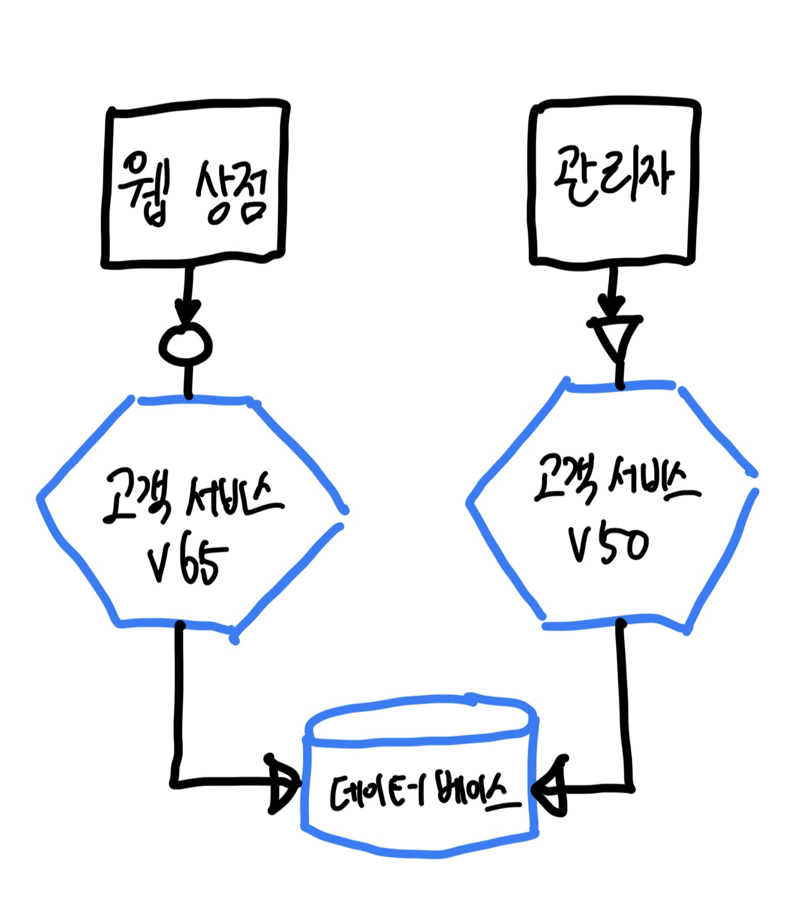
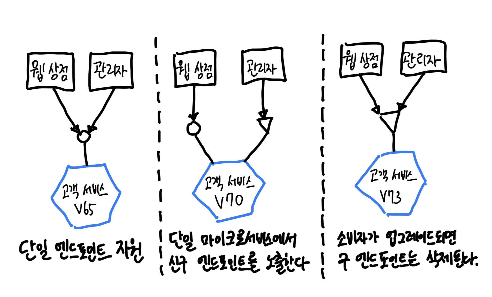

# Chapter 05 마이크로서비스의 통신 구현

## 1. 이상적인 기술을 찾아서

- SOAP, XML-RPC, REST, gRPC

### 1-1. 하위 호환성을 쉽게 하라

- 마이크로서비스를 변경할 때는 이 서비스를 소비하는 마이크로서비스와의 호환성이 깨지지 않도록 해야 한다.

### 1-2. 인터페이스를 명시적으로 만들라

- 마이크로서비스가 노출하는 기능이 마이크로서비스 소비자에게 분명하다는 것을 의미한다.
- 하지만 외부 당사자를 위해 어떤 기능이 그대로 유지되는지 마이크로서비스에서 작업하는 개발자에게 분명하게 전달된다는 의미이기도 한다.
- 마이크로서비스의 변경으로 인해 우발적으로 호환성이 깨지는 상황은 피하고 싶다.

### 1-3. API를 기술 중립적으로 유지하라

- 새로운 도구, 프레임워크, 프로그래밍 언어는 항상 등장해서 더 빠르고 효과적으로 작업하는 데 도움이 되는 아이디어를 구현한다.
- 마이크로서비스를 구현하는 데 사용될 기술 스택을 강요하는 통합 기술은 피해야 한다.

### 1-4. 소비자를 위해 서비스를 단순하게 만들라

- 마이크로서비스를 사용하는 비용이 하늘을 찌를 정도로 높다면, 마이크로서비스를 아름답게 만드는 것은 그다지 중요하지 않다.
- 소비자들이 우리의 새롭고 멋진 서비스를 쉽게 사용할 방법이 무엇인지 생각해보자.

### 1-5. 내부 구현 세부 사항을 숨겨라

- 소비자가 우리의 내부 구현에 종속되는 상황을 바라지 않는 것은 결합이 증가하기 때문이다.
  - 마이크로서비스 내부에서 무언가를 변경하려는 경우 소비자에게도 변경을 요구해 소비자를 불편하게 만들 수 있다.
- 소비자 또한 업그레이드해야 한다는 두려움 때문에 변경을 꺼리는 경향이 있다.

<br/>

## 2. 기술 선택

#### `원격 프로시저 호출 remote procedure call`

- 원격 프로세스에서 로컬 메소드를 호출할 수 있는 프레임워크다.
- 일반적으로 SOAP와 gRPC 중에서 선택한다.

#### `REST`

- HTTP 요청 및 응답

#### `그래프QL GraphQL`

- 소비자가 여러 하위 마이크로서비스에서 정보를 가져올 수 있는 사용자 지정 쿼리를 정의하고 필요한 결과만 반환하기 위해 필터링할 수 있으며, 상대적으로 새로운 프로토콜이다.

#### `메시지 브로커 message broker`

- 큐나 토픽을 통해 비동기 통신을 허용하는 미들웨어다.

### 2-1. 원격 프로시저 호출 Remote Procedure Call, RPC

- 로컬 호출을 통해 어딘가에 있는 원격 서비스를 실행하는 기술.
- 이 분야 기술 대부분은 SOAP나 gRPC와 같은 명시적 스키마를 필요로 한다.
  - RPC 맥락에서 스키마는 종종 인터페이스 정의 언어(interface definition language, IDL)라고 한다.
  - SOAP는 해당 스키마를 웹서비스 정의 언어(web service definition language, WSDL)로 참조한다.
- RPC 기술을 사용한다는 것 = 직렬화 프로토콜에 투자
  - gRPC는 프로토콜 버퍼 직렬화 방식 사용
- 명시적 스키마가 있는 RPC 프레임워크를 사용하면 클라이언트 코드를 생성하기가 매우 쉽다.
  - 어떤 클라이언트도 이 서비스 명세에 대해 스스로 코드를 생성할 수 있으므로 클라이언트 라이브러리가 필요하지 않다.
  - 하지만 클라이언트 측 코드를 생성하려면, 클라이언트는 스키마를 해당 호출 외부에서 가져올 방법이 필요하다.

#### 문제점

- **기술 결합이 발생한다.**
  - 클라이언트와 서버에서 사용될 수 있는 기술을 제한하며 특정 플랫폼에 강력히 묶여 있다.
  - `thrift`와 `gRPC`는 대체 언어에 대한 지원이 훌륭하므로 그 단점을 어느 정도 줄여주지만, RPC 기술에는 때때로 상호 운용성에 대한 제약이 따른다는 점을 유의하라.
- **로컬 호출은 원격 호출과 같지 않다.**
  - RPC의 핵심 개념은 원격 호출의 복잡성을 숨기는 것이지만 과도하게 숨겨질 수 있다.
  - 충분히 생각해보지 않은 채로 로컬 API를 가져와 서비스 경계를 만들려고 하면 문제가 될 수 있다.
  - 분산 컴퓨팅의 첫 번째 오류는 그 유명한 '네트워크는 신뢰할 수 있다'는 생각이다. **네트워크는 신뢰할 수 없다.**
- **깨지기 쉽다.**
  - 일부 RPC 구현체는 고약한 형태의 `취성 brittleness`(깨지기 쉬운 형태)을 가지고 있는데 자바 RMI가 가장 좋은 예이다.

#### 적용 대상

- gRPC 추천. 다른 구현체는 사용을 피하게 만드는 심각한 문제가 있다.
  - 자바 RMI는 취성과 기술 선택의 제한이라는 측면에서 많은 문제가 있다.
  - SOAP는 개발자 관점에서 상당히 무겁다.
- 유의사항
  - 네트워크가 완전히 숨겨져 있을 정도로 원격 호출을 추상화하지 말자. 
  - 클라이언트와 보조를 맞춰 업그레이드하지 않아도 서버 인터페이스를 개선할 수 있는지 확인하라.
- gRPC는 동기식 요청 및 응답 모델에 잘 맞지만 `반응형 확장 reative extension`과도 잘 어울리며, 스펙트럼의 클라이언트 쪽 모두를 잘 제어할 수 있는 상황에 처할 때마다 제일 먼저 고려하자.

### 2-2. REST

- REST에서 `리소스 resource`라는 개념이 가장 중요하다.
- 다양한 REST 형식을 비교한 `리차드슨 성숙도 모델 Richardson Maturity Model`
  - 링크: https://martinfowler.com/articles/richardsonMaturityModel.html

#### REST와 HTTP

- HTTP 메소드는 리소스와 함께 작동하는 방법에 대하 HTTP 명세에서 이미 잘 이해되도록 정의돼 있다.
- HTTP는 도구화 기술을 지원하는 대규모 생태계도 제공한다.
  - 따라서 `바니시 Vanish`와 같은 HTTP 캐싱 프록시와 mod_proxy와 같은 로드 밸런서를 사용하게 됐고, 많은 모니터링 도구가 이미 기본적으로 HTTP를 지원하고 있다.
  - HTTP 생태계는 보안 프로세스를 더 쉽게 만드는 많은 도구를 제공한다. (전제: HTTP를 잘 사용해야 한다.)
- HTTP는 RPC를 구현하는 데도 사용할 수 있다는 사실을 알아두자.
  - SOAP는 HTTP를 통해 라우팅되지만 불행히도 HTTP 명세를 따르진 않는다.
  - gRPC는 단일 커넥션을 통해 여러 요청 및 응답 스트림을 전송하는 기능과 같은 HTTP/2의 기능을 활용하도록 설계됐다.
  - 하지만 gRPC를 사용할 때 단지 HTTP를 사용한다고 해서 REST를 한다고 말할 수는 없다.

#### 애플리케이션 상태 엔진으로서의 하이퍼미디어(HATEOAS)

- 클라이언트와 서버 간의 결합을 피하고자 REST에 도입된 또 다른 원칙은 **하이퍼미디어를 애플리케이션 상태의 엔진**으로 보는 개념이다. `Hypermedia As The Engine Of Application State, HATEOAS`
- 하이퍼미디어는 다양한 포맷(텍스트, 이미지, 사운드)으로 된 여러 다양한 콘텐츠에 대한 링크가 콘텐츠에 포함된 개념이다.
  - HATEOAS의 이면에는 클라이언트가 다른 리소스에 대한 링크를 통해 서버와의 상호작용을 수행해야 한다는 생각이 자리 잡고 있다.
  - 클라이언트는 어떤 URI를 호출할지 알고 있으므로 고객이 서버 어디에 있는지 알 필요가 없다.
  - 대신 클라이언트는 필요한 것을 찾기 위해 링크를 찾아내고 탐색한다.
- 하이퍼미디어 컨트롤을 통해 우리는 전자 소비자를 위한 동일한 수준의 '지능'을 달성하려고 한다.
  - 아래 예시는 뮤직코프에서 사용하는 하이퍼미디어 컨트롤이다.

```html
<album>
  <name>Give Blood</name>
  <link rel="/artist" href="/artist/theBrakes" />
  <desciprtion>
    Awesome, short, brutish, funny and loud. Must buy!
  </desciprtion>
  <link rel="/instantpurchase" href="/instantPruchase/1234" />
</album>
```

1. 이 하이퍼미디어 컨트롤은 아티스트에 대한 정보를 어디서 찾을지 보여준다.
2. 그리고 앨범을 구매하고 싶다면 이제 어디로 가야 할지 알고 있다.

- 클라이언트 입장에서는 앨범을 구매하기 위해 어떤 URI `스킴 scheme`에 접근해야 하는지 알 필요가 없다.
  - 자원에 접근하고 구매 컨트롤을 찾아 이동하기만 하면 된다.
  - 구매 컨트롤 위치가 변경되거나 URI가 변경될 수 있고, 사이트가 우리를 완전히 다른 서비스로 보낼 수도 있다.
  - 이는 클라이언트와 서버 사이에 엄청난 분리가 이뤄진다.
- 근본적으로 REST의 많은 개념이 분산형 하이퍼미디어 시스템을 만드는 것을 전제로 하는데, 대부분의 사람들이 이런 시스템을 구축하는 것은 아니다.

#### 문제점

- 문제는 클라이언트 라이브러리가 클라이언트와 서버 간의 결합과 관련해 몇 가지 문제를 일으킬 수 있다는 것이다.
  - 최근 몇 년동안 이 문제는 다소 완화됐다.
  - Swagger 프로젝트에서 파생된 OpenAPI 명세 => REST Endpoint에 대한 충분한 정보 제공
- 성능이 문제가 될 수 있다.
  - Thrift 수준의 최적화된 바이너리 프로토콜에는 미치지 못한다.
  - HTTP 요청마다 발생하는 오버헤드는 낮은 지연 시간이 필요한 요구 사항에서 문제가 될 수 있다.
  - 하지만 HTTP/3의 QUIC 프로토콜 등장. 지연 시간 개선과 대역폭 감소와 같은 중요한 개선을 이뤄냈다.
- 특히 HATEOAS와 관련해 추가적인 성능 문제가 발생할 수 있다.
  - 클라이언트는 주어진 작업에 대한 정확한 엔드포인트를 찾기 위해 여러 컨트롤을 탐색해야 하므로 매우 복잡한 프로토콜이 발생할 수 있다.
  - 연산마다 많은 왕복 호출이 발생할 수 있다.

#### 적용 대상

- 가능한 한 다양한 클라이언트와 액세스를 허용하려는 경우라면 동기식 요청 및 응답 인터페이스를 위한 확실한 선택지.
- REST API는 대규모 요청을 효과적으로 캐싱해야 하는 상황에서 뛰어나다.

### 2-3. GraphQL

- 클라이언트 측 장치가 동일한 정보를 검색하기 위해 여러 번 요청할 필요가 없도록 쿼리를 정의할 수 있으며, 이로써 제한된 클라이언트 측 장치의 성능 면에서 상당한 향상을 이뤄내 맞춤형 서버 측 집계를 구현하지 않아도 될 수 있다.ㄴ

#### 문제점

- 클라이언트 장치는 동적으로 변경되는 쿼리를 실행할 수 있다.
  - 서버 측에 상당한 부하를 주는 GraphQL 쿼리가 만들어질 수 있다는 의미다.
  - SQL에서는 문제가 있는 쿼리를 진단하는 데 도움이 되는 데이터베이스용 `쿼리 플래너 query planner`와 같은 도구가 존재한다.
  - 하지만 GraphQL에서는 유사한 문제를 추적하기 더 어렵다.
- HTTP 기반 REST API와 비교하면 캐싱도 더 복잡하다.
  - REST 기반 API를 사용하면 많은 응답 헤더 중 하나를 설정해 클라이언트 측 장치나 CDN과 같은 중간 캐시가 응답을 캐싱해 다시 요청할 필요가 없도록 할 수 있다.
  - GraphQL에서는 이와 같은 방식이 불가능하다.
- GraphQL이 이론적으로 **쓰기**를 처리할 수 있지만 적합하지 않아 보인다.
  - 마이크로서비스를 단지 데이터베이스를 감싼 것으로 취급하는 생각은 매우 큰 문제가 될 수 있다. 서비스는 여전히 고유의 내부 로직과 동작이 있어야 한다.

#### 적용 대상

- 외부 클라이언트에 기능을 노출하는 시스템의 경계에서 사용하는 데 가장 적합하다.
  - 일반적으로 GUI. 최종 사용자에게 데이터를 표시하는 제한적인 기능과 모바일 네트워크의 특성 면에서 제약이 있는 모바일 장치에 확실히 적합.

### 2-4. 메시지 브로커

- 중개자로서 프로세스 사이에 위치해 프로세스 간의 통신을 관리.

#### 토픽과 큐

- 브로커는 `큐 Queue`나 `토픽 Topic` 또는 두 가지 모두 제공하는 경우가 많다.
  - 큐는 일반적으로 두 지점 간이다. (point to point)
  - 토픽 기반 시스템을 사용하면 여러 소비가 토픽을 구독할 수 있으며, 구독한 소비자는 해당 메시지의 복사본을 받는다.
- 메시지가 큐에 들어가면 소비자 그룹의 한 구성원만 해당 메시지를 받는다. 이는 큐가 부하 분산 메커니즘으로 작동함을 의미하며, 경쟁 소비자 패턴의 한 가지 예다.
- 토픽을 사용하면 여러 소비자 그룹을 가질 수 있다. 메시지는 여러 그룹에 브로드캐스트된다. 하지만 소비자 그룹의 인스턴스 하나만 해당 이벤트를 볼 수 있다.

#### 전달 보장 guaranteed delivery

- 전달 보장은 메시지 전달을 보장하기 위한 브로커의 약속을 설명한다.
- 전달 보장을 하기 위해 브로커는 아직 배달되지 않은 메시지가 배달될 때까지 지속저긴 방법으로 메시지를 유지해야 한다.
  - 브로커는 일종의 클러스터 기반 시스템으로 실행돼 한 머신이 고장 나더라도 메시지가 손실되지 않도록 한다.
  - 하지만 브로커가 올바르게 설정되지 않으면 종종 전달 보장에 대한 약속을 지킬 수 없게 된다.

#### 신뢰

- 브로커를 만든 사람뿐만 아니라 브로커의 운영 방식도 신뢰해야 한다.

#### 다른 특성

- 대부분의 브로커는 메시지가 전달되는 순서를 보장할 수 있다. (보편적인 특성은 아니다.)
- 쓰기 트랜잭션을 제공한다.
  - 단일 트랜잭션에서 여러 토픽에 쓸 수 있다.
  - 일부 브로커는 읽기 트랜잭션도 사용할 수 있다고 한다.
- '정확히 한 번'만 전달하는 기능이 있다. (다소 논란의 여지가 있다.)
  - 소비자가 메시지를 한 번 이상 받을 수 있고 이러한 상황을 처리할 수 있다는 사실에 대비한 형식으로 구축하는 것이 더 나은 방법이다.
  - 아주 간단한 예는 각 메시지에 ID를 포함시키는 것이다.

#### 선택

- 다양한 메시지 브로커. RabbitMQ, ActiveMQ, Kafka, AWS의 SQS와 SNS 그리고 Kinesis.

#### Kafka

- 최근 인기가 많은 카프카는 특수한 브로커로서 주목할 가치가 있다.
- 이 인기는 스트림 프로세싱 파이프라인의 구현으로 대용량 데이터를 이동하는 데 카프카가 유용하다는 점에서 기인한다.
  - 또한 배치 지향 처리에서 좀 더 실시간적인 처리로 전환하는 데도 도움이 된다.
- 카프카는 대규모를 위해 설계됐다.
  - 기존의 여러 메시지 클러스터를 단일 플랫폼으로 대체하기 위해 만들어졌다.
- 카프카는 메시지 영속성 개념이 있다.
  - 메시지 저장 기간을 설정할 수 있다.
  - 이를 통해 소비자가 이미 처리한 메시지를 다시 받아오거나, 새로 배포된 소비자가 이전에 전송된 메시지를 처리할 수 있다.
- 스트림 처리를 기본으로 제공한다.
  - 아파치 플린크와 같은 전용 스트림 프로세싱 도구로 메시지를 보내는 대신 몇몇 작업은 카프카 내부에서 수행할 수 있다.


<br/>

## 3. 직렬화 포맷

- 예를 들어 gRPC를 사용하면 전송된 모든 데이터는 프로토콜 버퍼 형식으로 변환된다.
- 많은 기술은 네트워크 호출을 위해 데이터를 은닉하는 유연한 방법을 제공한다.
- 브로커로 카프카를 선택한다면 다양한 포맷으로 메시지를 보낼 수 있다.

### 3-1. 텍스트 포맷

- 표준 텍스트 포맷을 사용하면 클라이언트가 자원을 사용하는 방법이 훨씬 유연해진다.
  - 요청 및 응답 바디에 텍스트 포맷을 가장 많이 사용한다.
  - 실제로 gRPC는 하부에 HTTP를 사용하지만 바이너리 프로토콜 버퍼를 전송하는 방식을 사용한다.
- JSON은 텍스트 직렬화를 위한 선택지에서 XML의 자리를 대체했다.
  - JSON은 XML보다 간결하고 단순하다.
  - 페이로드는 통상적으로 압축되기 때문에 차이가 없다.
  - JSON은 더 단순한 프로토콜을 채택하려고 서두르는 바람에 스키마는 사라져갔다.
- 아브로는 흥미로운 직렬화 포맷이며 JSON을 기본 구조로 사용해 스키마 기반의 포맷을 정의한다.
  - 부분적으로 스키마를 페이로드의 일부로 전송할 수 있는 기능 덕분에 메시지 페이로드 포맷으로 많은 인기를 얻었다.
- 몇몇 도구의 지원은 XML이 더 나을 수 있다.
  - 예를 들어 페이로드의 특정 부분만 추출하려는 경우 많은 도구를 지원한다. (XPATH, CSS Selector)
  - JSON에도 JSONPath가 있지만 널리 지원되지는 않는다.

### 3-2. 바이너리 포맷

- 바이너리 직렬화 프로토콜의 세계는 페이로드 크기나 페이로드의 쓰기 및 읽기 효율성을 걱정하기 시작하면 사람들이 찾게 되는 분야다.
- 다양한 요구 사항을 고려해 여러 포맷이 개발됐고 `Simple Binary Encoding, SBE`와 같은 포맷이 있다.
- 직렬화 포맷에서 마지막 몇 바이트를 늘리거나 이와 같은 페이로드를 읽거나 쓰는 데 소요되는 시간을 마이크로초 단위로 줄이려면 이런 다양한 포맷을 직접 비교하는 것을 적극 권장한다.

<br/>

## 4. 스키마

- 엔드포인트가 노출하고 수용하는 것을 정의하기 위해 스키마를 사용할지를 두고 현재 논의가 계속되고 있다.
  - 스키마는 다양한 타입 가능.
  - 직렬화 포맷을 선택하면 일반적으로 사용 가능한 스키마 기술을 정의하게 된다.
  - XML => XSD
  - JSON => JSON Schema
  
#### 명시적 스키마를 사용하는 이유

1. 스키마는 마이크로서비스 엔드포인트가 노출하는 것과 수용할 수 있는 것을 명시적으로 표현하는 데 중요한 역할을 한다.
2. 마이크로서비스의 엔드포인트가 우발적으로 파손(고장)되는 것을 탐지하는 데 도움이 되기 때문이다.

### 4-1. 구조적 계약 위반 대 의미적 계약 위반

- 대체적으로 위반은 `구조적 structural` 위반과 `의미적 semantic` 위반이라는 두 가지 형태로 분류할 수 있다.
- 구조적 위반은 소비자가 더 이상 호환되지 않는 방식으로 엔드포인트의 구조가 변경되는 상황
  - 필드나 메소드가 제거. 새로운 필드가 추가되는 것.
- 의미적 계약 위반은 마이크로서비스의 구조는 동일하게 유지되지만 소비자의 기대와 다른 방식으로 행동 양식이 변경되는 상황

### 4-2. 스키마를 사용해야 할까?

- 스키마를 사용하고 다른 버전의 스키마를 비교하면 `구조적 위반`을 포착할 수 있다.
  - 스키마가 없거나 스키마가 있지만 호환성을 위해 스키마 변경 사항을 비교하지 않기로 결정했다면, 운영 환경에 도달하기 전에 구조적 파손을 포착하는 책임도 테스트에 있다.
  - 이 상황은 프로그래밍 언어의 정적 타입과 동적 타입을 비교하는 것과 유사하다.
  - 정적 타입 언어 => 타입이 컴파일 시간에 고정
  - 동적 타입 언어 => 컴파일러로 에러를 잡을 수 없어 테스트로 잡아야 함.
- `의미적 파손`을 포착하려면 테스트를 사용해야 한다.
- 진짜 문제는 스키마의 실제 존재 여부가 아니라 해당 스키마가 `명시적 explicit`인지 여부다.
  - 마이크로서비스가 무엇을 노출할지에 대해 가능한 한 명시적인 것은 중요하다.

<br/>

## 5. 마이크로서비스 간의 변경 처리

- "얼마나 커야 할까요?" 다음으로 마이크로서비스에 대해 가장 많이 받는 질문은 "버전 관리를 어떻게 처리할까요?"일 것이다.
- 변화를 처리하는 방법은 실제로 두 가지 주제로 나뉘다.

<br/>

## 6. 중단 변경 피하기

### 6-1. 확장 변경 expansion changes

- 마이크로서비스 인터페이스에 새로운 것을 추가하라. 다만 오래된 것은 제거하지 않아야 한다.

### 6-2. 관대한 독자 tolerant reader

- 마이크로서비스 인터페이스를 사용할 때 기대하는 것에 유연해야 한다.
  - 소비자가 구현되는 방식은 하위 호환되는 변경을 쉽게 만드는 데 많은 영향을 미칠 수 있다.
  - 특히 클라이언트 코드가 마이크로서비스의 인터페이스와 너무 강하게 바인딩되는 것은 피하고 싶다.
- 관심 없는 변경 사항은 무시할 수 있는 독자를 구현하는 이 패턴을 `관대한 독자 tolerant reader`라고 한다. (마틴 파울러)
- 서비스를 최대한 유연하게 이용하려고 노력하는 클라이언트에 대한 예제는 **견고한의 원칙**으로 잘 알려진 `포스텔의 법칙 Postel's law`를 보여준다.
  - 링크: https://datatracker.ietf.org/doc/html/rfc761
  - '당신이 하는 일에는 엄격하고, 남에게서 받아들일 때는 너그럽게 하라'

### 6-3. 올바른 기술 right technology

- 인터페이스에 하위 호환 가능한 변경 사항을 쉽게 적용하는 기술을 선택하라.
- 일부 기술은 인터페이스를 변경할 때 더 취약하다. (like JAVA RMI)
- 반면에 일부 통합 구현체는 클라이언트를 중단하지 않고도 가능한 한 쉽게 변경할 수 있게 한다.
  - gRPC 일부로 사용되는 직렬화 포맷인 프로토콜 버퍼에는 필드 번호의 개념이 있다.
  - 프로토콜 버퍼의 각 항목에는 클라이언트 코드가 찾을 것으로 예상되는 필드 번호를 정의해야 한다.
  - 새 필드가 추가되더라도 클라이언트는 신경쓰지 않는다.

### 6-4. 명시적 인터페이스 explicit interface

- 마이크로서비스가 노출하는 내용은 명확해야 한다. 이를 통해 클라이언트는 작업을 더 쉽게 수행하고, 마이크로서비스의 유지 보수자는 자유롭게 변경할 수 있는 것을 더 쉽게 이해한다.
- 명시적 스키마를 사용하면
  - 소비자가 무엇을 기대하는지 분명히 할 수 있다.
  - **소비자를 중단시키지 않으려면 어떤 것을 건드리지 말아야 하는지 마이크로서비스를 작업하는 개발자도 훨씬 더 명확히 알게 된다.**
- 비동기 메시지 프로토콜은 이 분야에서 많은 어려움을 겪었다.
  - 이벤트를 발행하는 마이크로서비스를 고려한다면 어떤 이벤트를 노출할까?
  - 이벤트 기반 엔드포인트에 대한 명시적 스키마를 만드는 몇 가지 시도가 현재 진행 중이다. 
  - 가장 많은 사용자 확보한 것은 `AsyncAPI`, 가장 주목받고 있는 것은 `Cloud Native, Computing Foundation, CNCF`

> #### 시맨틱 버전 관리
> - 클라이언트 입장에서 서비스의 버전 번호만 보고 서비스에 통합할 수 있는지 알 수 있다면 얼마나 좋을까?
> - 시맨틱 버전 관리는 이를 가능하게 하는 명세다.
> - 시맨틱 버전 관리에서 각 버전 번호는 `MAJOR.MINOR.PATCH` 형태로 표시된다.
> - 이 버전 관리 체계를 통해 많은 정보와 기대치를 단 3개의 필드에 담을 수 있다.

### 6-5. 우발적 중단 변경을 일찍 발견하기

- 변경 사항이 배포되기 전에 운영 환경에서 소비자를 중단시킬 만한 변경 사항을 찾아내는 메커니즘이 있어야 한다.
- 스키마 버전을 비교하는 데 도움이 되는 일종의 도구를 사용하면 구조적 변화를 찾는 데 도움이 될 수 있다.
  - 프로토콜 버퍼용 `프로토락 Protolock`
  - JSON 스키마용 `json-schema-diff-validator`
  - OpenAPI 명세영 `openapi-diff`
- 하지만 두 스키마 간의 차이점을 리포트하는 것보다는 호환성에 따라 성공 또는 실패 여부를 판단해 호환되지 않는 스키마가 발견되면 CI 빌드에 실패함으로써 마이크로서비스가 배포되지 않도록 하는 도구가 좋다.
  - 오픈 소스 `컨플루언트 스키마 레지스트리 Confluent Schema Registry`
  - JSON 스키마, 아브로, 프로토콜 버퍼를 지원하며 하위 호환성을 위해 새로 업로드된 버전을 비교할 수 있다.
  - 이 도구는 카프카가 사용되는 생태계의 일부로서 지원하기 위해 만들어졌으며, 카프카 실행이 필요하지만 카프카 기반이 아닌 통신에 사용되는 스키마를 저장하고 검증할 수 있다.
- 스키마 비교 도구는 구조적 위반을 알아채는 데 도움이 되지만, 의미적 위반인 경우는 어떨까?
  - 아니면 애초에 스키마를 사용하지 않았다면 어떨까?
  - 그렇다면 테스트를 살펴봐야 한다.

<br/>

## 7. 중단 변경 관리하기

- 하위 호환성을 보장하도록 최대한 노력했지만, 중단 변경이 필요한 변경을 해야 한다는 사실을 알게 됐다.
- 이러한 상황헤서는 어떻게 해야 할까? 3가지 선택지가 있다.

### 7-1. 락스텝 배포 lockstep deployment

- 인터페이스를 노출하는 마이크로서비스와 이 인터페이스의 모든 소비자를 동시에 변경하는 것이 요구된다.
- 독립적인 배포 가능성과 대치된다. 소비자에게 새로운 인터페이스로 업그레이드할 시간을 주어야 한다.

### 7-2. 호환되지 않는 마이크로서비스 버전의 공존

- 마이크로서비스 이전 버전과 새 버전을 나란히 실행한다.
- 서비스의 다른 버전들을 한 번에 실행하고 이전 소비자의 트래픽을 이전 버전으로 라우팅해 새 소비자가 새 버전을 보게 하는 것이다.
- 레거시 장치가 여전히 이전 버전의 API와 묶인 경우와 같이 오래된 소비자를 변경하는 비용이 너무 높은 상황에서 넷플릭스가 드물게 사용하는 방식이다.
  - 필자는 이 아이디어를 좋아하지 않는다고 함.
1. 서비스의 내부 버그를 수정해야 하는 경우 이제 2개의 서로 다른 서비스 세트를 수정하고 배포해야 한다.
2. 소비자를 올바른 마이크로서비스로 유도하는 데 지능이 필요다하는 것을 뜻한다. => 복잡성을 가중한다.



### 7-3. 기존 인터페이스 에뮬레이션

- 마이크로서비스가 새 인터페이스를 노출하고 기존 인터페이스도 에뮬레이트하도록 한다.
- 인터페이스를 깨드리는 변경을 피하고자 최선을 다했다면 다음 작업은 그 영향도를 제한하는 것이다.
- 이를 위해 신/구 버전의 엔드포인트를 동시에 노출하는 새로운 버전의 서비스를 배포한다.
  - 새로운 마이크로서비스를 가능한 한 빨리 출시할 수 있으며, 동시에 소비자가 옮겨갈 시간을 확보할 수 있다.
  - 모든 소비자가 더 이상 구 엔드포인트를 사용하지 않으면 아래와 같이 연결된 코드와 함께 제거할 수 있다.



- 모든 코드를 유지하고 코드가 전부 제대로 작동하는지 확인하는 데 필요한 관련 테스트는 전적으로 추가 부담이 된다.
  - 이를 좀 더 쉽게 관리할 수 있도록 내부적으로 V1 엔드포인트에 대한 모든 요청을 V2 요청으로 변환한 후 V2 요청을 V3 엔드포인트로 변환할 수 있다.
  - 이를 통해 이전 엔드포인트가 종료될 때 어떤 코드가 폐기될지 명확히 구분할 수 있다.
- 엔드 포인트를 공존시키려면 호출자가 요청을 적절히 라우팅할 방법이 필요하다.

### 7-4. 어떤 방식을 선호하는가?

- 같은 팀이 마이크로서비스와 소비자 모두 관리하는 상황이라면 제한된 상황에서 락스텝 릴리스를 사용하는 것은 다소 안심이 된다.
  - 영향도가 단일팀이라면 락스텝 배포를 하자.
  - 하지만 일회성이 아닌 일상 업무가 될 위험이 있고 독립적 배포 가능성이 있다면 이 방식은 지양. (락스텝 배포가 잦으면 머지않아 분산형 모놀리스가 될 것이다.)
- 필자는 가능하면 구 엔드포인트를 에뮬레이션하는 것을 대체로 선호한다고 함.
  - 공존하는 마이크로서비스 버전의 문제보다 에뮬레이션 구현의 문제를 훨씬 쉽게 처리할 수 있다고 보기 때문.

### 7-5. 사회적 계약

- 어떤 접근 방식을 선택하느냐는 이러한 변경이 어떻게 이뤄질지에 대한 소비자의 기대치에 따라 크게 달라진다.
- 이전 인터페이스를 계속 사용하려면 비용이 발생할 수 있으므로 가능한 한 빨리 인터페이스를 종료하고 관련 코드와 인프라를 제거하는 것이 이상적이다.
- 마이크로서비스 유지 관리자의 요구와 소비자의 요구가 균형을 이루도록 조정해야 하며 논의가 필요한 사항이다.
1. 인터페이스를 변경해야 할 이슈는 어떻게 제기할 것인가?
2. 소비자와 마이크로서비스 팀이 변경될 사항에 동의하도록 어떻게 협업할 것인가?
3. 소비자를 업데이트하기 위해 누가 작업을 수행할 것인가?
4. 변경 사항에 동의한다면, 소비자가 인터페이스를 제거하기 전에 새로운 인터페이스로 전환하기까지 얼마나 걸리는가?

- 효과적인 마이크로서비스 아키텍처의 비밀 중 하나는 소비자 우선 방식을 수용하는 것임을 기억하라.
  - 우리의 마이크로서비스는 소비자가 호출하기 위해 존재한다.
  - 소비자의 요구는 가장 중요하며 업스트림 소비자에게 문제를 일으킬 마이크로서비스를 변경하는 경우 반드시 고려해야 한다.
- 오래된 인터페이스를 지원하는 데 드는 비용과 해당 소비자로부터 얻는 수익을 견줘봐야 한다.

### 7-6. 사용자 추적

- 소비자가 오래된 인터페이스 사용을 중단해야 하는 시점에 여러분이 동의하더라도 실제로 사용을 중단했는지 알 수 있을까?
  - 마이크로서비스가 노출하는 각 엔드포인트에 로그인을 보장하면 도움이 된다.
  - 예를 들어 클라이언트 식별자를 넣도록 소비자에게 요구하는 것은 간단한 일일 것이다.
  - 또는 반드시 키가 필요한 일종의 API 게이트웨이에 모든 호출이 통과하도록 요구할 수 있다.

### 7-7. 극단적 조치

- 제거하려는 오래된 인터페이스를 소비자가 여전히 사용 중이고 새 버전으로 전환하는 것을 주저하고 있다면 어떻게 해야 할까?
  - 가장 먼저 할 일은 그들과 대화하는 것이다. 변화가 일어나도록 도움을 줘야 한다.
  - 동의했는데도 업그레이드가 되지 않으면 극단적인 기법을 고려할 수 있다.

1. 별다른 조치 없이 1년 후 그냥 마이크로서비스를 꺼버린다??
  - 많은 경우에 효과가 없고 상당한 비효율을 초래
  - 더 일찍 인터페이스를 제거할 기회를 스스로 놓쳤다.
2. 더 좋고 새로운 라이브러리를 사용하기 위해 사용을 중단하려 했던 오래된 라이브러리의 예시
  - 해결책은 오래된 라이브러리에 `슬립 sleep`을 삽입해 호출이 더 느리게 응답하도록 하는 것이었다.
  - 지원 중단을 주도하는 팀은 다른 팀이 메시지를 받을 때까지 계속 지연 시간을 늘렸다.
  - 단, 이와 같은 조치를 고려하기 전에 소비자들이 업그레이드하도록 하기 위해 다른 합리적인 노력을 모두 기울였는지 반드시 확인해야 한다.

<br/>

# 참고 자료

- 마이크로서비스 아키텍처 구축, 샘 뉴먼 지음
