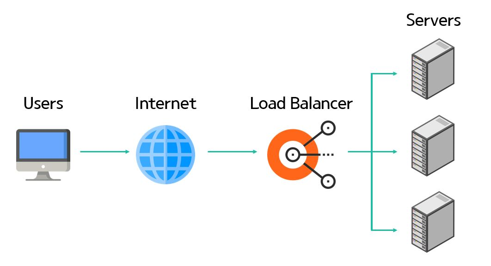
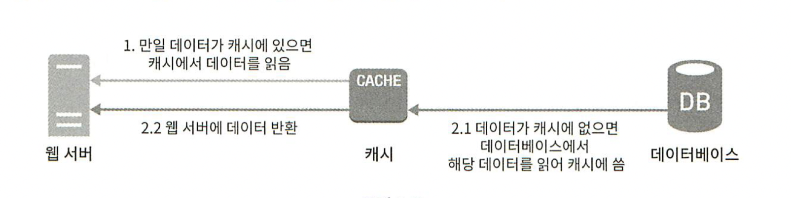
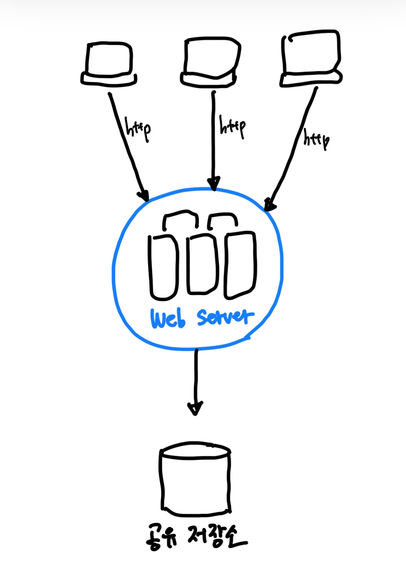
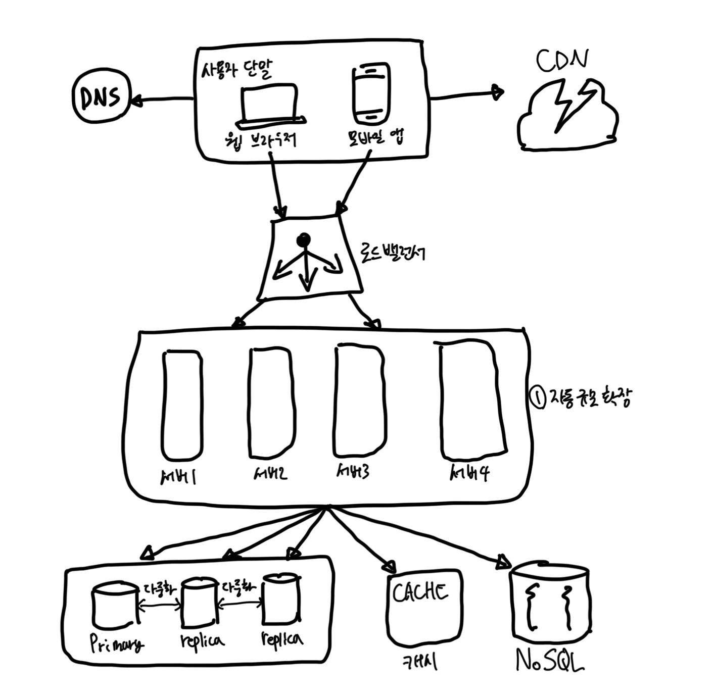
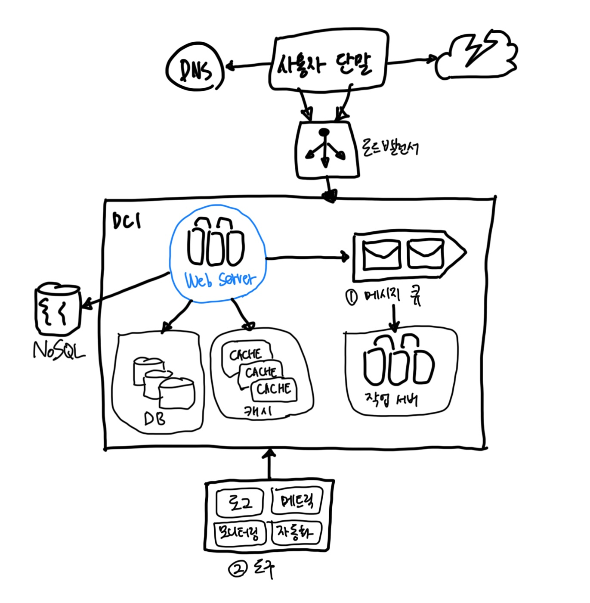
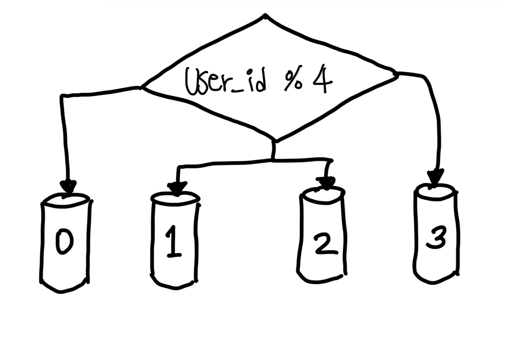

# 사용자 수에 따른 규모 확장성

# 단일 서버

- 웹브라우저, 웹서버, DNS
- 사용자 요청이 어떻게 처리되는지?

1. 사용자는 도메인 주소를 입력 (like www.google.com)
2. DNS(Domain Name Server)에 도메인 주소에 따른 IP 질의
3. 클라이언트는 IP 주소를 반환받음
4. 해당 IP로 HTTP 요청
5. 웹 서버에서 HTML 페이지나 JSON 데이터를 전달

## 데이터베이스

- 관계형 데이터베이스 vs 비관계형 데이터베이스

### 비관계형 데이터베이스가 적합한 경우

- 아주 낮은 지연시간(Latency)이 요구될 때
- 다루는 데이터가 비정형(unstructured)이라 관계형 데이터가 아닐 때
- 데이터(JSON, YAML, XML)를 직렬화 혹은 역직렬화할 수 있기만 하면 될 때
- 아주 많은 양의 데이터를 저장해야할 때

## 수직적 규모 확장 vs 수평적 규모 확장

- Scale Up: 수직적 규모 확장
- Scale Out: 수평적 규모 확장

- Scale Up??
  - 장점
    - 확장이 단순
  - 단점
    - CPU나 메모리를 무한대로 늘릴 수 X
    - 장애 자동복구(failover) 방안이나 다중화(redundancy) 방안을 제시하지 않기 때문에 장애가 발생하면 웹사이트/앱이 완전히 중단
- 따라서 대규모 서비스 운영을 위해서라면 수평적 규모 확장을 고려하는 것이 좋다.

 

# 부하 분산

## 로드밸런서

- 부하 분산 집합(Load Balancing Set)에 속한 웹 서버들에게 트래픽 부하를 고르게 분산하는 역할

- 자동 복구 문제를 해소할 수 있으면 웹 계층의 가용성 향상

## 데이터베이스 다중화

- 주(master)-부(slave) 관계를 설정하고 데이터 원본은 주서버에 사본은 부서버에 저장
- 주서버는 쓰기 연산
- 부서버는 읽기 연산

### 데이터베이스 다중화의 장점

- 성능이 좋아진다. 읽기 연산이 분산된다. 병렬로 처리될 수 있는 query의 수가 늘어난다.
- 안정성(reliability) 증대. DB 하나가 소실되어도 데이터가 보존되어 있기 때문에 복구가 가능하다.
- 가용성(availability) 증대. 하나의 DB에 장애가 발생하더라도 대체 가능.

## 결론

- 웹 서버 부하 분산 = 로드밸런서
- 데이터베이스 서버 부하 분산 = 데이터베이스 다중화

 

# 지연시간(Latency) 개선

## 캐시

- 캐시를 사용하면 응답시간을 개선할 수 있다.
- 애플리케이션의 성능은 데이터베이스를 얼마나 자주 호출하느냐에 크게 좌우 -> 캐시가 이를 완화

### 캐시 계층

- 별도의 캐시 계층은 성능 개선에도 도움이 되지만 데이터베이스의 부하도 줄일 수 있다.
- 캐시 계층의 규모를 독립적으로 확장하는 것도 가능하다.

- 위는 읽기 주도형 캐시 전략이다. 이 외에도 다양한 캐시 전략이 있다.
  - 데이터 종류, 크기, 액세스 패턴에 맞는 전략은 선택

### 사용할 때의 유의점

- 데이터 갱신은 자주 일어나지 않고 참조가 빈번할 때 고려
- 영속적으로 보관할 데이터를 캐시에 담지 말자.
- 적당한 만료 기한이 중요하다. 너무 짧아도 데이터베이스를 자주 읽게 되고, 너무 길어도 원본가 차이가 발생하기 때문에 문제가 된다.
- 데이터베이스와의 일관성 유지
- 장애 대처. 캐시 서버가 하나만 존재하면 단일 장애 지점(Single Point of Failure, SPOF)가 될 가능성이 있다. 캐시 서버를 분산하자.
- 적당한 메모리 크기.
- 데이터 방출 정책. 캐시가 꽉 찼을 때, 새로운 데이터를 넣어야할 경우 기존 데이터를 내보내야 한다. LRU, LFU, FIFO 등의 정책.

 

## 콘텐츠 전송 네트워크 CDN

- 이미지, 비디오, CSS, Javascript 파일 등을 캐시
- 클라이언트가 웹 사이트를 방문하면 지리적으로 가까운 CDN 서버가 정적 콘텐츠를 사용자에게 전달한다.
- 지리적으로 분산된 네트워크이기 때문에 거리가 멀면 응답이 느려진다.

### CDN 사용 시 고려사항

- 비용: CDN은 보통 제 3 사업자에 의해 운영. 데이터 전송 양에 따라 요금을 내기 때문에 자주 참조되지 않는 콘텐츠를 캐싱해두는건 비용적으로 손실이 있다.
- 적절한 만료 시간
- 장애 대처 방안. CDN이 응답하지 않을 경우 어떻게 대처할 지 생각해봐야 한다. 예를 들어, 원본 서버에서 직접 콘텐츠를 가져오도록 클라이언트를 구성할 수 있다.
- 콘텐츠 무효화.

 

# 웹 계층의 수평적 확장

- 웹 계층의 수평적 확장을 위해 상태 정보(ex. 사용자 세션 데이터)를 웹 계층에서 제거해야 한다.
- 바람직한 전략은 상태 정보를 관계형 데이터베이스나 NoSQL 같은 지속성 저장소에 보관하고, 필요할 때 가져오도록 하는 것이다.
- 이렇게 구성된 웹 계층을 무상태 웹 계층이라고 부른다.

## 무상태(Stateless) 웹 계층

- 상태 정보(사용자 세션 데이터와 같은)를 웹 계층에서 제거하여야 한다.
- 바람직한 전략은 상태 정보를 관계형 데이터베이스나 NoSQL 같은 영속적인 저장소에 보관하고, 필요할 때 가져오도록 하는 것이다.
- 이렇게 구성된 무상태 웹 계층이라 부른다.

### 상태 정보 의존적인 아키텍처

- 상태 정보에 의존적인 서버를 사용하면 같은 클라이언트로부터의 요청은 항상 같은 서버로 전송되어야 하는 제약이 생긴다.
  - 로드밸런서가 이를 지원하기 위해 `고정 세션 sticky session`이라는 기능을 제공하고 있는데, 이는 로드밸런서에게 부담을 준다.
  - 또한 뒷단에 서버를 추가하거나 제거하기도 까다로워진다. 서버의 장애를 처리하기도 복잡해진다.

### 무상태 아키텍처

- 상태 정보는 웹 서버로부터 물리적으로 분리되어 있다.
  - 단순하고, 안정적이며, 규모 확장이 쉽다.

- 위의 `자동 규모 확장 autoscaling`은 트래픽 양에 따라 웹 서버를 자동으로 추가하거나 삭제하는 기능을 뜻한다.

## 데이터 센터

- 전 세계 어디서도 쾌적하게 사용할 수 있는 서비스를 만드려면 여러 데이터 센터르르 지원해야 한다.
- 장애가 없는 상황이라면 사용자는 가장 가까운 데이터 센터로 안내된다.
  - 이를 `지리적 라우팅 (geoDNS-routing or geo-routing)`이라고 부른다.
- 만약 데이터 센터 중 하나에 심각한 장애가 발생하면 모든 트래픽은 장애가 없는 데이터 센터로 전송된다.
- 위와 같은 다중 데이터센터 아키텍처를 만드려면 몇 가지 기술적 난제를 해결해야 한다.

1. 트래픽 우회: 올바른 데이터 센터로 트래픽을 보내느 효과적인 방법 찾기
2. 데이터 동기화 `synchronization`: 데이터 센터마다 별도의 데이터베이스를 사용하고 있다면, 장애가 자동으로 복구되어 트래픽이 다른 데이터베이스로 우회된다 해도, 해당 데이터센터에는 찾는 데이터가 없을 수 있다. => 데이터를 여러 데이터센터에 걸쳐 다중화
3. 테스트와 배포: 자동화된 배포 도구를 통해 모든 데이터 센터에 동일한 서비스가 설치되도록!

> #### 참고
> - [넷플릭스에서 데이터 동기화를 처리하는 방법](https://netflixtechblog.com/active-active-for-multi-regional-resiliency-c47719f6685b)

## 메시지 큐

- `무손실 durability`을 보장하는 비동기 통신을 지원하는 컴포넌트.
- 메시지의 버퍼 역할을 하며, 비동기적으로 전송
- 메시지 큐를 사용하면 서비스 또는 서버 간 결합이 느슨해져서, 규모 확장성이 보장되어야 하는 안정적인 애플리케이션을 구성하기 좋다.

## 로그, 메트릭 그리고 자동화

- 로그: 에러 로그 모니터링은 중요. 시스템의 오류와 문제들을 보다 쉽게 찾아낼 수 있도록 도움. 로그를 단일 서비스로 모아주는 도구를 활용하면 더 좋음.
- 메트릭: 사업 현황에 관한 유용한 정보를 얻을 수도 있고, 시스템의 현재 상태를 손쉽게 파악할 수 있다. 특히 유용한 메트릭 정보는 아래와 같다.
  - `호스트 단위 메트릭`: CPU, Memory, Disk I/O
  - `종합 메트릭 aggregated metrics`: 데이터베이스 계층의 성능, 캐시 계층의 성능
  - `핵심 비즈니스 메트릭`: 일별 능동 사용자(daily active user), 수익(revenue), 재방문(retention)
- 자동화: 시스템이 크고 복잡해지면 생산성을 높이기 위해 자동화 도구를 활용해야 한다. 가령 `지속적 통합 continuous integeration`을 도와주는 도구를 활용하면 검증 절차를 통해 문제를 더 쉽게 감지 가능.

### 메시지 큐, 로그, 메트릭, 자동화를 반영한 설계안

1. 메시지 큐는 각 컴포넌트가 보다 `느슨하게 결합 loosely coupled`될 수 있도록 하고, 결함에 대한 내성을 높인다.
2. 로그, 모니터링, 메트릭, 자동화 등을 지원하기 위한 장치를 추가

## 데이터베이스의 규모 확장

### 데이터베이스 수직적 확장(scale up)

- 데이터베이스 서버 하드웨어에는 한계가 있으므로 CPU, RAM 등을 무한 증설할 수 없다.
- SPOF(Single Point of Failure)로 인한 위험성이 크다.
- 비용이 많이 든다. 고성능 서버로 갈수록 가격 상승.

### 데이터베이스 수평적 확장(scale out)

- `샤딩 sharding`

- user_id에 따라 각 샤드 노드에는 값이 아래와 같이 저장될 것이다. (user_id 기준)
  - `0`: 0, 4, 8, 12, ...  
  - `1`: 1, 5, 9, 13, ...
  - `2`: 2, 6, 10, 14, ...
  - `3`: 3, 7, 11, 15, ...

- 샤딩 전략을 구현할 때 고려해야 할 가장 중요한 것은 `샤딩 키 sharding key`를 어떻게 정하느냐이다.
  - 샤딩 키는 `파티션 키 partition key`라고도 부르며, 데이터가 어떻게 분산될지 정하는 하나 이상의 칼럼으로 구성된다.
  - 샤딩 키는 데이터를 고르게 분할할 할 수 있는 방식으로 선택해야 한다.

### 데이터의 재샤딩 resharding

1. 데이터가 너무 많아져서 하나의 샤드로는 더 이상 감당하기 어려울 때
2. 샤드 간 데이터 분포가 균등하지 못하여 어떤 샤드에 할당된 공간 소모가 다른 샤드에 비해 빨리 진행될 때, `샤드 소진 shard exhaustion`이라고도 부르는 이런 현상을 발생하면 샤드 키를 계산하는 함수를 변경하고 데이터를 재배치하여야 한다.

### 유명인사 문제

- `핫스팟 키 hotspot key` 문제라고도 부름.
- 특정 샤드에 질의가 집중되어 서버에 과부하가 걸리는 문제다.
- 진짜 유명인사(?)때문에 발생하는 문제... ex) 인스타그램의 인플루언서가 하나의 샤드에 모여 있다면?

### 조인과 비정규화

- 하나의 데이터베이스르 여러 샤드 서버로 쪼개고 나면, 여러 샤드에 걸친 데이터를 조인하기가 힘들어진다.
- 이를 해결하는 한 가지 방법은 데이터베이스를 비정규화하여 하나의 테이블에서 질의가 수행될 수 있도록 하는 것이다.

## 백만 사용자, 그리고 그 이상

시스템 규모 확장을 위해 살펴본 기법들은 아래와 같다.

- 웹 계층은 무상태 계층으로
- 모든 계층에 다중화 도입
- 가능한 한 많은 데이터를 캐시할 것
- 여러 데이터 센터를 지원할 것
- 정적 콘텐츠는 CDN을 통해 서비스할 것
- 데이터 계층은 샤딩을 통해 그 규모를 확장할 것
- 각 계층은 독립적 서비스로 분할할 것
- 시스템을 지속적으로 모니터링하고, 자동화 도구들을 활용할 것
