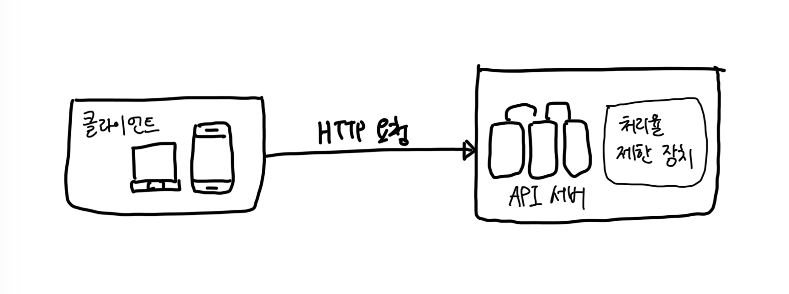
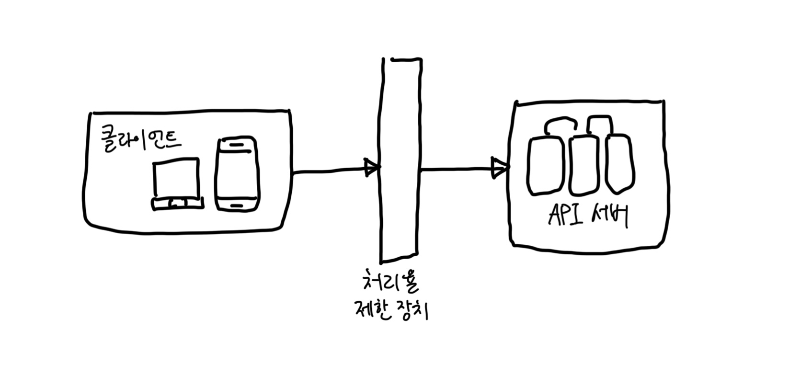
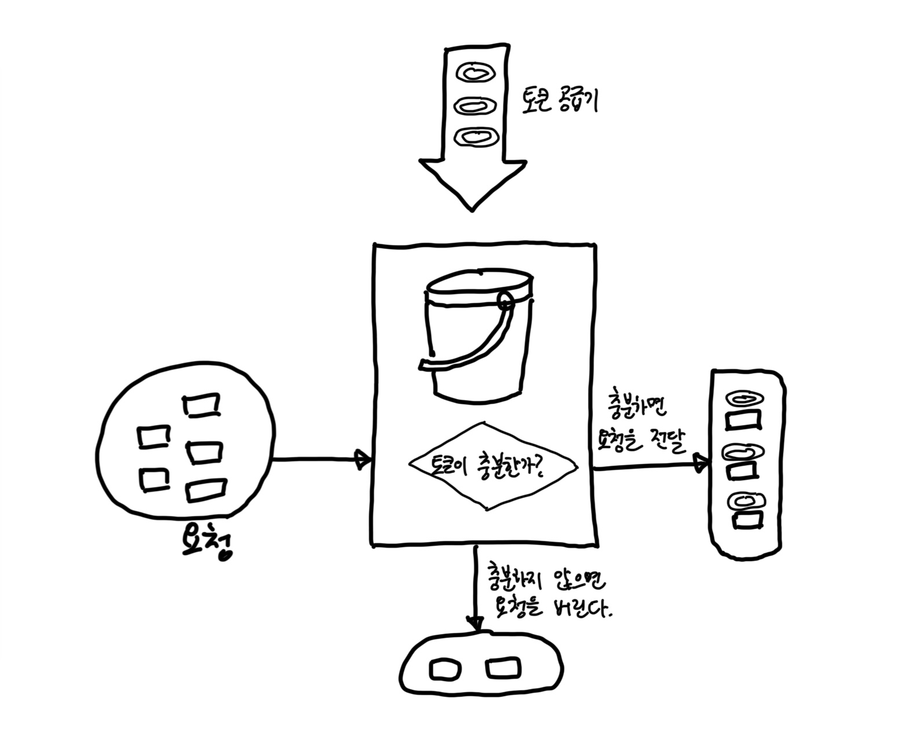
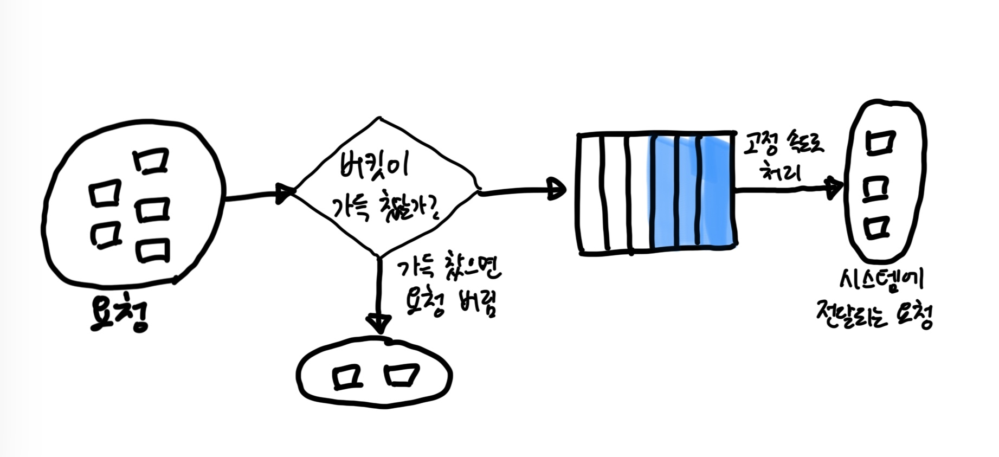
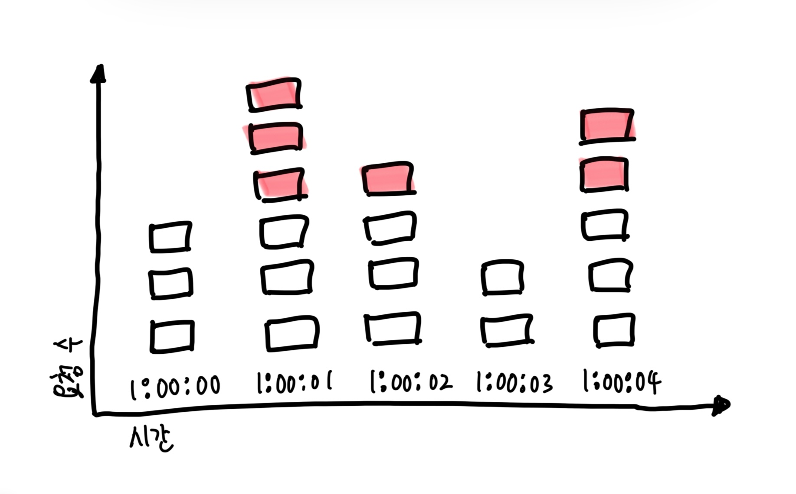
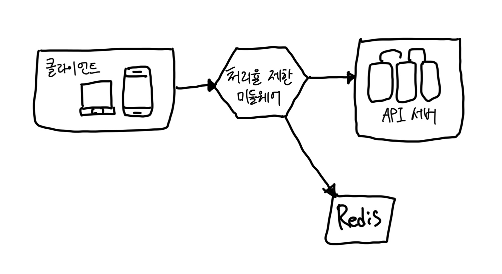
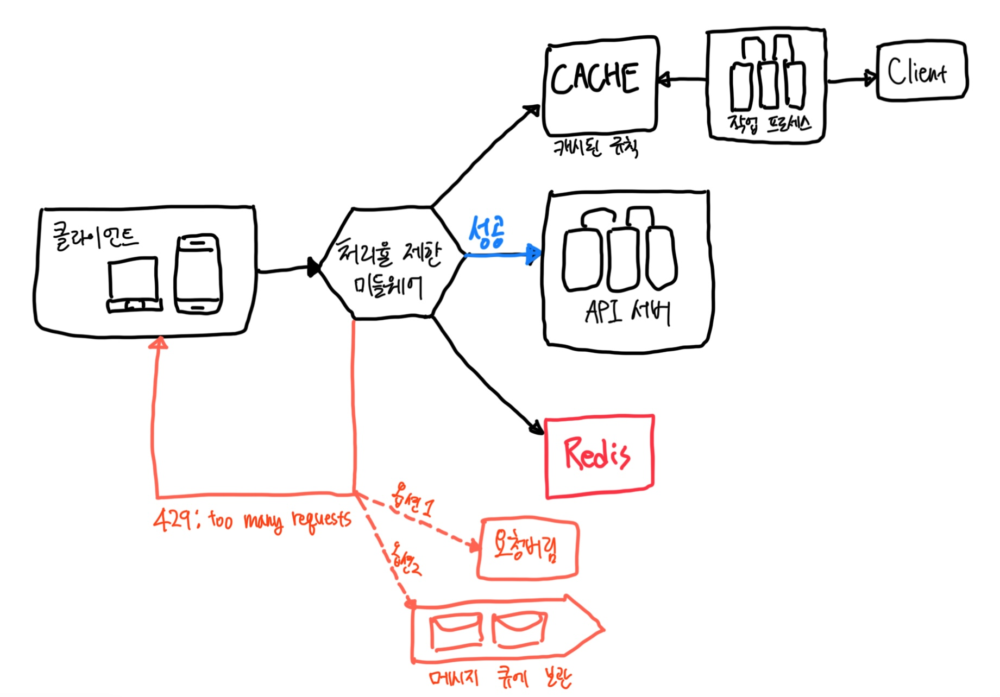
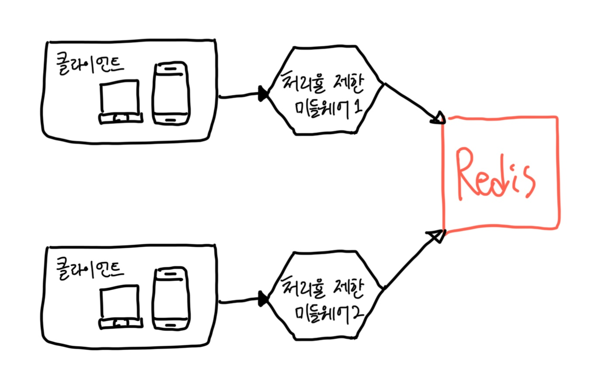

# 4장 처리율 제한 장치의 설계

- `처리율 제한 장치 rate limiter`는 클라이언트 또는 서비스가 보내는 트래픽의 처리율을 제어하기 위한 장치다.
  - HTTP를 예로 들면, 이 장치는 특정 기간 내에 전송되는 클라이언트의 요청 횟수를 제한한다.
- 처리율 제한 장치의 장점
  - DoS(Denial of Service) 공격에 의한 `자원 고갈 resource starvation`을 방지할 수 있다.
  - 비용을 절감할 수 있다. 서버를 줄일 수 있다. 특히, 외부 API를 사용할 때, API에 대한 과금이 발생한다면 그 횟수를 제한할 수 있어야 한다.
  - 서버 과부하를 막는다. bot에서 오는 트래픽이나 사용자의 잘못된 이용 패턴으로 유발된 트래픽을 걸러낼 수 있다.

## 1. 문제 이해 및 설계 범위 확정

- 어떤 종류의 처리율 제한 장치인지. 클라이언트 측인지. 서버 측 제한 장치인지.
- 어떤 기준을 사용해 API 호출을 제어해야 할지. IP 주소? 사용자 ID?
- 시스템 규모는 어느정도?
- 시스템이 분산 환경에서도 동작해야 하는지?
- 독립된 서비스인지? 아니면 애플리케이션 코드에 포함된 것인지?
- 처리율 요청에 따라 걸러졌다면 그것을 사용자에게 알려줘야 하는지?

## 2. 개략적 설계안 제시 및 동의 구하기

### 처리율 제한 장치는 어디에 둘 것인가

- 클라이언트 측에 둔다면?
  - 일반적으로 클라이언트는 처리율 제한을 안정적으로 걸 수 있는 장소가 못 된다. 클라이언트 요청은 쉽게 위변조가 가능해서다. 통제도 어려울 수 있다.
- 서버 측에 둔다면? 아래 그림은 서버 측에 처리율 제한 장치를 둔 방식을 보여준다.



- 아래 방법은 API 서버에 두는 대신, 처리율 제한 장치를 `미들웨어 middleware`로 만들어 해당 미들웨어로 하여금 API 서버로 가는 요청을 통제하도록 하는 것이다.



- 이제 정해놓은 정책을 기준으로 너무 많은 요청이 오면 `429 Too many requests`로 응답해주면 된다.
- 마이크로서비스의 경우 처리율 제한 장치는 보통 `API 게이트웨이 gateway`라 불리는 컴포넌트에 구현된다.
  - API 게이트웨이는 처리율 제한, SSL 종단, 사용자 인증, IP 허용 목록 관리 등을 지원하는 `완전 위탁관리형 서비스 fully managed service`다.
- 처리율 제한 장치는 어디에 두어야 하나? 일반적으로 사용할 수 있는 지침은 아래와 같다.
  - 현재 사용하고 있는 기술 스택을 점검하라. 현재 사용하는 언어가 서버 측 구현을 지원하기 충분할 정도로 효율이 높은지 확인하라.
  - 사업 필요에 맞는 처리율 제한 알고리즘을 찾아라. 서버 측에서 구현한다면 알고리즘은 자유롭게 선택할 수 있다. 하지만 제3 사업자가 제공하는 게이트웨이를 사용하기로 했다면 선택지는 제한될 수 있다.
  - 마이크로서비스에 기반하고 있고, 사용자 인증이나 IP 허용 목록 관리 등을 처리하기 위해 API 게이트웨이를 이미 설계에 포함시켰다면 처리율 제한 기능 또한 게이트웨이에 포함시켜야 할 수도 있다.
  - 처리율 제한 서비스를 직접 만드는 데는 시간이 든다. 구현할 인력이 없다면 상용 API 게이트웨이를 쓰는 것이 바람직하다.

### 처리율 제한 알고리즘

#### 토큰 버킷 알고리즘

- 보편적으로 사용하는 알고리즘
- 동작 원리는 아래와 같다.
  - 토큰 버킷은 지정된 용량을 갖는 컨테이너다. 이 버킷에는 사전 설정된 양의 토큰이 주기적으로 채워진다. 토큰이 꽉 찬 버킷에는 더 이상의 토큰은 추가되지 않고, 버려진다.(overflow)
  - 각 요청은 처리될 때마다 하나의 토큰을 사용한다. 요청이 도착하면 버킷에 충분한 토큰이 있는지 검사하게 된다.
    - 충분한 토큰이 있는 경우, 버킷에서 토큰 하나를 거낸 후 요청을 시스템에 전달한다.
    - 충분한 토큰이 없는 경우, 해당 요청은 버려진다.(dropped)



- 토큰 버킷 알고리즘은 2개의 parameter를 전달받는다.
  - 버킷 크기: 버킷에 담을 수 있는 토큰의 최대 개수
  - 토큰 공급률(refill rate): 초당 몇 개의 토큰이 버킷에 공급되는가
- 버킷은 몇 개나 사용해야 할까? 공급 제한 규칙에 따라 달라진다.
  - 통상적으로 API 엔드포인트마다 별도의 버킷을 둔다. (엔드포인트 개수 * 사용자)
  - IP 주소별로 처리율 제한을 적용해야 한다면 IP 주소마다 버킷을 하나씩 할당해야 한다.
  - 시스템의 처리율을 초당 10,000개 요청으로 제한하고 싶다면, 모든 요청이 하나의 버키슬 공유하도록 해야 할 것이다.
- 장점
    - 구현이 쉽다.
    - 메모리 사용 측면에서도 효율적이다.
    - `짧은 시간에 집중되는 트래픽 burst of traffic`도 처리 가능하다. 버킷에 남은 토큰이 있기만 하면 요청은 시스템에 전달된다.
- 단점
    - `버킷 크키`와 `토큰 공급율`이라는 두 개의 값을 적절히 튜닝하는 것이 까다롭다.

#### 누출 버킷 알고리즘

- 토큰 버킷 알고리즘과 비슷하지만 요청 처리율이 고정되어 있다는 점이 다르다. 보통 FIFO 큐로 구현한다.
- 동작 원리
  - 요청이 도착하면 큐가 가득 차 있는지 본다. 빈자리가 있는 경우에는 큐에 요청을 추가한다.
  - 큐가 가득 차 있는 경우에는 새 요청은 버린다.
  - 지정된 시간마다 큐에서 요청을 꺼내어 처리한다.



- 2개의 인자를 사용한다.
  - 버킷 크기: 큐 사이즈
  - 처리율(outflow rate): 지정된 시간당 몇 개의 항목을 처리할지 지정하는 값. 보통 초 단위로 표현. 
- 장점
  - 큐의 크기가 제한되어 있어 메모리 사용량 측면에서 효율적이다.
  - 고정된 처리율을 갖고 있기 때문에 `안정적 출력 stable outflow rate`이 필요한 경우에 적합하다.
- 단점
  - 단시간에 많은 트래픽이 몰리는 경우 큐에는 오래된 요청들이 쌓이게 되고, 그 요청들을 제때 처리 못하면 최신 요청들은 버려지게 된다.
  - 두 개 인자를 갖고 있는데, 이를 올바르게 튜닝하기가 까다로울 수 있다.

#### 고정 윈도우 카운터 알고리즘

- 동작 원리
  - `타임라인 timeline`을 고정된 간격의 `윈도우 window`로 나누고, 각 윈도우마다 `카운터 counter`를 붙인다.
  - 요청이 접수될 때마다 이 카운터의 값은 1씩 증가한다.
  - 이 카운터의 값이 사전에 설정된 `임계치 threshold`에 도달하면 새로운 요청은 새 윈도우가 열릴 때까지 버려진다.
- 아래 시스템은 초당 3개의 요청만을 허용한다.
  - 빨간색으로 표시된 요청은 버려지게 된다. 



- 이 알고리즘의 가장 큰 문제점은 윈도우 경계 부근에 순간적으로 많은 트래픽이 집중될 경우 윈도우에 할당된 양보다 더 많은 요청이 처리될 수 있다는 것이다.
- 장점
  - 메모리 효율이 좋다.
  - 이해하기 쉽다.
  - 윈도우가 닫히는 시점에 카운터를 초기화하는 방식은 특정한 트래픽 패턴을 처리하기에 적합하다.
- 단점
  - 위에서 설명한 윈도우 경계에서 많은 양의 요청을 처리하게 되는 문제

#### 이동 윈도우 로깅 알고리즘

- 고정 윈도우에서 경계 부근의 문제를 해결한 알고리즘
- 동작 원리
  - 요청의 `타임스탬프 timestamp`를 추적. 타임스탬프 데이터는 보통 Redis의 `정렬 집합 sorted set` 같은 캐시에 보관한다.
  - 새 요청이 오면 만료된 타임스탬프는 제거한다. 만료된 타임스탬프는 그 값이 현재 윈도우의 시작 시점보다 오래된 타임스탬프를 말한다.
  - 새 요청의 타임스탬프를 `로그 log`에 추가한다.
  - 로그의 크기가 허용치보다 같거나 작으면 요청을 시스템에 전달한다. 그렇지 않은 경우에는 처리를 거부한다.
- 장점
  - 이 알고리즘이 구현하는 처리율 제한 메커니즘은 아주 정교하다. 어느 순간에도 허용되는 요청의 개수는 시스템의 처리율 한도를 넘지 않는다.
- 단점
  - 다량의 메모리를 사용한다. 거부된 요청의 타임스탬프도 보관하기 때문이다.

#### 이동 윈도우 카운터 알고리즘

- 고정 윈도우 카운터 알고리즘 + 이동 윈도우 로깅 알고리즘
- 장점
  - 이전 시간대의 평균 처리율에 따라 현재 윈도우의 상태를 계산하므로 짧은 시간에 몰리는 트래픽에도 잘 대응한다.
  - 메모리 효율이 좋다.
- 단점
  - 직전 시간대에 도착한 요청이 균등하게 분포되어 있다고 가정한 상태에서 추정치를 계산하기 때문에 다소 느슨하다.

### 개략적인 아키텍처

- 기본 아이디어는 단순하다.
  - 얼마나 많은 요청이 접수되었는지를 추적할 수 있는 카운터를 추적 대상별로 두고(사용자별, IP 주소별, API 엔드포인트나 서비스 단위별), 이 카운터의 값이 어떤 한도를 넘어서면 한도를 넘어 도착한 요청은 거부하는 것이다.
- 그렇다면 카운터는 어디에 보관할 것인가?
  - 데이터베이스는 디스크 접근 때문에 느리니, 캐시가 좋을 것 같다. 만료 정책을 지원하기 때문에 더욱 더 바람직하다.
  - Reids를 사용한다면 `INCR`과 `EXPIRE` 두 가지 명령어를 사용하면 된다.
    - `INCR`: 메모리에 저장된 카운터의 값을 1만큼 증가시킨다.
    - `EXPIRE`: 카운터에 타임아웃 값을 설정한다. 설정된 시간이 지나면 카운터는 자동으로 삭제된다.



- 클라이언트가 `처리율 제한 미들웨어 rate limiting middleware`에게 요청을 보낸다.
- 처리율 제한 미들웨어는 레디스의 지정 버킷에서 카운터를 가져와서 한도에 도달했는지 아닌지를 검사한다.

## 3. 상세 설계

- 개략적인 설계만 봐서는 다음과 같은 사항을 알 수 없다.
  - 처리율 제한 규칙은 어떻게 만들어지고 어디에 저장되는가?
  - 처리가 제한된 요청들은 어떻게 처리되는가?

### 처리율 제한 규칙

- 오픈소스 링크: [ratelimit](https://github.com/envoyproxy/ratelimit)

```yaml
domain: messaging
descriptors:
  - key: message_type
    Value: marketing
    rate_limit:
      unit: day
      requests_per_unit: 5
```

- 위의 예제는 시스템이 처리할 수 있는 마케팅 메시지의 최대치를 하루 5개로 제한하고 있다.
- 이런 규칙들은 보통 `설정 파일 configuration file` 형태로 디스크에 저장된다.

### 처리율 한도 초과 트래픽의 처리

#### 처리율 제한 장치가 사용하는 HTTP 헤더

- 클라이언트는 자기 요청이 처리율 제한에 걸리고 있는지를 어떻게 감지할 수 있을까?
- 또, 자기 요청이 처리율 제한에 걸리기가지 얼마나 많은 요청을 보낼 수 있는지 어떻게 알 수 있을까?
- 답은 HTTP 응답 헤더에 있다.
- 설계한 처리율 제한 장치에서 다음의 HTTP 헤더를 클라이언트에게 보낸다.
  - `X-Ratelimit-Remaining`: 윈도우 내에 남은 처리 가능 요청의 수
  - `X-Ratelimit-Limit`: 매 윈도우마다 클라이언트가 전송할 수 있는 요청의 수
  - `X-Ratelimit-Retry-After`: 한도 제한에 걸리지 않으려면 몇 초 뒤에 요청을 다시 보내야 하는지 알림.
- 사용자가 너무 많은 요청을 보내면 `429 too many requests` 오류를 `X-Ratelimit-Retry-After` 헤더와 함께 반환하도록 한다.

### 상세 설계



- 처리율 제한 규칙은 디스크에 보관한다. `작업 프로세스 workers`는 수시로 디스크에서 읽어 캐시에 저장한다.
- 클라이언트가 요청을 서버에 보내면 요청은 먼저 처리율 제한 미들웨어에 도달한다.
- 처리율 제한 미들웨어는 제한 규칙을 캐시에서 가져온다. 아울러 카운터 및 마지막 요청의 `타임스탬프 timestamp`를 레디스 캐시에서 가져온다. 가져온 값들에 근거하여 해당 미들웨어는 다음과 같은 결정을 내린다.
  - 해당 요청이 처리율 제한에 걸리지 않은 경우 API 서버로 라우팅
  - 해당 요청이 처리율 제한에 걸렸다면 429 too many requests 에러를 클라이언트에게 송신. 한편 해당 요청은 그대로 버릴 수도 있고, 메시지 큐에 보관할 수도 있다.

### 분산 환경에서의 처리율 제한 장치 구현

- 여러 대의 서버와 병렬 스레드를 지원하도록 시스템을 확장하는 것은 또 다른 문제다. 다음 두 가지 어려운 문제를 풀어야 한다.
  - `경쟁 조건 race condition`
  - `동기화 synchronization`

#### 경쟁 조건

- 처리율 제한 장치는 대략 다음과 같이 동작한다.
  - 레디스에서 카운터의 값을 읽는다. (counter)
  - `counter + 1`의 값이 임계치를 넘는지 본다.
  - 넘지 않는다면 레디스에 보관된 카운터 값을 1만큼 증가시킨다.
- 경쟁 조건을 해결하는 가장 널리 알려진 해결책은 Lock이다. 하지만 Lock은 시스템의 성능을 상당히 떨어뜨린다는 문제가 있다.
- Lock 대신 `루아 스크립트 Lua script`를 사용하거나, `Sorted set`이라고 불리는 레디스 자료구조를 사용해볼 수 있다.
  - Lua script: https://stripe.com/blog/rate-limiters
  - Sorted set: https://engineering.classdojo.com/blog/2015/02/06/rolling-rate-limiter/

#### 동기화 이슈

- 수백만 사용자를 감당하려면 여러 대의 처리율 제한 장치가 필요하다. => 동기화가 필요해진다는 의미
- 웹 계층은 무상태라 서로 다른 처리율 제한 장치로 요청을 보내기 때문에 동기화가 일어나지 않으면, 처리율 제한을 올바르게 수행할 수 없다.
- 이에 대한 한 가지 해결책은 `고정 세션 sticky session`을 활용하여 같은 클라이언트로부터의 요청은 항상 같은 처리율 제한 장치로 보낼 수 있도록 하는 것이다. 하지만 추천하지 않는 방식
- 더 나은 해결책은 레디스와 같은 중앙 집중형 데이터 저장소를 사용하는 것이다.



#### 성능 최적화

1. 여러 데이터센터를 지원하는 것은 처리율 제한 장치에 매우 중요한 문제다.
2. 제한 장치 간에 데이터를 동기화할 때 `최종 일관성 모델 eventual consistency model`을 사용하는 것이다.

#### 모니터링

- 효과적으로 수행되고 있는지 보기 위해 데이터를 모을 필요가 있다. 기본적으로 모니터링을 통해 확인하려는 것은 다음 두 가지다.
1. 채택된 처리율 제한 알고리즘이 효과적이다.
2. 정의한 처리율 제한 규칙이 효과적이다.

- 처리율 제한 규칙이 너무 빡빡하다면, 많은 유효 요청이 처리되지 못하고 버려질 것이다. => 규칙 완화 필요
- 트래픽이 급증할 때, 처리율 제한 장치가 비효율적으로 동작한다면, 그런 트래픽 패턴을 잘 처리할 수 있도록 알고리즘을 바꾸는 것을 생각해 봐야 한다.
  - 이런 상황에서는 토큰 버킷이 적합할 것이다.

### 4. 마무리

- hard of soft
  - `hard late limiter`: 요청의 개수는 임계치를 절대 넘어설 수 없다.
  - `soft late limiter`: 잠시 동안은 임계치를 넘어설 수 있다.
- 다양한 계층에서의 처리율 제한
  - 애플리케이션 계층(OSI에서 7번째 계층)이 아닌 다른 OSI 계층에서도 처리율 제한이 가능하다.
- 처리율 제한을 회피하는 방법. 클라이언트를 어떻게 설계하는 것이 최선일까?
  - 클라이언트 측 캐시를 사용해서 API 호출 횟수를 줄인다.
  - 처리율 제한의 임계치를 이해하고, 짧은 시간 동안 너무 많은 메시지를 보내지 않도록 한다.
  - 예외나 에러를 처리하는 코드를 도입하여 클라이언트가 예외적 상황으로부터 gracefully 복구될 수 있도록 한다.
  - retry 로직을 구현할 때는 충분한 back-off 시간을 둔다.
