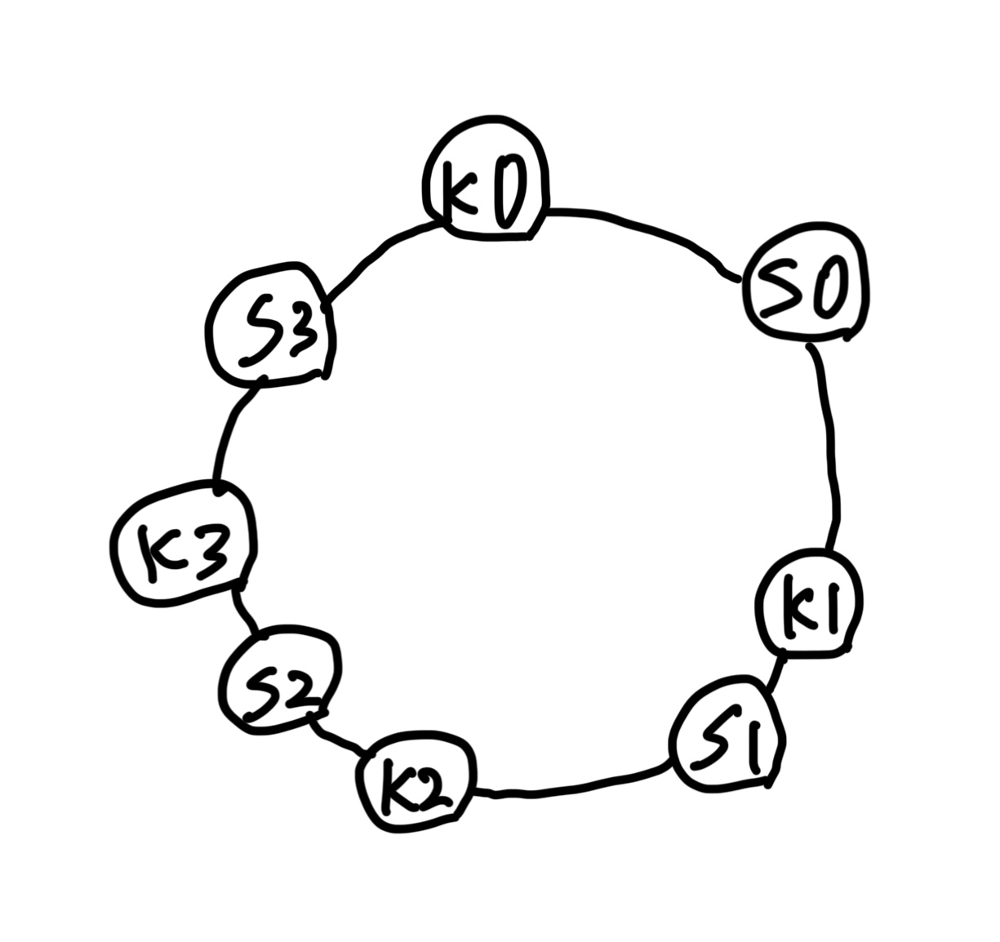

# 5장 안정 해시 설계

- 수평적 규모 확장성을 달성하기 위해 요청 또는 데이터를 서버에 균등하게 나눈 것이 중요하다.
- 안정 해시는 이 목표를 달성하기 위해 보편적으로 사용하는 기술이다.

## 해시 키 `재배치 refresh` 문제

```
serverIndex = hash(key) % N(서버의 개수)
```

- 4개의 서버가 있다고 가정하고 해시 키를 구성

|   키   | 해시 | 해시 % 4(서버 인덱스) |
|:-----:|:--:|:--------------:|
| key0  |  18358617  |       1        |
| key1  |  26143584  |       0        |
| key2  |  18131146  |       2        |
| key3  |  35863496  |       0        |
| key4  |  34085809  |       1        |
| key5  |  27581703  |       3        |
| key6  |  38164978  |       2        |
| key7  |  22530351  |       3        |

- 이 방법은 `서버 풀 server pool`의 크기가 고정되어 있을 때, 그리고 데이터 분포가 균등할 때는 잘 동작한다.
- 하지만 서버가 추가되거나 기존 서버가 삭제되면 문제가 생긴다.
  - ex) 특정 서버가 장애를 일으킴

|   키   | 해시 | 해시 % 3(서버 인덱스) |
|:-----:|:--:|:--------------:|
| key0  |  18358617  |       0        |
| key1  |  26143584  |       0        |
| key2  |  18131146  |       1        |
| key3  |  35863496  |       2        |
| key4  |  34085809  |       1        |
| key5  |  27581703  |       0        |
| key6  |  38164978  |       1        |
| key7  |  22530351  |       0        |

- 키 분포가 균등하게 되지 않는다는 사실을 알 수 있다.
- 서버가 주그면 대부분 캐시 클라이언트 데이터가 없는 엉뚱한 서버에 접속하게 된다.
  - 그 결과 대규모 캐시 미스가 발생하게 될 것이다.

## 안정 해시

- `안정 해시 consistence hash`는 해시 테이블 크기가 조정될 때 평균적으로 오직 `k/n`개의 키만 재배치하는 해시 기술이다.
  - `k`: 키의 개수
  - `n`: `슬롯 slot`의 개수

### 해시 공간과 해시 링

- 해시 함수는 SHA-1 사용
- 함수의 출력 값 범위는 x0, x1, x2, x3, ..., xn과 같음
- SHA-1의 `해시 공간 hash space` 범위는 0부터 2^160-1까지라고 알려져 있다.
- x0는 0, xn은 2^160-1이며, 나머지 x1~xn-1까지는 그 사이의 값을 갖게 된다. 


- 이 해시 공간의 양쪽을 구부려 접으면 아래와 같은 해시 링이 만들어진다.


### 해시 서버

- 이 해시 함수 f를 사용하면 서버 IP의 이름을 이 링 위의 어떤 위치에 대응시킬 수 있다.


### 해시 키

- 여기 사용된 해시 함수는 "해시 키 재배치 문제"에 언급된 함수와는 다르며, 나머지(modular) 연산 %를 사용하지 않고 있음에 유의
- 캐시할 키 key0, key1, key2, key3 또한 해시 링 위의 어느 지점에 배치할 수 있다.



### 서버 조회

- 어떤 키가 저장되는 서버는, 해당 키의 위치로부터 시계 방향으로 링을 탐색해 나가면서 만나는 첫 번째 서버다.
- key0은 서버 0에 저장되고, key1은 서버 1에 저장되며, key2는 서버 2, key3는 서버 3에 저장된다.


### 서버 추가

- 서버를 추가하더라도 키 가운데 일부만 재배치하면 된다.
- 새로운 서버 4가 추가된 뒤에 key0만 재배치된 것을 알 수 있다.


- 서버 4가 추가되기 전, key0는 서버 0에 저장되어 있었다. 하지만 서버 4가 추가된 뒤에 key0은 서버 4에 저장될 것이다.
  - 왜냐하면 key0의 위치에서 시계 방향으로 순회했을 때 처음으로 만나게 되는 서버가 서버 4이기 때문이다.
  - 다른 키들은 재배치되지 않는다.

### 서버 제거

- 하나의 서버가 제거되면 키 가운데 일부만 재배치된다.
- 아래 그림을 보면 서버 1이 삭제되었을 때, key1만이 서버 2로 재배치됨을 알 수 있다. 나머지 키에는 영향이 없다.


### 기본 구현법의 두 가지 문제

- 기본 절차
  - 서버와 키를 `균등 분포 uniform distribution` 해시 함수를 사용해 해시 링에 배치한다.
  - 키의 위치에서 링을 시계 방향으로 탐색하다 만나는 최초의 서버가 키가 저장될 서버다.
- 이 접근법에는 두 가지 문제가 있다. 
1. 서버가 추가되거나 삭제되는 상황을 감안하면 `파티션 partition`의 크기를 균등하게 유지하는 게 불가능하다.
   - 여기서 파티션에 인접한 서버 사이의 해시 공간이다.
   - 어떤 서버는 굉장히 작은 해시 공간을 할당 받고, 어떤 서버는 굉장히 큰 해시 공간을 할당 받는 상황이 가능하다는 것이다.

2. 키의 `균등 분포 uniform distribution`를 달성하기가 어렵다. 
   - 이 문제를 해결하기 위해 제안된 기법이 `가상 노드 virtual node` 또는 `복제 replica`라 불리는 기법이다.

### 가상 노드

- `가상 노드 virtual node`는 실제 노드 도는 서버를 가리키는 노드로서, 하나의 서버는 링 위에 여러 개의 가상 노드를 가질 수 있다.


- 키의 위치로부터 시계 방향으로 링을 탐색하다 만나는 최초의 가상 노드가 해당 키가 저장될 서버가 된다.
- 가상 노드의 개수를 늘리면 키의 분포는 점점 더 균등해진다. `표준 편차 stadard-deviation`가 작아져서 데이터가 고르게 분포되기 때문이다.
  - 표준 편차는 데이터가 어떻게 퍼져 나갔는지 보이는 척도다.
  - 100~200개의 가상 노드를 사용했을 경우 표준 편차 값은 평균의 5%(200개)에서 10%(100개) 사이다.
  - 가상 노드의 개수를 더 늘리면 표준 편차의 값은 더 떨어진다. 그러나 가상 노드 데이터를 저장할 공간이 더 많이 필요하게 될 것이다. (tradeoff)

### 재배치할 키 결정

- 서버가 추가되거나 제거되면 데이터 일부는 재배치해야 한다.


- 서버 4가 추가되면 s3부터 s4까지 존재하는 키 값이 재배치되어야 한다.


- 서버 1이 삭제되면 s0부터 s1까지의 키 값이 재배되어야 한다.

### 마치며

- 안정 해시의 이점은 아래와 같음

1. 서버가 추가되거나 삭제될 때 재배치되는 키의 수가 최소화된다.
2. 데이터가 보다 균등하게 분포하게 되므로 수평적 규모 확장성을 달성하기 쉽다.
3. `핫스팟 hotspot` 키 문제를 줄인다. 특정한 `샤드 shard`에 대한 접근이 지나치게 빈번하면 서버 과부하 문제가 생길 수 있다.

- 안정 해시 사용의 예시
1. 아마존 `다이나모 데이터베이스 DynamoDB`의 파티셔닝 관련 컴포넌트
2. `아파치 카산드라 Apache Cassandra` 클러스터에서의 데이터 파티셔닝
3. 디스코드 채팅 어플리케이션
4. `아카마이 Akamai` CDN
5. `매그레프 Meglev` 네트워크 부하 분산기

# 참고자료

- 가상 면접 사례로 배우는 대규모 시스템 설계 기초, 알렉스 쉬 지음, 프로그래밍 인사이트
