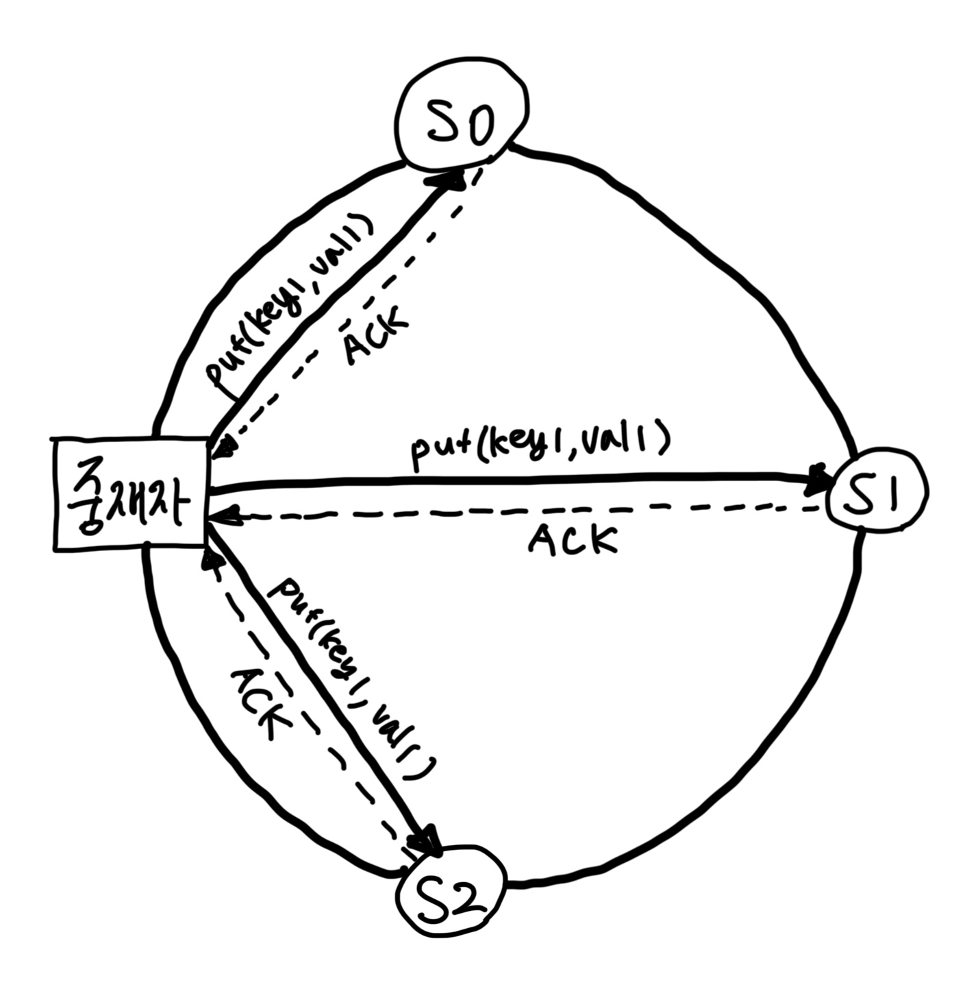
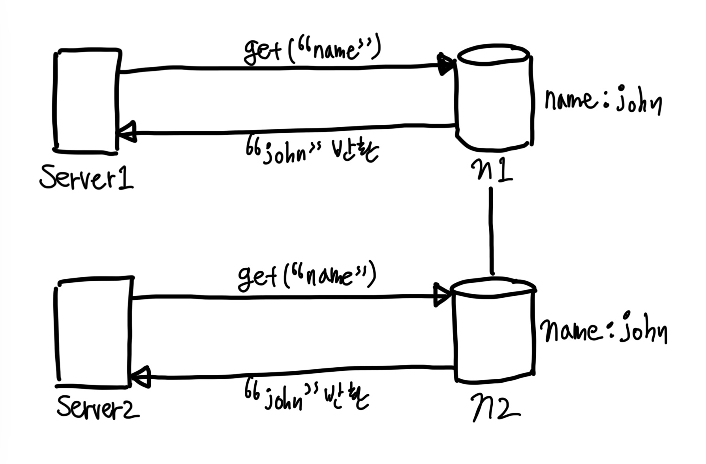
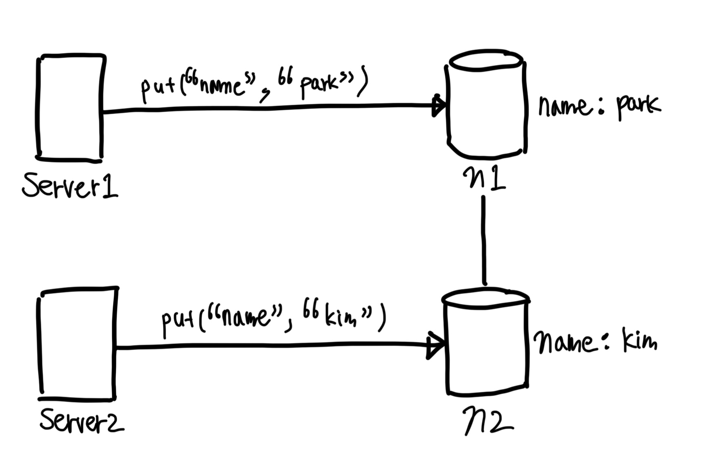
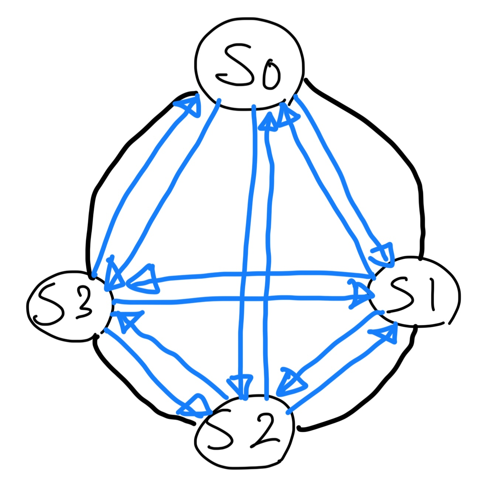
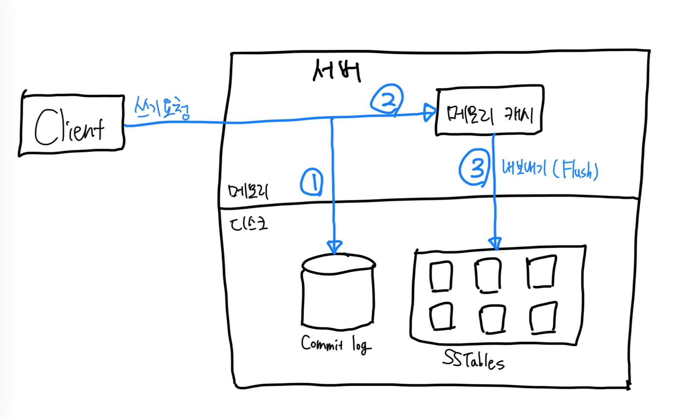
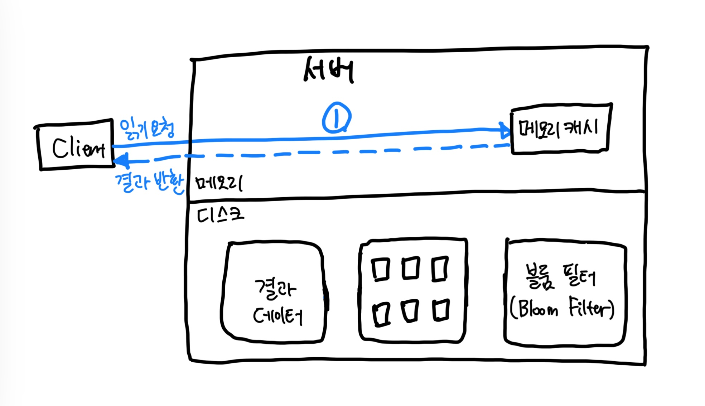
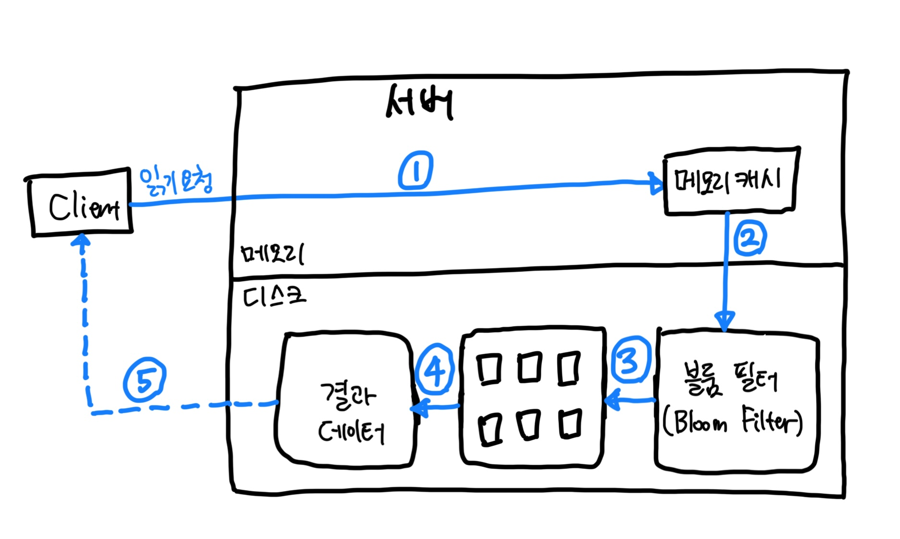

# 6장 키-값 저장소 설계

- `key-value store`는 `비 관계형 non-relational` 데이터베이스다.
  - 이 저장소에 저장되는 값은 `고유 식별자 identifier`를 키로 가져야 한다.
- `value`는 문자열일 수도, 리스트일 수도, 객체일 수도 있다.
- `key-value store` 사례
  - 아마존 다이나모, `memcached`, `redis`
- 아래 연산을 지원하는 키-값 저장소를 설계
  - `put(key, value)`: 키-값 쌍을 저장소에 저장한다.
  - `get(key)`: 인자로 주어진 키에 매달린 값을 꺼낸다.

## 문제 이해 및 설계 범위 확정

- 읽기, 쓰기, 그리고 메모리 사용량 사이에 어떤 균형을 찾고, 데이터의 일관성과 가용성 사이에서 tradeoff를 고려한 설계
- 아래 특성을 가진 키-값 저장소 설계
  - `key-value` 쌍의 크기는 10KB 이하
  - 큰 데이터를 저장할 수 있어야 한다.
  - 높은 가용성을 제공해야 한다. 따라서 시스템은 설사 장애가 있더라도 빨리 응답해야 한다.
  - 높은 규모 확장성을 제공해야 한다. 따라서 트래픽 양에 따라 자동적으로 서버 증설/삭제가 이뤄져야 한다.
  - 데이터 일관성 수준은 조정이 가능해야 한다.
  - 응답 `지연시간 latency`이 짧아야 한다.

## 단일 서버 키-값 저장소

- 단일 서버는 쉽다. 그냥 `pair`를 전부 메모리에 해시 테이블로 저장하기만 하면 된다.
- 이 접근법은 빠른 속도를 보장하긴 하지만 모든 데이터를 메모리 안에 두는 것이 불가능할 수도 있다는 약점을 갖고 있다.
- 개선책은 아래와 같다.
1. 데이터 `압축 compression`
2. 자주 쓰이는 데이터만 메모리에 두고 나머지는 디스크에 저장

## 분산 키-값 저장소

- 분산 해시 테이블
- 분산 시스템을 설계할 때는 CAP 정리(Consistency, Availability, Partition Tolerance theorem)를 이해하고 있어야 한다.

### CAP 정리

- CAP 정리는 `일관성 Consistency`, `가용성 Availability`, `분할 내성 Partition tolerance` 라는 세 가지 요구사항을 동시에 만족하는 분산 시스템을 설계하는 것은 불가능하다는 정리다.
  - `Consistency`: 분산 시스템에 접속하는 모든 클라이언트는 어떤 노드에 접속했느냐에 관계없이 언제나 같은 데이터를 보게 되어야 한다.
  - `Availability`: 분산 시스템에 접속하는 클라이언트는 일부 노드에 장애가 발생하더라도 항상 응답을 받을 수 있어야 한다.
  - `Partition Tolerance`: 파티션은 두 노드 사이에 통신 장애가 발생하였음을 의미한다. 분할 내성은 네트워크에 파티션이 생기더라도 시스템을 계속 동작하여야 한다는 것을 뜻한다.
- 키-값 저장소는 3가지 요구사항 가운데 어느 두 가지를 만족하느냐에 따라 아래와 같이 분류할 수 있다.
  - CP 시스템: 일관성과 분할 내성를 지원. 가용성 희생
  - AP 시스템: 가용성과 분할 내성을 지원. 일관성 희생
  - CA 시스템: 일관성과 가용성을 지원. 분할 내성 희생. 그러나 통상 네트워크 장애는 피할 수 없으므로, 분산 시스템은 반드시 파티션 문제를 감내할 수 있도록 설계되어야 하므로 CA를 채택하지는 않는다.

#### 실세계의 분산 시스템

- 파티션 문제가 발생하면 우리는 일관성과 가용성 사이에서 하나를 선택해야 한다.
- 파티션 문제가 발생한 저장소(n3)에는 기록되었으나, 아직 나머지 저장소(n1, n2)로 전달되지 않은 데이터가 있다면, 각 서버는 오래된 사본을 가지고 있으므로 문제가 발생할 것이다.
- **일관성 선택**
  - 데이터 불일치 문제를 피하기 위해 n1, n2에 대한 쓰기 연산을 중단시켜야 한다. (가용성 깨짐)
  - 은행권은 보통 데이터 일관성을 양보하지 않는다.
- **가용성 선택**
  - 낡은 데이터를 반환할 위험이 있더라도 계속 읽기 연산을 허용한다.
  - 아울러 n1과 n2에 대한 쓰기 연산을 허용할 것이고, 파티션 문제가 해결된 위에 새 데이터를 n3에 전송할 것이다.

### 시스템 컴포넌트

#### 데이터 파티션

- 대규모 애플리케이션의 경우 전체 데이터를 한 대 서버에 욱여넣는 것은 불가능하다.
- 가장 단순한 해결책은 데이터를 작은 파티션들로 분할한 다음 여러 대 서버에 저장하는 것이다.
- 데이터를 파티션으로 나눌 때는 다음 두 가지 문제를 중요하게 따져봐야 한다.
1. 데이터를 여러 서버에 고르게 분산할 수 있는가?
2. 노드가 추가되거나 삭제될 때 데이터의 이동을 최소화할 수 있는가?

- `안정 해시 consistent hash`는 이런 문제를 푸는 데 적합한 기술이다. 장점은 아래와 같다.
  - `규모 확장 자동화 automatic scaling`: 시스템 부하에 따라 서버가 자동으로 추가되거나 삭제되도록 만들 수 있다. 
  - `다양성 heterogeneity`: 각 서버의 용량에 맞게 `가상 노드 virtual node`의 수를 조정할 수 있다. 고성능 서버는 더 많은 가상 노드를 갖도록 설정할 수 있다.

#### 데이터 다중화

- 높은 가용성과 안정성을 확보하기 위해서는 데이터를 N개 서버에 비동기적으로 `다중화 replication`할 필요가 있다.
- 어떤 키를 해시 링 위에 배치한 후, 그 지점으로부터 시계 방향으로 링을 순회하면서 만나는 첫 N개의 서버에 데이터 사본을 보관하는 것이다.
- 그런데 가상 노드를 사용하면 선택한 N개의 노드가 대응될 실제 물리 서버의 개수가 N보다 작아질 수 있다.
  - 이 문제를 피하려면 노드를 선택할 때 같은 물리 서버를 중복 선택하지 않도록 해야 한다.
- 같은 데이터 센터에 속한 노드에 저장하기 보다는, 안정성을 담보하기 위해 사본을 각기 다른 센터의 서버에 보관하고, 센터들은 고속 네트워크로 연결한다.

#### 데이터 일관성

- 여러 노드에 다중화된 데이터는 적절히 동기화가 되어야 한다.
- `정족수 합의 Quorum Consensus` 프로토콜을 사용하면 읽기/쓰기 연산 모두에 일관성을 보장할 수 있다.
  - `N`: 사본 개수
  - `W`: 쓰기 연산에 대한 정족수. 쓰기 연산이 성공한 것으로 간주되려면 적어도 W개의 서버로부터 쓰기 연산이 성공했다는 응답을 받아야 한다.
  - `R`: 읽기 연산에 대한 정족수. 읽기 연산이 성공한 것으로 간주되려면 적어도 R개의 서버로부터 응답을 받아야 한다.
- 아래는 `N=3`인 예시이다.

- `W=1`은 데이터가 한 대 서버에만 기록된다는 뜻이 아니다.
  - 쓰기 연산이 성공했다고 판단하기 위해 `중재자 coordinator`는 최소 한 대 서버로부터 쓰기 성공 응답을 받아야 한다는 뜻이다.
  - 따라서 s1으로부터 성공 응답을 받았다면 s0, s2로부터의 응답을 기다릴 필요가 없다.
  - 중재자는 클라이언트와 노드 사이에서 `proxy`의 역할을 한다.
- `W`, `R`, `N`의 값을 정하는 것은 응답 지연과 데이터 일관성 사이의 타협점을 찾는 전형적인 과정이다.
1. `R=1`, `W=N`: 빠른 읽기 연산에 최적화된 시스템
2. `W=1`, `R=N`: 빠른 쓰기 연산에 최적화된 시스템
3. `W + R > N`: 강한 일관성이 보장된다. (보통 `N=3`, `W=R=2`)
4. `W + R <= N`: 강한 일관성이 보장되지 않음

##### 일관성 모델

- `일관성 모델 consistency model`은 키-값 저장소를 설계할 때 고려해야 할 또 하나의 중요한 요소다.
- 일관성 모델은 데이터 일관성의 수준을 결정하는데, 종류가 다양하다.
1. `강한 일관성 strong consistency`: 모든 읽기 연산은 가장 최근에 갱신된 결과를 반환한다. 다시 말해 클라이언트는 절대로 `낡은 out-of-date` 데이터를 보지 못한다.
2. `약한 일관성 weak consistency`: 읽기 연산은 가장 최근에 갱신된 결과를 반환하지 못할 수 있다.
3. `결과적 일관성 eventual consistency`: 약한 일관성의 한 형태로, 갱신 결과가 결국에는 모든 사본에 반영(동기화)되는 모델이다.

- 강한 일관성을 달성하는 일반적인 방법은 모든 사본에 현재 쓰기 연산의 결과가 반영될 때까지 해당 데이터에 대한 읽기/쓰기를 금지하는 것이다.
  - 고가용성 시스템에는 적합하지 않다. 새로운 요청의 처리가 중단되기 때문이다.
- 다이나모 또는 카산드라 같은 저장소는 결과적 일관성 모델을 택하고 있다.
  - 결과적 일관성 모델을 따를 경우 쓰기 연산이 병렬적으로 발생하면 시스템에 저장된 값의 일관성이 깨질 수 있는데, 이 문제는 클라이언트가 해결해야 한다.
  - 클라이언트 측에서는 데이터의 버전 정보를 활용해 일관성이 깨진 데이터를 읽지 않도록 한다.

##### 비 일관성 해소 기법: 데이터 버저닝

- 데이터를 다중화하면 가용성은 높아지지만 사본 간 일관성이 개질 가능성은 높아진다.
- `버저닝 versioning`과 `벡터 시계 vector clock`는 그 문제를 해소하기 위해 등장한 기술이다.
- `버저닝`은 데이터를 변경할 때마다 해당 데이터의 새로운 버전을 만드는 것을 의미한다. 따라서 각 버전의 데이터는 `변경 불가능 immutable`하다.

- 기존에는 `get("name")`을 호출할 때 `john`이라는 결과물을 받았다.
- 그런데, 아래 그림과 같이 동시에 같은 키에 대한 `put` 연산을 실행한다면?

- 이제 `충돌 conflict`하는  두 값을 갖게 되었다. 각각을 v1, v2라고 해보자.
- 이 문제를 해결하려면 충돌을 발견하고 자동으로 해결해 낼 버저닝 시스템이 필요하다.
- `벡터 시계 vector clock`는 이런 문제를 푸는데 보편적으로 사용되는 기술이다.
- 벡터 시계는 `[서버, 버전]`의 순서쌍을 데이터에 매단 것이다.
  - 어떤 버전이 선행 버전인지, 후행 버전인지, 아니면 다른 버전과 충돌이 있는지 판별하는 것에 쓰인다.
- 예시
  - 표현 방식: `D([S1, v1], [S2, v2], ..., [Sn, vn])`, D는 데이터, vi는 버전 카운터, Si는 서버 번호
  - 만약 서버 Si에 기록하면, 시스템은 아래 작업 가운데 하나를 수행하여야 한다.
    - `[Si, vi]`가 있으면 `vi`를 증가시킨다.
    - 그렇지 않으면 새 항목 `[Si, 1]`을 만든다.
- 어떤 버전 X와 Y 사이에 충돌이 있는지 보려면 Y의 벡터 시계 구성 요소 가운데 X의 벡터 시계 동일 서버 구성요소보다 작은 값을 갖는 것이 있는 보면 된다.
  - 예를 들어 `D([s0, 1], [s1, 2])`와 `D([s0, 2], [s1, 1])`는 서로 충돌한다.
- 그러나 벡터 시계를 사용해 충돌을 감지하고 해소하는 방법에는 두 가지 분명한 단점이 있다.
1. 충돌 감지 및 해소 로직이 클라이언트에 들어가야 하므로, 클라이언트 구현이 복잡해진다는 것이다.
2. `[서버: 버전]`의 순서쌍 개수가 굉장히 빨리 늘어난다는 것이다.

- 이 문제를 해결하려면 그 길이에 어떤 `임계치 threshold`를 설정하고, 임계치 이상으로 길이가 길어지면 오래된 순서쌍을 벡터 시계에서 제거하도록 해야 한다.
  - 그러나 이렇게 하면 버전 간 선후 관계가 정확하게 결정될 수 없기 때문에 충돌 해소 과정의 효율성이 낮아지게 된다.
  - 하지만 DynamoDB에 관계된 문헌에 따르면 아마존은 실제 서비스에서 그런 문제가 벌어지는 것을 발견한 적이 없다고 한다.

##### 장애 처리

- `장애 감지 failure detection`와 `장애 해소 failure resolution`

##### 장애 감지

- 아래와 같이 모든 노드에 대해 `멀티캐스팅 multicasting`채널을 구축하는 것이 서버 장애를 감지하는 가장 손쉬운 방법이다.
  - 하지만 이 방법은 서버가 많을 때는 분명 비효율적이다.

- `가십 프로토콜 gossip protocol` 같은 `분산형 장애 감지 decentralized failure detection` 솔루션을 채택하는 편이 효율적이다.
- 동작 원리는 아래와 같다.
  - 각 노드는 `멤버십 목록 membership list`을 유지한다. 멤버십 목록은 각 멤버 ID와 그 `카운터 heartbeat counter` 쌍의 목록이다.
  - 각 노드는 주기적으로 자신의 `heartbeat counter`를 증가시킨다.
  - 각 노드는 무작위로 선정된 노드들에게 주기적으로 자신의 `heartbeat counter` 목록을 보낸다.
  - `heartbeat counter` 목록을 받은 노드는 멤버십 목록을 최신 값으로 갱신한다.
  - 어떤 멤버의 `heartbeat counter` 값이 지정된 시간 동안 갱신되지 않으면 해당 멤버는 `장애 offline` 상태인 것으로 간주한다.

##### 일시적 장애 처리

- `엄격한 정족수 strict quorum`: 읽기와 쓰기 연산 금지
- `느슨한 정족수 sloppy quorum`: 조건 완화하여 가용성을 높인다.
- 네트워크나 서버 문제로 장애 상태인 서버로 가는 요청은 다른 서버가 잠시 맡아 처리한다. 그동안 발생한 변경사항은 해당 서버가 복구되었을 때 일관 반영하여 데이터 일관성을 보존한다.
  - 이를 위해 임시로 쓰기 연산을 처리한 서버에는 그에 관한 `단서 hint`를 남겨둔다. 따라서 이런 장애 처리 방안을 단서 후 `임시 위탁 hinted handoff` 기법이라 부른다. 

##### 영구 장애 처리

- `반-엔트로피 anti-entropy` 프로토콜을 구현하여 사본들을 동기화한다.
  - `반-엔트로피` 프로토콜은 사본들을 비교하여 최신 버전으로 갱신하는 과정을 포함한다.
  - 사본 간의 일관성이 망가진 상태를 탐지하고 전송 데이터의 양을 줄이기 위해서 `머클 트리 Merkle Tree`를 사용한다.

> ##### 머클 트리
> - `해시 트리 hash tree`라고도 불리는 머클 트리는 각 노드에 그 자식 노드들에 보관된 값의 해시, 또는 자식 노드들에 보관된 값의 해시 값을 레이블로 붙여두는 트리다.
> - 해시 트리를 사용하면 대규모 자료 구조의 내용을 효과적이면서도 보안상 안전한 방법으로 검증할 수 있다.

- 두 머클 트리의 비교는 root node의 해시값을 비교하는 것으로 시작한다.
  - root node의 해시 값이 일치한다면 두 서버는 같은 데이터를 갖는 것이다.
  - 그 값이 다른 경우에는 왼쪽 자식 노드의 해시 값을 비교하고, 그 다음으로 오른쪽 자식 노드의 해시 값을 비교한다.
  - 이렇게 하면서 아래쪽으로 탐색해 나가다 보면 다른 데이터를 갖는 버킷을 찾을 수 있으므로, 그 버킷들만 동기화하면 된다.
- 머클 트리를 사용하면 동기화해야 하는 데이터의 양은 실제로 존재하는 차이의 크기에 비례할 뿐, 두 서버에 보관된 데이터의 총량과는 무관해진다.
- 하지만 실제로 쓰이는 시스템의 경우 버킷 하나의 크기가 꽤 크다는 것을 알아야 한다.
  - 예로 들어, 10억 개의 키를 백만 개의 버킷으로 관리 => 하나의 버킷은 1,000개의 키를 관리

##### 데이터 센터 장애 처리

- 데이터를 여러 데이터 센터에 다중화하는 것이 중요하다.

#### 시스템 아키텍처 다이어그램

- 이 아키텍처의 주된 기능은 다음과 같다.
1. 클라이언트는 키-값 저장소가 제공하는 두 가지 API, `get(key)`, 와 `put(key, value)`와 통신한다.
2. 중재자는 클라이언트에게 키-값 저장소에 대한 proxy 역할을 하는 노드다.
3. 노드는 안정 해시의 해시 링 위에 분포한다.
4. 노드를 자동으로 추가 또는 삭제할 수 있도록, 시스템은 완전히 분산된다.
5. 데이터는 여러 노드에 다중화된다.
6. 모든 노드가 같은 책임을 지므로, `SPOF, Single Point of Failure`는 존재하지 않는다.

#### 쓰기 경로

- `카산드라 Cassandra`의 사례

1. 쓰기 요청이 `커밋 로그 commit log` 파일에 기록된다.
2. 데이터가 메모리 캐시에 기록된다.
3. 메모리 캐시가 가득차거나 사전에 정의된 어떤 임계치에 도달하면 데이터는 디스크에 있는 `SSTable`에 기록된다. `SSTable`은 `Sorted-Sring Table`의 약어로, `<키, 값>`의 순서쌍을 정렬된 리스트 형태로 관리하는 테이블이다.

#### 읽기 경로

- 읽기 요청을 받은 노드는 데이터가 메모리 캐시에 있는지부터 살핀다.
- cache hit! 바로 해당 데이터를 클라이언트에게 반환한다.

- 데이터가 메모리에 없는 경우에는 디스크에서 가져와야 한다.
- 어느 `SSTable`에 찾는 키가 있는지 알아낼 효율적인 방법이 필요할 것이다. 이런 문제를 푸는 데는 `블룸 필터 Bloom filter`가 흔히 사용된다.

1. 데이터가 메모리에 있는지 검사한다.
2. 데이터가 메모리에 없으므로 블룸 필터를 검사한다.
3. 블룸 필터를 통해 어떤 `SSTable`에 키가 보관되어 있는지 알아낸다.
4. `SSTable`에서 데이터를 가져온다.
5. 해당 데이터를 클라이언트에게 반환한다.

## 요약

| 목표/분제               | 기술                                               |
|:--------------------|:-------------------------------------------------|
| 대규모 데이터 저장          | 안정 해시를 사용해 서버에 부하 분산                             |
| 읽기 연산에 대한 높은 가용성 보장 | 데이터를 여러 데이터 센터에 다중화                              |
| 쓰기 연산에 대한 높은 가용성 보장 | 버저닝 및 벡터 시계를 사용한 충돌 해소                           |
| 데이터 파티션             | 안정 해시                                            |
| 점진적 규모 확장성          | 안정 해시                                            |
| 다양성 heterogeneity   | 안정 해시                                            |
| 조절 가능한 데이터 일관성      | 정속수 합의 quorum consensus                          |
| 일시적 장애 처리           | 느슨한 정족수 프로토콜(sloppy)과 단서 후 임시 위탁(hinted handoff) |
| 데이터 센터 장애 대응        | 여러 데이터 센터에 걸친 데이터 다중화                            |
