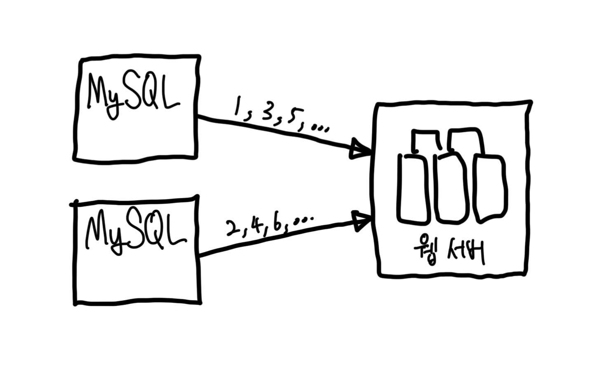
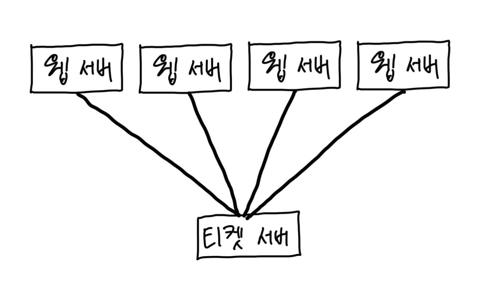
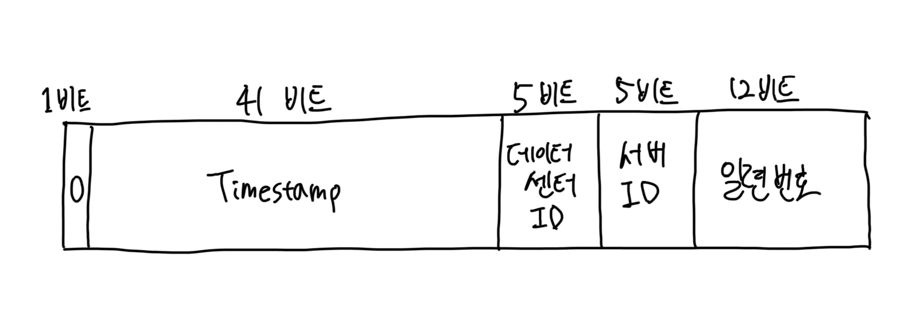
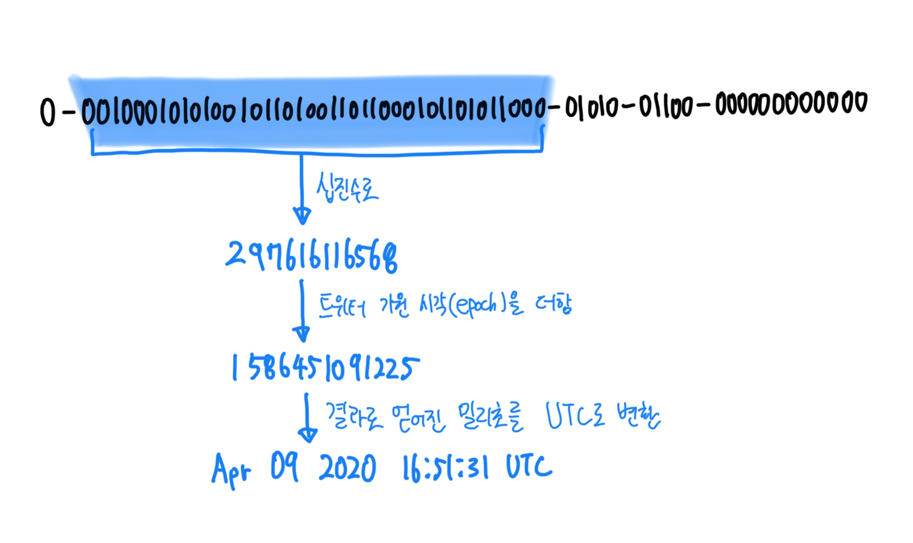

# 7장 분산 시스템을 위한 유일 ID 생성기 설계

- `auto_increment` 속성이 설정된 관계형 데이터 베이스의 기본 키를 스면 되지 않을가? 하고 생각할지 모른다.
  - 하지만 분산 환경에서 이 접근법은 통하지 않을 텐데, 데이터베이스 서버 한 대로는 그 요구를 감당할 수 없을뿐더러, 여러 데이터베이스 서버를 쓰는 경우에는 `지연 시간 delay`을 낮추기가 무척 힘들 것이다.

## 1. 문제 이해 및 설계 범위 확정

- 유일해야 하고, 정렬 가능해야 한다.
- ID는 숫자로만 구성되어야 한다.
- ID는 64비트로 표현될 수 있는 값이어야 한다.
- 발급 날짜에 따라 정렬 가능해야 한다.
- 초당 10,000 ID를 생성할 수 있어야 한다.

## 2. 개략적 설계안 제시 및 동의 구하기

### 다중 마스터 복제

- `다중 마스터 복제 multi-master replication`은 대략 아래와 같은 구성을 갖는다.

- 이 접근 법은 데이터베이스의 `auto_increment` 기능을 활용하는 것이다.
  - 다만 다음 ID의 값을 구할 때 1만큼 증가시켜 얻는 것이 아니라, `k`만큼 증가시킨다.
  - 여기서 `k`는 현재 사용 중인 데이터베이스 서버의 수다.
- 하지만 이 방법은 중대한 단점이 있다.
  - 여러 데이터 센터에 걸쳐 규모를 늘리기 어렵다.
  - ID의 유일성은 보장되겠지만 그 값이 시간 흐름에 맞춰 커지도록 보장할 수는 없다.
  - 서버를 추가하거나 삭제할 때도 잘 동작하도록 만들기 어렵다.

### UUID

- 유일성이 보장되는 ID를 만드는 또 하나의 간단한 방법
  - 컴퓨터 시스템에 저장되는 정보를 유일하게 식별하기 위한 128비트짜리 수
  - 충돌 가능성이 지극히 낮다.
  - 서버 간 조율 업이 독립적으로 생성 가능하다.
- 장점
  - 단순하다. 조율이 필요 없으므로 동기화 이슈도 없다.
  - 각 서버가 자기가 쓸 ID를 알아서 만드는 구조이므로 규모 확장도 쉽다.
- 단점
  - ID가 128비트로 길다. 하지만 요구사항은 64비트
  - 시간순으로 정렬할 수 없다.
  - ID에 숫자가 아닌 값이 포함될 가능성이 높다.

### 티켓 서버

- `티켓 서버 ticket server`는 유일성이 보장되는 ID를 만들어 내는 데 쓰일 수 있다.
- `플리커 Fliker`는 `분산 기본 키 distributed primary key`를 만들어 내기 위해 이 기술을 이용하였다.

- 이 아이디어의 핵심은 `auto_increment` 기능을 갖춘 데이터베이스 서버, 즉 티켓 서버를 중앙 집중형으로 하나만 사용하는 것이다.
- 장점
  - 유일성이 보장되는 오직 숫자로만 구성된 ID를 쉽게 만들 수 있다.
  - 구현하기 쉽고, 중소 규모 애플리케이션에 적합하다.
- 단점
  - 티켓 서버가 `SPOF, Single-Point-of-Failure`가 된다. 이 서버에 장애가 발생하면, 해당 서버를 이용하는 모든 시스템이 영향을 받는다. 이 이슈를 피하려면 티켓 서버를 여러 대 준비해야 한다. 하지만 그렇게 하면 데이터 동기화 같은 새로운 문제가 발생한다.

### 트위터 스노플레이크 접근법

- ID를 바로 생성하는 대신, 언제나 우리의 좋은 친구가 되어주는 `분할 정복 divide and conquer`을 먼저 적용해보자.
  - 생성해야 하는 ID의 구조를 여러 `절 section`로 분할하는 것이다.

- 각 `section`의 쓰임새는 아래와 같다.
- `sign bit`: 1비트를 할당한다. 지금으로서는 쓰임새가 없지만 나중을 위해 유보해 둔다. 음수와 양수를 구별하는 데 사용할 수 있을 것이다. 
- `timestamp`: 41비트를 할당한다. `기원 시각 epoch` 이후로 몇 밀리초가 경과했는지를 나타내는 값이다.
  - 본 설계에서는 스노플레이크 구현에서 사용하는 값 `1288834974657 (Nov 04, 2010, 01:42:54 UTC)`를 사용
- `데이터센터 ID`: 5비트를 할당. 2^5 = 32개 데이터센터를 지원할 수 있다.
- `서버 ID`: 5비트 할당. 따라서 데이터센터당 32개 서버를 사용 가능
- `일련번호`: 12비트를 할당. 각 서버에서는 ID를 생성할 때마다 일련번호가 1만큼 증가. 이 값은 1밀리초가 경과할 때마다 0으로 초기화

## 3. 상세 설계

- 트위터 스노플레이크 접근법을 사용하여 보다 상세한 설계를 진행.
- `데이터센터 ID`와 `서버 ID`는 시스템이 시작할 때 결정되며, 일반적으로 시스템 운영 중에는 바뀌지 않는다.
  - `데이터센터 ID`나 `서버 ID`를 잘못 변경하게 되면 ID 충돌이 발생할 수 있으므로, 그런 작업을 해야 할 때는 신중해야 한다.
- `타임스탬프`나 `일련번호`는 ID 생성기가 돌고 있는 중에 만들어지는 값이다.

### 타임스탬프

- 41비트 차지.
- 시간이 흐름에 따라 점점 큰 값을 갖게 되므로, 결국 ID는 시간순으로 정렬 가능하게 될 것이다.
- 아래는 이진수로 표현된 타임스탬프를 UTC로 추출하는 예시

- 41비트로 표현할 수 있는 타임스탬프의 최댓값은 2^41 - 1 = 2199023255551 밀리초이다.
  - 대략 69년에 해당하는 값
  - 69년이 지나면 기원 시각을 바꾸거나 ID 체계를 다른 것으로 migration 해야 한다.

### 일련번호

- 12비트 => 2^12 = 4096개의 값을 가질 수 있다.
- 어떤 서버가 같은 밀리 초 동안 하나 이상의 ID르 만들어 낸 경우에만 0보다 큰 값을 갖게 된다.

## 4. 마무리

- 여러 방법을 살펴봤지만, 스노플레이크가 모든 요구사항을 만족하면서도 분산 환경에서 규모 확장이 가능한 방법이었다.
- 아래 사항을 추가로 논의해보면 좋을 것이다.
  - `clock synchronization`: 서버가 여러 코어에서 실행될 경우, 같은 시계를 사용한다는 가정이 깨지게 된다. 여러 서버가 물리적으로 독립된 여러 장비에서 실행되는 경우에도 마찬가지다. `NTP, Network Time Protocol`은 이 문제를 해결하는 가장 보편적 수단이다.
  - 각 `절 section`의 길이 최적화: `동시성 concurrency`이 낮고 수명이 긴 애플리케이션이라면 일련번호 절의 길이를 줄이고 타임스탬프 절의 길이를 늘리는 것이 효과적일 수도 있을 것이다.
  - `고가용성 high availability`: ID 생성기는 `필수 불가결 mission critical` 컴포넌트이므로 아주 높은 가용성을 제공해야 할 것이다.

# 참고자료

- 가상 면접 사례로 배우는 대규모 시스템 설계 기초, 알렉스 쉬 지음, 프로그래밍 인사이트

