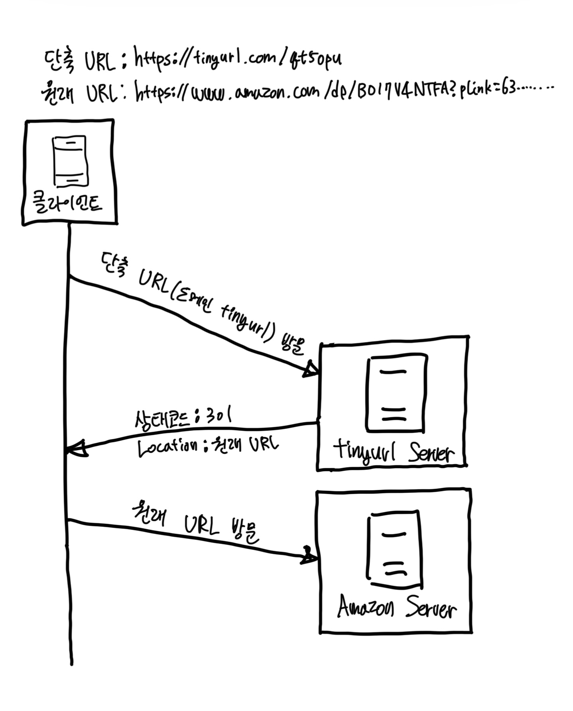
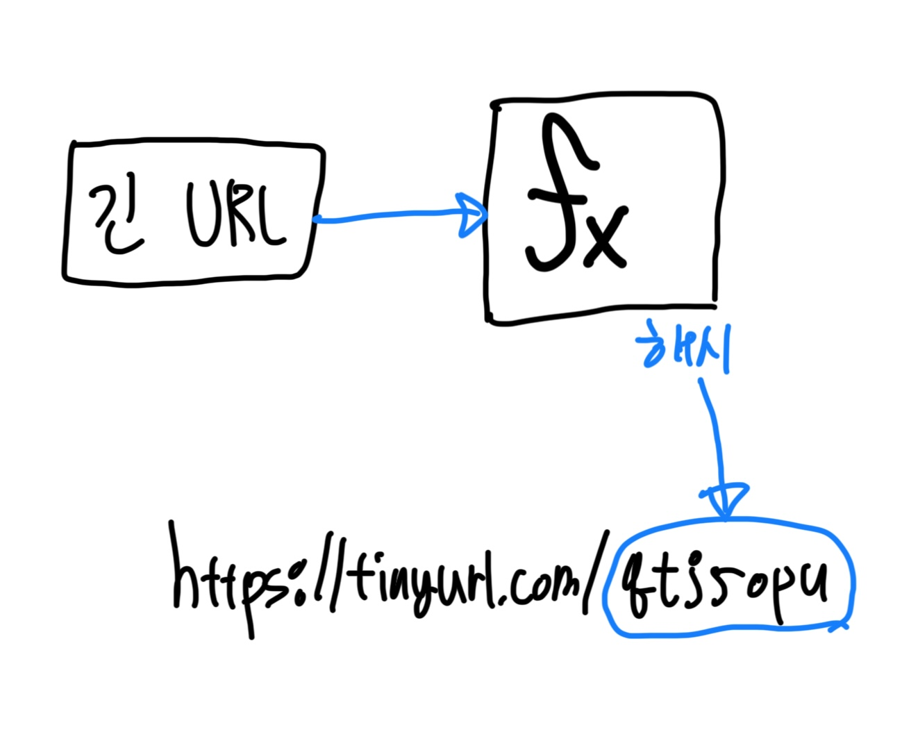
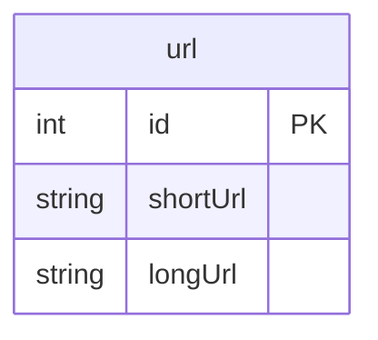
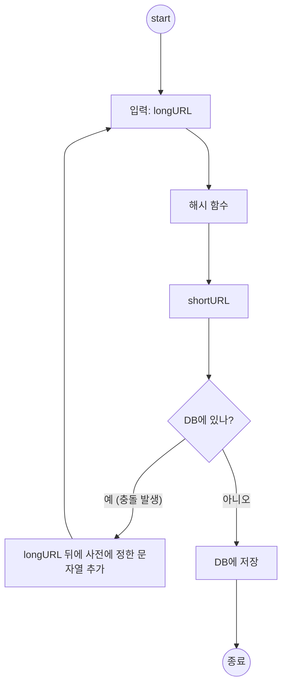
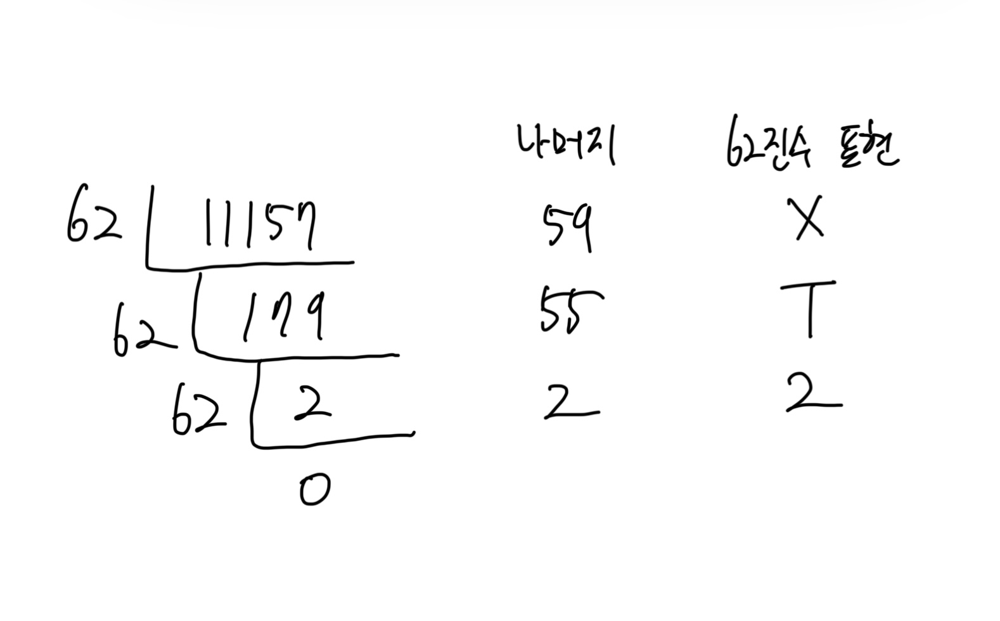
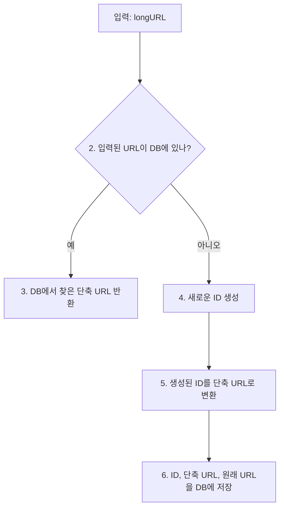
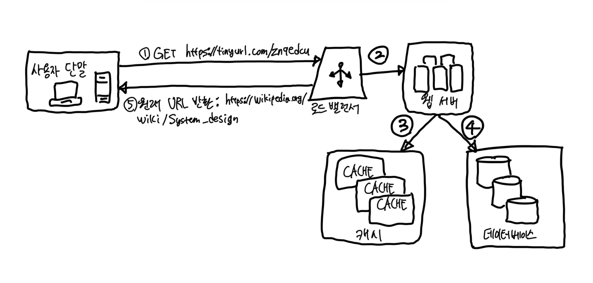

# 8장 URL 단축기 설계

- `tiny url` 같은 URL 단축기를 설계하는 문제

## 1. 문제 이해 및 설계 범위 확정

### 기본 기능

1. URL 단축: 주어진 URL을 훨씬 짧게 줄인다.
2. URL `리디렉션 redirection`: 축약된 URL로 HTTP 요청이 오면 원래 URL로 안내
3. 높은 가용성과 규모 확장성, 그리고 장애 내성 요구

### 개략적 추정

- 쓰기 연산: 매일 1억 개 단축 URL 생성
- 초당 쓰기 연산: 1억(100million) / 24/ 3600 = 1160회
- 읽기 연산: 읽기 연산과 쓰기 연산의 비율 = `10:1`이라고 가정. 이 경우 읽기 연산은 초당 11,600회 발생 (1,160회 * 10배 = 11,600회)
- URL 단축 서비스를 10년간 운영 => 1억 * 365 * 10 = 3650억 개의 레코드 보관
- 축약 전 URL의 평균 길이 = 100
- 따라서 10년 동안 필요한 저장 용량은 3650억 * 100바이트 = `36.5TB`이다.

## 2. 개략적 설계안 제시 및 동의 구하기

- API endpoint, URL redirection, URL 단축 flow 등

### API endpoint

- 클라이언트는 서버가 제공하는 API 엔드포인트를 통해 서버와 통신
- URL 단축기는 기본적으로 두 개의 엔드포인트를 필요로 한다.
1. URL 단축용 endpoint: 새 단축 URL을 생성하고자 하는 클라이언트는 이 엔드포인트에 단축할 URL을 인자로 실어서 POST 요청을 보내야 한다. 이 엔드포인트는 다음과 같은 형태를 띤다.
    - `POST /api/v1/data/shortnen`
      - 인자: {longURL: longURLString}
      - 반환: 단축 URL
2. URL 리디렉션용 엔드포인트: 단축 URL에 대하서 HTTP 요청이 오면 원래 URL로 보내주기 위한 용도의 엔드포인트. 아래와 같은 형태를 띈다.
    - `GET /api/v1/shortUrl`
      - 반환: HTTP 리디렉션 목적지가 될 원래 URL

### URL 리디렉션

- 단축 URL을 받은 서버는 그 URL을 원래 URL로 바꿔 `301` 응답의 `Location Header`에 넣어 반환한다.
- 아래는 클라이언트와 서버 사이의 통신 절차를 자세히 보여준 것이다.

- 여기서 유의할 것인 `301` 응답과 `302` 응답의 차이다. 둘 다 리디렉션 응답이긴 하지만 차이가 있다.
- `301 Permanently Moved`: 해당 URL에 대한 HTTP 요청의 처리 책임이 영구적으로 Location 헤더에 반환된 URL로 이전되었다는 응답니다. 영구적으로 이전되었으므로, 브라우저는 이 응답을 `캐시 cache`한다. 따라서 추후 같은 단축 URL에 요청을 보낼 필요가 있을 때 브라우저는 캐시된 원래 URL로 요청을 보내게 된다.
- `302 Found`: 이 응답은 주어진 URL로의 요청이 '일시적으로' Location 헤더가 지정하는 URL에 의해 처리되어야 한다는 응답니다. 따라서 클라이언트의 요청은 언제나 단축 URL 서버에 먼저 보내진 후에 원래 URL로 리디렉션 되어야 한다.
- 서버 부하는 줄이는 것이 중요하다면 `301 Permanently Moved`
- 트래픽 분석이 중요할 때는 `302 Found`를 쓰는 쪽이 클릭 발생률이나 발생 위치를 추적하는 데 좀 더 유리할 것이다.
- URL 리디렉션을 구현하는 가장 직관적인 방법은 해시 테이블을 사용하는 것이다.
- 해시 테이블에 `<단축 URL, 원래 URL>`의 쌍을 저장한다고 가정한다면, URL 리디렉션은 다음과 같이 구현될 수 있을 것이다.
    - 원래 URL = `hashTable.get(단축 URL)`
    - 301 또는 302 응답 Location 헤더에 원래 URL을 넣은 후 전송

### URL 단축

- 결국 중요한 것은 긴 URL을 해시 값으로 대응시킬 해시 함수 fx를 찾는 일이다.

- 이 해시 함수는 다음 요구사항을 만족해야 한다.
  - 입력으로 주어지는 긴 URL이 다른 값이면 해시 값도 달라야 한다.
  - 계산된 해시 값은 원래 입력으로 주어졌던 긴 URL로 복원될 수 있어야 한다.

## 3. 상세 설계

### 데이터 모델

- 모든 것을 해시 테이블에 두는 접근법은 초기 전략으로는 괜찮지만 실제 시스템에 쓰기에는 곤란하다.
  - 메모리는 유한한 데다 비사기 때문이다.
- 더 나은 방법은 `<단축 URL, 원래 URL>`의 순서쌍을 관계형 데이터베이스에 저장하는 것이다.

### 해시 함수

- hash function은 원래 URL을 단축 URL로 변환하는 데 쓰인다.
- 편의상 hash function이 계산하는 단축 URL 값을 `hashValue`라고 지칭

#### 해시 값 길이

- `hashValue`는 [0-9, a-z, A-Z]의 문자들로 구성된다.
  - 따라서 사용할 수 있는 문자의 개수는 10 + 26 + 26 = 62개
- `hashValue`의 길이를 정하기 위해서는 `62^n >= 3,650억`인 n의 최솟값을 찾아야 한다.
  - 개략적으로 계산했던 추정치에 따르면 이 시스템은 3,650억 개의 URL을 만들어 낼 수 있어야 한다.

| n | URL 개수                          |
|:-:|:--------------------------------|
| 1 | 62^1 = 62                       |
| 2 | 62^2 = 3,844                    |
| 3 | 62^3 = 238,328                  |
| 4 | 62^4 = 14,776,336               |
| 5 | 62^5 = 916,132,832              |
| 6 | 62^6 = 56,800,235,584           |
| 7 | 62^7 = 3,521,614,606,208 ≈ 3.5조 |
| 8 | 62^8 = 218,340,105,584,896      |

- `n=7`이면 3.5조 개의 URL을 만들 수 있으므로 요구사항을 만족시키기 위해 충분한 값이다.
  - 따라서 `hashValue`의 길이는 7로 설정

#### 해시 후 충돌 해소

- 긴 URL을 줄이려면 원래 URL을 7글자 문자열로 줄이는 해시 함수가 필요하다.
  - 손쉬운 방법은 `CRC32`, `MD5`, `SHA-1` 같이 잘 알려진 해시 함수를 이용하는 것이다.
- 아래는 `https://en.wikipedia.org/wiki/Systems_design`를 축약한 결과다.

| 해시 함수 | 해시 결과 (16진수)                             |
|:------|:-----------------------------------------|
| CRC32 | 5cb54054                                 |
| MD5   | 5a62509a84df9ee03fe1230b9df8b84e         |
| SHA-1 | 0eeae7916c06853901d9ccbefbfcaf4de57ed85b |

- 그런데 `CRC32`가 계산한 가장 짧은 해시값조차도 7보다 길다.
  - 어떻게 하면 줄일 수 있을까?
- 이 문제를 해결할 첫 번째 방법은 처음 7개의 글자만 이용하는 것이다.
  - 하지만 이러헥 하면 해시 결과가 서로 충돌할 확률이 높아진다.
  - 충돌이 실제로 발생했을 때는, 충돌이 해소될 때가지 사전에 정한 문자열을 해시값에 붙인다.
  - 이 절차는 아래와 같다.

- 이 방법을 쓰면 충돌은 해소할 수 있지만 단축 URL을 생성할 때 한 번 이상 데이터베이스 질의를 해야 하므로 오버헤드가 크다.
- 데이터베이스 대신 `블룸 필터 Bloom Filter`를 사용하면 성능을 높일 수 있다.
  - `Bloom Filter`는 어떤 집합에 특정 원소가 있는지 검사할 수 있도록 하는, 확률론에 기초한 공간 효율이 좋은 기술이다.

> #### 참고: Bloom Filter
> - 출처: https://en.wikipedia.org/wiki/Bloom_filter
> -   
> - 블룸 필터는 `m`비트 크기의 비트 배열 구조를 가진다. 또한 블룸 필터에서는 `k`가지의 서로 다른 해시 함수를 사용하며, 각 해시 함수는 입력된 원소에 대해 `m`가지의 값을 균등한 확률로 출력해야 한다.
> - 블룸 필터는 집합에 원소를 추가하는 명령어와 원소가 속하는지를 검사하는 명령어를 지원한다. (원소를 삭제하는 명령어는 존재하지 않는다.)
>   - 원소를 추가하는 경우, 추가하려는 원소에 대해 `k`가지의 해시 값을 계산한 다음, 각 해시 값에 대응하는 비트를 1로 설정한다.
>   - 원소를 검사하는 경우, 해당 원소에 대해 `k`가지의 해시 값을 계산한 다음, 각 해시 값에 대응하는 비트값을 읽는다. 모든 비트가 1인 경우 속한다고 판단하며, 나머지는 속하지 않는다고 판단한다.

#### base-62 변환

- `진법 변환 base conversion`은 URL 단축기를 구현할 때 흔히 사용되는 접근법 중 하나다.
  - 이 기법은 수의 표현 방식이 다른 두 시스템이 같은 수를 공유하여야 하는 경우에 유요하다.
- 62진법을 쓰는 이유는 `hashValue`에 사용할 수 있는 문자 개수가 62개이기 때문이다.
- 예시로 10진 11157을, 62진수로 변화하는 과정을 살펴보자.
  - `0(62) = 0(10)`, `9(62) = 9(10)` 
  - `a(62) = 10(10)`, `z(62) = 35(10)`
  - `A(62) = 36(10)`, `Z(62) = 61(10)`

- 따라서 단축 URL은 `https://tinyurl.com/2TX`가 된다.

#### 두 접근법 비교

| 해시 후 충돌 해소 전략                                           | base-62 변환                                                                  |
|:--------------------------------------------------------|:----------------------------------------------------------------------------|
| 단축 URL의 길이가 고정됨                                         | 단축 URL의 길이가 가변적. ID 값이 커지면 같이 길어짐                                           |
| 유일성이 보장되는 ID 생성기가 필요치 않음                                | 유일성 보장 ID 생성기가 필요                                                           |
| 충돌이 가능해서 해소 전략이 필요                                      | ID의 유일성이 보장된 후에야 적용 가능한 전략이라 충돌은 아예 불가능                                     |
| ID로부터 단축 URL을 계산하는 방식이 아니라서 다음에 쓸 수 있는 URL을 알아내는 것이 불가능 | ID가 1씩 증가하는 값이라고 가정하면 다음에 쓸 수 있는 단축 URL이 무엇인지 쉽게 알아낼 수 있어서 보안상 문제가 될 소지가 있음 |

### URL 단축기 상세 설계

- URL 단축기는 시스템의 핵심 컴포넌트이므로, 그 처리 흐름이 논리적으로는 단순해야 하고 기능적으로는 언제나 동작하는 상태로 유지되어야 한다.
- 아래 예시는 62진법 변환 기법을 사용해 설계한 예시이다.

- 여기서 `ID`는 데이터베이스의 기본 키를 사용한다.
  - ID 생성기에 의해 만들어지며, `전역적 유일성 globally unique`이 보장되는 것이어야 한다.

### URL 리디렉션 상세 설계

- 아래는 URL 리디렉션 메커니즘의 상세한 설계다.
- 쓰기보다 읽기를 더 자주 하는 시스템이라, `<단축 URL, 원래 URL>`의 쌍을 캐시에 저장하여 성능을 높였다.

- 로드밸런서의 동작 흐름은 아래와 같이 요약할 수 있다.

1. 사용자가 단축 URL을 클릭한다.
2. 로드밸런서가 해당 클릭으로 발생한 요청을 웹 서버에 전달한다.
3. 단축 URL은 이미 캐시에 있는 경우에는 원래 URL을 바로 꺼내서 클라이언트에게 전달한다.
4. 캐시에 해당 단축 URL이 없는 경우에는 데이터베이스에서 꺼낸다. 데이터베이스에 없다면 아마 사용자가 잘못된 단축 URL을 입력한 경우일 것이다.
5. 데이터베이스에서 꺼낸 URL을 캐시에 넣은 후 사용자에게 반환한다.

## 4. 마무리

- `처리율 제한 장치 rate limiter`: 지금가지 살펴본 시스템은 엄청난 양의 URL 단축 요청이 밀려들 경우 무력화될 수 있는 잠재적 보안 결함을 갖고 있다.
  - 처리율 제한 장치를 두면, IP 주소를 비롯한 `필터링 규칙 filtering rule`들을 이용해 요청을 걸러낼 수 있을 것이다.
- 웹 서버의 규모 확장: 본 설계에 포함된 웹 계층은 `무상태 stateless` 계층이므로, 웹 서버를 자유로이 증설하거나 삭제할 수 있다.
- 데이터베이스 규모 확장: 데이터베이스를 다중화하거나 `샤딩 sharding`하여 규모 확장성을 달성할 수 있다.
- 데이터 분석 솔루션: 성공적인 비즈니스를 위해서는 데이터가 중요하다. URL 단축기에 데이터 분석 솔루션을 통합해 두면 어떤 링크를 얼마나 많은 사용자가 클릭했는지, 언제 주로 클릭했는지 등 중요한 정보를 알아낼 수 있을 것이다.
- 가용성, 데이터 일관성, 안정성: 대규모 시스템이 성공적으로 운영되기 위해서는 반드시 갖추어야 할 속성들.

# 참고자료

- 가상 면접 사례로 배우는 대규모 시스템 설계 기초, 알렉스 쉬 지음, 프로그래밍 인사이트
