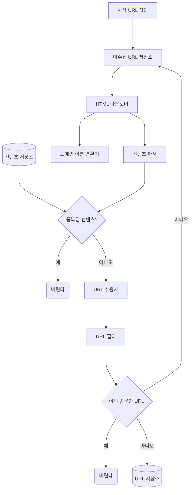
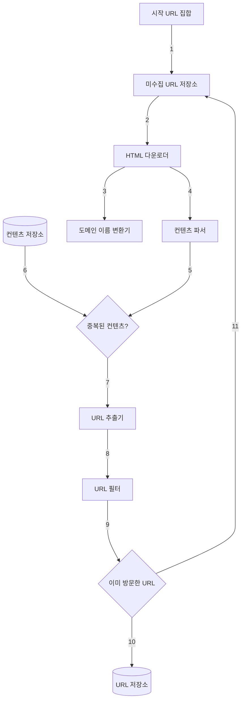
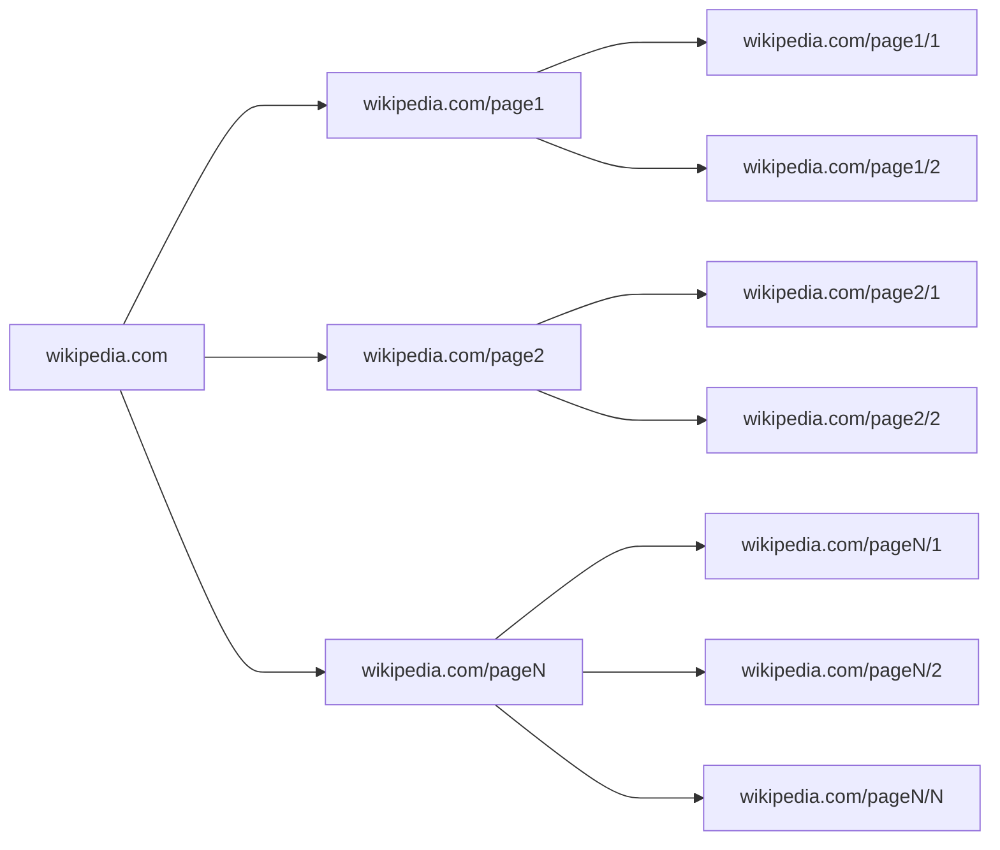
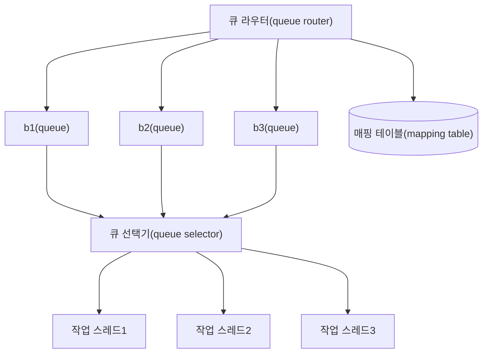
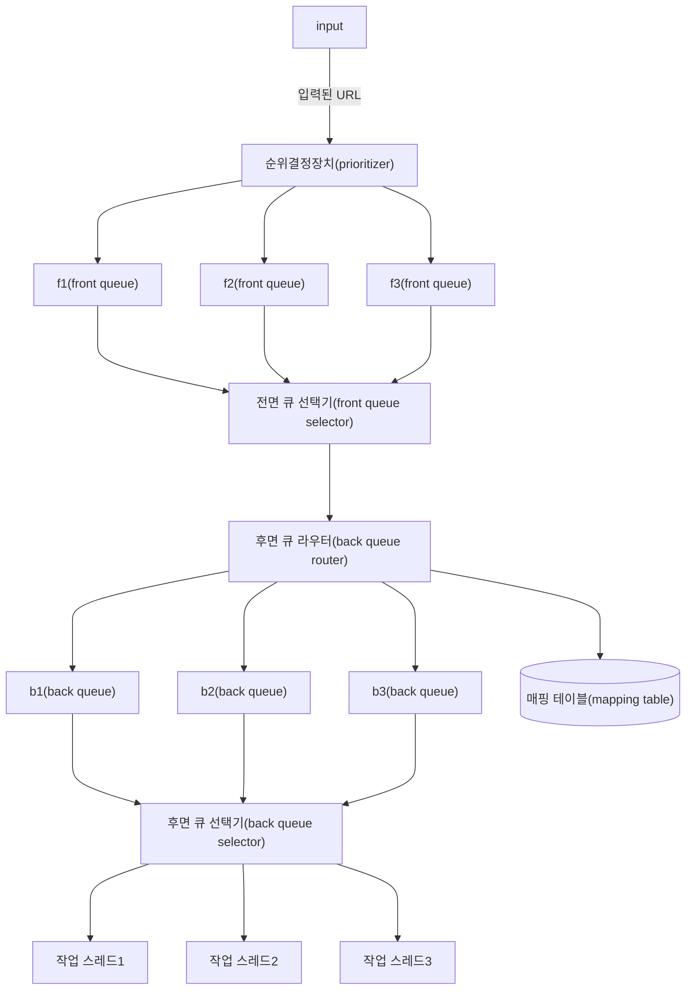
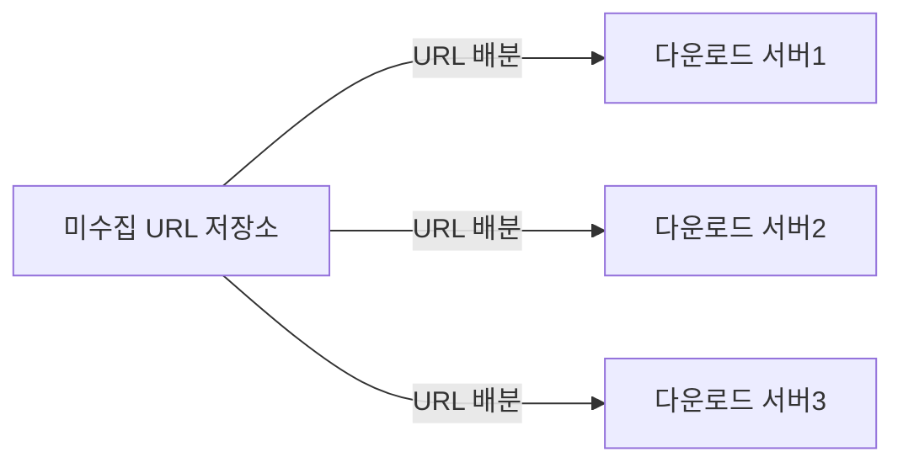
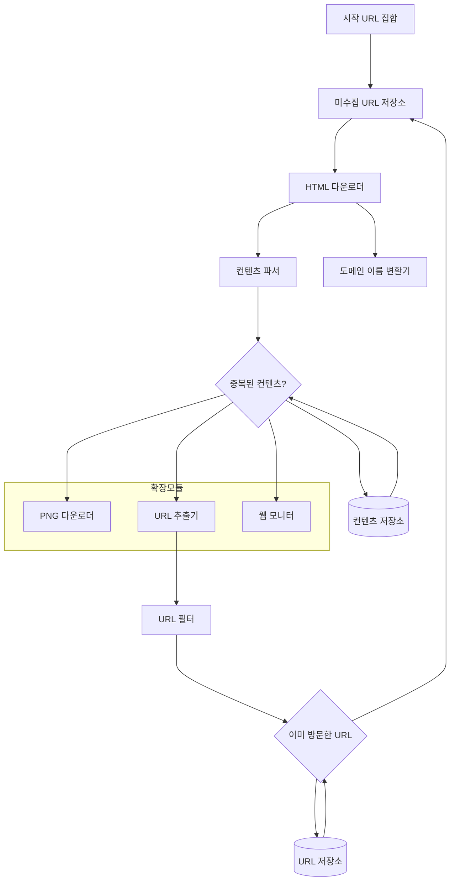

# 9장 웹 크롤러 설계

- 웹 크롤러는 `로봇 robot` 또는 `스파이더 spider`라고도 부른다.
  - 검색 엔진에 널리 쓰는 기술로, 웹에 새로 올라오거나 갱신된 콘텐츠를 찾아내는 것이 주된 목적이다.
- 크롤러는 다양하게 활용된다.
  - `검색 엔진 인덱싱 search engine indexing`: 크롤러의 가장 보편적인 용례다. 웹 페이지를 모아 검색 엔진을 위한 `로컬 인덱스 local index`를 만든다. 일례로 Googlebot은 구글 검색 엔진이 사용하는 웹 크롤러다.
  - `웹 아카이빙`: 나중에 사용할 목적으로 장기보관하기 위해 웹에서 정보를 모으는 절차를 말한다. 많은 국립 도서관이 크롤러를 돌려 웹 사이트를 아카이빙하고 있다.
  - `웹 마이닝 web mining`: 웹 마이닝을 통해 인터넷에서 유용한 지식을 도출해 낼 수 있다. 일례로, 유명 금융 기업들은 크롤러를 사용해 주주총회 자료나 연차 보고서를 다운받아 기업의 핵심 사업 방향을 알아내기도 한다.
  - `웹 모니터링 web monitoring`: 크롤러를 사용하면 인터넷에서 저작권이나 상표권이 침해되는 사례를 모니터링할 수 있다.

## 1. 문제 이해 및 설계 범위 확정

- 웹 크롤러의 기본 알고리즘은 간단하다.

1. URL 집합이 입력으로 주어지면, 해당 URL들이 가리키는 모든 웹 페이지를 다운로드한다.
2. 다운받은 웹 페이지에서 URL들을 추출한다.
3. 추출될 URL들을 다운로드할 URL 목록에 추가하고 위의 과정을 처음부터 반복한다.

- 엄청난 규모 확장성을 갖는 웹 크롤러를 설계하는 것은 엄청나게 어려운 작업.
  - 설계 범위를 좁혀야 한다.

#### 주의사항

  - `규모 확장성`: 웹은 거대하다. 수십억 개의 페이지가 존재. 따라서 `병행성 parallelism`을 활용하면 보다 효과적으로 웹 크롤링을 할 수 있다.
  - `안정성 robustness`: 잘못 작성된 HTML, 아무 반응 없는 서버, 장애, 악성 코드가 붙어 있는 링크 등 비정상적인 입력이나 환경에 잘 대응할 수 있어야 한다.
  - `예절 politeness`: 크롤러는 수집 대상 웹 사이트에 짧은 시간 동안 너무 많은 요청을 보내선 안 된다.
  - `확장성 extensibility`: 새로운 형태의 콘텐츠를 지원하기가 쉬워야 한다. 예를 들어 이미지 파일도 크롤링하고 싶다고 해 보자. 이를 위해 전체 시스템을 새로 설계해야 한다면 곤란할 것이다.

### 개략적 규모 추정치

- 매달 10억 개의 웹 페이지를 다운로드
- QPS = 10억 / 30일 / 24시간 / 3,600초 = 대략 400페이지/초
- Peak QPS = 2 * QPS = 800
- 웹 페이지의 크기 평균은 500k라고 가정
- 10억 페이지 * 500k = 500TB/월.
- 1개월치 데이터를 보관하는 데 500TB. 5년간 보관한다고 가정하면 결국 500TB * 12개월 * 5년 = 30PB의 저장용량 필요

## 2. 개략적 설계안 제시 및 동의 구하기

### 시작 URL 집합

- 크롤링을 시작하는 출발점.
- 전체 웹을 크롤링해야 하는 경우에는 시작 URL을 고를 때 좀 더 창의적일 필요가 있다.
- 크롤러가 가능한 한 많은 링크를 탐색할 수 있도록 하는 URL을 고르는 것 바람직할 것이다.
  - 일반적으로는 전체 URL 공간을 작은 부분집합으로 나누는 전략을 쓴다.
  - 지역적인 특색, 즉 나라별로 인기 있는 웹 사이트가 다르다는 점에 착안하는 것이다.
  - 또 다른 방법은 주제별로 다른 시작 URL을 사용하는 것이다.
- 사실 정답이 없는 문제

### 미수집 URL 저장소

- 웹 크롤러는 크롤링 상태를 아래 2가지로 나눠 관리한다.
1. 다운로드할 URL
2. 다운로드된 URL
- 이 중 전자를 저장 관리하는 컴포넌트를 `미수집 URL 저장소 URL frontier`라고 부른다.
  - FIFO Queue라고 생각하면 된다.

### HTML 다운로더

- 인터넷에서 웹 페이지를 다운로드하는 컴포넌트.
- 다운로드할 페이지의 URL은 미수집 URL 저장소가 제공한다.

### 도메인 이름 변환기

- 웹 페이지를 다운받으려면 URL을 IP 주소로 변환하는 절차가 필요하다.
- HTML 다운로더는 도메인 이름 변환기를 사용하여 URL에 대응되는 IP 주소를 알아낸다.
- ex) `www.wikipedia.org`의 IP 주소는 198.35.26.96 (2019/03/05 기준)

### 콘텐츠 파서

- 웹 페이지를 다운로드하면 `파싱 parsing`과 `검증 validation` 절차를 거쳐야 한다.
- 이상한 웹 페이지는 문제를 일으킬 수 있는데다 저장 공간만 낭비하게 되기 때문
- 크롤링 서버 안에 콘텐츠 파서를 구현하면 크롤링 과정이 느려지게 될 수 있으므로, 독립된 컴포넌트를 만듦

### 중복 콘텐츠인가?

- 웹에 공개된 연구 결과에 따르면, 29% 가량의 웹 페이지 콘텐츠는 중복이다.
- 이 문제를 해결하기 위한 자료 구조를 도입하여 데이터 중복을 줄이고 데이터 처리에 소요되는 시간을 줄인다.
- 두 HTML 문서를 비교하는 가장 간단한 방법은 그 두 문서를 문자열로 보고 비교하는 것이겠지만, 비교 대상 문서의 수가 10억에 달하는 경우에는 느리고 비효율적이어서 적용하기 곤란할 것이다.
  - 효과적인 방법은 웹 페이지의 해시 값을 비교하는 것이다.

### 콘텐츠 저장소

- HTML 문서를 보관하는 시스템
- 저장소를 구현하는 데 쓰일 기술을 고를 때는 저장할 데이터의 유형, 크기, 저장소 접근 빈도, 데이터의 유효 기간 등을 종합적으로 고려해야 한다.
- 본 설계안에서는 디스크와 메모리를 동시에 사용하는 저장소를 택함
  - 데이터 양이 너무 많으므로 대부분의 콘텐츠는 디스크에 저장한다.
  - 인기 있는 콘텐츠는 메모리에 두어 접근 지연시간을 줄인다.

### URL 추출기

- HTML 페이지를 파싱하여 링크들을 골라내는 역할을 한다.
- `상대 경로 relative path`는 전부 호스트를 붙여 `절대 경로 absolute path`로 변환한다.

### URL 필터

- 특정한 콘텐츠 타입이나 파일 확장자를 갖는 URL, 접속 시 오류가 발생하는 URL, `접근 제외 목록 deny list`에 포한된 URL 등을 크롤링 대상에서 배제하는 역할을 한다.

### 이미 방문한 URL인가?

- 이 단계를 구현하기 위해 이미 방문한 URL이나 미수집 URL 저장소에 보관된 URL을 추적할 수 있도록 하는 자료 구조를 사용할 것.
- 이미 방문한 적이 있는 URL인지 추적하면 같은 URL을 여러 번 처리하는 일을 방지할 수 있으므로 서버 부하를 줄이고 시스템이 무한 루프에 빠지는 일을 방지할 수 있다.
  - 이를 통해 서버 부하를 줄이고 시스템이 무한 루프에 빠지는 일을 방지할 수 있다.
- 해당 자료 구조로는 `블룸 필터 Bloom Filter`나 해시 테이블이 널리 스인다.

### URL 저장소

- 이미 방문한 URL을 보관하는 저장소다.

### 웹 크롤러 작업 흐름

1. 시작 URL들을 미수집 URL 저장소에 저장한다.
2. HTML 다운로더는 미수집 URL 저장소에서 URL 목록을 가져온다.
3. HTML 다운로더는 도메인 이름 변환기를 사용하여 URL의 IP 주소를 알아내고, 해당 IP 주소로 접속하여 웹 페이지를 다운받는다.
4. 콘텐츠 파서는 다운된 HTML 페이지를 파싱하여 올바른 형식을 갖춘 페이지인지 검증한다.
5. 콘텐츠 파싱과 검증이 끝나면 중복 콘텐츠인지 확인하는 절차를 개시한다.
6. 중복 콘텐츠인지 확인하기 위해서, 해당 페이지가 이미 저장소에 있는지 본다.
    - 이미 저장소에 있는 콘텐츠인 경우에는 처리하지 않고 버린다.
    - 저장소에 없는 콘텐츠인 경우에는 저장소에 저장한 뒤 URL 추출기로 전달한다.
7. URL 추출기는 해당 HTML 페이지에서 링크를 골라낸다.
8. 골라낸 링크를 URL 필터로 전달한다.
9. 필터링이 끝나고 남은 URL만 중복 URL 판별 단계로 전달한다.
10. 이미 처리한 URL인지 확인하기 위하여, URL 저장소에 보관된 URL인지 살핀다. 이미 저장소에 있는 URL은 버린다.
11. 저장소에 없는 URL은 URL 저장소에 저장할 뿐 아니라 미수집 URL 저장소에도 전달한다.

## 3. 상세 설계

### DFS vs BFS

- 웹은 `유향 그래프 directed graph`와 같다.
  - 페이지는 `node`고, 하이퍼링크는 `edge`다.
  - 크롤링 프로세스는 이 유향 그래프를 `edge`를 따라 탐색하는 과정이다.
  - `DFS`와 `BFS`는 이때 널리 사용하는 알고리즘.
- 하지만 `DFS`는 좋은 선택이 아닐 가능성이 높다. 그래프의 크기가 클 경우 어느 정도로 깊숙이 가게 될지 가늠하기 어렵다.
- 따라서 웹 크롤러는 보통 `BFS`를 사용한다.
- 하지만 2가지 문제점이 있다.

1. 한 페이지에서 나오는 링크의 상당수는 같은 서버로 되돌아간다.
   - 예제) `wikipedia.com` 페이지에서 추출한 모든 링크는 내부 링크, 즉 동일한 `wikipedia.com` 서버의 다른 페이지를 참조하는 링크다.
   - 결국 크롤러는 같은 호스트에 속한 많은 링크들을 다운받느라 바빠지게 되는데, 이때 링크들을 병렬로 처리하게 된다면 위키피디아 서버는 수많은 요청으로 과부하에 걸리게 된다.
   - 이런 크롤러를 보통 `예의 없는 impolite` 크롤러로 간주한다.

2. 표준 `BFS` 알고리즘은 URL 간에 우선순위를 두지 않는다. 처리 순서에 있어 모든 페이지를 공평하게 대우한다는 뜻이다.
    - 하지만 모든 웹 페이지가 같은 수준의 품질, 같은 수준의 중요성을 갖지 않는다.
    - 그러니 페이지 순위, 사용자 트래픽의 양, 업데이트 빈도 등 여러 가지 척도에 비추어 처리 우선순위를 구별하는 것이 온당할 것이다.

### 미수집 URL 저장소

- 이 때 미수집 URL 저장소를 활용하면 이 문제를 좀 쉽게 해결할 수 있다.
- 이 저장소를 잘 구현하면 `예의 politeness`를 갖춘 크롤러, URL 사이의 우선순위와 `신선도 freshness`를 구별하는 크롤러를 구현할 수 있다.

#### politeness

- 크롤러의 요청은 때로 DoS(Denial-of-Service) 공격으로 간주되기도 한다.
- 가령 아무 안전장치가 없는 웹 크롤러의 경우, 초당 수천 건의 페이지 요청을 동일한 웹 사이트로 보내 사이트를 마비시켜버릴 수도 있다.
- 지켜야 할 한 가지 원칙은, 동일 웹 사이트에 대해서는 한 번에 한 페이지만 요청한다는 것이다.
  - 같은 웹 사이트의 페이지를 다운받는 태스크는 시간차를 두고 실행하도록 하면 될 것이다.
  - 이 요구사항을 만족시키려면 웹 사이트의 호스트명과 다운로드를 수행하는 작업 스레드 사이의 관계를 유지하면 된다.
  - 즉, 각 다운로드 스레드는 별도 FIFO 큐를 가지고 있어서, 해당 큐에서 꺼낸 URL만 다운로드한다.
- 아래는 이 아이디어를 바탕으로 만들어진 설계다.

- `queue router`: 같은 호스트에 속한 URL은 언제나 같은 큐로 가도록 보장하는 역할을 한다.
- `mapping table`: 호스트 이름과 큐 사이의 관계를 보관하는 테이블 아래의 형태를 띈다.

| 호스트           | 큐   |
|:--------------|:----|
| wikipedia.com | b1  |
| apple.com     | b2  |
| ...           | ... |
| nike.com      | bn  |

- `queue selector`: 큐 선택기는 큐들을 순회하면서 큐에서 URL을 꺼내서 해당 큐에서 나온 URL을 다운로드하도록 지정된 작업 스레드에 전달하는 역할을 한다.
- `worker thread`: 작업 스레드는 전달된 URL을 다운로드하는 작업을 수행한다. 전달된 URL은 순차적으로 처리될 것이며, 작업들 사이에는 일정한 `지연시간 delay`를 둘 수 있다.

#### 우선순위

- 유용성에 따라 URL의 우선순위를 나눌 때는 `페이지랭크 PageRank`, 트래픽 양, `갱신 빈도 update frequency` 등 다양한 척도를 사용할 수 있을 것이다.
- `순위 결정 장치 prioritizer`는 URL 우선순위를 정하는 컴포넌트다.
- 변경된 설계는 아래와 같다.

- `prioritizer`: URL을 입력으로 받아 우선순위를 계산한다.
- `front_queue`: 우선순위별로 큐가 하나씩 할당된다. 우선순위가 높으면 선택될 확률도 올라간다.
- `front_queue_selector`: 임의 큐에서 처리할 URL을 거내는 역할을 담당한다. 순위가 높은 큐에서 더 자주 꺼내도록 프로그램되어 있다.

- 큐의 차이
  - `front queue`: 우선순위 결정 과정을 처리한다.
  - `back queue`: 크롤러가 예의 바르게 동작하도록 보증한다.

#### 신선도

- 웹 페이지는 수시로 추가되고, 삭제되고, 변경된다.
- 이미 다운로드한 페이지라고 해도 주기적으로 `재수집 recrawl`할 필요가 있다.
- 하지만 모든 URL을 재수집? 너무 많은 시간과 자원이 필요하다. 따라서 최적화하기 위한 전략을 사용한다.
  -  웹 페이지 `변경 이력 update history` 활용
  - 우선순위를 활용하여, 중요한 페이지는 좀 더 자주 재수집

#### 미수집 URL 저장소를 위한 지속성 저장장치

- 검색 엔진을 위한 크롤러의 경우, 처리해야 하는 URL의 수는 수억 개에 달한다.
  - 모든 것을 메모리에 보관하는 것은 안정성이나 규모 확장성 측면에서 바람직하지 않다.
  - 전부 디스크에 저장하는 것도 좋은 방법은 아닌데, 느려서 쉽게 성능 병목지점이 되기 때문이다.
- 따라서 절충안!
  - 대부분의 URL은 디스크에 두지만 IO 비용을 줄이기 위해 메모리 버퍼에 큐를 둔다! 버퍼에 있는 데이터는 주기적으로 디스크에 기록!

### HTML 다운로더

- HTTP Protocol을 통해 웹 페이지를 내려 받는다.
- 먼저 `로봇 제외 프로토콜 Robot Exclusion Protocol`부터 살펴보자.

#### Robots.txt

- `Robots.txt`는 웹사이트가 크롤러와 소통하는 표준적 방법이다.
  - 이 파일에는 크롤러가 수집해도 되는 페이지 목록이 들어 있다.
  - 따라서 웹 사이트를 긁어 가기 전에 크롤러는 해당 파일에 나열된 규칙을 먼저 확인해야 한다.
- `Robots.txt`는 주기적으로 다시 다운받아 캐시에 보관하여 계속 다운로드받지 않도록 개선

#### 성능 최적화

##### 1. 분산 크롤링

- 각 서버는 여러 스레드를 돌려 다운로드 작업을 처리
- URL 공간은 작은 단위로 분할하여, 각 서버는 그중 일부의 다운로드를 담당

##### 2. 도메인 이름 변환 결과 캐시

- `도메인 이름 변환기 DNS Resolver`는 크롤러 성능의 병목 중 하나
  - 이는 DNS 요청을 보내고 결과를 받는 작업의 동기적 특성 때문이다.
  - DNS 요청의 결과를 받기 전까지는 다음 작업을 진행할 수 없다. (보통 10ms~200ms 시간 소요)
  - 크롤러 스레드 가운데 어느 하나라도 이 작업을 하고 있으면 다른 스레드의 DNS 요청은 전부 `블록 block`된다.
- 따라서 DNS 조회 결과로 얻어진 도메인 이름과 IP 주소 사이의 관계를 캐시에 보관해 놓고 `크론 잡 cron job` 등을 돌려 주기적으로 갱신하도록 해 놓으면 성능을 효과적으로 높일 수 있다.

##### 3. 지역성

- 지역별로 분산하는 방법이다.
- 크롤링 서버가 크롤링 대상 서버와 지역적으로 가까우면 페이지 다운로드 시간은 줄어들 것이다.
- `지역성 locality`을 활용하는 전략은 크롤 서버, 캐시, 큐, 저장소 등 대부분의 컴포넌트에 적용 가능하다.

##### 4. 짧은 타임아웃

- 어떤 웹 서버는 응답이 느리거나 아예 응답하지 않는다.
- 최대 얼마나 기다릴지 설정. 응답하지 않으면 다운로드 중단하고 다음 페이지로 스킵

#### 안정성

- `안정 해시`: 다운로더 서버들에 부하를 분산할 때 적용 가능. 서버를 쉽게 추가하고 삭제.
- `크롤링 상태 및 수집 데이터 저장`: 장애가 발생한 경우에도 쉽게 복구할 수 있도록 크롤링 상태와 수집된 데이터를 지속적 저장장치에 기록해 두는 것이 바람직하다. 저장된 데이터를 로딩하고 나면 중단되었던 크롤링을 쉽게 재시작할 수 있을 것이다.
- `예외 처리 exception handling`: 대규모 시스템에서 에러는 불가피할 뿐만 아니라 흔하게 벌어진다. 예외가 발생해도 전체 시스템이 중단되지 않도록!
- `데이터 검증 data validation`: 시스템 오류를 방지하기 위한 중요 수단

#### 확장성

- 진화하지 않는 시스템은 없는 법! 이런 시스템을 설계할 때는 새로운 형태의 콘텐츠를 쉽게 지원할 수 있도록 신경 써야 한다.
- 아래 예제에서는 새로운 모듈을 끼워 넣어 새로운 형태의 콘텐츠를 지원할 수 있도록 설계

- PNG 다운로더는 PNG 파일을 다운로드하는 플러그인 모듈이다.
- `웹 모니터 web monitor`는 웹을 모니터링하여 저작권이나 상표권이 침해되는 일을 막는 모듈이다.

#### 문제 있는 콘텐츠 감지 및 회피

- 유해한 콘텐츠를 어떻게 감지하고 시스템으로부터 차단할지

##### 1. 중복 콘텐츠

- 30% 가량은 중복 페이지
- 해시나 `checksum`을 사용하면 쉽게 탐지 가능

##### 2. 거미 덫

- 크롤러를 무한 루프에 빠뜨리도록 설계한 웹 페이지
- ex) spidertrapexample.com/foo/bar/foo/bar/...
- 이런 덫은 URL의 최대 길이를 제한하면 회피할 수 있다.
  - 하지만 모든 종류의 덫을 피할 수 있는 만능 해결책은 없다.

##### 3. 데이터 노이즈

- 어떤 콘텐츠는 거의 가치가 없다.
  - ex) 광고, 스크립트 코드, 스팸 URL

## 4. 마무리

- `server-side rendering`: 웹 페이지를 그냥 있는 그대로 다운받아서 파싱하면 동적으로 생성되는 링크는 발견할 수 없다. 이 문제는 페이지를 파싱하기 전에 서버 측 렌더링(혹은 `동적 렌더링 dynamic redering`)을 적용하면 해결할 수 있다.
- `원치 않는 페이지 필터링`: `스팸 방지 anti-spam` 컴포넌트를 두어 품질을 조악하거나 스팸성인 페이지를 걸러내도록 하면 좋다.
- `데이터베이스 다중화 및 샤딩`: `replication`이나 `sharding` 같은 기법을 적용하면 `데이터 계층 data layer`의 가용성, 규모 확장성, 안정성이 향상된다.
- `수평적 규모 확장 horizontal scalability`: 대규모의 크롤링을 위해서는 다운로드를 실행할 서버가 수백 혹은 수천 대 필요하게 될 수도 있다. 수평적 규모 확장성을 달성하는 데 중요한 것은 서버가 상태 정보를 유지하지 않도록 하는 것, 즉 `무상태 stateless`로 만드는 것이다.
- 가용성, 일관성, 안정성
- 데이터 분석 솔루션

# 참고자료

- 가상 면접 사례로 배우는 대규모 시스템 설계 기초, 알렉스 쉬 지음, 프로그래밍 인사이트
