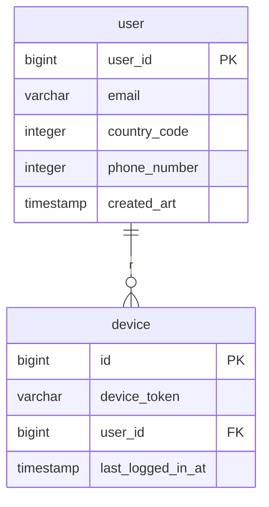
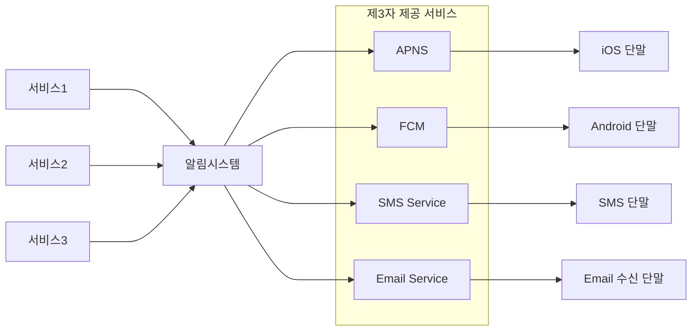
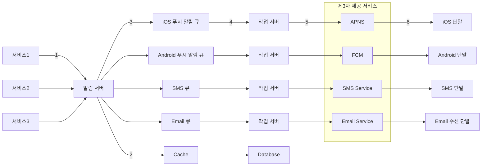
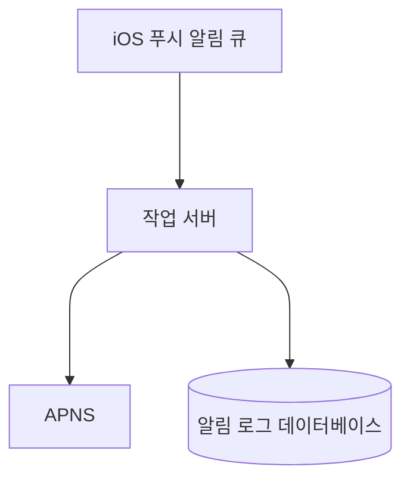
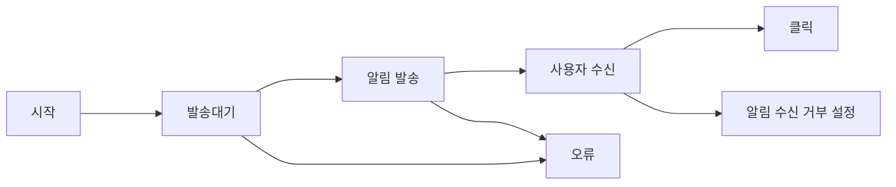
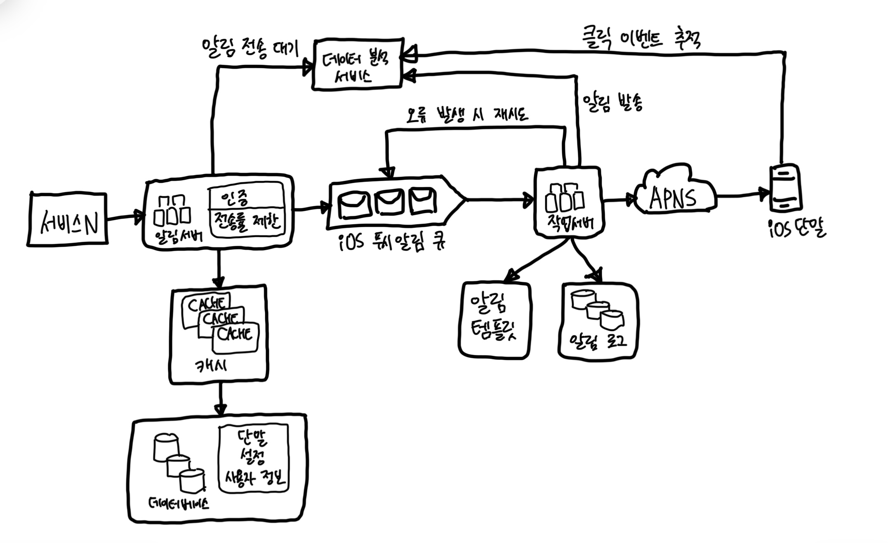

# 10장 알림 시스템 설계

- 모바일 푸시 알림, SMS 메시지, 이메일 3가지로 분류

## 1. 문제 이해 및 설계 범위 확장

- 알림 종류: 푸시 알림, SMS 메시지, 이메일
- soft real-time system
- 단말: iOS, android, laptop/desktop support
- 알림 주체: 클라이언트 애플리케이션, 서버 측의 스케줄링
- 사용자가 알림 받지 않도록 설정 가능해야 함.
- 하루에 천 만건의 모바일 푸시 알림, 백만 건의 SMS 메시지, 5백만 건의 이메일 송신 가능해야 함

## 2. 개략적 설계안 제시 및 동의 구하기

### 알림 유형별 지원 방안

#### iOS 푸시 알림

- iOS에서 푸시 알림을 보내기 위해서는 세 가지 컴포넌트가 필요하다.

- `알림 제공자 provider`: 알림 요청을 만들어 애플 푸시 알림 서비스로 보내는 주체. 알림 요청을 만드려면 아래와 같은 데이터가 필요
  - `단말 토큰 device token`: 고유 식별자
  - `페이로드 payload`: 알림 내용을 담은 JSON dictionary
- `APNS`: 애플이 제공하는 원격 서비스다. 푸시 알림을 iOS 장치로 보내느 역할을 담당
- `iOS device`: 푸시 알림을 수신하는 사용자 단말

#### 안드로이드 푸시 알림

- 위와 비슷한 절차. `APNS` 대신 `FCM`을 사용한다는 점만 다르다.

#### SMS 메시지

- 보통 `Twilio`, `Nexmo`와 같은 제3 사업자의 서비스 사용. 이용 요금이 있음

#### 이메일

- 고유 이메일 서버를 구축할 역량이 있음에도 많은 회사가 상용 이메일 서비스를 이용한다.
  - ex) Sendgrid, Mailchimp

### 연락처 정보 수집 절차

- 알림을 보내려면 모바일 단말 토큰, 전화번호, 이메일 주소 등의 정보가 필요
- 데이터베이스에 연락처 정보를 저장할 테이블 구조는 아래와 같다.

### 알림 전송 및 수신 절차

#### 개략적 설계안(초안)

- 1부터 N까지의 서비스: 서비스 각각은 microservice 혹은 cronjob, 분산 컴포넌트일 수 있다.
- 알림 시스템: 이 시스템은 서비스 1~N에 알림 전송을 위한 API를 제공해야 하고, 제3자 서비스에 전달할 알림 `페이로드 payload`를 만들어 낼 수 있어야 한다.
- 제3자 서비스(thrid party services): 사용자에게 알림을 실제로 전달하는 역할을 한다. 가장 유의할 것은 `확장성 extensibility`이다. 쉽게 새로운 서비스를 통합하거나 기존 서비스를 제거할 수 있어야 한다는 뜻이다.
  - 또 하나 고려해야 할 점! 어떤 서비스는 다른 시장에서는 사용할 수 없을 것이다. ex) 중국에서는 FCM 사용 불가능
- iOS, 안드로이드, SMS, 이메일 단말: 사용자는 자기 단말에서 알림을 수신한다.

- 이 설계에는 몇 가지 문제가 있다.

1. SPOF(Single-Point-Of-Failure): 알림 서비스에 서버가 하나빡에 없다는 것은 그 서버의 장애가 생기면 전체 서비스의 장애로 이어진다는 것이다.
2. 규모 확장성: 한 대 서비스로 푸시 알림에 관계된 모든 것을 처리하므로, 데이터베이스나 캐시 등 중요 컴포넌트의 규모를 개별적으로 늘릴 방법이 없다.
3. 성능 병목: 알림을 처리하고 보내는 것은 자원을 많이 필요로 하는 작업일 수 있다.

#### 개략적 설계안 (개선된 버전)

- 데이터베이스와 캐시를 알림 시스템의 주 서버에서 분리한다.
- 알림 서버를 증설하고 자동으로 수평적 규모 확장이 이루어질 수 있도록 한다.
- 메시지 큐를 이용해 시스템 컴포넌트 사이의 강한 결합을 끊는다.

- 알림 서버의 기능
  - `알림 전송`: 스팸 방지를 위해 보통 사내 서비스 또는 인증된 클라이언트만 이용 가능
  - `알림 검증`: 이메일 주소, 전화번호 등에 대한 기본적 검증 수행
  - `데이터베이스 또는 캐시 질의`: 알림에 포함시킬 데이터를 가져오는 기능
  - `알림 전송`: 알림 데이터를 메시지 큐에 넣는다. 본 설계안의 경우 하나 이상의 메시지 큐를 사용하므로 알림을 병렬적으로 처리 가능
- 캐시: 사용자 정보, 단말 정보, 알림 템플릿 등을 캐시
- 데이터베이스: 사용자, 알림, 설정 등 다양한 정보를 저장
- 메시지 큐: 시스템 컴포넌트 간 의존성을 제거하기 위해 사용. 다량의 알림이 전송되어야 하는 경우를 대비한 버퍼 역할도 한다. 본 설계안에서는 알림의 종류별로 별도 메시지 큐를 사용하였다. (제3자 서비스 장애 대비)
- 작업 서버(workers): 메시지 큐에서 전송할 알림을 꺼내서 제3자 서비스로 전달하는 역할을 담당

## 3. 상세 설계

### 안정성

#### 데이터 손실 방지

- 알림 지연되거나 순서가 틀리는 건 괜찮지만, 사라지면 곤란하다.
- 이 요구사항을 만족하려면 알림 시스템은 알림 데이터를 데이터베이스에 보관하고 재시도 메커니즘을 구현해야 한다.

#### 알림 중복 전송 방지

- 같은 알림이 여러 번 반복되는 것을 완전히 막는 것은 가능하지 않다.
  - 빈도를 줄이려면 중복을 탐지하는 메커니즘을 도입하고, 오류를 신중하게 처리해야 한다.
- 가단한 중복 방지 로직의 사례
  - 보내야 할 알림이 도착하면 그 이벤트 ID를 검사하여 이전에 본 적이 있는 이벤트인지 살핀다. 중복된 이벤트라면 버리고, 그렇지 않으면 알림을 발송

### 추가로 필요한 컴포넌트 및 고려사항

#### 알림 템플릿

- 알림 템플릿은 `인자 parameter`나 스타일, 추적 링크(tracking link)를 조정하기만 하면 사전에 지정한 형식에 맞춰 알림을 만들어 내는 틀
- 템플릿을 사용하면 전송될 알림들의 형식을 일관성 있게 유지할 수 있고, 오류 가능성뿐 아니라 알림 작성에 드는 시간도 줄일 수 있다.

#### 알림 설정

- 알림 설정을 상세히 조정할 수 있도록 하는 것이 좋다.
- 이와 같은 설정을 도입했다면 특정 종류의 알림을 보내기 전에 반드시 사용자가 해당 알림을 켜 두었는지 확인

#### 전송률 제한

- 너무 많은 알림을 보내지 않도록 하는 방법! 한 사용자가 받을 수 있는 알림의 빈도를 정하는 것.
- 너무 많이 보내기 시작하면 사용자가 알림 기능을 아예 거 버릴 수도 있다.

#### 재시도 방법

- 제3자 서비스가 알림 전송에 실패하면, 해당 알림을 재시도 전용 큐에 넣는다.
- 같은 문제가 계속해서 발생하면 개발자에게 통지(alert)

#### 푸시 알림과 보안

- 알림 전송 API는 appKey와 appSecret을 사용하여 보안을 유지

#### 큐 모니터링

- 큐에 쌓인 알림의 개수에 대한 메트릭은 핵심 정보다.
- 이 수가 너무 크면 작업 서버들이 이벤트를 빠르게 처리하고 있지 못한다는 뜻이다. => 서버 증설 필요

#### 이벤트 추적

- 알림 확인율, 클릭율, 실제 앱 사용으로 이어지는 비율 같은 메트릭은 사용자를 이해하는데 중요하다.

### 수정된 설계안

- 알림 서버에 `인증 authentication`과 `전송률 제한 rate-limiting` 기능이 추가
- 전송 실패에 대응하기 위한 재시도 기능이 추가 전송에 실패한 알림은 다시 큐에 넣고 지정된 횟수만큼 재시도
- 전송 템플릿을 사용하여 알림 생성 과정을 단순화하고 알림 내용의 일관성을 유지한다.
- 모니터링과 추적 시스템을 추가하여 시스템 상태를 확인하고 추후 시스템을 개선하기 쉽도록 구성

## 4. 마무리

- 특히 아래의 주제에 집중
- `안정성 reliabiltity`: 메시지 전송 실패율을 낮추기 위해 안정적인 재시도 메커니즘을 도입
- `보안 security`: 인증된 클라이언트만이 알림을 보낼 수 있도록 appKey, appSecret 등의 메커니즘을 이용
- `이벤트 추적 및 모니터랑`: 알림이 만들어진 후 성공적으로 전송되기까지의 과정을 추적하고 시스템 상태를 모니터링하기 위해 알림 전송의 각 단계마다 이벤트를 추적하고 모니터링할 수 있는 시스템을 통합
- `사용자 설정`: 사용자가 알림 수신 설정을 조정할 수 있도록 하였다. 따라서 알림을 보내기 전 반드시 해당 설정을 확인하도록 시스템 설계를 변경
- `전송률 제한`: 사용자에게 알림을 보내느 `빈도 frequency`를 제한

# 참고자료

- 가상 면접 사례로 배우는 대규모 시스템 설계 기초, 알렉스 쉬 지음, 프로그래밍 인사이트
