# 12장 채팅 시스템 설계

## 1. 문제 이해 및 설계 범위 확정

- 페이스북 메신저와 비슷한 채팅 앱 설계
- 응답지연이 낮은 일대일 채팅
- 최대 100명까지 참여할 수 있는 그룹 채팅 기능
- 사용자의 접속 상태 표시 가능
- 다양한 단말 지원, 하나의 계정으로 여러 단말에 동시 접속 지원
- 푸시 알림
- 5천만 DAU를 처리

## 2. 개략적 설계안 제시 및 동의 구하기

- 채팅 시스템. 클라이언트는 모바일 앱이거나 웹 애플리케이션. 클라이언트는 서로 직접 통신하지 않는다.
  - 대신 채팅 서비스와 통신.
- 채팅 서비스
  - 클라이언트들로부터 메시지 수신
  - 메시지 수신자(recipient) 결정 및 전달
  - 수신사자 접속 상태가 아닌 경우에는 접속할 때까지 해당 메시지 보관

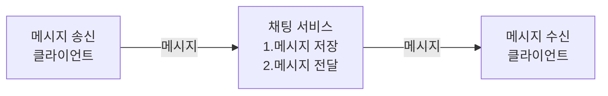

- 채팅을 시작하려는 클라이언트는 네트워크 통신 프로토콜을 사용하여 서비스에 접속
  - 어떤 통신 프로토콜을 사용할 것인가도 중요한 문제
- 대부분의 클라이언트/서버 애플리케이션에서 요청을 보내는 것은 클라이언트인데, 채팅 시스템의 경우도 마찬가지.
  - 채팅 서비스와의 접속에는 keep-alive header를 사용하면 효율적 => 클라이언트와 서버 사이의 연결을 끊지 않고 계속 유지할 수 있기 때문이다. TCP 접속 과정에서 발생하는 핸드셰이크 횟수를 줄일 수 있음은 물론이다.
  - HTTP는 메시지 전송 용도로로는 괜찮은 선택이며, 페이스북 같은 많은 대중적 채팅 프로그램이 초기에 HTTP를 사용했다.
- 메시지 수신 시나리오는 복잡하다. 서버가 연결을 만드는 것처럼 동작할 수 있도록 하기 위해 많은 기법이 제안되었다.
  - 폴링, 롱 폴링, 웹소켓 등

### 폴링 polling

- 클라이언트가 주기적으로 서버에게 새 메시지가 있느냐고 물어보는 방법
- 폴링을 자주 할수록 비용이 올라간다.
  - 답해줄 메시지가 없는 경우, 불필요하게 서버 자원이 낭비되는 문제

### 롱 폴링 long polling

- 클라이언트는 새 메시지가 반환되거나 타임아웃 될 때까지 연결을 유지한다.
  - 클라이언트는 새 메시지를 받으면 기존 연결을종료하고 서버에 새로운 요청을 본 모든 절차를 다시 시작한다.
- 약점
  - 메시지를 보내는 클라이언트와 수신하는 클라이언트가 같은 채팅 서버에 접속하게 되지 않을 수도 있다. HTTP 서버들은 보통 무상태 서버. 로드밸런싱을 위해 라운드 로빈을 사용하는 경우 메시지를 받은 서버는 해당 메시지를 수신할 클라이언트와의 롱 폴링 연결을 가지고 있지 않는 서버일 수 있음
  - 서버 입장에서는 클라이언트가 연결을 해제했는지 아닌지 알 좋은 방법이 없다.
  - 여전히 비효율적. 메시지를 많이 받지 않은 클라이언트도 타임아웃이 일어날 때마다 주기적으로 서버에 다시 접속할 것이다.

### 웹소켓 WebSocket

- 웹소켓 연결은 클라이언트가 시작.
  - 한번 맺어진 연결은 항구적이며 양방향이다.
  - 처음에는 HTTP 연결이지만 특정 핸드셰이크 절차를 거쳐 웹소켓 연결로 업그레이드된다.
  - 일단 이 항구적인 연결이 만들어지면 서버는 클라이언트에게 비동기적으로 메시지를 전송할 수 있다.
  - 웹소켓은 일반적으로 방화벽이 있는 환경에서도 잘 동작한다. 80이나 443처럼 HTTP 혹은 HTTPS 프로토콜이 사용하는 기본 포트번호를 그대로 쓰기 때문이다.

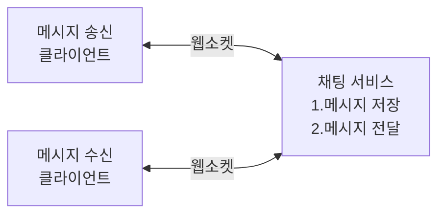

- 웹소켓을 이용하면 메시지를 보낼 때나 받을 때 동일한 프로토콜을 사용할 수 있으므로 설계뿐 아니라 구현도 단순하고 직관적이다.
- 유의할 것은 웹소켓 연결은 항구적으로 유지되어야 하기 때문에 서버 측에서 연결 관리를 효율적으로 해야 한다.

### 개략적 설계안

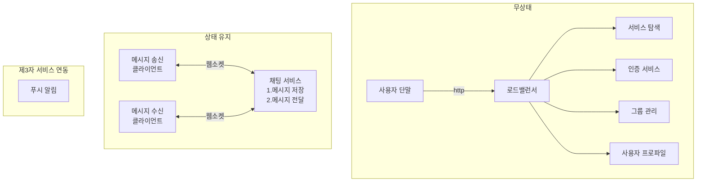

#### 무상태 서비스

- 무상태 서비스. 로그인, 회원가입, 사용자 프로파일 표시 등을 처리하는 전통적인 요청/응답 서비스다.
- 무상태 서비스는 로드밸런서 뒤에 위치한다. 로드밸런서가 하는 일은 요청을 그 경로에 맞는 서비스로 정확하게 전달하는 것이다.
  - 로드밸런서 뒤에 오는 서비스는 모놀리식 서비스일 수도, 마이크로서비스일 수도 있다.
- 위 무상태 서비스 중 `서비스 탐색  service discovery` 서비스는, 클라이언트가 접속할 채팅 서버의 DNS 호스트명을 클라이언트에게 알려주는 역할을 한다.
  - 채팅 서비스와 긴밀히 협력하여 특정 서버에 부하가 몰리지 않도록 한다.

#### 상태 유지 서비스

- 위 설계에서 유일하게 상태 유지가 필요한 서비스는 채팅 서비스다. 각 클라이언트가 채팅 서버와 독립적인 네트워크 연결을 유지해야 하기 때문이다.

#### 제3자 서비스 연동

- 채팅 앱에서 가장 중요한 제3자 서비스는 푸시 알림.
- 새 메시지를 받았다면 설사 앱이 실행 중이지 않더라도 알림을 받아야 한다.

#### 규모 확장성

- 트래픽 규모가 얼마 되지 않을 때는 모든 기능을 서버 한 대로 구현할 수 있다.
- 하지만 대용량 트래픽을 처리해야 한다면?
  - 이때 따져봐야 할 것은 서버 한 대로 얼마나 많은 접속을 동시에 허용할 수 있느냐.
  - 접속당 10K의 서버 메모리가 필요하다면, 10GB만 있어도 하나의 서버가 1M의 접속자를 처리할 수 있다.
  - 하지만 그 누구도 그 정도 규모의 트래픽을 서버 한대로 처리하지 않는다. (SPOF 문제를 잊지 말자.)
- 유의할 것인 실시간으로 메시지를 주고받기 위해 클라이언트는 채팅 서버와 웹소켓 연결을 끊지 않고 유지한다는 것이다.

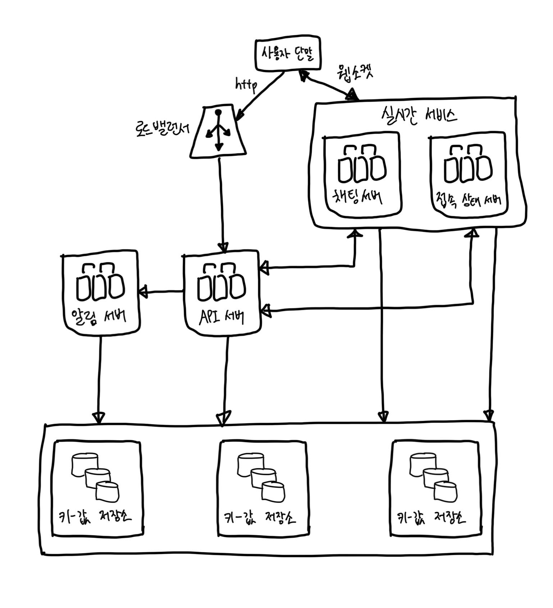

- 채팅 서버는 클라이언트 사이에 메시지를 중계하는 역할을 담당한다.
- `접속상태 서버 presence server`는 사용자의 접속 여부를 관리한다.
- API 서버는 로그인, 회원가입, 프로파일 변경 등 그 외 나머지 전부를 처리한다.
- 알림 서버는 푸시 알림을 보낸다.
- `키-값 저장소 key-value store`에는 `채팅 이력 chat history`를 보관한다. 시스템에 접속한 사용자는 이전 채팅 이력을 전부 보게 될 것이다.

#### 저장소

- 중요한 것 중 하나는 어떤 데이터베이스는 쓰느냐다.
  - 관계형 데이터베이스 vs NoSQL
  - 이 질문에 올바른 답을 하기 위해 중요하게 따져야 할 것은, 데이터의 유형과 읽기/쓰기 연산의 패턴이다.
- 채팅 시스템이 다루는 데이터는 보통 두 가지다.
1. 사용자 프로파일, 설정, 친구 목록처럼 일반적인 데이터 => 이런 데이터는 안정성을 보장하기 위해 관계형 데이터베이스에 보관
2. 채팅 시스템에 고유한 데이터인 `채팅 이력 chat history` => 이 데이터를 어떻게 보관할지 결정하려면 읽기/쓰기 연산 패턴을 이해해야 한다.

- 채팅 이력의 데이터 양은 엄청나다. 페이스북이나 왓츠앱은 매일 600억 개의 메시지를 처리한다.
- 이 데이터 가운데 빈번하게 사용되는 것은 주로 최근에 주고받은 메시지다. (오래된 메시지는 거의 보지 않는다.)
- 검색 기능을 이용하거나, 특정 사용자가 언급된 메시지를 보거나, 특정 메시지로 점프하거나 하여 무작위적인 데이터 접근을 하게 되는 일도 있다. 데이터 계층은 이런 기능도 지원해야 한다.
- 1:1 채팅 앱의 경우 읽기:쓰기 비율은 대략 1:1이다.
- 키-값 저장소 추천! 그 이유는?
  - 키-값 저장소는 `수평젹 규모확장 horizontal scaling`이 쉽다.
  - 키-값 저장소는 데이터 접근 `지연시간 latency`이 낮다.
  - 관계형 데이터베이스는 데이터 가운데 `롱 테일 long tail`에 해당하는 부분을 잘 처리하지 못하는 경향이 있다. 인덱스가 커지면 데이터에 대한 `무작위적 접근 random access`을 처리하는 비용이 늘어난다.
  - 이미 많은 안정적인 채팅 시스템이 키-값 저장소를 채택하고 있다.
    - ex) 페이스북 메신저: HBase
    - ex) 디스코드: Cassandra

### 데이터 모델

#### 1:1 채팅을 위한 메시지 테이블

- 기본키 `message_id`. 메시지 순서를 쉽게 정할 수 있도록 하는 역할도 담당

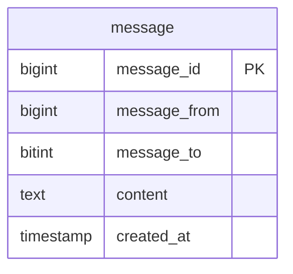

#### 그룹 채팅을 위한 메시지 테이블

- (`channel_id`, `message_id`)의 `복합키 composite key`를 기본키로 사용
  - `channel_id`는 `파티션 키 partition key`로도 사용할 것. 그룹 채팅에 적용될 모든 질의는 특정 채널을 대상으로 할 것이기 때문.

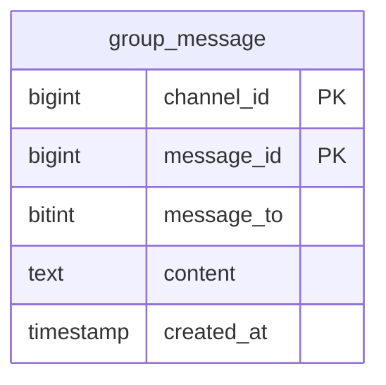

#### 메시지 ID

- `message_id`를 만드는 기법은 자세히 논의할 만한 가치가 있는 흥미로운 주제.
- 아래와 같은 속성을 만족해야 한다.
  - 고유해야 한다.
  - ID 값은 정렬 가능해야 하며, 시간 순서와 일치해야 한다.
1. RDBMS라면 `auto_increment`를 사용할 수 있다. (하지만, NoSQL은 보통 해당 기능을 제공하지 않는다.)
2. 스노플레이크 같은 전역적 64-bit 순서 번호 생성기를 사용하는 방법.
3. 지역적 순서 번호 생성기
   - 메시지 사이의 순서는 같은 채널에서는 유지되면 충분하기 때문에 가능. 전역적 ID 생성보다 쉽다.

## 3. 상세 설계

### 서비스 탐색

- 적합한 채팅 서버 추천
  - 기준: 클라이언트의 위치, 서버의 용량
- 서비스 탐색 기능을 구현하는 데 널리 쓰이는 오픈 소스 솔루션으로는 `아파치 주키퍼 Apache Zookeeper` 같은 것이 있다.
  - 사용 가능한 모든 채팅 서버를 등록시켜 두고, 클라이언트가 접속을 시도하면 사전에 정한 기준에 따라 최적의 채팅 서버를 골라 주면 된다.

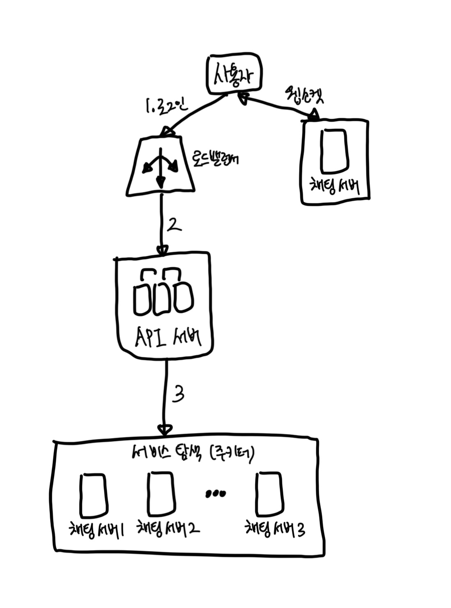

1. 사용자 A가 시스템에 로그인을 시도한다.
2. 로드밸런서가 로그인 요청을 API 서버들 가운데 하나로 보낸다.
3. API 서버가 사용자 인증을 처리하고 나면 서비스 탐색 기능이 동작하여 해당 사용자를 서비스할 최적의 채팅 서버를 찾는다. (예제에서는 채팅 서버 2라고 해보자.)
4. 사용자 A는 채팅 서버 2와 웹소켓 연결을 맺는다.

### 메시지 흐름

#### 1:1 채팅 메시지 처리 흐름

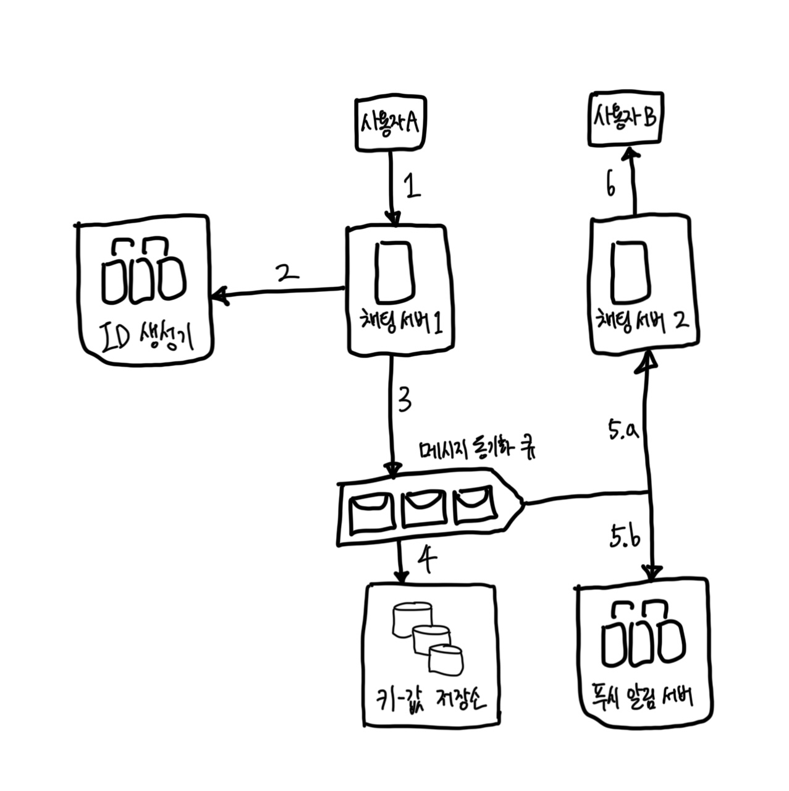

1. 사용자 A가 채팅 서버 1로 메시지 전송
2. 채팅 서버 1은 ID 생성기를 사용해 해당 메시지의 ID 결정
3. 채팅 서버 1은 해당 메시지를 메시지 동기화 큐로 전송
4. 메시지가 키-값 저장소에 보관됨
5. 메시지 동기화 처리
   - (a) 사용자 B가 접속 중인 경우 메시지는 사용자 B가 접속 중인 채팅 서버로 전송
   - (b) 사용자 B가 접속 중이 아니라면 푸시 알림 메시지를 푸시 알림 서버에 보냄
6. 채팅 서버 2는 메시지를 사용자 B에게 전송. 사용자 B와 채팅 서버 2 사이에는 웹소ㅔㅅ 연결이 있는 상태이므로 그것을 사용

#### 여러 단말 사이의 메시지 동기화

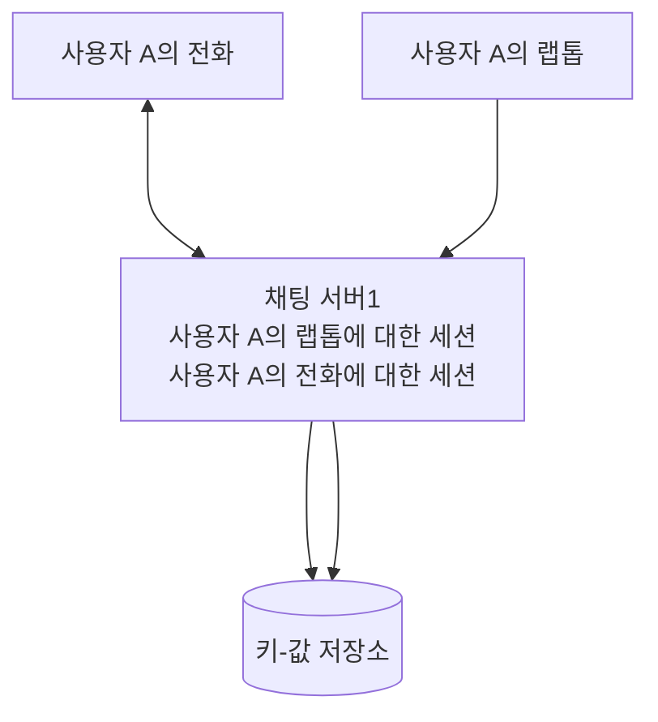

- 단말은 `cur_max_message_id`라는 변수를 유지하는데, 해당 단말에서 관측된 가장 최신 메시지의 ID를 추적하는 용도다.
- 아래 두 조건을 만족하는 메시지는 새 메시지로 간주한다.
  - 수신자 ID가 현재 로그인한 사용자 ID와 같다.
  - 키-값 저장소에 보관된 메시지로서, 그 ID가 `cur_max_message_id`보다 크다.

#### 소규모 그룹채팅에서의 메시지 흐름

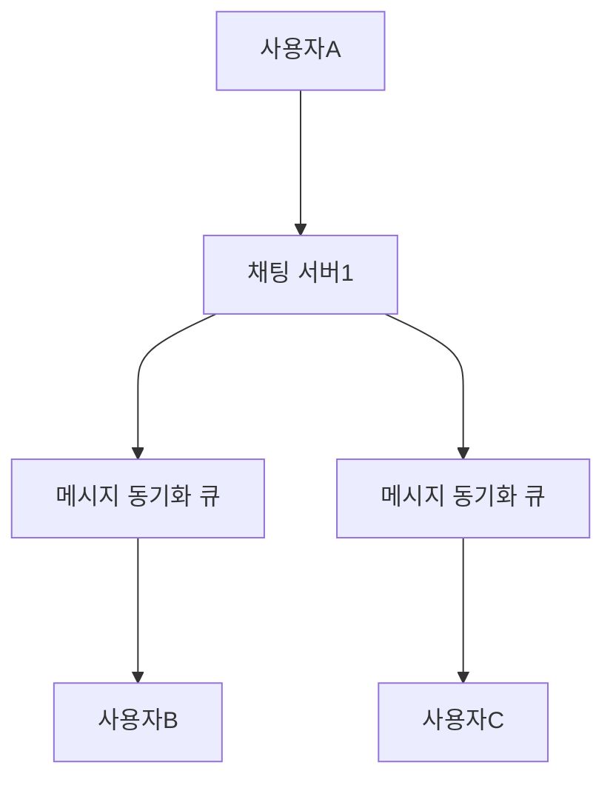

- 사용자 A가 보낸 메시지가 사용자 B와 C의 메시지 동기화 큐에 복사된다.
- 위 설계안은 소규모 그룹 채팅에 적합하다. 이유는 아래와 같다.
  - 새로운 메시지가 왔는지 확인하려면 자기 큐만 보면 되니까 동기화 플로우가 단순하다.
  - 그룹이 크지 않으면 메시지를 수신자별로 복사해서 큐에 넣는 작업의 비용이 문제가 되지 않는다.
- 하지만 많은 사용자를 지원해야 하는 경우라면 똑같은 메시지를 모든 사용자의 큐에 복사하는 게 바람직하지 않을 것이다.
- 메시지 흐름을 수신자 관점에서 살펴보면, 한 수신자는 여러 사용로부터 오는 메시지를 수신할 수 있어야 한다.
  - 따라서 아래와 같이 여러 사용자로부터 오는 메시지를 받을 수 있어야 한다.

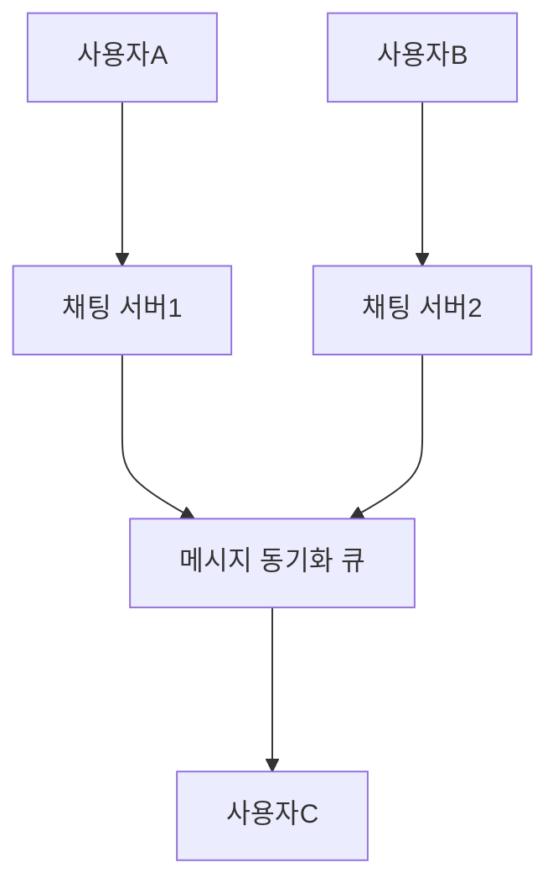

### 접속상태 표시

#### 사용자 로그인

- 접속상태의 서버는 A의 상태와 `last_active_at` 타임스탬프 값을 키-값 저장소에 보관한다.

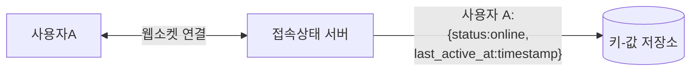

#### 로그아웃

- 상태가 `online`에서 `offline`으로 변경된다.

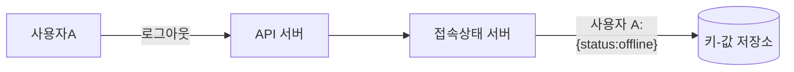

#### 접속 장애

- 사용자의 인터넷 연결이 끊어지면 클라이언트와 서버 사이에 맺어진 웹소켓 같은 지속성 연결도 끊어진다.
- 이런 장애에 대응하는 간단한 방법은 사용자를 오프라인 상태로 표시하고 연결이 복구되면 온라인 상태로 변경하는 것이다.
  - 하지만 심각한 문제가 있는데, 짧은 시간 동안 연결이 끊어졌다 복구되는 일은 흔하다.
- `heartbeat` 검사를 통해 이 문제를 해결해 볼 것이다.
  - 온라인 상태의 클라이언트로 하여금 `heartbeat event`를 접속상태 서버로 보내도록 하고, 마지막 이벤트를 받은 지 x초 이내에 또 다른 이벤트 메시지를 받으면 해당 사용자의 접속상태를 계속 온라인으로 유지하는 것이다.

#### 상태 정보의 전송

- 그럼 친구들은 사용자의 상태 변화를 어떻게 알 수 있을까?
- 아래는 `발행-구독 모델 publish-subscribe model`을 사용한 예시이다.

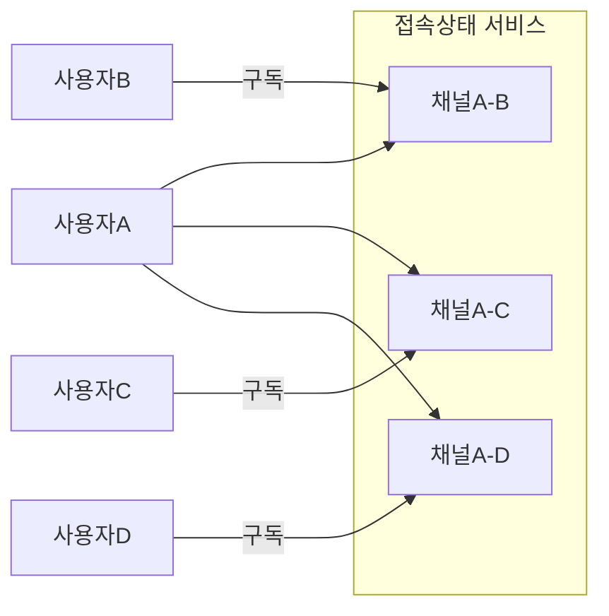

- 이 방안은 그룹의 크기가 작을 때는 효과적이다. 하지만 그룹 크기가 더 커지면 이런 식으로 접속상태를 알려서는 비용이나 시간이 많이 들게 된다.
- 이런 성능 문제를 해소하는 한 가지 방법은 사용자가 그룹 채팅에 입장하는 순간에만 상태 정보를 읽어가게 하거나, 친구 리스트에 있는 사용자의 접속상태를 갱신하고 싶으면 수동으로 하도록 유도하는 것이다.

## 4. 마무리

- 추가로 얘기해볼만한 것
1. 채팅 앱을 확장하여 사진이나 비디오 등의 미디어를 지원하도록 하는 방법
    - 압축 방식, 클라우드 저장소, thumbnail 생성 등을 논의해보면 재미있을 것이다.
2. 종단 간 암호화: 메시지 발신인과 수신자 이외에는 아무도 메시지 내용을 볼 수 없게 만들기
3. 캐시: 클라이언트에 이미 읽은 메시지를 캐시해 두면 서버와 주고받는 데이터 양을 줄일 수 있다.
4. 로딩 속도 개선: 슬랙은 사용자의 데이터, 채널 등을 지역적으로 분산하는 네트워크를 구축하여 앱 로딩 속도를 개선하였다.
5. 오류 처리
    - 채팅 서버 오류: 서비스 탐색 기능을 통해 클라이언트에게 새로운 서버를 배정하고 다시 접속할 수 있도록 해야 한다.
    - 메시지 재전송: 재시도나 큐는 메시지의 안정적 전송을 보장하기 위해 흔히 사용되는 기법

# 참고자료

- 가상 면접 사례로 배우는 대규모 시스템 설계 기초, 알렉스 쉬 지음, 프로그래밍 인사이트
