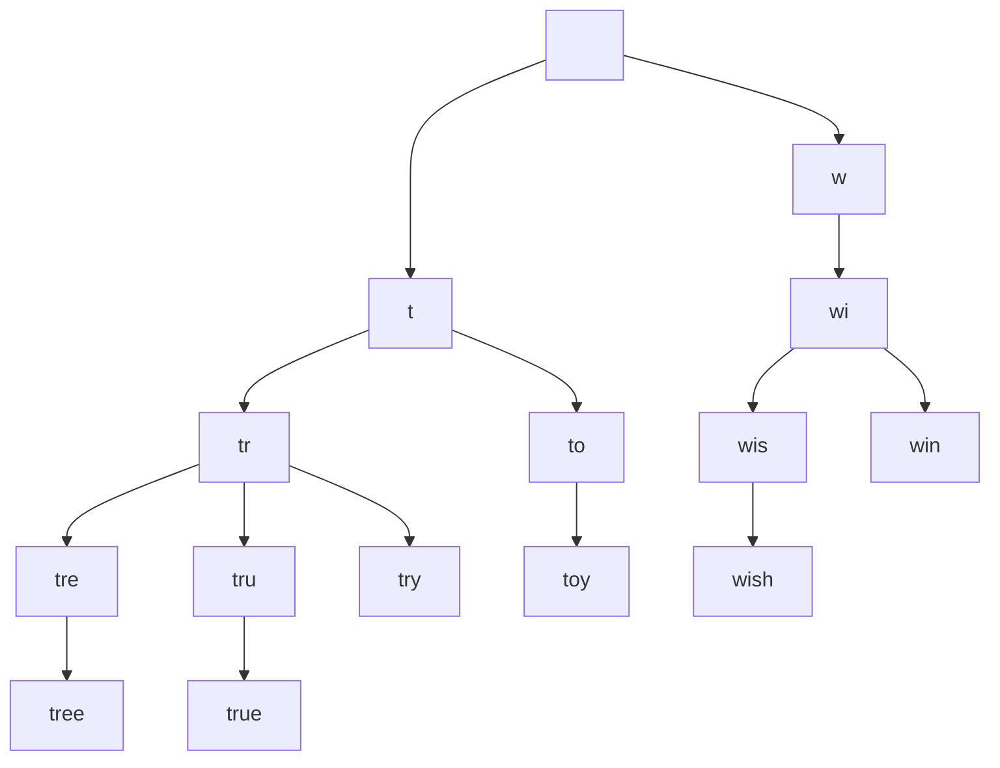
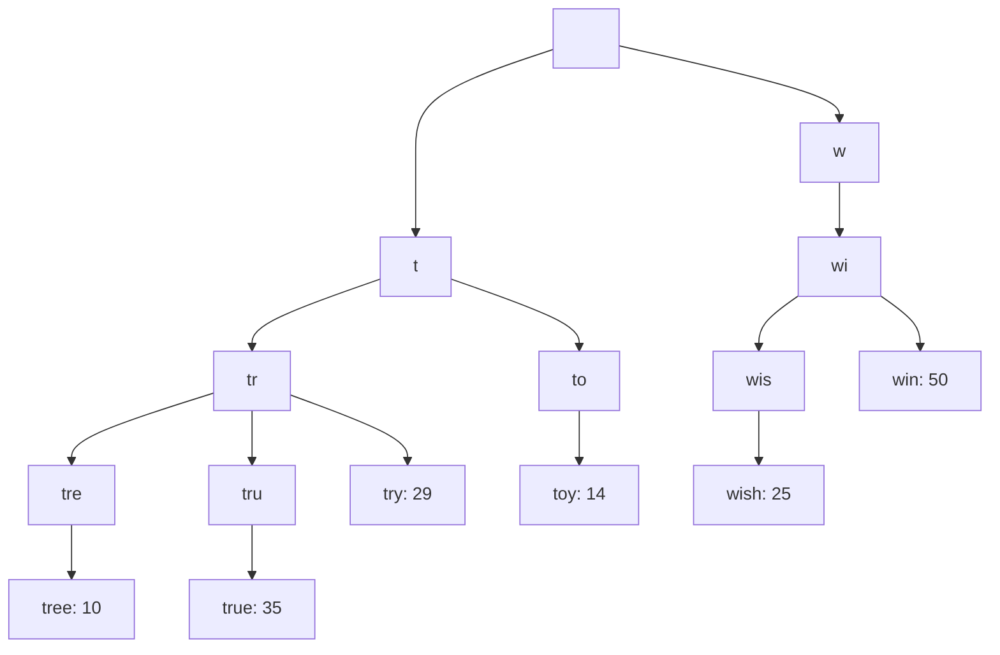
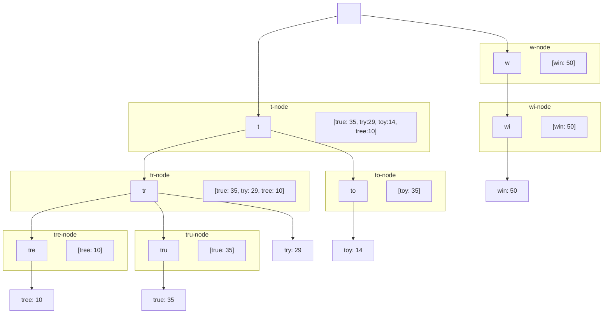
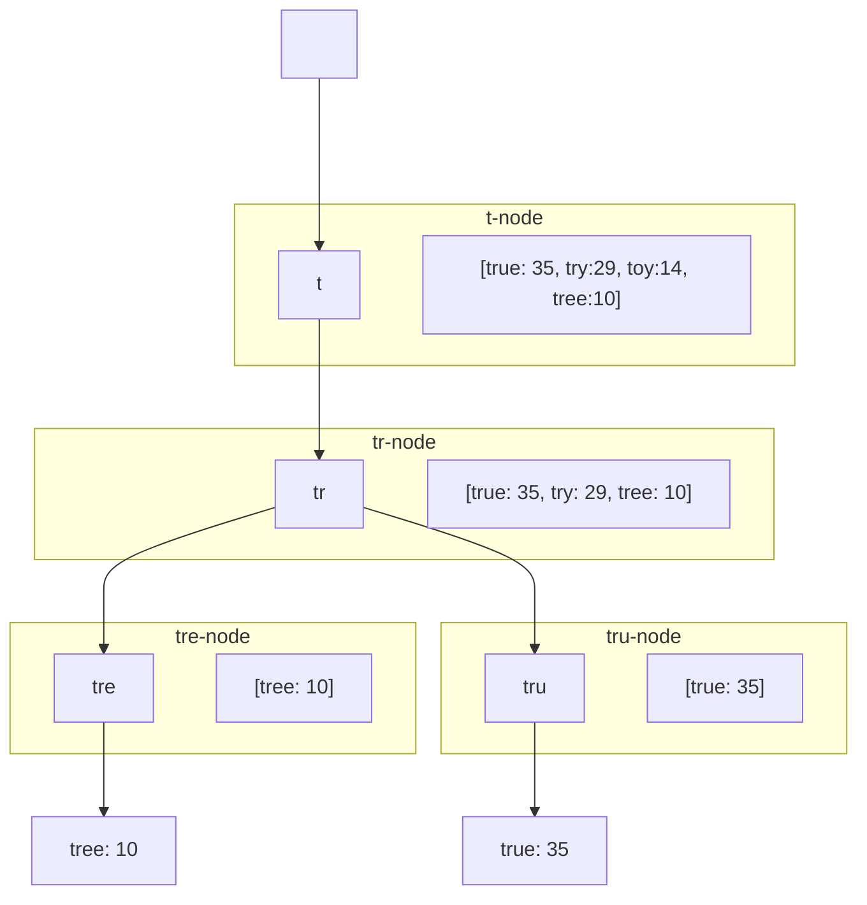

# 13장 검색어 자동완성 시스템

- 가장 많이 이용된 검색어 k개를 자동완성하여 출력하는 시스템

## 1. 문제 이해 및 설계 범위 확정

### 요구사항

- 빠른 응답 속도: 사용자가 검색어를 입력함에 따라 자동완성 검색어도 충분히 빨리 표시되어야 한다.
  - 페이스북 검색어 자동완성 시스템에 관한 문서 - 시스템 응답속도는 100밀리초 이내여야 한다.
- 연관성: 자동완성되어 출력되는 검색어는 사용자가 입력한 단어와 연관된 것이어야 한다.
- 정렬: 시스템의 계산 결과는 인기도 등의 순위 모델에 의해 정렬되어 있어야 한다.
- 규모 확장성: 시스템은 많은 트래픽을 감당할 수 있도록 확장 가능해야 한다.
- 고가용성: 시스템의 일부에 장애가 발생하거나, 느려지거나, 예상치 못한 네트워크 문제가 생겨도 시스템은 계속 사용 가능해야 한다.

### 개략적 규모 추정

- 일간 능동 사용자(DAU) = 천만 명
- 한 명의 사용자는 평균적으로 매일 10건의 검색 수행
- 질의마다 평균적으로 20바이트의 데이터를 입력
  - 문자 인코딩 방법 ASCII (1문자 = 1바이트)
  - 질의문은 평균적으로 4개 단어. 각 단어는 평균적으로 5글자.
  - 따라서 질의당 편균은 4 x 5 = 20바이트다.
- 검색창에 글자를 입력할 때마다 클라이언트는 검색어 자동완성 백엔드에 요청을 보낸다. 따라서 평균적으로 1회 검색당 20건의 요청이 백엔드로 전달된다.
- 대략 초당 24,000건의 QPS 발생 (천만 사용자 x 평균 10개의 질의 x 20자 x 24시간 / 3600초)
- 최대 QPS = QPS x 2 = 대략 48,000
- 질의 가운데 20% 정도는 신규 검색어라고 가정.
  - 대략 0.4GB로 계산 (천만 사용자 x 10개의 질의 x 20Byte x 20% / 1000[KB] / 1000[MB] / 1000[GB]) 
  - 매일 0.4GB의 신규 데이터가 시스템에 추가된다는 뜻이다.

## 2. 개략적 설계안 제시 및 동의 구하기

### 데이터 수집 서비스

- 질의문과 사용빈도를 저장하는 `빈도 테이블 frequency table`이 있다고 가정

### 질의 서비스

- `query`: 질의문을 저장하는 필드
- `frequency`: 질의문이 사용된 빈도를 저장하는 필드

| query    | frequency |
|:---------|:---------:|
| twitter  |    35     |
| twitch   |    29     |
| twilight |    25     |


- 만약 사용자가 `tw`를 검색하면 "top 5" 자동완성 검색어가 표시되어야 한다.
  - "top 5"는 위의 빈드 테이블에 기록된 수치를 사용해 계산한다고 가정한다.

```sql
SELECT * FROM frequency_table
WHERE query LIKE 'prefix%'
ORDER BY frequency DESC
LIMIT 5
```

- 위의 SQL 질의문은  데이터의 양이 적다면 나쁘지 않은 설계안이다.
- 하지만 데이터가 아주 많아지면 데이터베이스가 병목이 될 수 있다.

## 3. 상세 설계

### 트라이 자료구조

- 트라이는 문자열들을 간략하게 저장할 수 있는 자료구조다
  - 문자열을 꺼내는 연산에 초점을 맞춰 설계된 자료구조이다. (이름을 "retrieval"에서 따옴)
- 트라이 자료구조의 핵심 아이디어
  - 트리 형태의 자료구조
  - 루트 노드는 빈 문자열을 나타낸다.
  - 각 노드는 클자 하나를 저장하며, 26개의 자식 노드를 가질 수 있다.
  - 각 트리 노드는 하나의 단어, 또는 접두어 문자열을 나타낸다.
- 아래 트리는 'tree', 'try', 'true', 'toy', 'wish', 'win'이 보관된 트라이다.



- 기본 트라이 자료구조는 노드에 문자들을 저장한다.
- 이용 빈도에 따라 정렬된 결과를 내놓기 위해서는 노드에 빈도 정보까지 저장할 필요가 있다.

| query | frequency |
|:------|:----------|
| tree  | 10        |
| try   | 29        |
| true  | 35        |
| toy   | 14        |
| wish  | 25        |
| win   | 50        |

- 빈도 정보를 트라이 노드에 저장하게 되면 아래와 같은 상태가 될 것이다.



- 트라이로 자동완성을 구현하는 방법?
- 알고리즘을 살펴보기 전에, 용어 몇 가지만 정의하고 넘어가자.
  - `p`: `접두어 prefix`의 길이
  - `n`: 트라이 안에 있는 노드 개수
  - `c`: 주어진 노드의 자식 노드 개수
- 가장 많이 사용된 질의 k개는 다음과 같이 찾을 수 있다.
1. 해당 접두어를 표현하는 노드를 찾는다. `O(p)`
2. 해당 노드부터 시작하는 하위 트리를 탐색하여 모든 유효 노드를 찾는다. 유효한 검색 문자열을 구성하는 노드가 유효 노드다. 시간 복잡도는 `O(c)`
3. 유효 노드들을 정렬하여 가장 인기 있는 검색어 k개를 찾는다. 시간 복잡도는 `O(clogc)`

- 시간복잡도의 합은 `O(p) + O(c) + O(clogc)`가 된다.
- 최악의 경우 k개 결과를 얻기 위해 전체 트라이를 다 검색해야 하는 일이 생길 수 있는데, 이 문제를 해결하기 위해 2가지 방법을 사용할 수 있다.

#### 1. 접두어 최대 길이 제한

- 사용자가 검색창에 긴 검색어를 입력하는 일은 거의 없다.
  - 따라서 `p`값은 작은 정숫값이라고 가정해도 안전하다.
- 검색어의 최대 길이을 제한할 수 있다면 "접두어 노드를 찾는" 단계의 시간 복잡도는 `O(1)`로 바뀔 것이다.

#### 2. 노드에 인기 검색어 캐시

- 각 노드에 k개의 인기 검색어를 저장해 두면 전체 트라이를 검색하는 일을 방지할 수 있다.
  - 5~10개 정도의 자동완성 제안을 표시하면 충분하므로, k는 작은 값이다.
- 각 노드에서 아래와 같이 인기 질의어를 캐시하면 "top 5" 검색어를 질의하는 시간 복잡도를 엄청나게 낮출 수 있다.



1. 접두어 노드를 찾는 시간 복잡도는 `O(1)`로 바뀐다.
2. 최고 인기 검색어 5개를 찾는 질의의 시간 복잡도도 `O(1)`로 바뀐다.

- 각 단계의 시간 복잡도가 `O(1)`로 바뀐 덕분에, 최고 인기 검색어 k개를 찾는 전체 알고리즘의 복잡도도 O(1)로 바뀌게 된다.

### 데이터 수집 서비스

- 타이핑을 할 때마다 실시간으로 데이터를 수정?
1. 매일 수천만 건의 질의가 입력될 텐데 그때마다 트라이를 갱신하면 질의 서비스는 심각하게 느려질 것이다.
2. 일단 트라이가 만들어지고 나면 인기 검색어는 그다지 자주 바뀌지 않을 것이다. 그러니 트라이를 그렇게 자주 갱신할 필요가 없다.

- 수정된 설계안


#### 데이터 분석 서비스 로그

- 데이터 분석 서비스 로그에는 검색창에 입력된 질의에 관한 원본 데이터가 보관된다.
- 새로운 데이터가 추가될 뿐 수정은 X

| query | time                |
|:------|:--------------------|
| tree  | 2019-10-01 22:01:01 |
| try   | 2019-10-01 22:01:05 |

#### 로그 취합 서버

- 로그의 양은 엄청나고 데이터 형식도 제각각인 경우가 많다.
  - 이 데이터를 잘 `취합 aggregation`하여 우리 시스템이 쉽게 소비할 수 있도록 해야 한다.
- 본 설계안에서는 일주일 주기로 취합하는 충분하다고 가정

#### 취합된 데이터

- 아래 표는 매주 취합한 데이터의 사례

| query | time       | frequency  |
|:------|:-----------|:----------:|
| tree  | 2019-10-01 |   12,000   |
| tree  | 2019-10-08 |   15,000   |
| tree  | 2019-10-15 |   9,000    |
| toy  | 2019-10-01 |   8,500    |
| toy  | 2019-10-08 |   6,256    |
| toy  | 2019-10-15 |   8,866    |

#### 작업 서버

- 작업 서버는 주기적으로 비동기 작업을 실행하는 서버 집합.
- 트라이 자료구조를 만들고 트라이 데이터베이스에 저장하는 역할

#### 트라이 캐시

- 트라이 캐시는 분산 캐시 시스템으로 트라이 데이터를 메모리에 유지하여 읽기 연산 성능을 높이는 역할을 한다.
- 매주 트라이 데이터베이스의 스냅샷을 떠서 갱신한다.

#### 트라이 데이터베이스

- 선택지는 2가지
1. `문서 저장소 document store`: 새 트라이를 매주 만들 것이므로, 주기적으로 트라이를 직렬화하여 데이터베이스에 저장할 수 있다. 몽고디비 같은 문서 저장소를 활용하면 이런 데이터를 편리하게 저장할 수 있다.
2. `키-값 저장소`: 트라이는 아래 로직을 적용하면 해시 테이블 형태로 변환 가능하다.
    - 트라이에 보관된 모든 접두어를 해시 테이블 키로 반환
    - 각 트라이 노드에 보관된 모든 데이터를 해시 테이블 값으로 변환

- 아래는 트라이를 해시 테이블로 대응시킨 표를 보여준다.



| key  | value                               |
|:-----|:------------------------------------|
| t    | [true: 35, try:29, toy:14, tree:10] |
| tr   | [true: 35, try: 29, tree: 10]       |
| tre  | [tree: 10]                          |
| tru  | [true: 35]                          |
| tree | [tree: 10]                          |
| true | [true: 35]                          |

### 질의 서비스


1. 검색 질의가 로드밸런서로 전송된다.
2. 로드밸런서는 해당 질의를 API 서버로 보낸다.
3. API 서버는 트라이 캐시에서 데이터를 가져와 해당 요청에 대한 자동완성 검색어 제안 응답을 구성한다.
4. 데이터가 트라이 캐시에 없는 경우에는 데이터를 데이터베이스에서 가져와 캐시에 채운다. 그래야 다음에 같은 접두어에 대한 질의가 오면 캐시에 보관된 데이터를 사용해 처리할 수 있다. 캐시 미스는 캐시 서버의 메모리가 부족하거나 캐시 서버에 장애가 있을 때 발생할 수 있다.

- 질의 서비스에 대한 최적화 방아

1. AJAX 요청: 새로고침 없이 로드하기
2. 브라우저 캐싱: 제안된 검색어를 브라우저 캐시에 넣어두면 후속 질의의 결과는 해당 캐시에서 바로 가져갈 수 있다. 구글 검색 엔진이 이런 캐시 메커니즘을 사용한다.
3. 데이터 샘플링: 대규모 시스템의 경우, 모든 질의 결과를 로깅하도록 해 놓으면 CPU 자원과 저장공간을 엄청나게 소진하게 된다. 샘플링 기법은 그럴 때 유용하다. N개의 요청 가운데 1개만 로깅하도록!

### 트라이 연산

#### 트라이 생성

- 작업 서버 담당.
- 데이터 분석 서비스의 로그나 데이터베이스로부터 취합된 데이터 이용

#### 트라이 갱신

- 두 가지 방법이 있다.
1. 매주 한 번 갱신. 새로운 트라이를 만들어 기존 트라이를 대체
2. 트라이의 각 노드를 개별적으로 갱신.
   - 성능이 좋지 않다. 하지만 트라이가 작을 때는 고려해봄직하다.

#### 검색어 삭제

- 혐오성, 폭력성, 성적 등등 여러 가지로 위험한 질의어를 자동완성 결과에서 제거해야 한다.
- 트라이 캐시 앞에 필터 계층을 두면 필터 규칙에 따라 검색 결과를 자유롭게 변경할 수 있다는 장점이 있다.


### 저장소 규모 확장

- 영어만 지원한다고 가정. 간단하게 첫 글자를 기준으로 `sharding`하는 방법.
  - 검색어를 보관하기 위해 두 대 서버가 필요? `a~m` 글자는 첫 번째 서버에 저장, 나머지는 두 번째 서버에 저장
  - 세 대 서버. `a~i` 첫 번째 서버, `j~r` 두 번째 서버, 나머지는 세 번째 서버

## 4. 마무리

- 다국어 지원?
  - 트라이에 `유니코드 unicode` 데이터를 저장해야 한다.
- 국가별로 인기 검색어 순위가 다르다면?
  - 국가별로 다른 트라이를 사용하도록 한다. CDN에 저장하여 응답속도를 높이는 방안도 생각.
- 실시간으로 변하는 추이를 반영?
  - 현 설계안에서는 적합하지 않다. 작업 서버가 매주 한 번씩만 돌도록 되어 있다. 설사 때맞춰 서버가 실행된다 해도, 트라이를 구성하는 데 너무 많은 시간이 소요된다.
- 실시간에 도움이 될만한 아이디어?
  - 샤딩을 통하여 작업 대상 데이터의 양을 줄인다.
  - 순위 모델을 바꾸어 최근 검색어에 보다 높은 가중치를 주도록 한다.
  - 데이터가 스트림 형태로 올 수 있다는 점, 즉 한번에 모든 데이터를 동시에 사용할 수 없을 가능성이 있다는 점을 고려해야 한다.

# 참고자료

- 가상 면접 사례로 배우는 대규모 시스템 설계 기초, 알렉스 쉬 지음, 프로그래밍 인사이트
