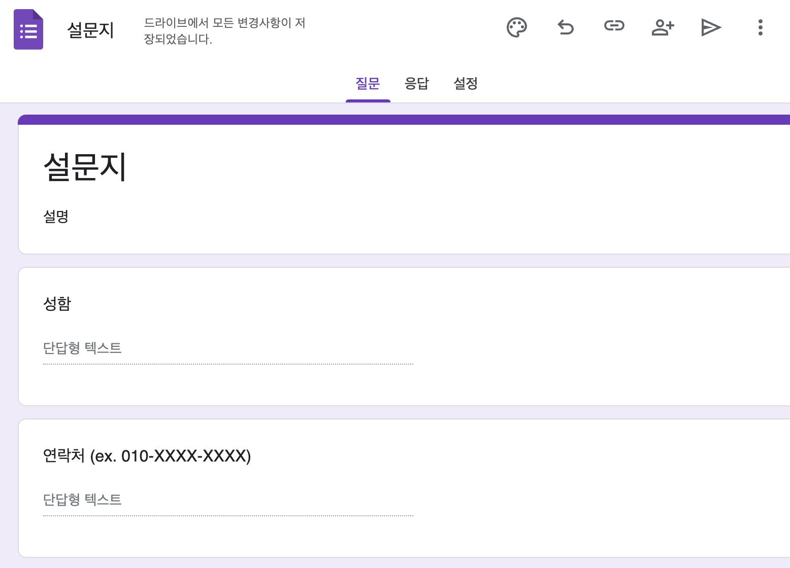
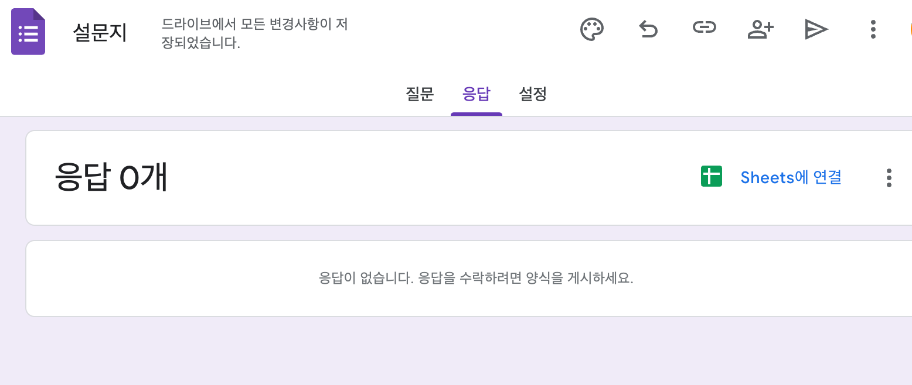
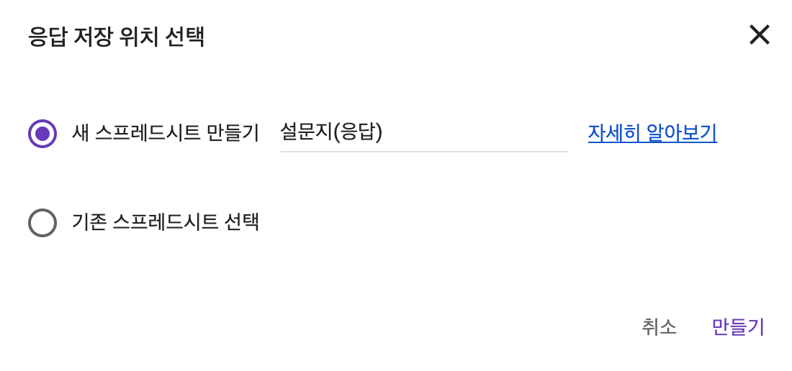
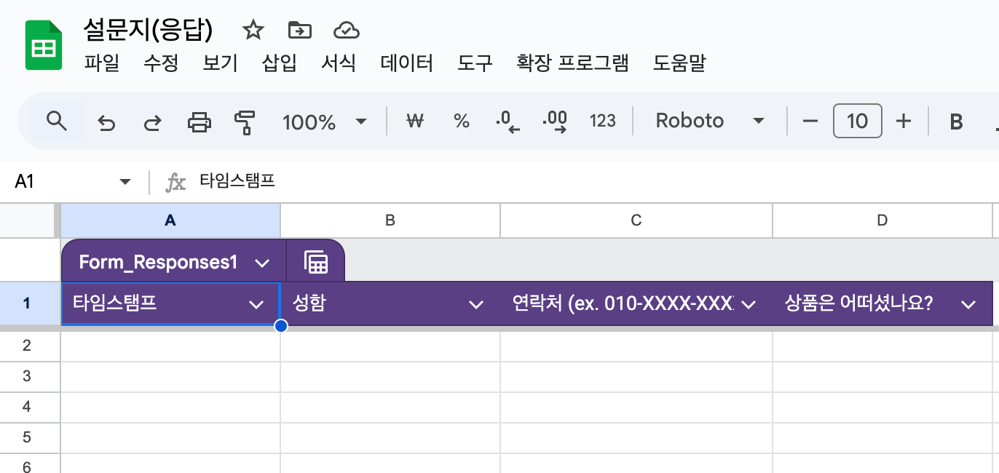
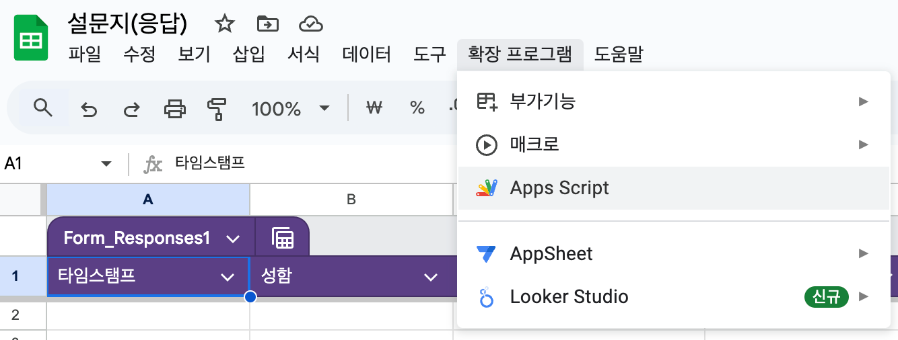
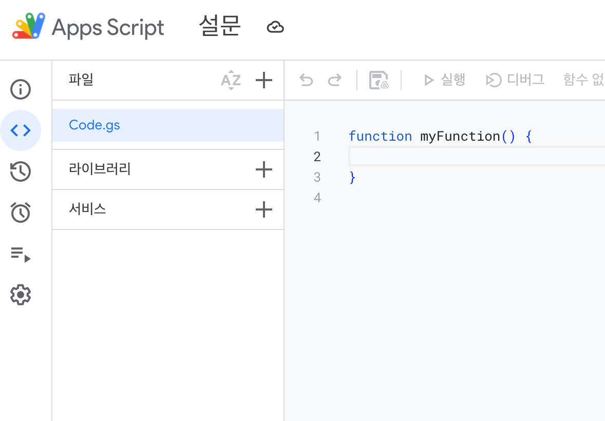
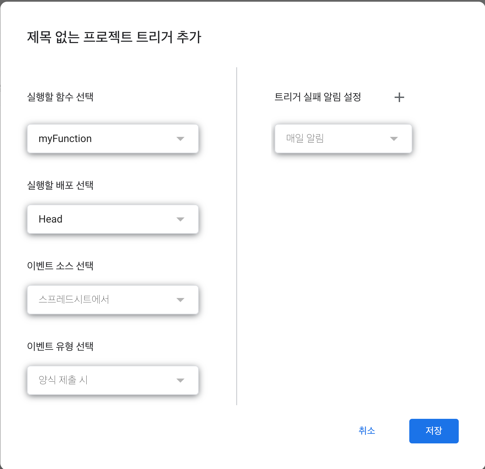
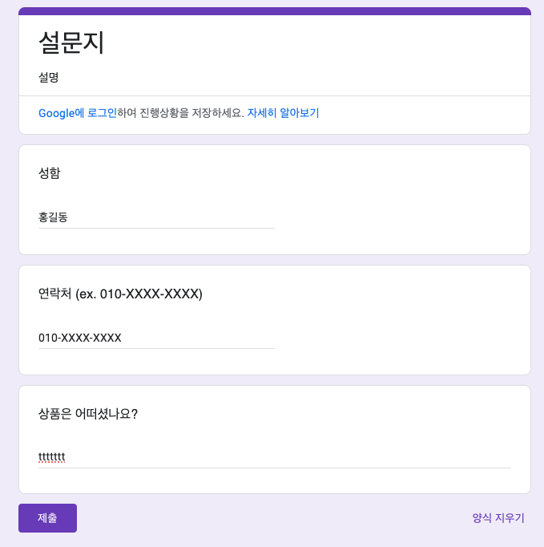
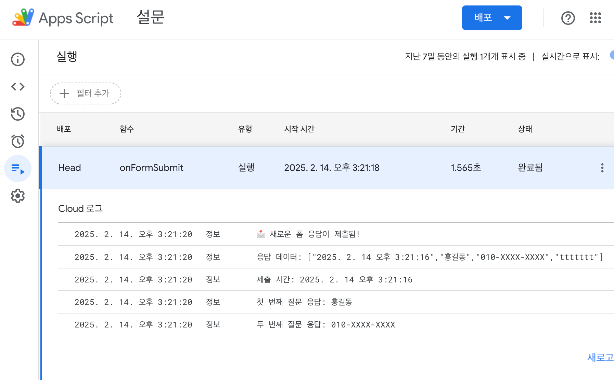
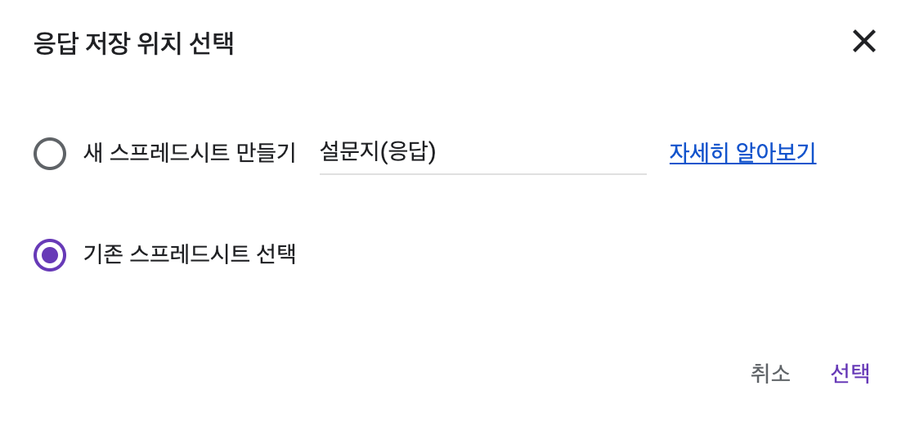

# Google Apps Script

## 구글 폼 생성 및 스프레드시트 연결

- 구글 폼을 생성



- 응답 탭에서 `Sheets에 연결`을 클릭



- 만들어준 스프레드시트가 없다면 새로운 스프레드시트를 만들자.



- 스프레드시트가 완성되었다.



- 스프레드시트의 `확장 프로그램` > `Apps Sciprt`를 선택한다.



- 이제 해당 페이지에서 스크립트 작업을 하면 된다!!



## 트리거 설정

- 실행할 함수를 선택하고, 이벤트 유형을 `양식 제출 시`로 설정



## 제출 트리거 이벤트 활용

```javascript
function onFormSubmit(e) {
    Logger.log("📩 새로운 폼 응답이 제출됨!");

    // 모든 응답을 배열로 가져오기
    var responses = e.values;
    Logger.log("응답 데이터: " + JSON.stringify(responses));

    // 특정 질문의 응답 가져오기
    var timestamp = responses[0]; // 폼 제출 시간
    var firstQuestionResponse = responses[1]; // 첫 번째 질문 응답
    var secondQuestionResponse = responses[2]; // 두 번째 질문 응답

    Logger.log("제출 시간: " + timestamp);
    Logger.log("첫 번째 질문 응답: " + firstQuestionResponse);
    Logger.log("두 번째 질문 응답: " + secondQuestionResponse);
}
```

- 아래와 같이 설문을 제출



- 실행 결과를 확인



## 환경변수 은닉

## 스크립트를 재사용하고 싶다면?

- 기존 스프레드시트 선택을 클릭하고, Apps Script가 적용된 스프레드시트와 연결해주면 재사용이 가능하다!
- 대신 질문을 사용하는 로직이 있다면 형식을 맞춰줘야 부작용이 발생하지 않는다.



## API 호출 예제

- `onFormSubmit` 이벤트를 통해 설문의 내용을 수신
  - `namedValues`는 `질문:답변` key:value로 엮여 있다. (대신 순서 보장이 안 되어 있음)
- `{ qeuestion: string; answer: string; }[]` 타입 형태로 

```javascript
function onFormSubmit(e) {
    // 질문과 응답 가져오기
    const responses = e.namedValues;
    const entries = Object.entries(responses).reduce((acc, [question, answerArray]) => {
      const result = {
        question,
        answer: answerArray[0]
      }
      return [...acc, result];
    }, []);

    const apiUrl = "https://mypage.com/api-path";
    const options = {
      method: "post",
      contentType: "application/json",
      payload: JSON.stringify(entries),
      muteHttpException: true,
    };

    try {
      UrlFetchApp.fetch(apiUrl, options);
    } catch(error) {
      Logger.log("Error " + error.message);
    }
}
```

## 폼 구성 요소 

- Google Forms API는 RESTful 인터페이스로, 폼과 퀴즈를 생성 및 수정하고, 응답과 퀴즈 채점을 조회하며, 자동 피드백이 포함된 정답 키를 설정하고, 푸시 알림을 받을 수 있도록 지원하는 기능을 제공한다.

### 📄 `Form` 
- Google Forms 문서로, Google Drive에 저장됨.
- 각 폼은 **고유한 formId**를 가지며, 이는 문자, 숫자, 하이픈(-), 밑줄(_)로 구성될 수 있음.
- formId는 Google Forms URL에서 찾을 수 있음.
👉 예: https://docs.google.com/forms/d/FORM_ID/edit

### 📝 `Quiz` 
- Google Forms의 한 유형으로, 정답 키를 설정하여 자동 채점 가능.
- batchUpdate() 메서드를 사용하여 기존 폼의 **isQuiz 속성을 true**로 설정해야 퀴즈로 변환됨.

### 🏆 `Grading`
- 퀴즈(isQuiz=true)에서 각 질문의 점수, 정답 키, 피드백을 포함하는 정보.
- Grading 리소스로 관리됨.

### 💬 `Feedback`
- 퀴즈에서 사용자가 특정 질문에 응답했을 때 제공되는 메시지.
- Feedback 리소스로 관리됨.

### 📌 `Item`
- 폼을 구성하는 기본 요소이며, 여러 번 반복될 수 있음.
- Item에는 다음과 같은 유형이 포함될 수 있음: 섹션 (Section)

### ❓ `Question`
- 단일 질문을 의미하며, 사용자가 입력할 수 있는 요소.
- Question 리소스로 관리됨.

### 📊 `Question Group`
- 같은 답변 옵션을 공유하는 여러 질문의 모음.
- 예: 1~5점 척도로 평가하는 그리드 형태의 질문.
- QuestionGroupItem 리소스로 관리됨.

### 📄 `Section` 
- 폼을 여러 페이지로 나누는 기능을 제공.
- 특정 응답에 따라 다른 섹션을 표시하는 조건부 논리(Branching Logic) 가능.
- PageBreakItem 리소스로 관리됨.

### ✅ `Answer` 
- 사용자가 특정 질문에 입력한 실제 응답 데이터.
- 퀴즈의 경우, 점수(채점 정보), 메타데이터, 응답 내용 포함.
- Answer 리소스로 관리됨.


### 📥 `Response` 
- 사용자가 제출한 전체 폼 응답.
- 개별 질문의 답변(Answer)과 연결됨.
- FormResponse 리소스로 관리됨.


### 🔔 `Watch` 
- 폼의 변경 사항을 감지하는 기능으로, 다음 이벤트를 추적할 수 있음:
- 폼의 구조 변경 (질문 추가, 삭제, 수정 등)
- 새 응답 제출
- 변경 사항이 발생하면 **푸시 알림(Push Notification)**을 받을 수 있음.
- Watch 리소스로 관리됨.

# 참고자료

- [공식 문서](https://developers.google.com/apps-script)
- [간단한 자동화로 Google Forms 응답 Slack에서 받아보기](https://www.babywhale.io/blog/google-forms-slack-integration)
