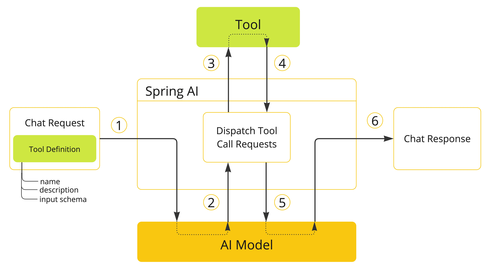

# Tool Calling

- AI 애플리케이션에서 모델이 API 세트 또는 도구와 상호작용하여 기능을 확장할 수 있게 하는 일반적인 패턴.

## 목적

### 정보 검색 (information retrieval)

- 데이터베이스, 웹 서비스, 파일 시스템 또는 웹 검색 엔진과 같은 외부 소스에서 정보를 검색하는 데 사용.
- 모델의 지식을 확장하여 답변할 수 없는 질문에 답변할 수 있게 한다. RAG 시나리오에서 사용할 수 있다.
  - ex) 특정 위치의 현재 날씨 검색, 최선 뉴스 기사 가져오기, 특정 레코드에 대한 데이터베이스를 쿼리

### 액션 수행 (taking action)

- 이메일 보내기, 데이터베이스에 새 레코드 생성, 양식 제출 또는 워크플로우 트리거와 같은 소프트웨어 시스템 액션 수행.
- 사람의 개입이나 명시적인 프로그래밍이 필요한 작업을 자동화.
  - ex) 채팅봇과의 상호작용을 통해 항공편 예약, 웹 페이지의 양식을 작성

## Quick Start

### 정보 검색 예시

- AI 모델은 실시간 정보에 액세스할 수 없다. 그러나 이 정보를 검색할 수 있는 도구를 제공하여 실시간 정보에 접근이 필요할 대 모델이 이 도구를 호출하도록 할 수 있다.ㄴ
- `DateTimeTools` 클래스에 사용자 시간대의 현재 날짜와 시간을 가져오는 도구를 구현
  - `LocaleContextHolder`를 사용하여 사용자의 시간대를 제공
  - `@Tool` 어노테이션을 사용하여 도구를 정의

```java
import java.time.LocalDateTime;
import org.springframework.ai.tool.annotation.Tool;
import org.springframework.context.i18n.LocaleContextHolder;

class DateTimeTools {
    @Tool(description = "Get the current date and time in the user's timezone")
    String getCurrentDateTime() {
        return LocalDateTime.now().atZone(LocaleContextHolder.getTimeZone().toZoneId()).toString();
    }
}
```

- 이제 다음으로 `ChatClient`를 사용하여 모델과 상호작용.
  - `tools()` 메소드를 통해 `DateTimeTools`의 인스턴스를 전달하여 모델에 도구를 제공.
  - `ChatClient`는 도구를 호출하고 결과를 모델에 반환하며, 모델은 이 도구 호출 결과를 사용하여 원래 질문에 대한 최종 응답을 생성.

```java
ChatModel chatModel = ...;

String response = ChatClient.create(chatModel)
    .prompt("What day is tomorrow?")
    .tools(new DateTimeTools())
    .call()
    .content();
```

### 액션 수행 예시

- 특정 목표를 달성하기 위한 계획을 생성하는 데 사용.
- `DateTimeTools`에 새 도구를 추가.
  - 새 도구는 ISO-8601 형식의 시간인 단일 매개변수를 받는다. 그런 다음 지정된 시간에 알림이 설정되었음을 나타내는 메시지를 콘솔에 출력한다.

```java
import java.time.LocalDateTime;
import java.time.format.DateTimeFormatter;
import org.springframework.ai.tool.annotation.Tool;
import org.springframework.context.i18n.LocaleContextHolder;

class DateTimeTools {

    @Tool(description = "Get the current date and time in the user's timezone")
    String getCurrentDateTime() {
        return LocalDateTime.now().atZone(LocaleContextHolder.getTimeZone().toZoneId()).toString();
    }

    @Tool(description = "Set a user alarm for the given time, provided in ISO-8601 format")
    void setAlarm(String time) {
        LocalDateTime alarmTime = LocalDateTime.parse(time, DateTimeFormatter.ISO_DATE_TIME);
        System.out.println("Alarm set for " + alarmTime);
    }
}
```

- 마찬가지로 `ChatClient`를 사용하여 모델과 상호작용.

```java
ChatModel chatModel = ...

String response = ChatClient.create(chatModel)
        .prompt("Can you set an alarm 10 minutes from now?")
        .tools(new DateTimeTools())
        .call()
        .content();
```

----

## 개요

- 추상화를 통한 도구 호출을 지원하여 문제를 해결할 수 있다.



1. 모델에서 도구를 사용할 수 있게 하려면 채팅 요청에 도구 정의를 포함시킨다. 각 도구 정의는 이름, 설명 및 입력 매개변수의 스키마로 구성된다.
2. 모델이 도구를 호출하기로 결정하면 정의된 스키마에 따라 모델링된 도구 이름과 입력 매개변수가 포함된 응답을 보낸다.
3. 애플리케이션은 도구 이름을 사용하여 도구를 식별하고 제공된 입력 매개변수로 실행할 책임이 있다.
4. 도구 호출의 결과는 애플리케이션에 의해 처리된다.
5. 애플리케이션은 도구 호출 결과를 모델에 다시 보낸다.
6. 모델은 도구 호출 결과를 추가 컨텍스트로 사용하여 최종 응답을 생성한다.

- 도구는 도구 호출의 기본 구성 요소이며 `ToolCallback` 인터페이스로 모델링된다.
- `ChatModel` 구현은 도구 호출 요청을 해당 `ToolCallback` 구현으로 투명하게 디스패치하고 도구 호출 결과를 모델에 다시 보내며, 최종적으로 모델이 최종 응답을 생성한다. 
  - 도구 실행 생명 주기를 관리하는 `ToolCallingManager` 인터페이스를 호출하여 작업을 수행한다.
- `ChatClient`와 `ChatModel` 모두 도구를 모델에서 사용할 수 있게 하고 이를 실행할 `ToolCallingManager`에 `ToolCallback` 객체 목록에 대한 접근을 허용한다.

---- 

## 메소드를 도구로 사용하기

- `@Tool` 어노테이션을 사용하여 선언적으로 쓸 수 있다.
- 저수준의 `MethodToolCallback` 구현을 통해 사용할 수도 있다.

### 선언적 명세: `@Tool`

- `@Tool`: 도구 정의
  - `name`: 같은 클래스 안에서는 이름이 유니크해야 한다. 기본값은 메소드명.
  - `description`: 모델이 도구를 언제 어떻게 호출해야 하는지 이해하는 데 사용할 수 있는 도구에 대한 설명이다. 제공되지 않으면 메소드 이름이 제공. 자세한 설명이 강력 권장.
  - `returnDirect`: 도구 결과를 클라이언트에 직접 반환할지 아니면 모델에 다시 전달할지 여부.
  - `resultConverter`: 도구 호출 결과를 AI모델에 다시 보낼 `String` 객체로 변환하는 데 사용할 `ToolCallResultConverter` 구현을 제공이다.
- `@ToolParam`: 주석을 사용하여 설명이나 매개변수가 필수인지 선택적인지 여부와 같은 추가 정보를 전달할 수 있다.
  - `description`: 매개변수 설명.
  - `required`: 필수 여부. 기본적으로 필수.

```java
import java.time.LocalDateTime;
import java.time.format.DateTimeFormatter;
import org.springframework.ai.tool.annotation.Tool;
import org.springframework.ai.tool.annotation.ToolParam;

class DateTimeTools {

    @Tool(description = "Set a user alarm for the given time")
    void setAlarm(@ToolParam(description = "Time in ISO-8601 format") String time) {
        LocalDateTime alarmTime = LocalDateTime.parse(time, DateTimeFormatter.ISO_DATE_TIME);
        System.out.println("Alarm set for " + alarmTime);
    }
}
```

#### `ChatClient`에 도구 추가

- `ChatClient`의 `tools()` 메소드에 전달할 수 있다.

```java
ChatClient.create(chatModel)
    .prompt("What day is tomorrow?")
    .tools(new DateTimeTools())
    .call()
    .content();
```

- 내부적으로 `ChatClient`는 도구 클래스 인스턴스의 각 `@Tool`로 주석이 달린 메소드에서 `ToolCallback`을 생성하고 이를 모델에 전달한다.
- 직접 생성하는 경우 아래와 같은 유틸리티 클래스를 사용할 수도 있다.

```java
ToolCallback[] dateTimeTools = ToolCallbacks.from(new DateTimeTools());
```

#### `ChatClient`에 기본 도구 추가

- `defaultTools()` 메소드를 사용하여 기본 도구를 추가할 수 있다.

```java
ChatClient chatClient = ChatClient.builder(chatModel)
    .defaultTools(new DateTimeTools())
    .build();
```

#### `ChatModel`에 도구 추가

- `ToolCallingChatOptions`의 `toolCallbacks()` 메소드에 도구 클래스 인스턴스를 전달할 수 있다.

```java
ChatModel chatModel = ...
ToolCallback[] dateTimeTools = ToolCallbacks.from(new DateTimeTools());
ChatOptions chatOptions = ToolCallingChatOptions.builder()
    .toolCallbacks(dateTimeTools)
    .build();
Prompt prompt = new Prompt("What day is tomorrow?", chatOptions);
chatModel.call(prompt);
```

#### `ChatModel`에 기본 도구 추가

- 마찬가지로 `ToolCallingChatOptions`의 `toolCallbacks()` 메소드에 도구 클래스 인스턴스를 전달할 수 있다.
- `ToolCallingChatOptions`는 `ToolCallingManager`를 사용하여 도구 호출을 관리하는 `ChatModel` 구현을 제공한다.
  - 대신 `defaultOptions()`에 전달하는 방식이다.
- 하지만 위험할 수 있으므로 주의해서 사용해야 한다.

```java
ToolCallback[] dateTimeTools = ToolCallbacks.from(new DateTimeTools());
ChatModel chatModel = OllamaChatModel.builder()
    .ollamaApi(OllamaApi.builder().build())
    .defaultOptions(ToolCallingChatOptions.builder()
            .toolCallbacks(dateTimeTools)
            .build())
    .build();
```

### 프로그래밍 방식 명세: `MethodToolCallback`

- `MethodToolCallback.Builder`를 활용하는 방식


# 참고 자료

- [공식문서: Tool Calling](https://docs.spring.io/spring-ai/reference/api/tools.html)

