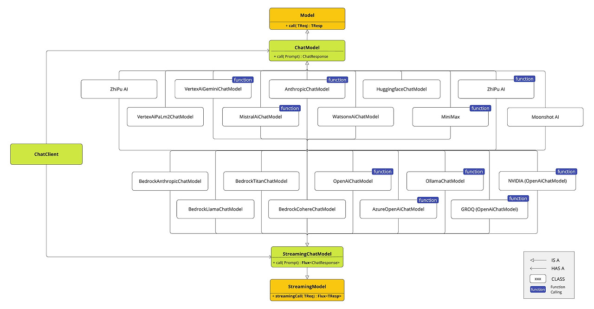
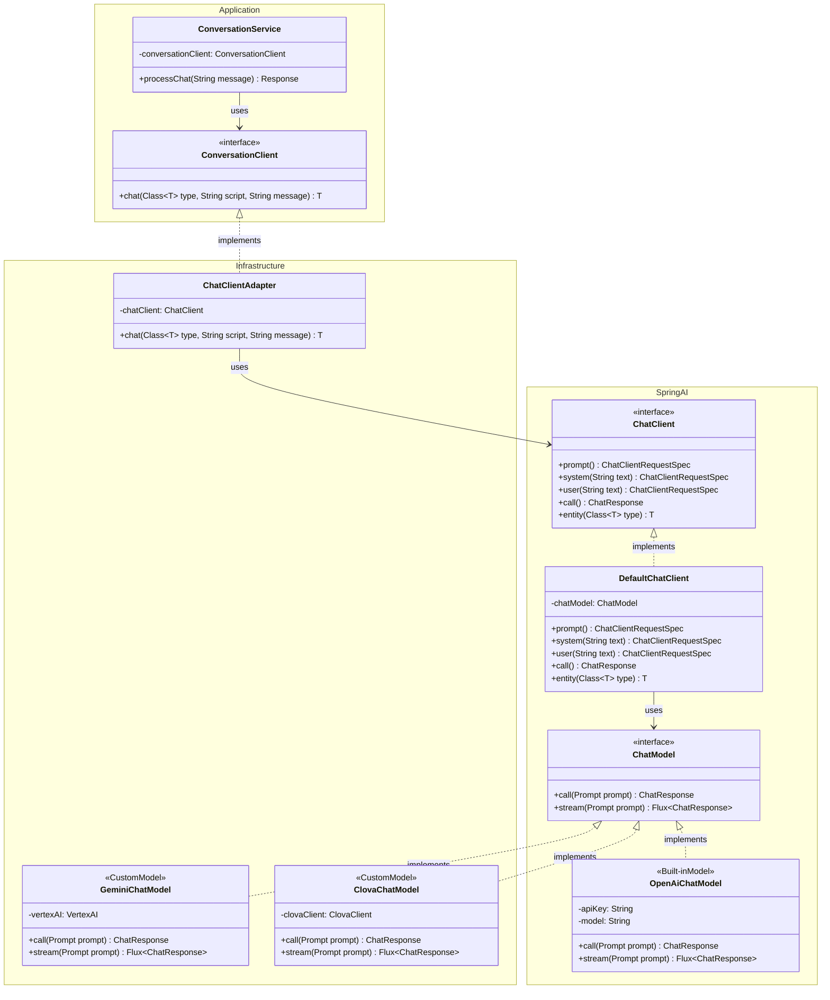

# Spring AI 모델 추상화

## Spring AI 

- `ChatClient`가 `ChatModel`에게 의존.

## 추상화 구상

- Gemini에서 VertexAI를 사용하는 것이 아니라 Gemini SDK를 통해 프롬프팅을 진행
- ChatModel을 구현하여 ChatClient가 사용하게 함.

```mermaid
classDiagram
    direction TB

    namespace Application {
        class ConversationClient {
            <<interface>>
            +chat(Class~T~ type, String script, String message) T
        }

        class ConversationService {
            -conversationClient: ConversationClient
            +processChat(String message) Response
        }
    }

    namespace Infrastructure {
        class ChatClientAdapter {
            -chatClient: ChatClient
            +chat(Class~T~ type, String script, String message) T
        }

        class GeminiChatModel {
            <<CustomModel>>
            -vertexAI: VertexAI
            +call(Prompt prompt) ChatResponse
            +stream(Prompt prompt) Flux~ChatResponse~
        }

        class ClovaChatModel {
            <<CustomModel>>
            -clovaClient: ClovaClient
            +call(Prompt prompt) ChatResponse
            +stream(Prompt prompt) Flux~ChatResponse~
        }
    }

    namespace SpringAI {
        class ChatClient {
        <<interface>>
        +prompt() ChatClientRequestSpec
        +system(String text) ChatClientRequestSpec
        +user(String text) ChatClientRequestSpec
        +call() ChatResponse
        +entity(Class~T~ type) T
        }
        
        class DefaultChatClient {
        -chatModel: ChatModel
        +prompt() ChatClientRequestSpec
        +system(String text) ChatClientRequestSpec
        +user(String text) ChatClientRequestSpec
        +call() ChatResponse
        +entity(Class~T~ type) T
        }

        class ChatModel {
        <<interface>>
        +call(Prompt prompt) ChatResponse
        +stream(Prompt prompt) Flux~ChatResponse~
        }

        class OpenAiChatModel {
        <<Built-inModel>>
        -apiKey: String
        -model: String
        +call(Prompt prompt) ChatResponse
        +stream(Prompt prompt) Flux~ChatResponse~
        }
    }   

%% Relationships
ConversationService --> ConversationClient: uses
ConversationClient <|.. ChatClientAdapter: implements
ChatClientAdapter --> ChatClient: uses
ChatClient <|.. DefaultChatClient: implements
DefaultChatClient --> ChatModel: uses
ChatModel <|.. OpenAiChatModel: implements
ChatModel <|.. GeminiChatModel: implements
ChatModel <|.. ClovaChatModel: implements
```
