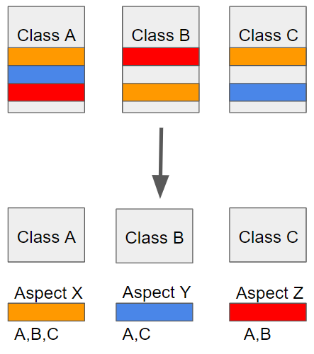

# AOP

## AOP란?

- AOP(Aspect-Oriented Programming)란 말그대로 관점(관심) 지향 프로그래밍으로 프로젝트 구조를 바라보는 관점을 바꿔보자는 의미이다.
- Spring의 핵심 개념 중 하나인 DI가 결합도를 낮추는 역할을 하듯이, AOP(Aspect-Oriented Programming)는 핵심 로직과 부가 기능을 분리하여 애플리케이션 전체에 걸쳐 사용되는 부가 기능을 모듈화하여 재사용할 수 있도록 지원한다.

- AOP에서 각 관점을 기준으로 로직을 모듈화한다는 것은 코드들을 부분적으로 나누어서 모듈화하겠다는 의미다. 이때, 소스 코드상에서 다른 부분에 계속 반복해서 쓰는 코드들을 발견할 수 있는 데 이것을 흩어진 관심사 (Crosscutting Concerns)라 부른다.
- 결국 흩어진 관심사를 Aspect로 모듈화하고 핵심적인 비즈니스 로직에서 분리하여 재사용하겠다는 것이 AOP의 취지다.

- Service의 핵심기능에서 바라보았을 때 User과 Order는 공통된 요소가 없지만, 부가기능 관점에서 바라보면 각각의 Service의 getXX 메서드를 호출하는 전후에 before과 after라는 메서드가 공통되는 것을 확인할 수 있다.
- 기존에 OOP에서 바라보던 관점을 다르게 하여 부가기능적인 측면에서 보았을때 공통된 요소를 추출하자는 것입니다. 이때 가로(횡단) 영역의 공통된 부분을 잘라냈다고 하여, AOP를 크로스 컷팅(Cross-Cutting) 이라고 부르기도 한다.

### AOP와 OOP

- OOP : 비즈니스 로직의 모듈화
  - 모듈화의 핵심 단위는 비즈니스 로직
- AOP : 인프라 혹은 부가기능의 모듈화
  - 대표적인 예 : 모니터링 및 로깅, 동기화, 오류 검사 및 처리, 성능 최적화(캐싱) 등
  - 각각의 모듈들의 주 목적 외에 필요한 부가적인 기능들

### AOP의 장점?

애플리케이션 전체에 흩어진 공통 기능이 하나의 장소에서 관리되어 유지보수에 유리하다.
핵심 로직과 부가 기능의 명확한 분리로, 핵심 로직은 자신의 목적 외에 사항들에는 신경쓰지 않을 수 있다.

 

## AOP 적용 시점

### 컴파일 시점

- `.java` 파일을 컴파일러를 통해 `.class`를 만드는 시점에 부가 기능 로직을 추가하는 방식이다.
- 모든 지점에 적용 가능하다.
- AspectJ가 제공하는 특별한 컴파일러를 사용해야 하기 때문에 특별할 컴파일러가 필요한 점과 복잡하다는 단점이 있다.

### 클래스 로딩 시점

- `.class` 파일을 JVM 내부의 클래스 로더에 보관하기 전에 조작하여 부가 기능 로직 추가하는 방식이다.
- 모든 지점에 적용 가능하다
- 특별한 옵션과 클래스 로더 조작기를 지정해야하므로 운영하기 어렵다.

### 런타임 시점

- 스프링이 사용하는 방식
- 컴파일이 끝나고 클래스 로더에 이미 다 올라가 자바가 실행된 다음에 동작하는 런타임 방식이다.
- 실제 대상 코드는 그대로 유지되고 프록시를 통해 부가 기능이 적용된다.
- 프록시는 메서드 오버라이딩 개념으로 동작하기 때문에 메서드에만 적용 가능하지만, 스프링 빈에만 AOP가 적용 가능하다.
- 특별한 컴파일러나, 복잡한 옵션, 클래스 로더 조작기를 사용하지 않아도 스프링만 있으면 AOP를 적용할 수 있기 때문에 스프링 AOP는 런타임 방식을 사용한다.

 

## AOP 주요 개념

### Join point

- 추상적인 개념으로 advice가 적용될 수 있는 모든 위치이다.
- ex) 메서드 실행 시점, 생성자 호출 시점, 필드 값 접근 시점 등등
- 스프링 AOP는 프록시 방식을 사용하므로 조인 포인트는 항상 메서드 실행 지점이다.

### Pointcut

- 조인 포인트 중에서 advice가 적용될 위치를 선별하는 기능이다.
- 스프링 AOP는 프록시 기반이기 때문에 조인 - 포인트가 메서드 실행 시점 뿐이 없고 포인트컷도 메서드 실행 시점만 가능하다.

### Target

- advice의 대상이 되는 객체다.
- Target은 Pointcut으로 결정한다.

### Aspect

- advice + pointcut을 모듈화 한 것이다.
- @Aspect와 같은 의미이다.

### Advice

- 실질적인 부가 기능 로직을 정의하는 곳이다.
- 특정 조인 포인트에서 Aspect에 의해 취해지는 조치

### Advisor

- 스프링 AOP에서만 사용되는 용어로 advice + pointcut 한 쌍이다.

### Weaving

- pointcut으로 결장한 타겟의 join point에 advice를 적용하는 것이다.

### AOP 프록시

- AOP 기능을 구현하기 위해 만든 프록시 객체다.
- 스프링에서 AOP 프록시는 JDK 동적 프록시 또는 CGLIB 프록시다.
- 스프링 AOP의 기본값은 CGLIB 프록시다.

 

## 참고자료

- [Spring AOP 총정리](https://velog.io/@backtony/Spring-AOP-%EC%B4%9D%EC%A0%95%EB%A6%AC)

- [스프링 AOP](https://engkimbs.tistory.com/746)
