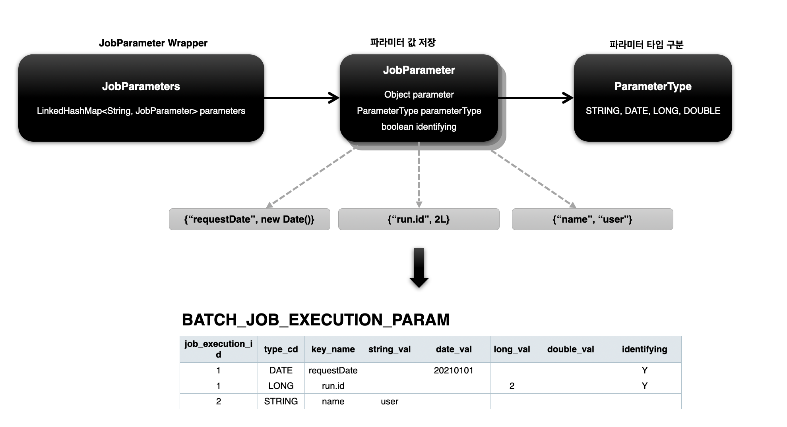
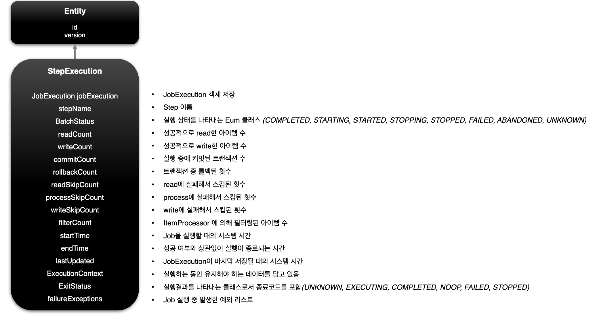
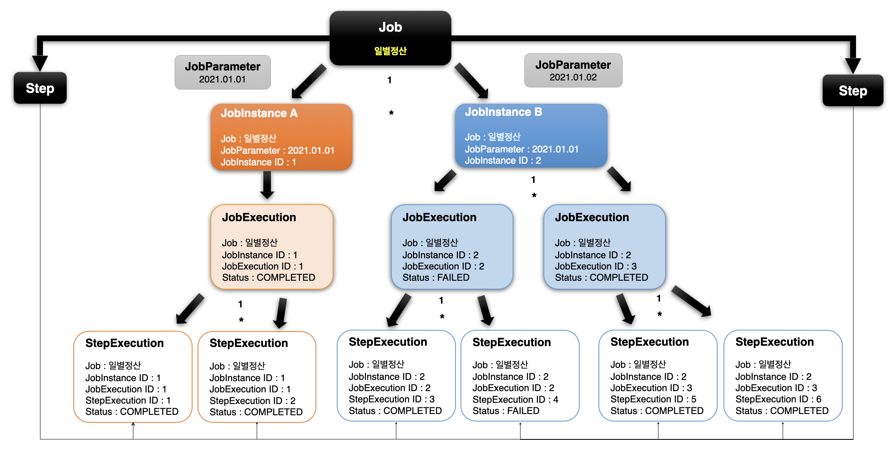
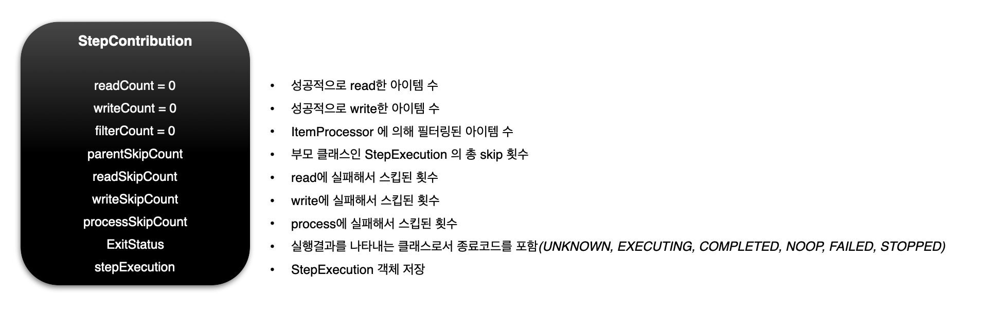
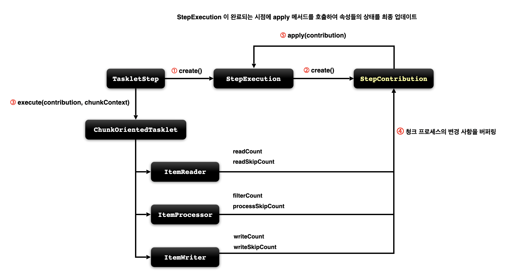
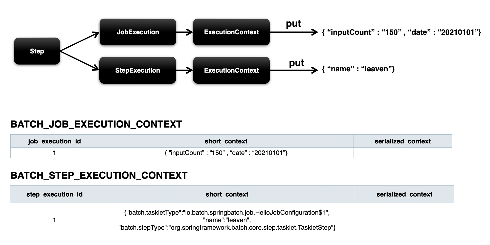
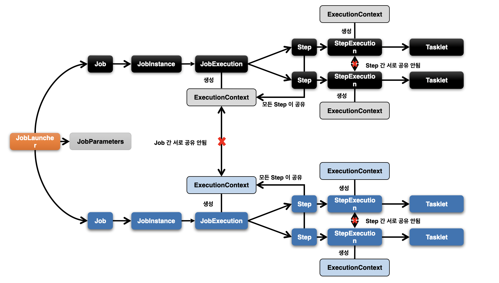

# 스프링 배치 도메인

## Job

- 배치 계층 구조에서 가장 상위에 있는 개념, Job을 구성하기 위한 최상위 인터페이스
- 하나의 배치 작업 자체를 의미한다.
- Job Configuration을 통해 생성되는 객체 단위, 배치 작업을 어떻게 구성하고 실행할 것인지 전체적으로 설정하고 명세해 놓은 객체
- 스프링 배치에서 기본 구현체를 제공하며 여러 Step을 포함하고 있는 컨테이너이다. (무조건 한 개 이상의 Step으로 구성해야함)

### 기본 구현체

- SimpleJob
  - 순차적으로 Step을 실행, 표준 기능
  - Step 객체를 실행시켜서 작업을 진행함
- FlowJob
  - 특정한 조건과 흐름에 따라 Step을 구성하여 실행시키는 Job
  - Flow 객체를 실행시켜서 작업을 진행함


## JobInstance

- Job이 실행되는 시점에 생성하는 Job의 논리적 실행 단위 객체, 고유하게 식별 가능한 작업 실행
- Job의 설정과 구성은 동일하지만 Job이 실행되는 시점에 처리하는 내용은 다르기 때문에 Job의 실행을 구분해야함. (오늘 처리하는 내용과 내일 처리할 내용이 다르듯)
  - 주기에 따라 매번 실행되는 Job을 JobInstance로 구분한다.

### JobInstance 생성 및 실행

- 처음 시작하는 Job + JobParameter 일 경우 새로운 JobInstance를 생성
- 이전과 동일한 Job + JobParameter로 실행할 경우 이미 존재하는 JobInstance를 리턴 => 다시 수행할 필요가 없다고 판단해 실행 실패한다.
- 
```
Caused by: org.springframework.batch.core.repository.JobInstanceAlreadyCompleteException: 
          A job instance already exists and is complete for parameters={name=user1}.  
          If you want to run this job again, change the parameters.
```

- 내부적으로 JobName과 JobKey(JobParameter의 해시값)를 가지고 JobInstance 객체를 얻음

### 테이블 매핑

- `BATCH_JOB_INSTANCE` 테이블과 매핑
- JOB_NAME(job)과 JOB_KEY(JobParameter 해시값)과 동일한 데이터는 중복해서 저장할 수 없다.

### 플로우

- 일별 정산의 예시


- JobName과 JobParameters의 해시값을 통해 JobInstance의 고유성을 보장


## JobParameter

- Job을 실행할 때 함께 포함되어 사용되는 파라미터를 가진 도메인 객체
- 하나의 Job에 존재할 수 있는 여러 개의 JobInstance를 구분하기 위해 사용
- JobParameters와 JobInstance는 1대 1 관계다.

### 생성 및 바인딩

- 애플리케이션 실행 시 주입
  - `java -jar batch.jar 'name=user2' 'seq(long)=5L' 'date(date)=2023/12/09' 'age(double)=27.1'`
- 코드로 생성 (주로 `JobParameterBuilder`를 많이 사용)
  - `JobParameterBuilder`, `DefaultParametersConverter`
- SpEL 사용
  - `@Value("#{jobParameter[name]}")`, `@JobScope`, `@StepScope` 선언 필수

### 테이블 매핑

- `BATCH_JOB_EXECUTION_PARAM` 테이블과 매핑
- `JOB_EXECUTION` 테이블과 1:M 관계

### 플로우



## JobExecution

- JobInstance의 한 번의 시도를 의미하는 객체, Job 실행 중에 발생한 정보들을 저장하고 있는 객체
- 시작 시간, 종료 시간, 상태(시작, 완료, 실패), 종료 상태 등의 속성을 가짐

### JobInstance와의 관계 (Execution이 여러 번 실행될 수도, 한 번만 실행될 수도, 아예 실행되지 않을 수도 있다.)

- JobExecution은 `FAILED` 또는 `COMPLETED` 등의 Job의 실행 결과 상태를 가지고 있다.
- JobExecution 상태가 `COMPLETED`면 JobInstance 실행이 완료된 것으로 간주해 재실행하지 않는다.
- JobExecution 상태가 `FAILED`면 JobInstance 실행이 완료되지 않은 것으로 간주해 재실행한다.
  - JobParameter가 동일하더라도 다시 실행한다는 말이다.
- 상태가 `COMPLETED`가 될 때까지 여러 번의 시도를 할 수 있다.

### 테이블 매핑

- `BATCH_JOB_EXECUTION` 테이블과 매핑
- JobInstance와 JobExecution은 1:M 관계로 JobInstance에 대한 성공/실패 내역을 가지고 있다.

### 플로우


<br/>

## Step

- Batch Job을 구성하는 독립적인 하나의 단계다. 실제 배치 처리를 정의하고 컨트롤하는 데 필요한 모든 정보를 가지고 있는 도메인 객체다.
- 단순한 단일 Task와 입력, 처리 및 출력과 관련된 복잡한 비즈니스 로직을 포함하는 모든 설정을 담고 있다.
- 배치 작업을 어떻게 구성하고 실행할 것인지 Job의 세부 작업을 Task 기반으로 설정하고 명세해놓은 객체다.
- Job은 하나 이상의 Step으로 구성된다.

### 구현체

- `TaskletStep`
  - 가장 기본이 되는 클래스
  - Tasklet 타입의 구현체들을 제어
- `PartitionStep`
  - 멀티 스레드 방식으로 Step을 여러 개로 분리해서 실행
- `JobStep`
  - Step 내에서 Job을 실행하도록 함
- `FlowStep`
  - Step 내에서 Flow를 실행하도록 함


### API 설정에 따른 각 Step의 생성

- Tasklet: 직접 생성한 Tasklet 실행

```java
public Step taskletStep() {
  return this.stepBuilderFactory.get("step")
        .tasklet(myTasklet())
        .build();
}
```

- TaskletStep: ChunkOrientedTasklet을 실행

```java
public Step taskletStep() {
  return this.stepBuilderFactory.get("step")
        .<Member, Member>chunk(100)
        .reader(reader())
        .writer(writer())
        .build();
}
```

- JobStep: Step에서 Job을 실행

```java
public Step jobStep() {
  return this.stepBuilderFactory.get("step")
        .job(job())
        .launcher(jobLauncher)
        .parametersExtractor(JobParametersExtractor())
        .build();
}
```

- FlowStep: Step에서 Flow를 실행

```java
public Step flowStep() {
  return this.stepBuilderFactory.get("step")
        .flow(myFlow())
        .build();
}
```

<br/>

## StepExecution

- Step에 대한 한 번의 시도를 의미하는 객체. Step 실행 중에 발생한 정보들을 저장하고 있다.
  - 시작시간, 종료시간, 상태(시작, 완료, 실패), commit count, rollback count 등의 속성
- Step이 매번 시도될 때마다 생성되며 각 Step 별로 생성
- Job이 재시작 하더라도 이미 성공적으로 완료된 Step은 재실행되지 않고 실패한 Step만 실행
- 이전 단계 Step이 실패해서 현재 Step을 실행하지 않았다면 StepExecution을 생성하지 않는다. Stetp이 실제로 시작됐을 때만 StepExecution을 생성한다.

### JobExecution과의 관계

- Step의 StepExecution이 모두 정상적으로 완료되어야 JobExecution이 완료된다.
- Step의 StepExecution 중 하나라도 실패하면 JobExecution은 실패한다.

### 테이블 매핑

- `BATCH_STEP_EXECUTION` 테이블과 매핑
- JobExecution과 StepExecution은 1:M 관계
- 하나의 Job을 여러 개의 Step으로 구성했을 경우 각 StepExecution은 하나의 JobExecution을 부모로 가진다.

### 예시

- 일별정산 Job은 매일 실행된다. Job이 실행될 때마다 JobExecution은 매번 생성된다.
- Job은 2개의 Step으로 구성되어 있다. 2개의 Step이 전부 성공해야 `COMPLETE` 상태가 된다. 하나라도 실패하면 `FAILED` 상태가 된다.
- `BATCH_STEP_EXECUTION` 테이블은 (2개의 STEP) * (2회 실행) = 4개의 로우가 저장되었고, `BATCH_JOB_EXECUTION`에는 JOB이 실행된만큼 2번의 로우가 저장되었다.


- StepExecution은 Entity라는 객체를 상속받아 만들어진다.



- 1월 1일 JobParameter로 생성된 JobInstance A
  - 하위에 JobExecution(JobInstance에 대한 1번의 시도)를 생성한다.
  - 각각의 스텝마다 StepExecution이 생성되기 때문에 2개의 객체가 생성된다.
  - 모든 StepExecution이 `COMPLETE`로 끝났기 때문에 JobExecution도 `COMPLETE` 상태가 되었다.
- 1월 2일 JobParameter로 생성된 JobInstance B
  - 동일하게 JobExecution이 생성된다. 하지만 하위의 StepExecution 중 하나가 `FAILED` 상태가 되어버려 JobExecution 또한 `FAILED` 상태가 됐다.
  - JobExecution이 실패로 끝나 Job이 한 번 더 실행됐다. 이 때 StepExecution이 모두 성공해 JobExecution 또한 `COMPLETE` 됐다.



<br/>

## StepContribution

- Chunk 프로세스의 변경 사항을 버퍼링한 후 StepExecution 상태를 업데이트하는 객체.
- Chunk Commit 직전에 StepExecution의 apply 메소드를 호출하여 상태를 업데이트한다.
- ExitStatus의 기본 종료코드 외 사용자 정의 종료코드를 생성해서 적용할 수 있다.



1. 먼저 `TaskletStep`이 시작되고 `StepExecution`을 실행한다.
2. `StepExecution`이 내부적으로 `StepContribution` 객체를 생성한다.
3. `TaskletStep`이 Chunk 기반의 프로세스를 처리할 수 있는 전용 Tasklet 객체인 `ChunkOrientedTasklet`를 생성한다.
4. Tasklet이 `ChunkOrientedTasklet`를 호출하면 내부적으로 청크 프로세스를 처리해주는 객체를 실행한다. 그리고 그 내용(count 등)은 `StepContribution`에 저장된다.
   - 청크 기반 프로세스는 `ItemReader`, `ItemProcessor`, `ItemWriter`를 사용해 처리한다.
5. 모든 작업이 완료되면 `StepContribution`에 저장된 값들을 `apply(contribution)` 메소드를 사용해 `StepExecution`에 적용시킨다.



<br/>

## ExecutionContext

- 프레임워크에서 유지 및 관리하는 키/값으로 된 컬렉션으로 `StepExecution` 또는 `JobExecution` 객체의 상태(state)를 저장하는 공유 객체
- DB에 직렬화한 값으로 저장된다. `{key: value}`
- 공유 범위
  - Step 범위 - 각 `Step`의 `StepExecution`에 저장되며 Step 간 서로 공유가 안된다.
  - Job 범위 - 각 `Job`의 `JobExecution`에 저장되며 `Job` 간 서로 공유가 안되며 해당 Job의 Step 간은 공유된다.
- `Job` 재시작 시 이미 처리한 Row 데이터는 건너 뛰고 이후로 수행하도록 할 때 상태 정보를 활용한다. 

### 구조

- 유지, 관리에 필요한 키-값을 설정한다.

```java
Map<String, Object> map = new ConcurrentHashMap();
```





<br/>

## JobRepository / JobLauncher

<br/>

## 참고자료

- [인프런 스프링 배치 강의: 정수원 님](https://www.inflearn.com/course/%EC%8A%A4%ED%94%84%EB%A7%81-%EB%B0%B0%EC%B9%98/dashboard)

- [Spring Batch 이해하고 사용하기](https://khj93.tistory.com/entry/Spring-Batch%EB%9E%80-%EC%9D%B4%ED%95%B4%ED%95%98%EA%B3%A0-%EC%82%AC%EC%9A%A9%ED%95%98%EA%B8%B0)

- [Spring Batch 개념 잡기](https://azderica.github.io/01-spring-batch/)

- [Spring Batch 가이드: 향로님 자료](https://jojoldu.tistory.com/324)
